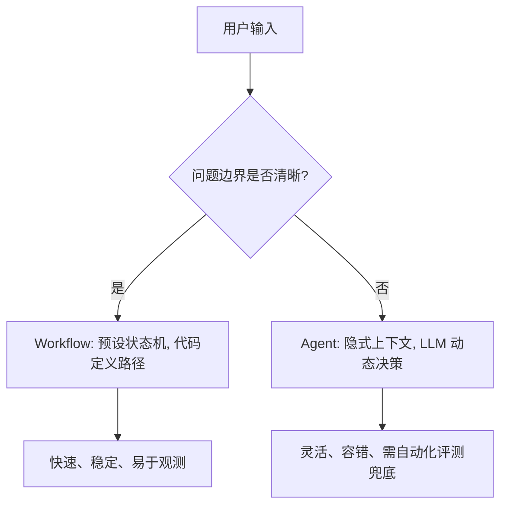
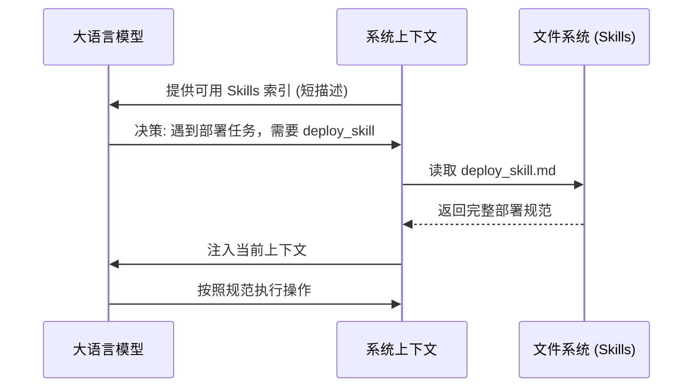
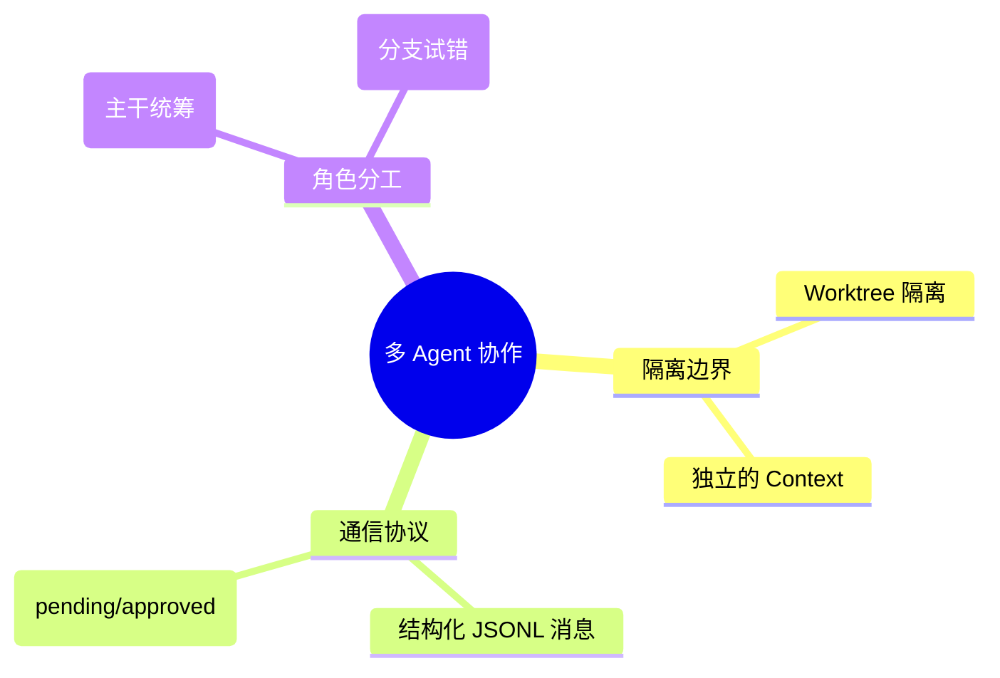

<div style="background-color: #1e1e1e; color: #00ff00; font-family: 'Courier New', Courier, monospace; border-radius: 8px; padding: 20px; box-shadow: 0 10px 30px rgba(0,0,0,0.3); margin-bottom: 30px; margin-top: 20px; position: relative; overflow: hidden;">
    <div style="display: flex; align-items: center; margin-bottom: 15px; padding-bottom: 10px; border-bottom: 1px solid #333;">
        <div style="display: flex; gap: 8px; margin-right: 15px;">
            <div style="width: 12px; height: 12px; border-radius: 50%; background-color: #ff5f56;"></div>
            <div style="width: 12px; height: 12px; border-radius: 50%; background-color: #ffbd2e;"></div>
            <div style="width: 12px; height: 12px; border-radius: 50%; background-color: #27c93f;"></div>
        </div>
        <div style="color: #ccc; font-size: 0.9em;">bash</div>
    </div>
    <div>
        <p style="margin: 5px 0; line-height: 1.6;"><span style="color: #008AFF; font-weight: bold;">ckhuang@macbookpro:~$</span> 很多人以为换个更贵、更强的大模型，Agent 就能从“人工智障”变成“人工智能”。但真相是：模型能力只是天花板，而决定 Agent 能否在生产环境跑稳的，往往是被你忽视的 Harness（验证设施）、上下文工程和工具设计。读完本文，你将了解如何从工程架构视角构建一个真正可用的工业级 Agent。 <span style="display: inline-block; width: 8px; height: 16px; background-color: #00ff00; vertical-align: middle;"></span></p>
    </div>
</div>

在过去的几年里，我参与了多个分布式系统与 AI Agent 的架构设计。我发现一个普遍的痛点：团队在开发 Agent 时，总是把 80% 的精力花在调 Prompt 和换模型上，却对核心的“工程化”问题视而不见。最后做出来的 Demo 看起来很惊艳，一上生产环境就各种“幻觉”、死循环或者状态丢失。

今天，我们不谈玄乎的 AGI 理论，直接扒开 Agent 的底层架构，从工程实践的角度聊聊：**怎么把 Agent 做稳？**

## 一、Agent Loop：少即是多的架构之美

很多人把 Agent 想象得很复杂，甚至试图在循环体内部塞入各种状态机。但实际上，一个健壮的 Agent Loop 核心逻辑通常不到 20 行代码：感知 -> 决策 -> 行动 -> 反馈。

```javascript
// 极简的 Agent Loop 核心逻辑
const messages = [{ role: "user", content: userInput }];
while (true) {
  const response = await client.messages.create({
    model: "claude-opus-4-6",
    max_tokens: 8096,
    tools: toolDefinitions,
    messages,
  });
  
  if (response.stop_reason === "tool_use") {
    // 执行工具并补充上下文
    const toolResults = await executeTools(response.content);
    messages.push({ role: "assistant", content: response.content });
    messages.push({ role: "user", content: toolResults });
  } else {
    return response.content.text;
  }
}
```

从最小实现到支持子 Agent 甚至 Skills 动态加载，主循环基本不需要改动。**新增能力通常是叠加在循环外部的。** 模型只负责推理，外部系统负责状态和边界。这和我们在分布式系统中常说的“无状态计算节点”理念不谋而合。一旦分工确定下来，核心循环逻辑就很少需要频繁调整了。

### Workflow 与 Agent：谁掌握了控制权？

很多打着 Agent 旗号的产品，深入看其实只是 Workflow（工作流）。这两者并没有高下之分，关键在于：**执行路径是由代码预先写死（Workflow），还是由 LLM 动态决定（Agent）。**



<div style="text-align: center; font-size: 1.2em; font-style: italic; color: #008AFF; margin: 40px 0 20px; padding: 20px; border-top: 1px dashed #ccc; border-bottom: 1px dashed #ccc;">
    “不要让模型做确定性的事情，也不要让代码去处理模糊的意图。” —— CK·黄
</div>

## 二、Harness：为什么基础设施比模型更关键？

我见过很多团队把 Agent 放在一个“没有约束”的旷野里裸奔，指望它自己能找到终点。但工程现实是：**Agent 看不到的内容等于不存在；写在文档里的规范不如写在 Linter 里的代码具备可执行性。**

Harness（测试、验证与约束基础设施）的作用，就是给 Agent 设定**验收基线、执行边界、反馈信号和回退手段**。

如果一个任务没有自动化的机器验收标准，全靠人盯，那么 Agent 的吞吐量上限就是人的审查速度。在写代码这种高可验证的场景下，把约束编码化（而非文档化），让 Agent 端到端自主完成任务、重跑测试、修复错误，这才是真正的 AI 研发效能提升。这就是为什么，有的时候模型本身没变，加上良好的 Harness，成功率却能大幅提升。

## 三、上下文工程：决定系统稳定性的生命线

随着上下文窗口越来越大，很多人开始把各种文档、历史记录一股脑儿塞进去。结果呢？发生了典型的 **Context Rot（上下文腐烂）**：关键信号被噪声稀释，Agent 的决策质量断崖式下跌。

解决之道在于**上下文分层管理**：

1. **常驻层**：身份定义、项目约定、绝对禁止项（必须短、硬、可执行，每次会话都必须成立）。
2. **按需加载 (Skills)**：领域知识和程序性记忆，触发时再注入。
3. **运行时注入**：当前时间、用户偏好等动态信息。
4. **记忆层**：跨会话经验（如 `MEMORY.md`）。

### Skills 的按需加载：一个精妙的工程权衡

把所有能力全塞进系统提示，不仅 Token 成本高，还会破坏 Prompt Caching 的前缀命中率。好的做法是：**系统提示只保留索引，完整知识按需加载。**



记住，Skill 的描述不是写“我能做什么”，而是写“何时该用我，何时不该用我”。例如：`Use when deploying to production or rolling back.` 明确的路由边界比详尽的功能介绍更重要。很多路由失败不是模型能力问题，而是边界写得不清楚。

## 四、工具设计：Agent 能做什么是你决定的

在微服务架构里，我们讲究 API 设计的合理性。在 Agent 架构里，工具（Tool / ACI - Agent-Computer Interface）的设计同样致命。

很多时候 Agent 选错工具，不是因为它笨，而是工具描述太烂、参数太模糊。

**一个好的工具设计必须遵循 ACI 原则：**
- **面向目标**：一次性把目标动作说完整，而不是提供底层的操作 API。
- **定义与实现绑定**：参数描述要自带约束格式。
- **错误结构化**：出错时不要只抛个 `"Error"`，要给出修正建议。

例如，与其给 Agent 报 `Error: update failed`，不如结构化报错：`文章 ID 不存在，请先调用 list_posts 获取有效 ID`。这就像是带一个初级程序员做 Code Review，你得告诉他怎么改。调试 Agent 时应优先检查工具定义，大多数工具选择错误都出在描述不准确，而不在模型能力。

## 五、记忆系统与多 Agent 组织

Agent 没有原生的时间连续性。Session 一关，它就失忆了。这就要求我们必须在架构层面设计记忆系统：

- **工作记忆**：当前任务所需的最小信息（Token 限制）。
- **程序性记忆**：怎么做某件事（Skills）。
- **情景记忆**：发生了什么（JSONL 持久化日志）。
- **语义记忆**：重要事实的沉淀（如 `MEMORY.md`）。

对于长耗时任务，如果单 Session 做不完，就必须把状态外化到文件系统。

在多 Agent 协作上，很多人迷信“并行”。但工程上首先要解决的是**隔离和协作协议**。主 Agent（Orchestrator）统筹全局，子 Agent 负责具体的探索和试错。子 Agent 的探索细节不要污染主 Agent 的上下文，跑完只回传摘要。它们之间的通信必须是**结构化的协议**，而不是模糊的自然语言。



## 六、总结与思考

Agent 的落地，绝不是简单地调用一下 LLM 的 API。它是一次系统架构的重构。从单体应用到分布式微服务，再到如今的 Agent 架构，变的是技术栈，不变的是对高内聚、低耦合、状态管理与可观测性的工程追求。

<div style="background-color: #1e1e1e; color: #00ff00; font-family: 'Courier New', Courier, monospace; border-radius: 8px; padding: 20px; box-shadow: 0 10px 30px rgba(0,0,0,0.3); margin-bottom: 30px; margin-top: 20px; position: relative; overflow: hidden;">
    <div style="display: flex; align-items: center; margin-bottom: 15px; padding-bottom: 10px; border-bottom: 1px solid #333;">
        <div style="display: flex; gap: 8px; margin-right: 15px;">
            <div style="width: 12px; height: 12px; border-radius: 50%; background-color: #ff5f56;"></div>
            <div style="width: 12px; height: 12px; border-radius: 50%; background-color: #ffbd2e;"></div>
            <div style="width: 12px; height: 12px; border-radius: 50%; background-color: #27c93f;"></div>
        </div>
        <div style="color: #ccc; font-size: 0.9em;">bash</div>
    </div>
    <div>
        <p style="margin: 5px 0; line-height: 1.6;"><span style="color: #008AFF; font-weight: bold;">ckhuang@macbookpro:~$</span> 真正让 Agent 跑稳的，是消息解耦、状态外化、分层提示、记忆整合和安全边界这些枯燥但关键的工程细节。别在没做评测之前就瞎改 Agent，也别在没设好约束之前就指望它能创造奇迹。 <span style="display: inline-block; width: 8px; height: 16px; background-color: #00ff00; vertical-align: middle;"></span></p>
    </div>
</div>

在 AI 时代，我们依然需要敬畏工程规律。少一点魔法崇拜，多一点架构思考。
