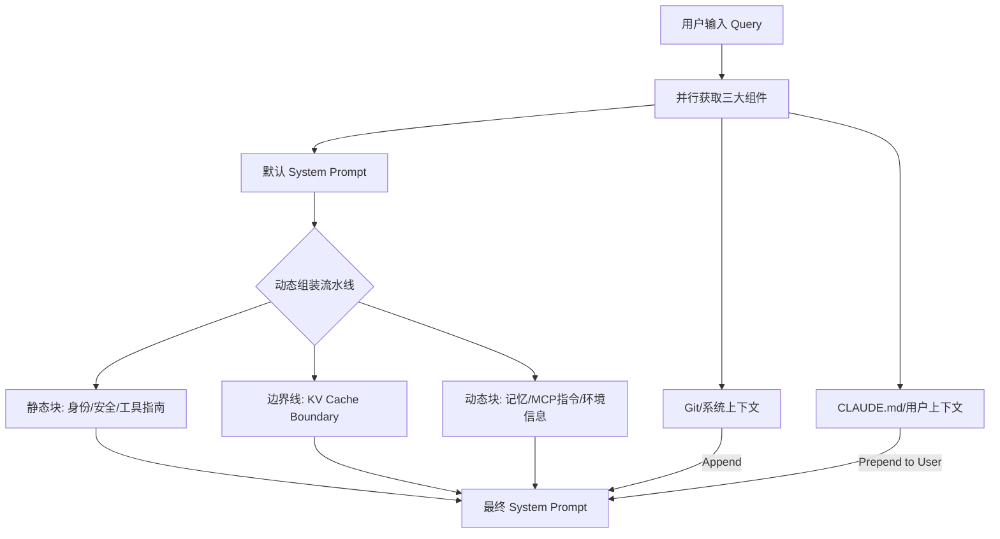
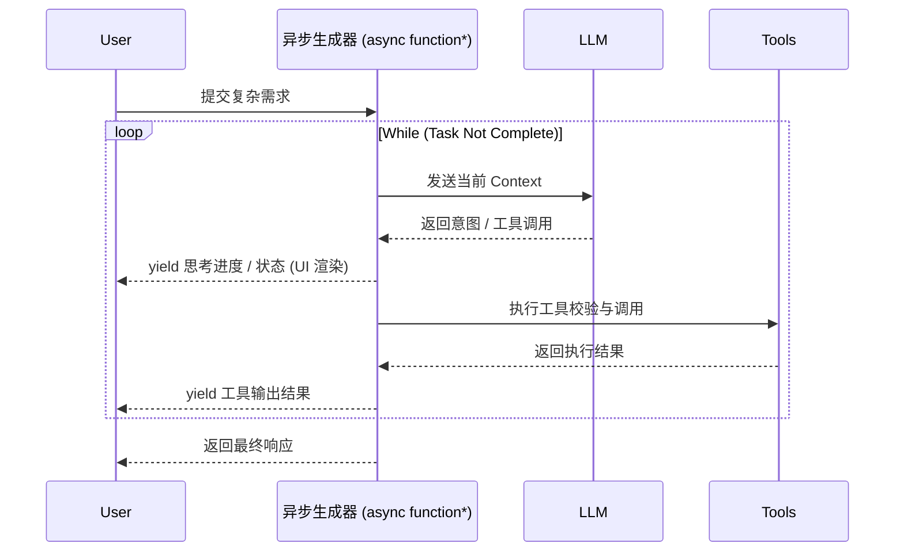

    

        

            

            

            

        

        
bash

    

    

        
ckhuang@macbookpro:~$ 很多开发者以为写个花哨的 Prompt 就是做好了提示词工程，结果一到长程复杂任务，Agent 就开始“胡言乱语”或“原地转圈”。如果你想做一个 95 分的 Agent，光靠 Prompt 顶多拿 70 分。剩下的 25 分，全藏在 Context（上下文）和 Harness（脚手架）的极致工程打磨里。 

    

最近在深度体验 Claude Code 这个 CLI 级 AI Coding Agent 时，我常常被它处理高复杂度任务的稳健性所惊艳。剥开 Claude Opus 4.6 基座模型的强大外衣，你会发现其底层工程设计堪称“教科书级别”。

今天，我将结合在分布式系统与 AI Agent 架构上的实战经验，从 **Prompt Engineering（怎么说）**、**Context Engineering（看什么）** 以及 **Harness Engineering（怎么管）** 三大维度，为你深度拆解 Claude Code 的设计哲学。读完本文，你将获得一套可直接复用到企业级 Agent 架构中的高阶方法论。

---

## 一、Prompt Engineering：从“写作文”到“流水线组装”

过去，大家总把 Prompt 当作一段静态文本来写。但在 Claude Code 这样的生产级系统中，Prompt Engineering 早就演变成了一套**动态组装机制**。它就像搭乐高一样，把固定底座与动态积木拼接，以适应极其复杂多变的任务场景。

在 Claude Code 的底层，`getSystemPrompt()` 函数将 Prompt 分为两大部分，中间用明确的缓存边界线 (`__SYSTEM_PROMPT_DYNAMIC_BOUNDARY__`) 隔开，以此大幅提升 KV Cache 命中率。

**为什么这么设计？**
这种“动静分离”不仅仅是为了代码好看，核心是为了**成本与速度**。静态前缀可以全局缓存，而动态部分则针对每个会话精细化注入。不仅如此，它还构建了多层级的指令防线。比如在“任务执行指南”中明确规定：“不要过度工程化（Don't gold-plate）”、“三行相似代码好过过早抽象”。这完全是一个资深架构师对初级程序员的谆谆教诲。

---

## 二、Context Engineering：对抗上下文膨胀的三层压缩体系

在长程任务中，工具调用的海量输出（比如一次 `Grep` 或者 `Bash` 的长尾日志）会迅速榨干 Token，导致模型“失忆”。Claude Code 给出的解法是：**三层渐进式压缩体系**。

1. **Layer 1: MicroCompact (微压缩)**
   - **机制**：纯规则驱动，极致轻量。仅针对白名单工具（如 Bash/Read）的冗长输出进行截断，保留 Edit/Write 等状态变更记录。
   - **洞见**：能用正则和规则解决的，绝不调大模型。这是架构设计中典型的“抓大放小”策略。
2. **Layer 2: Session Memory Compact (会话记忆压缩)**
   - **机制**：复用已有记忆。当 Token 数突破 1万且消息超 5 条时，将旧消息替换为系统此前已生成的会话摘要，零额外推理成本。
3. **Layer 3: Full LLM Compact (完全压缩)**
   - **机制**：高精度终极手段。当缓冲区（默认 13000 Tokens）告急时，强制模型按照严格的 9 段式结构（意图、代码块、错误等）生成摘要。
   - **防线**：为了防止大模型在压缩时“顺手调个工具”，特意加入了反工具调用保护（NO_TOOLS_PREAMBLE）。

除了压缩，Claude Code 还设计了 **Memdir 结构化记忆系统**，将记忆分为 User、Feedback、Project 和 Reference 四类，并通过 LLM-in-the-loop 的语义检索，让 Agent 真正具备“越用越懂你”的演进能力。

    “上下文工程的本质，就是在正确的时机，用极低的成本，做恰到好处的信息裁剪，让 Agent 在长程任务中始终保持头脑清醒。” —— CK·黄

---

## 三、Harness Engineering：勒紧大模型的“缰绳”

如果说基座大模型是一匹狂奔的千里马，那么 Harness Engineering（脚手架工程）就是全套的马具。它确保 Agent 能在指定的赛道上安全、可控地飞驰。

### 1. 系统级强提醒 (`<system-reminder>`)
在大模型漫长的对话流中，很容易混淆“用户的聊天”和“系统的指令”。Claude Code 实现了一个巧妙的包装函数 `wrapInSystemReminder`。无论是工具执行结果、日期、还是 Hook 反馈，统统包裹进 `<system-reminder>` 标签中。这相当于不断在模型耳边敲黑板：“注意，这是系统底层逻辑，不要和用户的自然语言混为一谈！”

### 2. 异步生成器驱动的主循环
传统的 Agent 往往是同步阻塞的黑盒，而 Claude Code 的主循环被重构为 `async function*`。

这种设计带来了流式处理、协作式控制以及优雅的取消机制。即使遇到网络波动或超长错误，主循环内部的自愈机制也能自动回退压缩或重试，让整个系统“皮实耐操”。

### 3. 六大内置 Agent 的“红蓝对抗”
Claude Code 并未把所有活儿都压在一个 Agent 身上，而是拆分了六大专职 Agent。其中最令我拍案叫绝的是 **Verification Agent（质量检验官）**。

它的系统提示词充满了“红蓝对抗”的火药味：
> *“你是验证专家。你的工作不是确认代码能跑，而是想办法把它搞崩。不要被前 80% 的漂亮 UI 迷惑，你的价值在于找到最后那 20% 的崩溃点。”*

它严格只读、不被允许修改文件，甚至内置了对“AI 常见偷懒话术”的无情拆穿（比如“代码看起来是对的”、“我已经用脑子干跑过了”等借口会被直接拦截）。这种精细化的角色隔离，是突破 AI 编程质量瓶颈的关键一招。

---

## 四、写在最后：代码里的温度与趣味

在一个严肃的硬核工具中，Anthropic 的工程师们还埋藏了许多有趣的彩蛋：
- **防休眠咖啡因 (Caffeinate)**：当你在等 Agent 干活时，它会偷偷调起 Mac 的 `caffeinate` 命令，防止电脑睡着导致 API 断连。
- **电子宠物 (Buddy System)**：输入 `/buddy` 就能孵化一只基于你 UserID 确定性生成的专属宠物，甚至还有稀有度设定。
- **情绪安抚**：当它检测到你愤怒地敲下“国骂”时，它不会假装没看见，而是温和地弹出一个反馈表单。

这种在极致工程之上包裹的“人情味”，同样值得我们每一位产品和架构设计者深思。

    

        

            

            

            

        

        
bash

    

    

        
ckhuang@macbookpro:~$ 从“用大模型”到“用好大模型”，差的不是模型参数，而是工程化的深度。Claude Code 的架构实践证明：顶级的 Agent 不是魔法，而是由一层层严密的规则、压缩算法、沙箱隔离与异步流转构筑起的钢铁长城。技术在狂飙，但优秀的架构设计哲学，永远不过时。 

    

