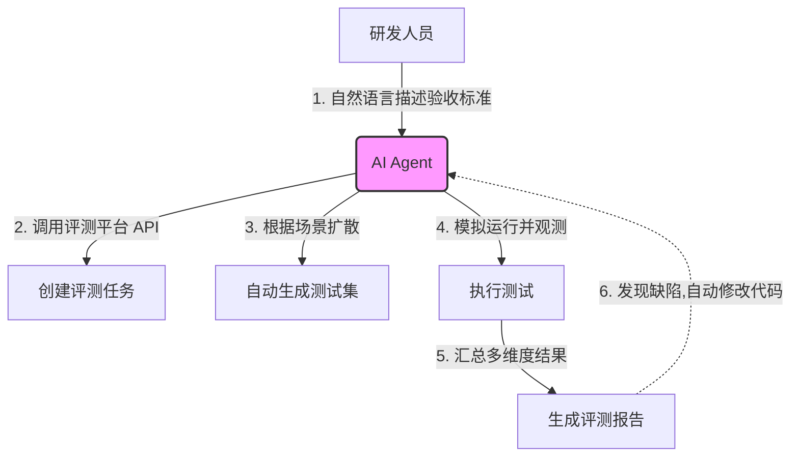

    

        

            

            

            

        

        
bash

    

    

        
ckhuang@macbookpro:~$ 写代码 1 小时，造测试数据、点 UI、排查联调问题 3 小时？在 AI 时代，还在靠堆人力做回归测试的研发团队，注定要被降维打击。今天我们来聊聊如何让 AI 接管整个系统的评测与自我优化。 

    

在软件工程中，构建一个系统并不难，难的是如何在长周期的迭代中保证系统的稳定性与质量。传统的评测流程通常是：定义评测任务 -> 人工收集评测集 -> 运行任务并观测指标 -> 产出报告。这个流程中最大的痛点在于**人**——造数据苦、跑测试累，开发同学的意愿极低。

但随着 AI Agent 能力的跃升，我们完全可以切换到 **AI First** 的视角：能否只定义验收标准，剩下的用例生成、模拟点击、质量打分甚至代码优化，全交给 AI 来做？

读完本文，你将了解如何构建一个全自动化的 AI 评测与进化平台，以及如何利用大模型实现系统的“自动挂机升级”。

### 一、AI First 评测平台的设计哲学

在分布式系统和 AI Agent 的落地实践中，我越来越深切地体会到：**好的架构应该让人尽可能地“懒”**。一个真正的 AI 评测平台，从入口层面就应该杜绝让人去干苦力活。

核心玩法其实非常克制：平台只暴露接口给 AI，人无法直接操作。你只需要把平台的 API 能力（比如创建任务、生成用例、提交报告）封装成 Skill，喂给你的 AI Agent（如本地的 Cursor、QoderWork 等）。

这个流程的关键在于，AI 不仅是执行者，更是**测试用例的设计师**。比如你要测试一个“钉钉文档 MCP 工具”，只需丢给 AI 一句话：“测试一下这个 MCP 的全功能”。AI 会自动拆解出创建文档、读取内容、冲突检测等 10 多个连贯的测试用例，并自主跑完出具一份详尽的报告。

### 二、不仅是 API：突破 UI 与内容的评测盲区

早期的自动化测试多聚焦于后端接口（Headless），但现代 Web 应用尤其是 AIGC 产品，真正的痛点在于**前端交互体验和生成内容的质量**。

利用具备浏览器控制能力的 Agent，AI 可以直接介入 UI 测试。例如，评测一个“根据文本生成 PPT”的系统：
1. **状态断言**：不再是非黑即白的 Pass/Fail。
2. **Rubrics 评分机制**：对于“生成的图片好不好看”、“排版是否合理”这种主观问题，引入 Rubrics（多维度评分标准）。AI 会生成一系列不同等级的用例，从功能完整性、视觉品味、内容逻辑等多个维度进行打分。

    “当 AI 具备了审美和逻辑判别能力，UI 测试就不再是死板的 DOM 节点断言，而是像真人体验官一样的全面审视。” —— CK·黄

### 三、系统的自我进化：让代码挂机升级

如果只是自动出报告，那 AI 充其量只是个高级 QA。真正的杀手锏在于**闭环优化**。

当我们拿到了一份包含具体扣分点（比如“创建同名文件夹时未抛出冲突提示”）的评测报告时，下一步是什么？当然是把这份报告丢给代码生成模型（如 Cursor 或本地的 AI 编程助手），让它去读报告、改代码！

**一个典型的系统自我优化飞轮：**
1. **v1 版本评测**：AI 跑完测试，发现边缘 Case 报错，打分 90 分。
2. **AI 自动修复**：Cursor 读取报告，定位代码，修改逻辑。
3. **v2 版本回归**：再次触发自动化评测，验证修复结果，打分上升至 97 分。
4. **循环迭代**：人去睡觉，系统自己往复迭代三轮，第二天早上收获一个 99 分的健壮系统。

在这个过程中，系统的 **AI Coding 含量**至关重要。一个充斥着硬编码、约定大于配置的“屎山”代码，AI 是很难在其中闪转腾挪的。只有架构清晰、基础设施达标的系统，才能享受到这波“自动化升级”的红利。这也正是我们在打造 [有鱼智界](https://zhijie.iyouyu.tech/)（全能 AI 员工）时一直坚持的理念：赋予 AI 员工完整的上下文和标准化的操作环境，它们才能爆发出超越人类的工程效率。

### 四、总结与思考

从全自动化无 UI 评测，到带 UI 的内容质量评估，再到整个系统的自动化迭代，AI 正在重塑软件工程的生命周期。

    

        

            

            

            

        

        
bash

    

    

        
ckhuang@macbookpro:~$ 未来的高级工程师，不再是写出最多代码的人，而是最善于构建“基础设施”，让 AI 跑得更顺畅的架构师。你的系统，准备好迎接 AI 员工的接管了吗？ 

    

