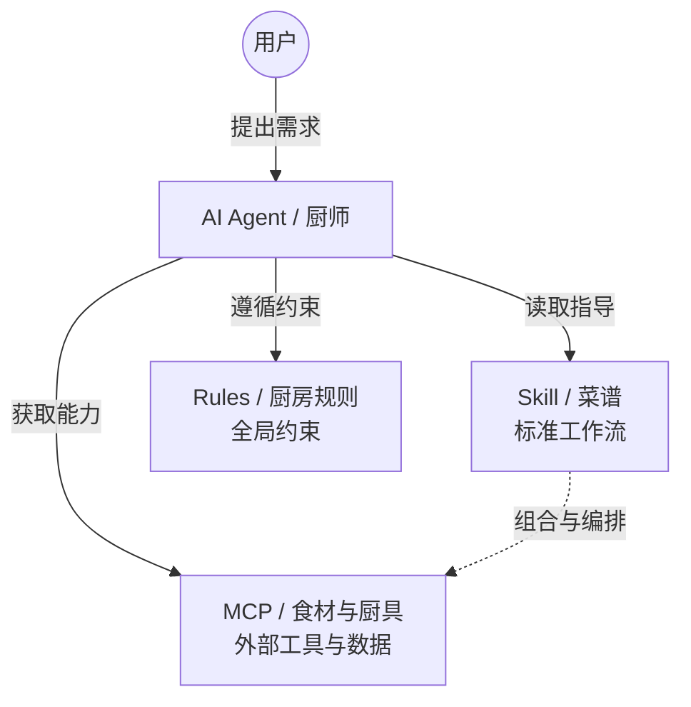
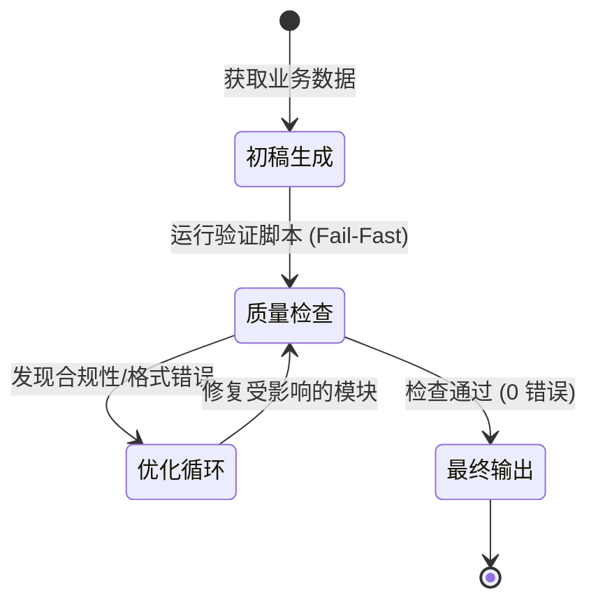

    

        

            

            

            

        

        
bash

    

    

        
ckhuang@macbookpro:~$ 每天都在“调教”AI，却依然得不到稳定的输出？你可能把 AI 当成了全知全能的神，却忘了给它一份标准的“工业级菜谱”。今天，我们把 Agent Skill 的底层逻辑扒得干干净净。

    

在 AI 原生工作流加速普及的今天，很多人发现了一个痛点：**向 AI 传达了模糊的需求后，AI 总是按自己的理解自由发挥**。结果就是你需要反复修正提示词，持续“调教”模型。这种高成本、低确定性、难以复现的交互模式，显然无法满足工业级的项目交付标准。

想象一下你走进一家餐馆，直接对厨师说：“帮我做一道红烧肉。”如果没有菜单和菜谱，厨师做出来的口味大概率不是你想要的。这正是我们在使用大模型时遇到的普遍问题。

今天，我们就来聊聊打破这个僵局的核心武器——**Skill（技能）**。

## 1. Skill 的本质：AI 的“标准化菜谱”

如果说大模型（Agent）是执行力极强的厨师，那么 MCP（Model Context Protocol）就是提供食材和专业厨具的供应商，而 **Skill 就是那份极其详细的标准化菜谱**。

当 AI 拥有了一份清晰的菜谱，它就明确了：
- 任务的标准做法是什么？
- 哪些步骤是必须的？
- 应该调用什么工具，顺序如何？

在我的分布式架构实战经验中，我们一直在追求**系统的确定性**与**无状态的优雅**。Skill 的出现，本质上就是将人类领域专家的“Know-How”沉淀为可执行、可复用的工作流配置，让大模型在复杂的业务场景中收敛其随机性，实现高确定性的输出。

## 2. 核心架构：三级渐进式披露机制

Skill 并不是一个简单的 Prompt 文本，而是一个开放标准的文件夹，它通过**三级渐进式披露机制（Progressive Disclosure）**来巧妙地管理大模型的上下文窗口（Context Window）。

在分布式系统设计中，我们常说“不要一次性把所有数据都加载到内存中”。Skill 也是同样的逻辑：

- **第一级：YAML Frontmatter（元数据）**
  - **内容**：仅包含 `name` 和 `description`。
  - **机制**：始终驻留在 AI 的系统提示词中，相当于图书馆的目录卡片。它告诉 AI “我有哪些技能，在什么场景下应该被触发”。
- **第二级：SKILL.md（正文）**
  - **内容**：具体的执行步骤、示例、注意事项。
  - **机制**：只有当 AI 判断当前任务与该 Skill 匹配时，才会“按需加载”完整正文，极大地节省了上下文和推理成本。
- **第三级：Scripts / References / Assets（扩展资源）**
  - **内容**：Python/Shell 脚本、参考文档、模板文件。
  - **机制**：在执行特定步骤时，AI 才会去读取这些资源，保证了复杂工作流的顺利执行而不撑爆 Token 限制。

    “MCP 赋予了 AI 触手，而 Skill 赋予了 AI 行业最佳实践的大脑。没有大脑的触手，只会把系统搅得一团糟。” —— CK·黄

## 3. 为什么是 Skill，而不是 Slash Command 或纯 MCP？

很多技术管理者可能会问：“我已经配置了 MCP 连通了 GitHub 和 Jira，或者写了一些 `/` 快捷指令，为什么还需要 Skill？”

我们可以用一个简单的判断法则来区分：
- 需要调用外部系统数据？👉 **MCP**
- 只是一次性快捷操作，不需要多步复用？👉 **Slash Command**
- 是一条全局适用的格式化约束？👉 **Rules**
- **是可复用的标准化工作流，需要跨项目、跨团队共享的最佳实践？** 👉 **Skill**

**Skill 的降维打击在于“工作流编排”与“领域知识内嵌”。** 比如团队规定新增 API 必须同步文档、做兼容性检查并写单元测试。如果没有 Skill，AI 很容易遗漏。通过编写一个 API 规范 Skill，并在其中内嵌一段 Python 校验脚本（`scripts/check_api_docs.py`），你就能把团队的技术规范强制固化下来。

## 4. 如何写好一个工业级的 Skill？

结合我自己在大数据平台与 AI Agent 架构中的踩坑经验，要写出一个“不翻车”的 Skill，必须遵循以下几个原则：

1. **写好 Description 的触发词（Trigger Words）**：
   Frontmatter 是 AI 判断是否调用的唯一依据。描述不能只写“做什么”，必须写“什么时候用”。例如：*“当用户提到‘冲刺’、‘Linear任务’或要求‘创建工单’时触发。”* 这就像微服务中的路由规则，定义得越精准，匹配效率越高。
2. **用第三人称描述步骤，并编号化**：
   在 `SKILL.md` 中，使用“当被触发时，AI 需要先……”而不是“你要……”。把每个步骤编号，确保 AI 不会跳过或混淆顺序。
3. **关键验证前置（Fail-Fast）**：
   在分布式开发中，Fail-Fast（快速失败）是铁律。在 Skill 中，也要把最重要的检查放在最前面，并使用 `## 重要` 或 `CRITICAL:` 标注，防止 AI 走很长的弯路后才发现前置条件不满足。

## 5. 总结：让 AI 按你的标准执行

在 AI 时代，掌握 Skill 已经不再是少部分极客的专利，而是产品、研发、甚至技术管理者提升人机协同效能的核心素养。它解决的不是“AI 能不能做”的问题，而是“AI 能不能按照人类专家的顶级标准、稳定可靠地做”的问题。

不要等待完美的时机，立刻动手在你的本地环境写下第一个 Skill 吧。把重复的劳动交给脚本，把最佳实践固化成代码。

    

        

            

            

            

        

        
bash

    

    

        
ckhuang@macbookpro:~$ AI 不会取代人，但掌握了 AI 标准化工作流的人，一定会取代那些还在手动敲 CRUD 的人。拥抱 Skill，重塑你的开发范式。 

    

