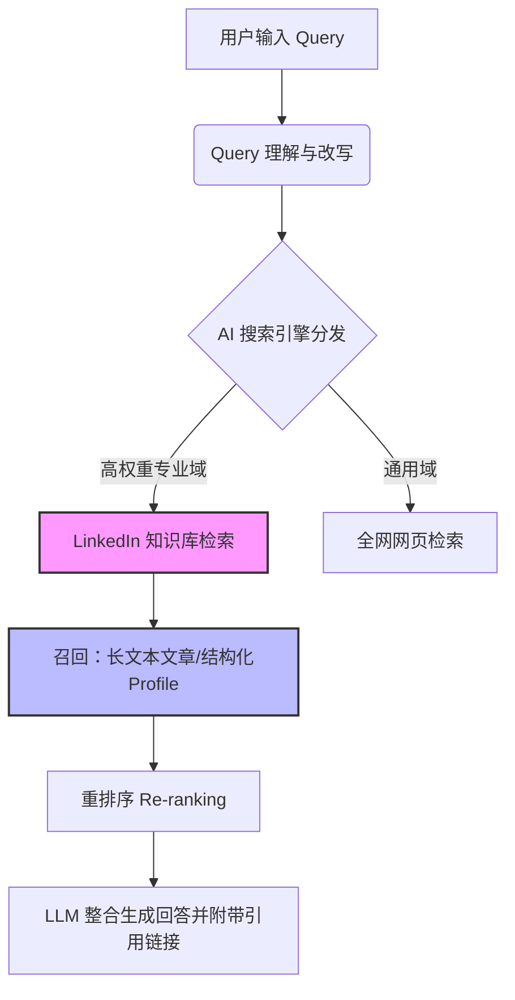

    

        

            

            

            

        

        
bash

    

    

        
ckhuang@macbookpro:~$ 很多技术人辛辛苦苦敲了十几年代码，解决过无数高并发、大数据的史诗级 Bug，但在 AI 搜索引擎眼里，你可能只是个“透明人”。当 ChatGPT 和 Google AI Overview 开始主导信息检索，如果不懂得把自己的数字资产“向量化”以迎合 AI 的胃口，你的职场竞争力正在被悄悄降维打击。

    

最近读到一篇关于 [AI 搜索时代如何优化 LinkedIn](https://builtin.com/articles/how-to-optimize-linkedin-for-ai-search) 的深度文章，里面提到了一个非常有意思的数据：从 2025 年底到 2026 年初，LinkedIn 在 ChatGPT 上的域名排名翻了一倍多，成为了第五大被引用的信息源。而在所有与“职场”相关的查询中，LinkedIn 更是高居榜首。

作为每天都在和 AI Agent、分布式系统打交道的老兵，这让我产生了一个职业直觉：**社交媒体正在从“人际关系网络”演变成大模型的“优质 RAG（检索增强生成）数据源”**。今天，我们就用工程师的视角，来拆解一下如何让你的 LinkedIn 个人品牌在 AI 搜索时代脱颖而出。

### 一、为什么大模型偏爱 LinkedIn？（底层逻辑）

传统的社交平台充满着情绪化的短文本和娱乐信息，对于 LLM 来说，这些数据的信噪比极低。而 LinkedIn 作为一个职业社交平台，天然拥有结构化的履历数据、专业领域的长文本探讨以及相对真实的身份认证。

当用户向 ChatGPT 提问“如何解决分布式事务中的数据一致性问题？”或者“寻找一位有金融级大模型落地经验的架构师”时，AI 搜索系统会在后台执行以下流程：

在这个链路中，**长文章（Articles）和深度帖子（Posts）构成了被引用的绝对主力**（占据 70% 以上的引用比例），因为它们能提供足够的上下文（Context），完美契合了 RAG 系统中基于语义相似度的向量检索机制。

### 二、如何用工程师思维优化你的数字资产？

既然知道了 AI 是如何抓取和计算的，我们就可以对症下药，对自己的 LinkedIn Profile 进行一次“重构”。

#### 1. 标题（Headline）：高维特征提取，拒绝模糊语义

很多人喜欢把 Headline 写成“Results-driven professional”或者干脆只有一个“Software Engineer”。在 LLM 看来，这种词汇属于“停用词（Stop words）”或者低权重特征，无法在多维向量空间中将你与其他几百万程序员区分开来。

**正确做法**：将 Headline 视为一段高密度的 Prompt。用具体的职位、核心技能栈和业务价值（Value Proposition）来构建。
- **反面教材**：资深后端开发
- **工程师实践**：分布式架构师 | 高并发处理、大数据治理、AI Agent 落地 | 为金融 SaaS 构建毫秒级高可用系统

#### 2. 长文本输出：提升 Semantic Density（语义密度）

数据表明，**500 到 2000 字的 LinkedIn 文章最受 AI 偏爱**。为什么？因为过短的文本在 Chunking（分块）和 Embedding（向量化）时，容易丢失关键特征；而 500-2000 字恰好能完整阐述一个痛点、一套方法论和一次实战踩坑记录。

不要试图追求传统社交媒体的“病毒式传播（Virality）”。AI 算法和推荐流算法不同，它更看重**内容的一致性（Consistency）和相关性（Relevance）**。哪怕你的帖子只有 15 个点赞，只要你的技术逻辑严密、持续输出垂直领域的见解，AI 搜索引擎照样会把你当做该领域的权威信源（Authority）。

#### 3. 对抗“模式崩溃”：保持人类的真实感

这里有一个非常有意思的悖论：Originality AI 的数据显示，目前 LinkedIn 上超过一半的帖子是 AI 生成的。很多人想走捷径，用 ChatGPT 批量洗稿来打造“意见领袖（Thought Leadership）”人设。

从 AI Agent 专家的角度来看，这是一种极其短视的行为。大模型在训练和检索时，正在不断引入困惑度（Perplexity）检测。当满屏都是毫无波澜的“AI 塑料味”套话时，这些内容会被打上低权重标签。**你真正有价值的数据，是你熬夜排查过的 OOM、是你为应对双十一流量洪峰做过的架构降级方案、是你真实的踩坑血泪史。** 只有这些充满“人类实战经验”的罕见特征（Rare features），才能打破同质化，被猎头和 AI 搜索精准捕获。

    “在 AI 泛滥的时代，算法最渴望的，恰恰是那些 AI 无法生成的真实踩坑经验与深度行业洞察。” —— CK·黄

### 三、AI 时代的猎头：你的 Copilot 也是别人的 Copilot

不要以为只有你在用 AI。现在的猎头早就不局限于传统的关键字搜索了。他们正在使用 Fetcher、Juicebox 等 AI 驱动的工具进行全网简历爬取和语义匹配。

AI 不是在取代传统的寻访，而是在增加一个“认知层”。比如猎头寻找“能优化 LLM 推理延迟的专家”，AI 会自动将这个需求映射到你在 LinkedIn 上分享过的“关于 vLLM 和 PagedAttention 的调优经验”文章上，从而将你从海量候选人中“捞”出来。

    

        

            

            

            

        

        
bash

    

    

        
ckhuang@macbookpro:~$ 总结一下：把你的 LinkedIn 当成一个正在被全网大模型持续抓取的高质量数据库。定义好你的主键（Headline），填充好你的长文本字段（Articles/Posts），用最真实的人类经验去对抗 AI 时代的同质化。终身学习不仅是向内输入，高质量的向外输出，才是让你在 AI 时代获得复利的最优解。

    

