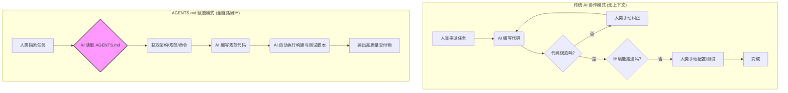

    

        

            

            

            

        

        
bash

    

    

        
ckhuang@macbookpro:~$ 很多团队引入了最前沿的 AI Coding 工具，却发现效率提升远不及预期。AI 总是在项目规范、上下文和环境配置上“疯狂踩坑”。问题出在哪里？不是 AI 不够聪明，而是你的项目对 AI “太不友好”。今天我们来聊聊，如何用一份 AGENTS.md 文件，彻底打通 AI 智能体与代码仓库的任督二脉。 

    

## 认知误区：为什么有了 AI，开发还是那么累？

在近期的分布式架构和 AI Agent 落地实践中，我经常听到开发者抱怨：让 AI 改个前后端联动的需求，它在仓库间反复横跳，频频丢失上下文；让 AI 写个业务逻辑，它把团队死守的分层架构破坏得一塌糊涂；好不容易代码写完了，却不知道怎么启动自测。

这些痛点的根源在于：**项目的知识、规矩和环境配置，都存在于人类开发者的脑子里，或者散落在零碎的 Wiki 中，AI 根本无从得知。** 

如果我们把 AI 当作一个新入职的“超级外包”，那么 `AGENTS.md` 就是发给它的**《新员工入职与开发指南》**。

## 破局之道：AGENTS.md 的前世今生

`AGENTS.md` 是一个简单的开放格式，用于指导 AI Coding Agent 在你的项目中工作。它最早由 Anthropic 提出的 `CLAUDE.md` 演变而来，如今已经成为 GitHub 上超过 6 万个开源项目采用的事实标准（主流工具如 Cursor、Copilot、Trae 等均已支持）。

它的核心理念是：**渐进式披露（Map, not Manual）。** 它是一张导航地图，大约 200 行，告诉 AI “去哪里找什么”，而不是把所有的长篇大论塞进去。只有**项目全貌的必要信息**和**违反会导致问题的硬性规则**才应该直接写在里面，其他细节通过链接指向详细文档。

为了更直观地理解引入 `AGENTS.md` 前后的差异，我们来看下面这张图：

## 核心实战：如何打造高质量的 AGENTS.md？

结合我参与构建大型管控系统（Spring Boot + React）的经验，以及原作者岛风的精彩总结，我认为要让 AI Coding 发挥出 10 倍效能，需要做好以下五个层面的架构级适配：

### 1. 解决上下文割裂：走向 Monorepo
过去我们习惯将前端、后端、组件库拆分到不同的代码仓库中。这在微服务时代是合理的，但在 AI 时代，这成了阻碍 AI 理解全局上下文的最大绊脚石。
**最佳实践**：尽可能采用 Monorepo 架构。将前后端代码、文档、甚至部署脚本放在同一个仓库下。AI 在同一个窗口就能看到 Controller 定义和对应的前端 API 调用，实现真正的全栈协同。如果存量项目迁移成本太高，也可以通过脚本将相关仓库聚合到子目录下（在 `.gitignore` 中忽略）。

### 2. 统一环境配置：让 AI 能自主启动
AI 如果连项目都启动不了，就无法形成测试闭环。
**最佳实践**：摒弃散落在 `.bashrc` 或 IDE 里的环境变量配置。将本地环境变量统一配置在 `~/.<project>_env` 中，并通过一键启动脚本（如 `./scripts/start-server.sh`）自动加载。在 `AGENTS.md` 中告诉 AI 这个脚本的存在，让它一键构建、启动、检查。

### 3. 打造验证闭环：改完代码不算完，跑通才算完
这是最容易被忽视的一环。我们必须在 `AGENTS.md` 或设计文档中明确验证规范，让 Agent 学会自我验证。
**最佳实践**：
- **后端**：制定严格的 `curl` 验证规范。例如，通过临时文件传递数据，将登录、提取 Token、业务调用拆分为独立步骤，避免 Shell 管道兼容性问题导致 AI 罢工。
- **前端**：利用 Agent Browser 的能力，让 AI 自己打开浏览器、操作页面、截屏对比，验证视觉渲染和交互逻辑。

### 4. 自动化检查：用脚本捍卫架构底线
`AGENTS.md` 里写的规矩，如果没有自动化检查，很容易形同虚设。
**最佳实践**：比如分层架构（Controller 不能直接依赖 Entity），必须编写专门的扫描脚本（如 `lint-deps.sh`）。检查失败时，输出的错误信息必须包含：**WHAT（违规了什么）+ WHY（为什么不允许）+ HOW（怎么修复）**。这样 AI 读到错误后，就能立刻自我修正。

### 5. 引入参考源码：最好的文档是代码本身
很多团队使用了内部闭源组件，或者对接了复杂的开源内核，AI 的训练数据里根本没有这些知识。
**最佳实践**：不要试图用自然语言写冗长的使用手册。直接在仓库中建一个 `reference-projects/` 目录，通过 `git submodule` 引入组件库或网关内核的源码。告诉 AI：“如果你不会用，去读那里的 TypeScript 定义和实现。” **源码永远不会过时，它是最精准、最硬核的 Prompt。**

    “在 AI Coding 时代，让 AI 读懂你的项目上下文，比盲目追求更聪明的基座模型更重要。” —— CK·黄

    

        

            

            

            

        

        
bash

    

    

        
ckhuang@macbookpro:~$ 总结一下，AGENTS.md 不是一份写满条条框框的说明书，而是一个连接 AI 与工程实践的桥梁。通过仓库聚合、环境统一、自动化检查和源码级参考，我们将项目的“隐性知识”转化为 AI 可执行的“显性规则”。下一次当你抱怨 AI 写代码不够聪明时，不妨先审视一下：你的项目，准备好迎接 AI 员工了吗？ 

    

