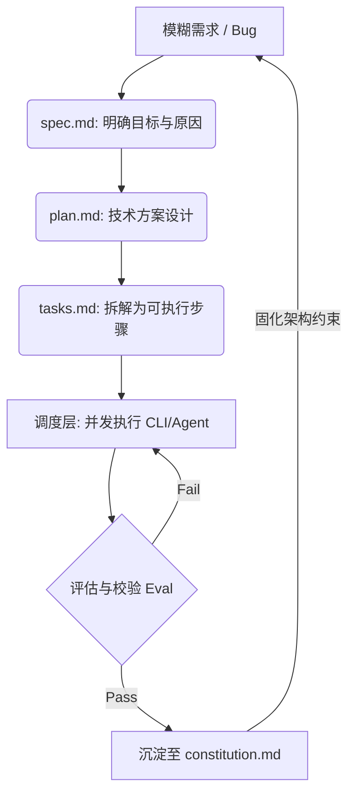

    

        

            

            

            

        

        
bash

    

    

        
ckhuang@macbookpro:~$ 屏幕上开着5个AI终端，人脑并发上限被无情击穿。AI没有替代我，却让我变成了系统的瓶颈。这篇文章，我们来聊聊如何跳出“微观调度”的陷阱，构建真正 Goal-Driven 的 AI Agent 架构。 

    

## 1. 认知缺口：被击穿的人脑并发上限

曾几何时，前端开发被戏称为“娱乐圈”——框架月抛，工具层出不穷。如今，AI 把这个焦虑周期压缩到了按周计。但当我们剥开各种炫酷 Demo 的外衣，深入到真实的研发场景中时，往往会面临一个极其尴尬的窘境。

想象一下这个画面：你的屏幕上同时开着 5 个终端。
左上角的 Codex 在跑单元测试；右上角的 Gemini-CLI 在重构入参校验；左下角的 Claude 根据新变更生成 API 文档；而主屏幕上的 Cursor 还挂着两个重构组件的 Agent 窗口。

**听起来是不是很像一个未来极客？**
但真实的体验是：Codex 卡住了五分钟我才发现，Gemini 改完接口我忘了切分支，Claude 写的文档引用了旧名称因为上下文没同步，而 Cursor 里的确认弹窗白白等了我十分钟。

**结论非常刺骨：人脑的并发 Context Switch 上限，也就是 4-6 个终端。**
当我们在追求让 AI 更聪明的时候，却忽略了最大的系统瓶颈——人。解决这个瓶颈的方法，不是让 AI 替代人，而是**让系统不再依赖人的实时在场**。

## 2. 架构洞见：80% 的 AI 需求不需要 AI

很多开发者在接触 AI 后，很容易患上“大模型依赖症”。一个简单的定时采集任务，非要套一层 LangChain，加个 Agent 循环，搞个 Tool Calling，最后运行起来的稳定性还不如写死的脚本。

回归到工程本质，我提炼出了一条极其反直觉的决策层级：

**目标 → 代码 → CLI → Prompt → Agent**

每往上一层，系统的不确定性和维护成本就增加一个量级。
- 自动拉取代码跑测试？`Bash` 脚本搞定。
- 定时检查服务健康？`cron + curl`。
- 日志格式化？`jq + awk`。

    “代码优先于 Prompt。能用 10 行 Bash 解决的，别折腾 AI。这不是反 AI，是尊重工程。” —— CK·黄

能够在底层以确定性代码解决的问题，绝不向上推给充满概率的大模型。先问问自己：一次 LLM 调用够吗？10行 Bash 能搞定吗？这个习惯能帮你省掉 80% 的过度工程。

## 3. 从 Vibe Coding 翻车到 SDD 的救赎

有了需求，接下来是动手。在打造系统初期，我也尝试过极其流行的 Vibe Coding（直觉编程）：不写 Spec，不做设计，直接跟 AI 喊话“帮我做个 XXX”。

前几天体验爽到飞起，但第三天就开始还债。
Vibe Coding 的本质是“先易后难”。随着代码膨胀，AI 的上下文彻底混乱，每次修改都在给系统埋雷。大路平坦宽阔，但人偏偏喜欢走捷径，最后只能退回来重新走大路。

这套“大路”的方法论，我称之为 **SDD (Spec-Driven Development)**。
在 Agent 场景里，SDD 的核心不是先写文档，而是**把模糊想法逐步转成可执行单元，并把过程完整留痕**。

当系统出 Bug 时，你不需要让大模型去猜，而是直接看 `spec.md` 当时的输入是什么，看 `plan.md` 的判断逻辑在哪里失效。**留痕不是为了 Debug，而是为了进化。**

## 4. 从 Demo 到生产：Agent 系统的 5 层地基

在打造“24h 无人值守”的打工人 Agent 时，我放弃了复杂的数据库，选择了最简单的核心架构：**文件系统存储 + 轮询调度 + JSON 状态管理**。

为什么？因为当 Agent 挂掉时，直接让 AI 读文件排查的成本最低，且 Git 天然提供了版本控制。在这个过程中，系统能真正做到“自己修自己的 Bug”，其前提正是基于 `constitution.md` 里的目录规范、边界约束和 SDD 流程。

如果今天要概括一个高可用 Agent 系统的地基，必然包含以下 5 层：
1. **目标表达**：到底想完成什么。
2. **能力单元**：有哪些 Skill、工具、工作流。
3. **运行时状态**：当前正在做什么。
4. **治理边界 (Control Plane)**：允许做什么，不允许做什么。
5. **评估反馈 (Observability)**：哪些行为值得固化，哪些必须修正。

如果没有 Observability（可观测性），连它为什么失败都回答不了，那去追求更强的模型毫无意义。**垃圾的思考乘以强大的模型，等于精美的垃圾。**

## 5. 行业协议收敛与 Goal-Driven 的跃迁

2025年开始，整个行业的风向变了：从单系统自动化，走向跨系统互操作。
- **Responses API** 统一了 Runtime。
- **MCP (Model Context Protocol)** 标准化了工具接入。

这意味着“自己造胶水层”的时代正在过去。作为架构师，选型时必须优先考虑是否兼容 MCP 等正在收敛的协议。**协议层是长期资产，框架只是短期工具。**

而这一切的最终指向，是从 **Task-Driven** 走向 **Goal-Driven**。
Task-Driven 解决了执行问题，但只要还需要人持续“派活”，人就依然是瓶颈。Goal-Driven 则通过类似 `STATE.yaml` 的共享状态机制，让每个 Agent 自主读取状态、写回进度，主会话只负责高层目标和验收。

先让一次执行可复盘，再让它可重复，再让它可规模化，最后让它可有限自主。别跳步。

    

        

            

            

            

        

        
bash

    

    

        
ckhuang@macbookpro:~$ 真正的技术跃迁，不是让 AI 多跑几个步骤，而是让开发者从微观的流程调度中全身而退。AI 的最终目的，是增强自我，而非取代自我。共勉。 

    

