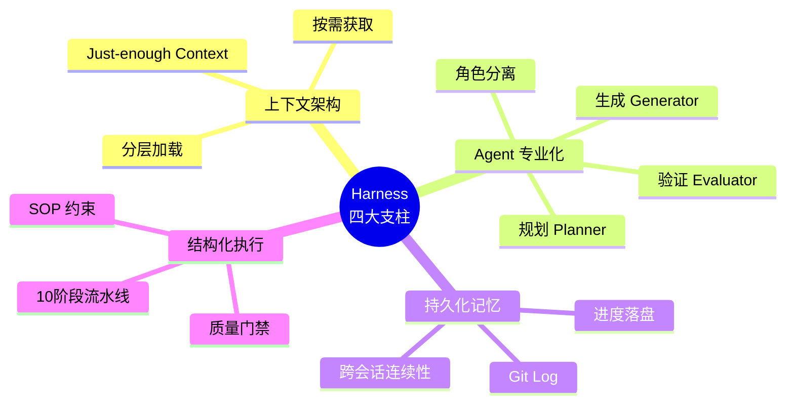
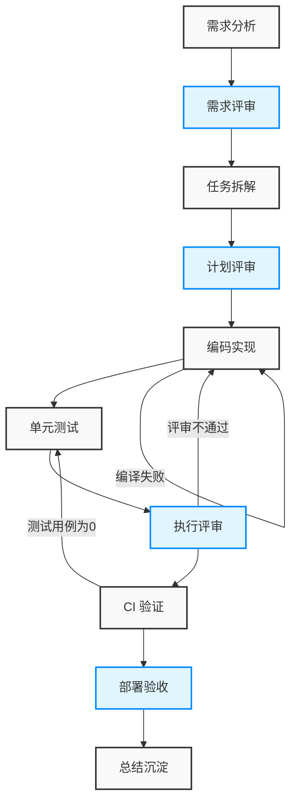

    

        

            

            

            

        

        
bash

    

    

        
ckhuang@macbookpro:~$ 别再死磕 Prompt 了！把大模型直接扔进几十万行的企业级代码库，就像把刚毕业的实习生扔进祖传“屎山”——如果缺乏严密的工程约束，产出的必定是“语法完美但业务全错”的灾难。 

    

在过去的几年里，AI Coding 正在经历肉眼可见的狂飙突进。从早期的 Copilot 自动补全，到如今 Cursor、Claude Code 等 Agentic Coding 工具的爆发，我们真切感受到了 AI 接管代码的潜力。

但当你真正尝试在真实的企业级代码库（动辄十几万行，充斥着复杂的 RPC、配置中心、流程引擎等中间件）中落地 AI Agent 时，往往会遇到一个令人抓狂的系统性鸿沟：**Agent 模型的原始能力足够强，但产出却极度缺乏“可信赖的工程度”。** 

它不知道某个配置项在全项目有85处引用；不知道高频变更链路的暗坑；甚至会“幻觉”出不存在的 API。为了解决这个痛点，我们需要引入一个全新的工程范式：**Harness Engineering**。

今天，我将结合最新的行业方法论（如 Anthropic 与 OpenAI 的实践）以及我个人的实战经验，和你聊聊如何为一个存量 Java 应用构建完整的 Harness 体系，并将 AI 代码产出率从不到 25% 飙升至 90% 以上。

---

### 一、AI Coding 的三次范式跃迁

回溯过去几年，AI 工程实践经历了三个清晰的演化阶段：

1. **Prompt Engineering（2022-2024）**：核心是优化“单次交互”。通过 Few-shot、CoT 等技巧让模型给出一个好答案，就像“写好一封邮件”。
2. **Context Engineering（2025）**：核心是优化“给 Agent 看什么”。引入 RAG、动态上下文窗口，犹如“给邮件附上正确的附件”。
3. **Harness Engineering（2026）**：这是目前的终极解法。它不再关注单次对话，而是设计**跨越多个会话、多个 Agent 角色、多个执行阶段的完整系统架构**。

正如 HashiCorp 创始人 Mitchell Hashimoto 所定义的：“每发现一个 Agent 犯的错误，你就花时间去工程化一个解决方案，让它永远无法再犯同样的错。”

如果缺乏 Harness 的约束，Agent 在复杂项目中极易陷入四大失败模式（Failure Modes）：
- **试图一步到位（One-shot Syndrome）**：在单个窗口塞满上下文，导致幻觉和输出崩溃。
- **过早宣布胜利（Premature Victory）**：代码写了一半就宣布完成，连编译都过不了。
- **过早标记功能完成（Premature Feature Completion）**：缺乏端到端测试，部署就挂。
- **冷启动困难（Cold Start Problem）**：缺乏持久化记忆，每次都需要重新理解浩如烟海的项目结构。

    “Agents aren't hard; the Harness is hard. 外部化的质量保障体系，才是大模型落地的底座。” —— CK·黄

---

### 二、构建 Harness 体系的四大支柱

结合业界经验和我自身的分布式架构实践，我将 Harness Engineering 归纳为四根支柱：

1. **上下文架构（Context Architecture）**：必须做到“恰好够用”。把几十页的架构文档全塞给 Agent 是灾难。我们应该构建 L1（常驻层）、L2（阶段触发层）和 L3（按需查询层）的分层上下文。
2. **Agent 专业化（Agent Specialization）**：让“写代码”的 Agent 和“Review 代码”的 Agent 分离。受限的专家 Agent 永远优于全能的通用 Agent。
3. **持久化记忆（Persistent Memory）**：任务进度必须持久化在文件系统（如 `progress.md`）中，而不是指望模型窗口的记忆。
4. **结构化执行（Structured Execution）**：强制 Agent 遵循“理解 -> 规划 -> 执行 -> 验证”的流水线，每个节点都有明确的质量门禁（Quality Gates）。

---

### 三、存量项目实战：如何让 AI 代码率跃升至 90%

在真实的企业级 Java 应用（10万+行代码，Spring Boot / RPC / 配置中心等复杂技术栈）中，我落地了这套 Harness 体系。

#### 1. 四要素架构设计

我们将 Harness 物理化在项目根目录下的 `.harness/` 目录中，拆分为四要素：
- **Rules（规则）**：不随需求变化的稳定约束（架构约定、编码规范）。
- **Skills（技能）**：SOP，告诉 Agent 每个阶段该干嘛。
- **Wiki（知识库）**：业务文档、链路梳理，作为按需加载的素材。
- **Changes（变更管理）**：每个需求的追溯链。

#### 2. 十阶段结构化流水线

这套体系的核心是一个名为 **Application Owner Agent** 的“大脑”，它驱动着需求从接收到交付的 10 个严格阶段：

在这个流水线中：
- 每个阶段都有**触发条件**、**Skill 加载**和**质量门禁**。
- **机器可验证的门禁**：比如 CI 检查不仅要 `status == SUCCESS`，还必须校验 `total_tests > 0`。如果条件不能被程序化验证，Agent 就会钻空子。
- **Human-in-the-Loop**：我们在关键节点（如计划评审后、部署前）设置了人工确认点，确保方向不偏。

#### 3. Agent-to-Agent Review

传统开发中，Code Review 是最大的瓶颈。在 Harness 中，我实现了 `expert-reviewer` Skill，通过引入专门的 Review Agent 来审查编码 Agent 的产出。这本质上是将 Code Review 自动化，在代码交到人类手里之前，AI 已经在内部完成了质量纠偏。

---

### 四、实战成果与深度洞见

经过实战打磨，项目的 AI 代码率从引入前的 **24.86%** 跃升至成熟后的 **90.54%**。但这背后最大的收益并不是“写代码更快了”，而是**返工率的大幅降低和交付质量的可预期性**。

基于这次完整的实战，我有以下几点深度洞见与大家分享：

1. **如果门禁不能被机器验证，那它就是无效约束**。永远不要用模糊的自然语言去约束 Agent。
2. **规范是“活”的，需要持续迭代**。当你在 Harness 中写下一条看似啰嗦的规则时，背后往往对应着一个真实的线上血泪坑。
3. **流程一致性优先于效率**。即使是只改 2 行代码的小需求，也必须跑完 10 阶段流水线。在复杂的企业系统中，“小改动引发大事故”的惨痛教训比比皆是，Harness 是一份廉价的保险。

    

        

            

            

            

        

        
bash

    

    

        
ckhuang@macbookpro:~$ AI 并没有降低软件工程的门槛，反而拔高了它。作为未来的架构师与开发者，我们的核心竞争力正在从“手工垒代码”全面转向“设计 Agent 的精密工作环境”。你准备好迎接这场工程范式的迁变了吗？ 

    

