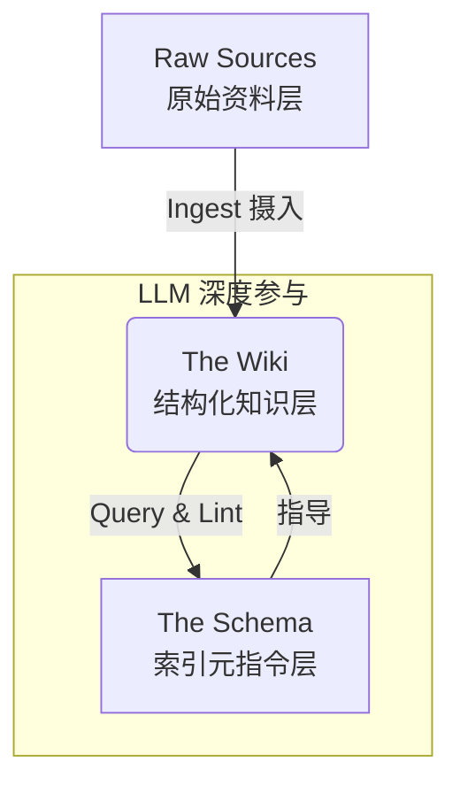
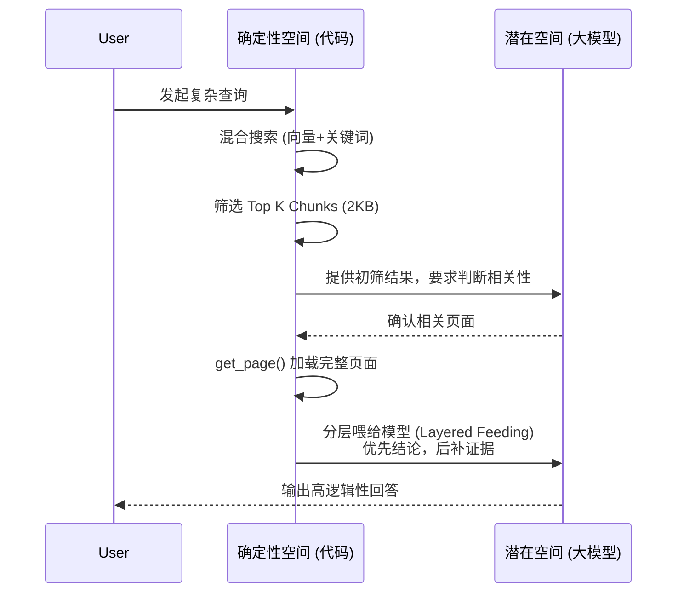

<!-- 引入终端风格的 HTML 块，用于吸引读者注意力并抛出痛点 -->

    

        

            

            

            

        

        
bash

    

    

        
ckhuang@macbookpro:~$ 打开你的浏览器收藏夹，看看有多少文章是“吃灰”的？人类擅长“无脑堆积”，却极不擅长“组织知识”。而现在的 Agent 也面临同样的问题：光靠 RAG 堆砌文档，Agent 真的能变聪明吗？今天我们聊点硬核的：Knowledge Engineering（知识工程）。 

    

在构建企业级 Agent 时，很多人都会陷入一个误区：觉得只要接了 RAG（检索增强生成），Agent 就能无所不知。但真正在生产环境里跑起来，你会发现它经常“装傻”——前置的小模型检索能力有限，每次交互都是独立的“重头再来”，知识完全没有沉淀。这就像让一个学渣每次考试都带小抄，虽然能抄到几道题，但他本身的知识储备并没有任何增长。

除了昂贵的 RL（强化学习）训练，还有什么轻量级的方法能让 Agent 实现真正的**自进化**？答案是从“知识堆积”走向“结构化记忆”。今天，我将结合 Andrej Karpathy 的 **LLM Wiki**、**Obsidian-Wiki** 以及 Garry Tan 的 **GBrain**，深入拆解 Agent 时代知识体系的演进架构。

### 1. 传统 RAG 的困境与 Skillify 的崛起

回顾智能客服和知识库的发展，我们经历了“人工标签时代”，随后大步跨入“RAG时代”。RAG 虽然解决了海量文本的搜索问题，但在复杂场景下暴露出三大致命伤：
1. **模型能力断层**：检索端的小模型（Embedding）和生成端的大模型（LLM）能力不匹配，检索漏了，生成必错。
2. **搜索独立性**：每次问答都是孤立的。昨天搜准了，今天换个词可能就翻车。
3. **知识未沉淀**：即便引入了 Agentic RAG 循环优化搜索，也只是在用高昂的算力掩盖“记不住”的事实。

为了解决这个问题，Andrej Karpathy 提出了 **LLM Wiki** 的概念。这不仅仅是一个文件，而是一种范式转变：把知识当做代码一样去“编译”。

<!-- 引入引用块，突出个人技术洞见 -->

    “如果说 RAG 是让大模型‘带着书本进考场’，那么 Skillify 则是让大模型‘把书读透并整理成体系化的笔记’。前者依赖临场发挥，后者依赖深厚积累。” —— CK·黄

### 2. LLM Wiki：三层架构的知识闭环

LLM Wiki 的核心思路非常优雅：将所有知识沉淀为一个相互链接的 Markdown 文件集合体。它打破了传统 RAG“即搜即用即抛”的模式，将系统分为三层：

<!-- 使用 Mermaid 流程图展示 LLM Wiki 的三层架构，帮助读者直观理解知识流转过程 -->

- **摄入（Ingest）**：当新知识（如一篇长文）进入时，LLM 不是把它切成 Chunk 扔进向量库，而是深度阅读，提取要点，甚至联动更新十几个相关的 Wiki 页面。
- **查询（Query）**：大模型像阅读目录一样，根据上下文动态决定加载哪部分知识（渐进式披露）。
- **维护（Lint）**：定期执行类似代码静态检查的操作，清理过期声明，修复断链，解决事实矛盾。

这种模式的维护成本接近于零，因为“记账”的脏活累活都交给了不知疲倦的 LLM。

### 3. Obsidian-Wiki：从理念到多 Agent 框架

单纯依靠一个 `llm-wiki.md` 在工程上是不够的。**Obsidian-Wiki** 在此基础上做出了极大的工程化增强：
- **Delta 差异追踪**：引入 `.manifest.json`，通过 SHA-256 哈希比对，实现增量扫描，避免重复处理。
- **历史交互摄入**：自动扫描你在 Claude、Cursor 等工具中的对话记录，将碎片化的交互转化为系统级的隐性经验。
- **自动图谱化**：通过 `cross-linker` 等技能自动发现页面间的潜在联系并建立交叉引用。

### 4. GBrain：混合检索与实体关系演进

如果 LLM Wiki 是“极简主义”，那么 Garry Tan 的 **GBrain** 就是“工程化重型武器”。GBrain 解决的是 LLM Wiki 在规模膨胀（比如文件达到数千个）后面临的性能瓶颈。

GBrain 的核心哲学是 **Thin Harness, Fat Skills**，以及一个极其深刻的洞察：区分**潜在空间（Latent Space）**与**确定性（Deterministic）**。

<!-- 使用 Mermaid 时序图展示 GBrain 的查询处理流程，凸显大模型和代码职责的边界 -->

在 GBrain 中：
- **让 LLM 做它擅长的（潜在空间）**：阅读、解释、判断“这条信息属于谁”。
- **让代码做它擅长的（确定性空间）**：SQL 查询、向量计算、链接构建。

此外，GBrain 并不是摒弃向量库，而是**将向量过滤与文件披露相结合**。先用混合搜索快速定位，再用全页加载和分层投喂（Layered Feeding）让大模型掌握核心观点与历史时间线。同时，它通过代码规则（而非玄学的模型预测）强制构建了轻量级的**实体关系图谱**（节点 + 关系边），赋予了 Agent 复杂的多跳推理能力。

<!-- 结尾终端风格总结块，升华文章主题 -->

    

        

            

            

            

        

        
bash

    

    

        
ckhuang@macbookpro:~$ 技术选型从来不是非此即彼的单选题。追求准确性的“渐进式披露”必然带来延迟开销。在企业级生产落地中，混合架构——利用向量检索做轻量级初筛，保留核心业务的图谱化渐进式阅读——才是兼顾性能与智商的最佳解法。停止无脑的 RAG 堆砌吧，开始构建属于你的 Agent “自组织”大脑。 

    

