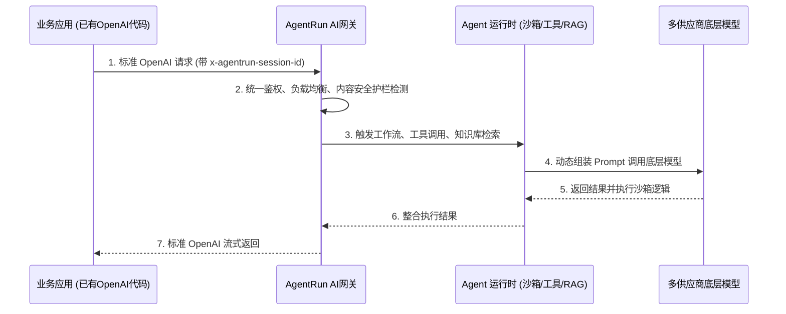
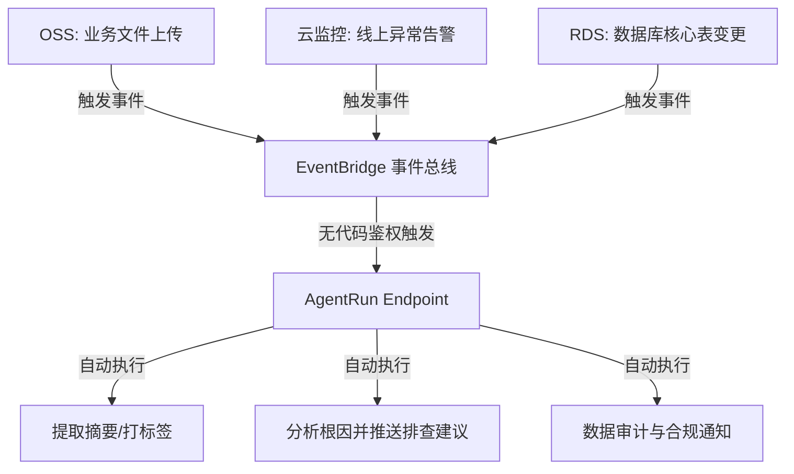

    

        

            

            

            

        

        
bash

    

    

        
ckhuang@macbookpro:~$ 开发一个 Agent 只要 5 分钟，但把它稳定地接到生产系统里，可能需要 5 天。你还在为各种自定义 API 协议和鉴权逻辑掉头发吗？ 

    

## 引言：Agent 落地最后一公里的“坑”

在过去的交流中，我经常听到技术团队抱怨：在控制台用提示词和知识库拼凑出一个极其聪明的 Agent 往往只需几分钟，但当产品经理要求把它集成到公司的后端服务、IM 机器人或小程序中时，噩梦就开始了。

你需要去读冗长的自定义 API 文档，处理繁琐的鉴权逻辑，手写 WebSocket 或 SSE 来解析流式输出，甚至为了多轮对话还得自己写一套 Session 管理（Redis 缓存、TTL 清理等）。光是对接调通，可能就要耗费大半天的时间。**“造轮子”的悲剧在每一家做 AI 落地的公司反复上演。**

近期了解到的 **AgentRun** 提供了一种截然不同的解法：**不发明新协议，而是选择让开发者用现有代码直接调用。** 今天我们就从架构的视角，深度解析 AgentRun 是如何将集成门槛降到最低的。

---

## 一、大道至简：为什么“兼容 OpenAI 协议”是最佳实践？

在分布式系统的演进史中，标准化的力量永远是降维打击。正如 TCP/IP 统一了网络传输，OpenAI 的 Chat Completions 协议事实上已经成为了当前大语言模型（LLM）交互的“行业标准”。

如果你的项目已经在使用 OpenAI 相关的库（如 Python/Node.js 的 `openai` SDK，或者 Java 的普通 HTTP 请求），通过 AgentRun 接入 Agent 只需要改动两个参数：
1. `base_url`（替换为 AgentRun 提供的端点）
2. `api_key`（替换为 AgentRun 的 Token）

**一行逻辑代码都不用改，流式输出、多轮对话、Function Calling 直接通畅。** 

但千万不要以为这只是一个简单的反向代理（Reverse Proxy）。在简单的接口背后，AgentRun 的 AI 网关默默承担了极重的底层架构工作：

**专家洞见（Why it works）**：
- **安全隔离**：模型供应商的 API Key 由平台统一托管和轮转，调用方只接触 AgentRun 的 token，实现了底层模型密钥的物理隔离。
- **状态托管**：多轮对话不再需要业务线自己维护。只需在请求头带上 `x-agentrun-session-id`，平台自动接管 Session 的生命周期（TTL、空闲超时、状态追踪）。这是典型的 Serverless 思维——**把状态下沉到基础设施，让业务层保持无状态（Stateless）。**

---

## 二、全场景覆盖：从代码到云原生的 5 条集成路径

除了基础的代码调用，AgentRun 针对不同的业务场景，提供了覆盖前后端、IM 及事件驱动的五大集成路径：

### 1. 代码集成 (Code Integration)
兼容 OpenAI 协议，适合绝大多数有研发能力的团队。无论是 Python、Node.js 还是简单的 `curl`，调试阶段跑通后，直接平移进生产代码。

### 2. SDK 深度整合 (SDK Integration)
当业务需求超越了单纯的“对话”，需要对 Agent 进行生命周期管理时，SDK 就派上用场了。
它提供了统一的 CRUDL 接口来管理 Agent Runtime、工具（MCP Server、Function Call、Skill）、知识库以及 Sandbox（代码解释器、浏览器沙箱等）。最关键的是，SDK 内置了对 LangChain、CrewAI、AgentScope 等主流框架的集成，省去了编写“胶水代码”的烦恼。

### 3. 前端零代码嵌入 (UI Integration)
自己从零搭一个前端 Agent 聊天界面工作量惊人（处理 WebSocket长连接、Markdown 渲染、样式适配）。AgentRun 直接提供了开箱即用的 UI 组件。支持四套视觉风格（简约/商务/科技/温馨）和三种嵌入方式（全屏、浮动气泡、侧边栏），直接复制代码片段嵌入 HTML 即可。

### 4. IM 机器人无缝对接 (IM Integration)
对接钉钉、飞书、企微的传统做法是自己搭一套 Webhook 转发服务。现在，平台内置了 IM 通信协议代理，统一处理了三家的协议差异。在控制台配好后，无论是群聊 `@机器人` 还是私聊，多轮对话的上下文会自动映射到 AgentRun 的 Session 中，行为逻辑与 IM 原生体验完全一致。

### 5. 事件驱动架构 (EDA) 触发
作为一名大数据与分布式架构的老兵，我最推崇的是这一条路径。很多时候，Agent 不需要“人”来主动触发，而是由“事件”驱动。

AgentRun 直接打通了阿里云的 **EventBridge**。你可以构建出极具想象力的云原生自动化工作流：

这彻底改变了 Agent 的使用范式，让 AI 从“被动的问答机器人”进化为“主动的后台数字员工”。

---

## 三、总结与思考：AI 时代的基础设施该长什么样？

从技术演进的角度看，好的平台应当具备“冰山模型”：**水面之上，对开发者呈现极致的简单；水面之下，隐藏极其复杂的系统工程。**

AgentRun 将集成门槛拉低到了“能调 OpenAI 就能调 Agent”的程度。其背后依托的不仅仅是协议适配，更是全链路可观测性（OpenTelemetry）、多租户安全护栏、以及对 RAG 和沙箱资源的统一调度能力。

    “好的架构从不强迫开发者学习新概念，而是巧妙地将复杂能力折叠在他们最熟悉的协议背后。” —— CK·黄

未来，评判一个 AI Agent 平台是否优秀的标准，不再仅仅是它能接入多少模型，而是它能以多低的摩擦力，融入企业现有的技术生态。拥抱标准协议与事件驱动，才是 AI 落地的康庄大道。
