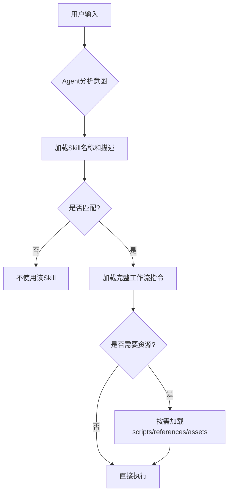
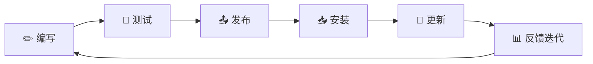
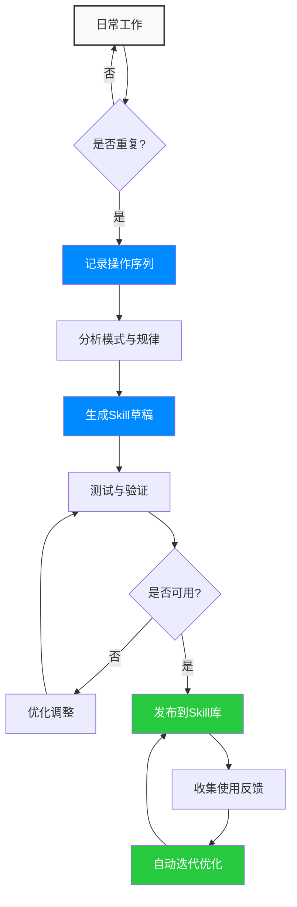

<div style="background-color: #1e1e1e; color: #00ff00; font-family: 'Courier New', Courier, monospace; border-radius: 8px; padding: 20px; box-shadow: 0 10px 30px rgba(0,0,0,0.3); margin-bottom: 30px; margin-top: 20px; position: relative; overflow: hidden;">
    <div style="display: flex; align-items: center; margin-bottom: 15px; padding-bottom: 10px; border-bottom: 1px solid #333;">
        <div style="display: flex; gap: 8px; margin-right: 15px;">
            <div style="width: 12px; height: 12px; border-radius: 50%; background-color: #ff5f56;"></div>
            <div style="width: 12px; height: 12px; border-radius: 50%; background-color: #ffbd2e;"></div>
            <div style="width: 12px; height: 12px; border-radius: 50%; background-color: #27c93f;"></div>
        </div>
        <div style="color: #ccc; font-size: 0.9em;">bash</div>
    </div>
    <div>
        <p style="margin: 5px 0; line-height: 1.6;"><span style="color: #008AFF; font-weight: bold;">ckhuang@macbookpro:~$</span> 你需要焦虑的不是"被Skill替代"，而是"还没学会用Skill" <span style="display: inline-block; width: 8px; height: 16px; background-color: #00ff00; vertical-align: middle;"></span></p>
    </div>
</div>

## 引言：Skill会替代我们吗？

每当我向团队同学介绍 Skill 时，最常被问到的一个问题是：

> "你把自己的工作流写进 Skill，让 AI 自动跑——那以后还需要你吗？"

这其实是同一道题的两面：**当 AI 学会了我们的"流程"，我们的"价值"还在哪里？**

黄仁勋在那段访谈里给了一个非常性感的回答——**任务（Task）会被自动化，但体验（Experience）和判断（Judgment）不会**。AI 看片子比放射科医生准，结果放射科医生不降反升，因为医生的工作从"看片子"升级成了"诊断疾病"。

把这个逻辑放回 Skill 的语境里：

- ❌ Skill 替代的不是"你"，而是替代你身上那些重复、冗长、易错、本来就不该占用大脑的"任务"
- ✅ Skill **替代不了的"你"**，是你生成的 Skill 在体验上的丝滑和你对 Skill 执行的准确性的**判断**，这成为你新的价值

<div style="text-align: center; font-size: 1.2em; font-style: italic; color: #008AFF; margin: 40px 0 20px; padding: 20px; border-top: 1px dashed #ccc; border-bottom: 1px dashed #ccc;">
    "你需要焦虑的不是'被 Skill 替代'，而是'还没学会用 Skill'。当别人开始用 Skill 把自己的经验沉淀、复用、放大时，你还在反复手工执行同一套流程——这才是差距的开始。" —— CK·黄
</div>

## 一、什么是 Skill：Agent 的"技能卡"

### 1.1 一句话定义

Skill 是一份**结构化的指令文档**，它告诉 AI Agent「在什么场景下、按什么步骤、用什么工具、完成什么任务」。你可以把它理解为 Agent 的**「技能卡」**——插上就能用，拔掉就没有。

### 1.2 类比理解

想象你是新入职的员工，公司给了你一本《开发操作手册》：

| 现实世界 | Skill 世界 |
|---------|-----------|
| 开发操作手册 | `SKILL.md` 文件 |
| 手册封面（标题+简介） | YAML frontmatter（`name` + `description`） |
| 开发操作步骤 | Markdown 正文中的工作流指令 |
| 附录（工具、文档等） | Bundled Resources（`scripts/` / `references/` / `assets/`） |
| 你按手册干活 | Agent 按 Skill 执行任务 |

### 1.3 Skill 的三级加载机制

Skill 并不是一股脑全部塞给 Agent 的，它采用**渐进式加载**策略：



**为什么要分级加载？**

Agent 的上下文窗口是有限的。如果所有 Skill 的全部内容都一次性加载，会迅速耗尽上下文空间。分级加载让 Agent 只在需要时才读取详细指令，既节省资源又保证精准执行。

## 二、创建你的第一个 Skill

### 2.1 目录结构

一个 Skill 本质上就是一个文件夹，最简单的情况下只需要一个文件：

```
my-awesome-skill/
├── SKILL.md              ← 唯一必需的文件！
└── (可选) 附加资源
    ├── scripts/          ← 可执行脚本（Python、Node.js、Shell等）
    ├── references/       ← 参考文档（按需加载到上下文）
    └── assets/           ← 静态资源（模板、图标、字体等）
```

### 2.2 编写 SKILL.md

这是 Skill 的灵魂文件，由两部分组成：**YAML 头部**和**Markdown 正文**。

#### YAML 头部（frontmatter）

```yaml
---
# 必需字段
name: dingtalk-webhook-skill
description: 通过钉钉自定义机器人Webhook发送群消息。当用户提到钉钉、机器人、webhook、群消息、通知、dingtalk、发消息时触发。

# 可选字段（按需添加）
license: MIT
compatibility: 
  - claude-3.5+
  - aone-copilot
allowed-tools: Read Bash WebFetch
metadata:
  author: your-name
  version: 1.2.0
  category: communication
  tags: [dingtalk, webhook, notification]
---
```

**核心字段说明：**

| 字段 | 是否必需 | 说明 |
|------|---------|------|
| `name` | **必需** | Skill 的唯一标识符。**最长 64 字符**，仅允许小写字母/数字/连字符 |
| `description` | **必需** | Skill 的触发描述。这是 Agent 判断是否使用该 Skill 的**核心依据**，**最长 1024 字符** |
| `license` | 可选 | 许可证名称，如 `MIT`、`Apache-2.0` |
| `compatibility` | 可选 | 适配的 Agent/平台/模型范围 |
| `allowed-tools` | 可选 | 预授权工具白名单，如 `Read Edit Bash` |
| `metadata` | 可选 | 任意 KV 元数据（author、version、category、tags） |

⚠️ **description 是触发的关键**

Agent 目前倾向于「少触发」而非「多触发」。因此，description 要写得**稍微"积极"一些**，多列举可能的触发关键词和场景。

```
❌ 不够好：发送钉钉消息的技能
✅ 推荐写法：通过钉钉自定义机器人Webhook发送群消息。当用户提到钉钉、机器人、webhook、群消息、通知、dingtalk、发消息时触发。
```

#### Markdown 正文

正文就是你给 Agent 的「操作手册」，通常包含以下部分：

1. **快速开始/使用示例** — 给出 1-2 个典型的用户输入示例
2. **参数列表** — 用表格清晰列出每个参数的名称、是否必需、默认值和说明
3. **工作流/执行步骤** — Skill 的核心，用分步骤的方式描述 Agent 如何执行任务
4. **错误处理** — 列出常见的错误场景和对应的处理方式
5. **附加资源引用** — 如果有 `scripts/` 或 `references/`，明确指出何时、如何使用

### 2.3 完整示例：钉钉群消息通知 Skill

```markdown
---
name: dingtalk-notifier
version: 1.0.0
description: 通过钉钉机器人发送群消息通知。当用户提到"发钉钉消息"、"钉钉通知"、"群消息"、"webhook"时触发。
---

# 钉钉群消息通知

通过钉钉自定义机器人 Webhook 发送群消息。

## 快速开始

用户输入示例：
> 帮我发一条钉钉消息到部署群，内容是：v2.1.0 已发布上线

## 参数列表

| 参数 | 必需 | 默认值 | 说明 |
|------|------|--------|------|
| webhook_url | 是 | - | 机器人的Webhook地址 |
| message | 是 | - | 消息正文 |
| msg_type | 否 | markdown | 消息类型 |

## 工作流

### Step 1：解析参数

从用户输入中提取 webhook_url、message 等参数。缺少必要参数时，友好地向用户询问。

### Step 2：发送消息

执行 scripts/send.py 发送消息：

```bash
python3 scripts/send.py --url URL --msg "消息内容"
```

### Step 3：确认结果

检查返回的 errcode，向用户报告发送结果。

## 错误处理

| 错误 | 处理方式 |
|------|---------|
| token 无效 | 提示用户检查 Webhook 地址 |
| 签名错误 | 提示用户检查加签密钥 |
```

## 三、Skill 创作的最佳实践

### 3.1 创作思维框架

在动笔写 SKILL.md 之前，先按下面的四步思考，能让你的 Skill 结构更清晰、触发更精准、行为更可控：


**1. 确定触发时机**：先想清楚"用户在什么场景会用到"，把关键词、口令、上下文条件梳理出来——这直接决定 `description` 怎么写

**2. 确定输入与输出**：明确 Skill 需要哪些参数、最终交付什么产物，避免后续流程发散

**3. 确定大致流程**：把核心步骤、调用的工具、依赖的外部资源用 3-7 步串起来，先骨架后细节

**4. 补充细节与规则**：补全边界情况、错误处理、约束条件，并准备好示例或模板

💡 **顺序很重要**：很多人一上来就写第 3 步流程，结果触发不准（缺第 1 步）或者交付不稳（缺第 2 步）。务必从「触发时机」开始倒推。

### 3.2 写作原则

- **📝 用祈使句** — 直接告诉 Agent 该做什么，而不是描述性地说明
  ```
  ✅ 从用户输入中提取 webhook_url 参数
  ❌ Agent 应该从用户输入中提取参数
  ```

- **🎯 解释「为什么」** — 与其堆砌 MUST/SHOULD，不如解释原因，让 Agent 理解意图后自主决策
  ```
  ✅ 使用 --headed 模式打开浏览器，因为会议室平台会检测 headless 环境并拒绝访问
  ```

- **📏 控制篇幅** — SKILL.md 正文建议控制在 **500 行以内**。超出时，将详细内容拆分到 `references/` 目录

- **🌍 保持通用性** — Skill 应该是通用的，不要过度绑定到特定的示例。用理论指导代替硬编码的特例

### 3.3 资源组织模式

当 Skill 需要支持多个变体（如不同框架、不同平台）时，推荐按变体组织 references：

```
cloud-deploy/
├── SKILL.md              ← 通用工作流 + 变体选择逻辑
└── references/
    ├── aliyun.md         ← 阿里云部署指南
    ├── aws.md            ← AWS 部署指南
    └── azure.md          ← Azure 部署指南
```

Agent 会根据用户的实际需求，只读取相关的 reference 文件，避免无关信息占用上下文。

### 3.4 脚本编写建议

- **零依赖优先**：脚本尽量使用语言标准库，避免需要额外安装依赖
- **多语言 fallback**：提供 Python → Node.js → Shell 的降级方案，适配不同环境
- **结构化输出**：脚本输出 JSON 到 stdout，方便 Agent 解析结果
- **明确退出码**：成功返回 0，失败返回非 0，让 Agent 能判断执行结果

💡 **脚本的妙用**：`scripts/` 目录下的脚本可以**不加载到上下文就直接执行**。这意味着你可以把复杂的、确定性的操作（如签名计算、数据格式转换）封装成脚本，Agent 直接调用即可，既省上下文又保证准确性。

## 四、Skill 的生命周期管理

### 4.1 管理流程总览



### 4.2 发布与更新

**为什么选择 Git 仓库发布？**

- 🔗 **打通代码平台、关联 Git 仓库，开发体验友好**：创建 Skill 时自动生成对应的 Git 仓库，本地 push 即可触发发布
- 🏷️ **自动版本管理，无需手动维护版本号**：平台基于 Git commit 自动生成版本信息

⚠️ **特别注意**：Git 仓库默认的主分支（发布分支）是 `main` 分支而不是 `master`。

## 五、跨平台一致性挑战与应对

Skill 生态还在早期阶段，在后续的迭代过程中可能会遇到一系列的疑惑和痛点。

### 5.1 痛点：跨平台、跨模型一致性

不同平台对 Skill 的解析行为有差异。**只要严格按 `name` + `description` + 正文的标准结构写，至少 80% 的内容天然可移植**，问题出在那 20% 的"平台增量语法"。

#### 三种常见的"污染"

| 污染类型 | 例子 | 干扰 |
|---------|------|------|
| **平台语法污染** | AccioWork 的 `@团队成员`、Aone Copilot 的 `/cmd` | 不识别的平台当成普通文本，或被 LLM 误解 |
| **工具命名污染** | 写死 `Bash`、`WebFetch`、`Read` | 不同平台工具名不同，写死会导致工具找不到 |
| **路径环境污染** | 硬编码 `~/.claude/skills/`、`process.env.ACCIO_*` | 仅在特定平台生效 |

### 5.2 应对策略：三纯净 + 注释隔离 + 三检测

**写作期：「三纯净」原则**

1. **正文纯文本**：不写任何平台特定的 `@`、`/`、`!` 触发符。必须提及就用引号当例子讲，而不是当指令用
2. **工具用能力描述**：写「调用 shell 命令执行 xxx」而非「调用 Bash 工具」，让平台自己映射
3. **路径不写死**：用相对路径或 `~/<workspace>/` 占位

**隔离期：用 HTML 注释隔离平台增量**

```html
<!-- platform: accio-work -->
当任务需要团队协作时，使用 `@团队成员` 触发分配。
<!-- /platform -->

<!-- platform: aone-copilot -->
当任务需要工单流转时，使用 `/ticket assign` 命令。
<!-- /platform -->

<!-- platform: default -->
当任务需要分配时，输出"建议指派给：<候选人>"，由用户手动操作。
<!-- /platform -->
```

支持的平台按需渲染，不支持的平台 LLM 通常会忽略注释。

## 六、其实你只要一个 Skill

回到文章开头的那个问题："那以后到底还需要做什么？"

作为在分布式架构、大数据和 AI Agent 领域摸爬滚打多年的老兵，我想说：**你不需要一堆 Skill，你只需要一个能不断进化的"元 Skill"**。

这个元 Skill 的核心能力是：**观察你的工作模式 → 提炼重复流程 → 自动生成 Skill → 持续优化迭代**。

<div style="text-align: center; font-size: 1.2em; font-style: italic; color: #008AFF; margin: 40px 0 20px; padding: 20px; border-top: 1px dashed #ccc; border-bottom: 1px dashed #ccc;">
    "未来的工程师价值不在于你会写多少个 Skill，而在于你能否设计出能自我进化的 Skill 生成体系。" —— CK·黄
</div>

### 6.1 元 Skill 的架构设计



### 6.2 你的新价值在哪里？

当 Skill 能够自动化执行你的工作流程时，你的价值将转移到：

1. **体验设计**：设计更丝滑的 Skill 交互体验，让 AI 执行得更准确、更高效
2. **判断与决策**：在复杂场景下做出准确的技术判断，这是 AI 难以替代的
3. **体系构建**：设计能自我进化的 Skill 生成体系，而不是单纯编写单个 Skill
4. **问题定义**：准确定义问题边界和约束条件，让 Skill 在正确的范围内工作

<div style="background-color: #1e1e1e; color: #00ff00; font-family: 'Courier New', Courier, monospace; border-radius: 8px; padding: 20px; box-shadow: 0 10px 30px rgba(0,0,0,0.3); margin-bottom: 30px; margin-top: 20px; position: relative; overflow: hidden;">
    <div style="display: flex; align-items: center; margin-bottom: 15px; padding-bottom: 10px; border-bottom: 1px solid #333;">
        <div style="display: flex; gap: 8px; margin-right: 15px;">
            <div style="width: 12px; height: 12px; border-radius: 50%; background-color: #ff5f56;"></div>
            <div style="width: 12px; height: 12px; border-radius: 50%; background-color: #ffbd2e;"></div>
            <div style="width: 12px; height: 12px; border-radius: 50%; background-color: #27c93f;"></div>
        </div>
        <div style="color: #ccc; font-size: 0.9em;">bash</div>
    </div>
    <div>
        <p style="margin: 5px 0; line-height: 1.6;"><span style="color: #008AFF; font-weight: bold;">ckhuang@macbookpro:~$</span> Skill 不是终点，而是你技术价值升级的起点。把重复交给 AI，把判断留给自己 <span style="display: inline-block; width: 8px; height: 16px; background-color: #00ff00; vertical-align: middle;"></span></p>
    </div>
</div>

## 总结

Skill 的本质是**将你的经验结构化、可执行化、可复用化**。它替代的不是你这个人，而是你身上那些重复、冗长、易错的任务。

当你学会用 Skill 把自己的经验沉淀、复用、放大时，你就已经从"执行者"升级为"设计者"。这才是未来工程师真正的核心竞争力。

**记住**：不要焦虑被 Skill 替代，而要焦虑还没学会用 Skill。现在就开始动手创建你的第一个 Skill 吧！

---

*本文基于阿里云开发者社区的技术分享，结合我在 AI Agent 和工作流自动化领域的实战经验整理而成。如果你对 Skill 开发有任何疑问或想法，欢迎在评论区交流讨论。*
