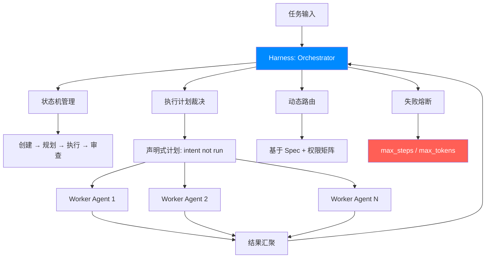
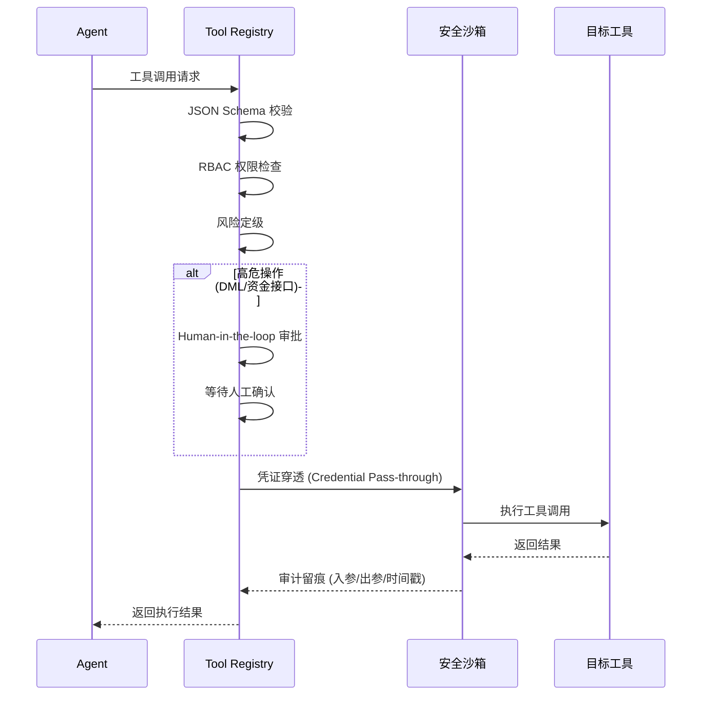
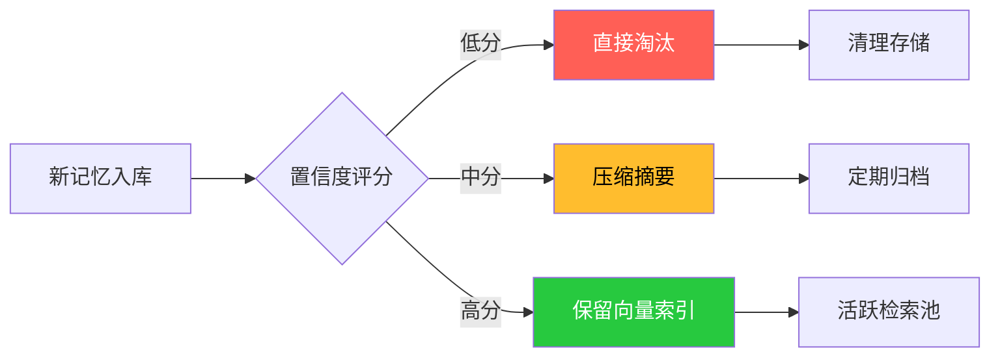
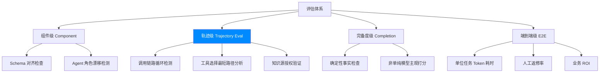
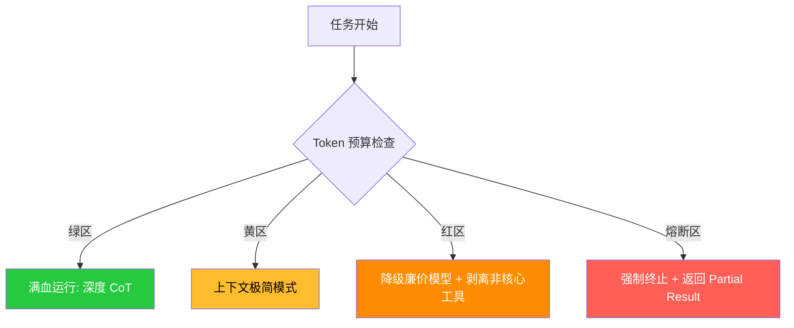
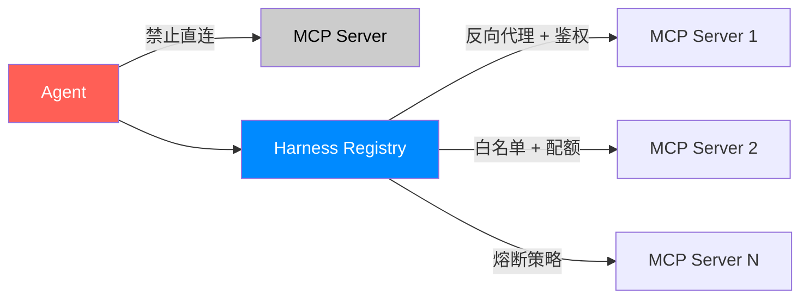
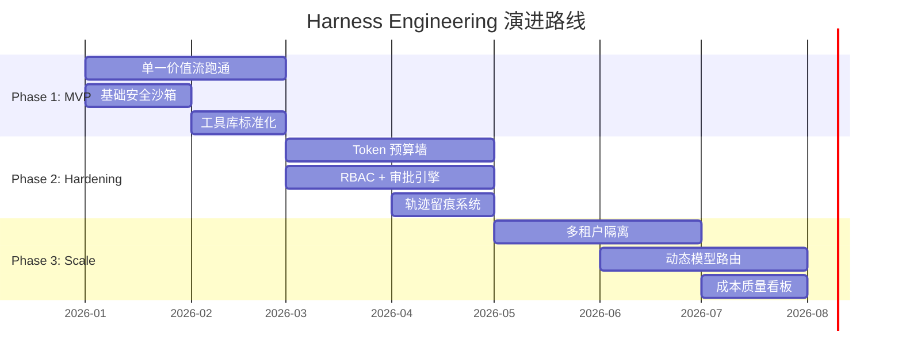

    

        

            

            

            

        

        
bash

    

    

        
ckhuang@macbookpro:~$ 在企业级 AI 的语境下，我们必须确立一个核心公式：Agent = 模型（大脑） + 驾驭层（骨架与神经系统） 

    

## 引言：走出 Demo 的幻觉，直面生产环境的骨感

过去一年，几乎每个技术团队都在尝试构建 AI Agent。一个输入框，挂载几个外部工具，辅以精心雕琢的 System Prompt，再加上大模型的涌现能力，一个看似无所不能的"数字员工"就诞生了。

在 Demo 阶段，表现往往令人惊艳。业务侧兴奋，研发侧也觉得技术闭环已经打通。

**但一旦推向真实生产环境，系统就会面临极其严苛的考验：**

- **循环死锁**：Agent 为什么会反复死循环调用同一个无效工具？
- **成本黑洞**：为什么一个常规的工单处理任务能烧掉几十万 Token？
- **单点雪崩**：为什么某个子 Agent 逻辑崩溃后，整条 Master-Slave 链路全部挂掉？
- **过程黑盒**：为什么最终的输出看似正确，但中间的推理和检索过程却无法追溯？
- **架构耦合**：为什么新增一个业务工具，需要修改十几处胶水代码？

这就是 Demo 与企业级生产之间的巨大鸿沟。

跨越这条鸿沟的答案，**不在于盲目追求参数更大的模型，也不在于反复堆砌玄学的 Prompt**。真正决定 Multi-Agent 系统能否在企业落地的核心，是那个隐于幕后、却掌控全局的运行时底座：**Multi-Agent Harness（多智能体驾驭层）**。

    "Prompt 解决的是如何让模型理解意图，驾驭层解决的是如何让系统可靠、可控地交付结果。" —— CK·黄

## 一、概念重塑：什么是"驾驭层工程"？

在 Multi-Agent 架构中，Harness（驾驭层）绝不仅仅是一个简单的"多 Prompt 拼盘"或常规的 Orchestrator（编排器）。

**它是将多个 Agent 的能力、工具、状态、通信和监控进行统一收束与安全治理的工业级运行时框架。**

| 维度 | Prompt 工程 | 编排器 (Orchestrator) | 驾驭层 (Harness) |
|------|------------|---------------------|----------------|
| 核心职责 | 让模型理解意图 | 管理执行顺序 | 资源调度、记忆、安全、成本全治理 |
| 控制范围 | 单次对话 | 任务流转 | 全生命周期 |
| 生产就绪 | ❌ 依赖人工 | ⚠️ 部分可控 | ✅ 工业级 |

**核心认知：** 如果没有驾驭层，Multi-Agent 只是各显神通的草台班子；有了驾驭层，它们才能成为稳定输出、可审计、可追溯的现代企业流水线。

## 二、架构编排：确立严格的"主从控制"边界

Multi-Agent 系统最致命的架构缺陷，就是**错置了决策权**。

将重试、跳过、结束等调度决策权直接下放给 Planner Agent 是极其危险的。大模型本质上是一个概率引擎，它缺乏天然的全局一致性、并发意识和安全边界意识。

**生产级第一原则：Agent 负责局部智能，Harness 负责全局统筹。**

在驾驭层中，Orchestrator 必须拥有对以下生命周期的**绝对独占权**：

### 1. 任务状态机统管
从创建、规划、沙箱执行、审查到失败熔断，必须有严密的代码级状态机控制，拒绝 Agent 侧的"薛定谔状态"。

### 2. 执行计划裁决
Agent 只能生成**声明式计划**（例如 `intent: "research"`，而非直接的函数调用 `await run()`）。计划一旦抛出，必须由驾驭层接管，进行安全审查和并行度优化后再执行。

### 3. 动态路由
基于任务规格（Spec）和权限矩阵，将任务精准路由给对应的 Worker Agent。

### 4. 失败与熔断
子节点失败后的降级策略由驾驭层规则引擎决定，绝不允许出错的 Agent 自行决定是否继续消耗资源。

### 5. 硬性安全阀
强制设置 `max_steps`、`max_tokens` 等物理隔离机制，防止系统暴走。

## 三、工具治理：构建不可逾越的安全沙箱

在企业场景中，工具（Tool）不是单纯的函数，而是**生产资源的对外授权点**。一个具备外网访问、数据库读写或代码执行能力的 Agent，如果没有约束，其破坏力是灾难性的。

任何生产级驾驭层，都必须引入统一的 **Tool Registry（工具注册中心）**，并将其作为进入安全沙箱的唯一网关。

**一个合格的 Registry 必须强制校验以下元数据：**

- ✅ **唯一标识与 JSON Schema 校验**：确保调用契约正确
- ✅ **RBAC 权限映射**：明确哪些角色的 Agent 有权调用
- ✅ **凭证穿透 (Credential Pass-through)**：确保调用链路上用户的真实鉴权身份不丢失
- ✅ **风险定级与审批引擎**：高危操作（如 DML 语句、资金接口）强制接入"Human-in-the-loop"（人机协同审批）
- ✅ **审计留痕**：强制落库调用入参、出参与时间戳

## 四、状态与记忆：跨越周期的"数据修剪"逻辑

在 Multi-Agent 体系中，记忆不是浪漫主义的拟人化，而是**极具挑战的工程问题**。把状态（State）和记忆（Memory）混为一谈，会导致上下文急剧膨胀，不仅成本失控，还会让模型被历史噪音淹没。

### 状态（State）：重一致性，生命周期短

| 类型 | 说明 | 存储方案 |
|------|------|---------|
| **Working State** | 当前 Task Graph 的局部上下文，随用随弃 | 内存/进程内 |
| **Session State** | 会话级全局变量，设定严格 TTL | Redis 等高速缓存 |

### 记忆（Memory）：重相关性，生命周期长

| 类型 | 说明 | 应用场景 |
|------|------|---------|
| **Episodic Memory** | 历史踩坑记录、用户偏好修正 | 避免重复犯错 |
| **Semantic Memory** | 沉淀的业务规范与领域知识 | 知识检索增强 |

**关键设计：记忆的遗忘机制**

驾驭层必须具备自动化修剪能力。只增不减的记忆库会拖垮检索效率：

基于**置信度、访问频次和时间衰减算法**，低分直接淘汰，中分压缩摘要，高分保留向量。

    "没有遗忘机制的记忆系统，终将被历史噪音淹没。遗忘不是缺陷，而是工程上的必需。" —— CK·黄

## 五、评估体系：从"结果验证"走向"轨迹评估"

多智能体由于具备复杂的协作和重试机制，传统的"一问一答"结果评估（LLM-as-Judge）已经彻底失效。你必须知道它达到目标的路径是否合规。

**生产级 AI-DLC（AI 开发生命周期）的评估管线必须分层：**

**轨迹评估（Trajectory Eval）是驾驭层的核心**，需要评估：
- 调用链路是否存在循环？
- 工具选择是否为最短路径？
- 引用的知识源是否经过授权？

## 六、成本控制：直面"质量、速度、成本"的不可能三角

没有预算治理的 Agent 系统，会在上线第一周就变成财务灾难。驾驭层必须具备**实时 Token 调度与熔断机制**，来平衡大模型落地的"不可能三角"：**输出质量、响应速度与推理成本**。

### 核心管控策略

#### 1. 模型路由（Model Routing）
拒绝"一刀切"使用千亿参数大模型：

| 任务类型 | 模型选择 | 成本等级 |
|---------|---------|---------|
| 基础分类、格式规整 | 轻量级/私有化百亿模型 | 💚 低 |
| 核心逻辑推理（Spec 解析） | 最强模型 | 💰 高 |

#### 2. 动态上下文压缩（Context Compression）
触发阈值后，自动将早期对话折叠为关键摘要，仅保留强相关的凭证和数据引用。

#### 3. 梯次降级防御

- **绿区**：满血运行，深度 CoT（思维链）
- **黄区**：开启上下文极简模式
- **红区**：降级调用廉价模型，剥离非核心工具
- **熔断区**：抛出异常，强制终止任务，返回可用碎片（Partial Result）

## 七、MCP 工具接入：拥抱标准化，坚持强管控

MCP（模型上下文协议）是当前改变工具生态格局的核心变量。它实现了工具开发与具体模型的解耦，仿佛为 Agent 提供了标准的"USB-C 接口"。

**但请注意：协议的标准化，绝不等于安全治理的放松。**

在驾驭层工程中引入 MCP 必须遵循以下红线：

### 🚨 三大红线

1. **禁止直连**：MCP Server 绝对不能对 Agent"裸奔"。必须通过 Harness 的 Registry 层进行反向代理和鉴权。

2. **最小特权（白名单机制）**：即使一个 MCP 暴露了 100 个端点，业务线也只能按需向指定 Agent 开放必要的 3 个。

3. **资源隔离**：赋予每个 MCP Server 独立的配额与超时熔断策略，防止单一外部服务拖垮整个调度池。

## 八、演进路线：从闪电迭代到工业规模化

构建驾驭层是一项系统工程，切忌好高骛远。基于我在分布式架构领域的实战经验，建议遵循以下**三段式演进**：

### Phase 1 - 敏捷闭环（MVP）

利用"Bolt"式的闪电迭代，跑通单一价值流：

- ✅ 搭建最小化的 Orchestrator
- ✅ 基础安全沙箱
- ✅ 确定的工具库
- 🎯 **目标**：先让系统"能跑且不乱跑"

### Phase 2 - 工业加固（Hardening）

引入 Harness 的核心灵魂：

- ✅ Token 预算墙
- ✅ RBAC 权限体系
- ✅ 人工审批引擎
- ✅ 执行轨迹留痕
- 🎯 **目标**：解决"为什么贵、哪里不安全"

### Phase 3 - 规模化运营（Scale）

步入深水区：

- ✅ 多租户隔离
- ✅ 动态模型路由表
- ✅ 复杂长记忆的向量修剪
- ✅ 全面的成本/质量数据看板
- 🎯 **目标**：支撑企业级多业务线并发

    "不要一上来就搞大而全的 Harness 平台。先用 MVP 跑通单一价值流，让系统'能跑且不乱跑'，再逐步加固。这才是分布式系统演进的铁律。" —— CK·黄

## 九、分布式架构视角的补充思考

从分布式系统的角度来审视 Harness 架构，有几个关键点值得深入：

### 1. 容错与幂等性设计

在 Multi-Agent 系统中，网络分区、节点故障、超时重试是常态。Harness 必须确保：

- **工具调用的幂等性**：同一请求多次执行不会产生副作用
- **状态机的最终一致性**：即使部分节点故障，系统整体仍能收敛到正确状态
- **补偿机制**：失败任务的自动回滚或人工介入流程

### 2. 可观测性（Observability）

生产级 Harness 必须具备三位一体的可观测能力：

| 维度 | 工具 | 作用 |
|------|------|------|
| **Metrics** | Prometheus + Grafana | Token 消耗、延迟、错误率实时监控 |
| **Tracing** | OpenTelemetry + Jaeger | 全链路追踪，定位瓶颈与异常 |
| **Logging** | ELK / Loki | 结构化日志，支持审计与回溯 |

### 3. 弹性伸缩（Auto Scaling）

基于任务队列深度和 Token 预算，Harness 应支持：

- **水平扩展**：动态增加 Worker Agent 实例
- **垂直扩展**：根据任务复杂度动态调整模型参数
- **优雅降级**：资源不足时优先保障高优先级任务

## 十、结语

    

        

            

            

            

        

        
bash

    

    

        
ckhuang@macbookpro:~$ 未来的 AI 竞争，入场券是大模型，但在企业应用场景的真正壁垒，在于谁的驾驭层（Harness）更稳健。没有驾驭层，AI 只是脆弱的玩具；拥有了驾驭层，AI 才是真正的先进生产力。 

    

当您准备在金融、政企等复杂场景中落地 Agent 时，第一步不是构思要多少个 Agent 来开会，而是**先画出这张驾驭层的系统架构图**。

**记住：** 不要追求一步到位的完美架构。从 MVP 开始，快速迭代，逐步加固，这才是工程实践的真理。

---

*本文核心观点参考自 [玄姐论AI](https://mp.weixin.qq.com/s/7Vwp6eNFWW8vwi7N74dfSA)，结合分布式架构实战经验进行深度解读与技术扩展。*
