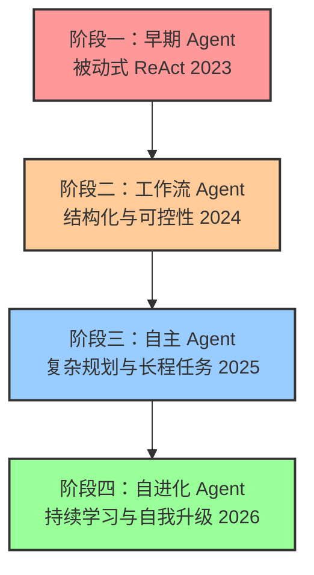
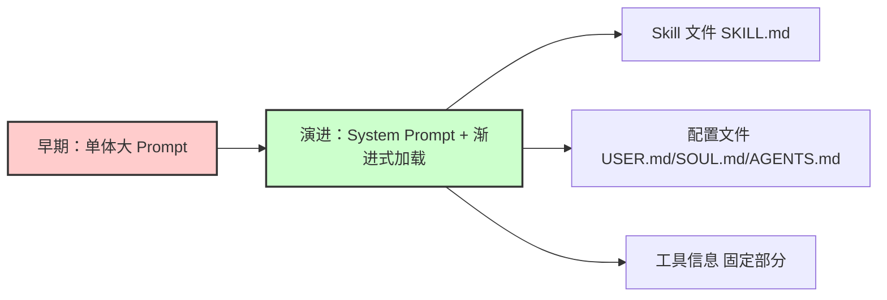
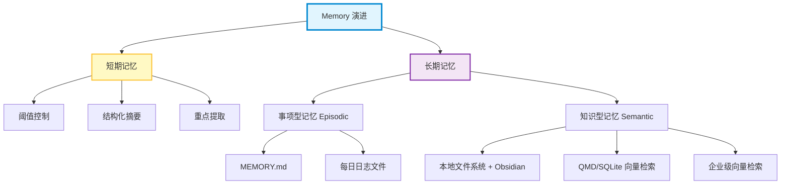
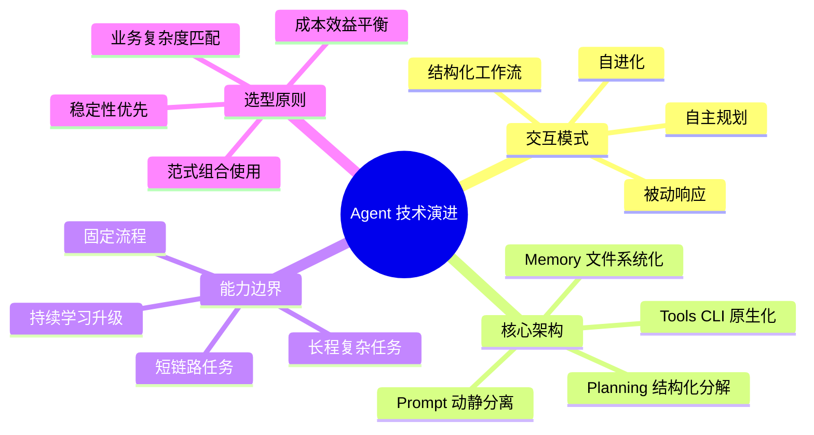

    

        

            

            

            

        

        
bash

    

    

        
ckhuang@macbookpro:~$ Agent 技术正在经历从"简单交互"到"复杂执行"，再到"智能成长"的范式跃迁。搞不清演化逻辑，就容易陷入"为了升级而升级"的误区 

    

## 引言：为什么现在急需理清 Agent 技术演进脉络？

近几年，随着基座模型能力的快速迭代，Agent 领域迎来了爆发式增长。Cloud Code、Codex、OpenClaw、Hermes 等新一代 Agent 产品不断涌现，能力相比早期版本实现了质的飞跃。

但在实际交流中，我发现一个普遍问题：**新旧技术概念混杂，导致很多开发者越学越迷糊**。早期的 ReAct 范式、Workflow 编排、自主规划、自进化机制……这些概念并非简单的替代关系，而是存在深刻的继承与演进逻辑。

如果不搞清楚 Agent 技术范式背后的演化逻辑，很容易陷入两个误区：
- **盲目追求最新概念**：为了用新架构而升级，忽视实际业务需求
- **固守过时方案**：用早期范式解决复杂问题，导致效果不佳

本文旨在结合最新的行业实践，系统梳理 Agent 技术的演化脉络，帮助大家在纷繁复杂的技术浪潮中找到最适合的选型路径。

## Agent 发展的四个阶段：从被动响应到自进化

回顾 2023~2026 这三年，Agent 的技术形态经历了四个显著特征的阶段。理解这四个阶段的演进，有助于我们看清当前技术选型的底层脉络。

### 阶段一：早期 Agent（被动式 ReAct，2023）

2023 年是 LLM 爆发元年，也是 Agent 概念的启蒙期。这一阶段的代表性理论源自 Lilian Weng 的经典博客《LLM Powered Autonomous Agents》，定义了基于大模型的 Agent 基本架构：

**核心架构**：`LLM + Planning + Tools + Memory`

**本质特征**：被动式响应，基于初步的 ReAct 架构（Reasoning + Acting），遵循"Reasoning → Observe → Response"的单步链条。

**主要特点**：
- **交互形态**：增强版 Chatbot，"一问一答"或"指令-执行"模式
- **能力边界**：严重依赖用户明确指令，只能完成单点、短链路小任务
- **局限性**：缺乏长期规划能力，任务复杂度超出上下文窗口时极易偏离或中断

受限于当时基础模型的能力，能够做好 3 轮以上 Reasoning 的模型都屈指可数。

### 阶段二：工作流 Agent（结构化与可控性，2024）

随着 to B 业务对稳定性要求的提升，纯靠 ReAct 这种"理想方式"无法解决复杂问题时，**Agentic Workflow 成为了主流**。

**核心理念**：用工程化的约束来弥补模型的不确定性。

**架构特征**：
- 固定 Workflow 框架，关键节点嵌入 LLM
- 或 LLM 作为中枢，调用预定义的子 Workflow
- 本质上是一套用 Harness（驾驭工程）思想的硬约束

**价值体现**：
- 对于非长尾、非极度复杂的场景，**Workflow Agent 依然是性价比最高、落地最稳定的方案**
- 确保效果的下限，在企业服务领域极受欢迎

### 阶段三：自主 Agent（复杂规划与长程任务，2025）

2025 年是 Agent 迈向"自主性"的关键转折点。Manus、Claude Code、Codex 等 AI Coding Agent 的出现，标志着能力再次质的飞跃。

**核心变化**：
- 具备复杂的 Planning（规划）能力
- 面对模糊需求，能自行拆解任务、规划路径、调用工具、多轮迭代
- 配合轻量级 Harness 或自我校验机制，能够在长程运行中不断修正错误

**标志性能力**：只要用户清晰描述需求并设定好开发规范（Specs），Agent 就可以连续运行很长时间，自主处理企业级项目代码或复杂业务流程。这是从"辅助者"向"执行者"角色的根本转变。

### 阶段四：自进化 Agent（持续学习与自我升级，2026）

随着 Hermes Agent 等新一代框架的兴起，配合 LLM-Wiki 等开源项目，Agent 进入了"自进化"（Self-Evolving）的新阶段。

**核心本质**：开始解决"静态模型"与"动态世界"之间的矛盾。

**机制原理**：
- Agent 不仅完成任务，更在过程中沉淀经验
- 通过记忆模块、反馈循环和自我反思机制，将教训转化为新知识或策略
- 根据历史交互数据，自动优化提示词、工具选择策略甚至微调局部模型参数

**深远意义**：Agent 从"一次性消耗品"变成了"可积累资产"，为构建真正具备长期生命力的数字员工奠定了基础。

> **重要提醒**：这四个阶段并非完全的替代关系，而是**并存且互补**的。在实际落地中，需要根据业务复杂度、稳定性要求和成本预算，选择合适的范式或组合使用。

## 六个核心技术概念的演化深度解析

创建一个轻量级 Agent，除了最关键的 Agent Loop，还涉及 Prompt、Planning、Memory、Tools、Workflow、Environment 等多个维度。让我们逐一拆解这些核心概念的前后变化。

### 1. Prompt：深耦合 → 渐进式加载

#### 早期做法：单体大 Prompt

回想早期构建 Agent 的阶段，我们绝大部分精力都耗费在撰写 Prompt 上。当时的做法是"**一个任务创建一个 Agent**"：

- 写作 Agent：负责撰写初稿
- 编辑 Agent：负责润色优化
- 绘图 Agent：负责生成配图

每个 Agent 背后都对应一段精心调试的 System Prompt，包括人设、任务目标、约束条件、注意事项、各种示例等。这种模式下，**Prompt Engineering 几乎等同于针对每个任务写"小作文"**，维护成本极高。

#### 演进方案：动静分离

随着实践深入，我们发现将"系统级指令"与"任务要求&细节"紧耦合的方式存在明显瓶颈。于是出现了 System Prompt 层面的"解耦策略"：

**核心思路**：尽量固化 System Prompt，将动态的、具体的任务要求剥离出来。

**具体实现**：
- **Skill 层面沉淀**：将执行任务的方法论、步骤要求、领域约束沉淀为独立的 Markdown 文件（如 `SKILL.md`），构成 Agent 的"技能库"
- **配置文件存储**：将人设定义、用户偏好、搜索规则等存储在 `USER.md`、`SOUL.md`、`CLAUDE.md`、`AGENTS.md` 等配置文件中
- **渐进式披露**：通过渐进式加载文件系统的方式，实现 Prompt 内容的模块化管理

这种从"单体大 System Prompt"到"System Prompt + 渐进式加载上下文文件"的转变，实现了真正的**"动静分离"**，让 System Prompt 保持纯粹和稳定，而易变的业务逻辑通过结构化 Markdown 文件灵活挂载。

### 2. Planning：思维链 → 复杂长程任务

#### 早期做法：线性思维链

早期 Planning 的实现相对朴素，主要依赖大模型原生的思维链（CoT, Chain of Thought）能力，通过"Let's think step by step"这样的提示词引导模型进行线性、串行的逻辑推导。

这种模式处理简单任务时尚可应付，但面对复杂场景时，往往显得力不从心，容易陷入逻辑断层或死循环。

#### 演进方案：结构化分解与多步协同

随着基础模型推理能力的飞速迭代，如今的 Planning 机制发生了质的飞跃：

**1. 复杂问题的结构化分解**
- 主动将宏大、模糊的目标拆解为多个可执行的子任务（Sub-tasks）
- 生成结构化的 Todo List

**2. 多步协同与长程推理**
- 按步骤有序执行，并在执行过程中动态调整计划
- 处理具有极长上下文依赖的复杂任务，保持逻辑一致性和连贯性

**3. 子 Agent 的动态构建**
- 根据子任务需求，动态实例化或调用特定的子 Agent
- 实现从"单体思考"到"协同作战"的转变

**核心驱动力**：底层基座模型推理能力升级。随着模型在逻辑推理、长文本理解以及复杂指令遵循上的表现越来越强，Planning 模块从简单的"提示词技巧"演变成了真正的"智能决策中枢"。

### 3. Memory：检索增强 → 文件系统化

#### 早期定义：短期记忆 + 长期记忆

在 Lilian Weng 的经典架构中，Memory 被划分为：
- **短期记忆**：对话上下文，包括 System Prompt、历史对话等
- **长期记忆**：外部知识库，通常通过 RAG 从向量数据库中检索相关文档

#### 短期记忆的演进：从存储到管理

核心挑战从"存储"转向了"管理"与"压缩"。为了保证长上下文下 Agent 的效果，引入了多种记忆压缩策略：

**主要策略**：
- **阈值控制**：基于固定 token 数或动态语义密度阈值触发压缩
- **结构化摘要**：对中间过程对话进行 Summary 提炼，保留头尾关键指令和最终结论
- **重点提取**：从冗长对话流中提取关键事实或状态变化，剔除无关噪音

这些手段使得短期记忆更加精炼、高密度，显著提升了模型在长对话中的注意力集中度。

#### 长期记忆的演进：从向量检索到文件系统主导

长期记忆的变化相对更大，逐步从"向量数据库主导"向"文件系统主导"回归：

**事项型记忆（Episodic Memory）**：
- 针对用户偏好、历史行为、每日待办等动态变化的"事实"
- 使用文件系统记录，如生成 `MEMORY.md` 或每日 Memory 日志文件
- 以结构化 Markdown 格式存储关键事件，比向量检索更可控、更易读

**知识型记忆（Semantic Memory）**：
- 传统的纯 RAG 方案正被更灵活的本地文件系统 + Obsidian 等笔记工具补充甚至替代
- Agent 可以直接访问组织良好的 Markdown 知识库
- 企业级场景：搭配 QMD 或 SQLite 等轻量化向量化检索机制，甚至企业级向量检索

**演进本质**：从纯向量文本检索走向"文件系统化的沉淀 + 向量检索混合管理"，追求更高的记忆效果、可读性和效率的均衡。

### 4. Tools：Function Call → CLI / Script

#### 早期范式：Function Call

早期工具调用的主流范式是 Function Call：
- 将系统能力封装成标准 API，注册为模型可调用的函数
- **痛点**：极高的开发与维护成本，大量系统没有现成 API，团队需要投入大量精力"补全"API

随后出现的 MCP（Model Context Protocol）虽然在协议层面优化了工具的注册与发现机制，但本质上仍停留在接口标准化层面。

#### 范式转移：CLI 命令行原生化与 Script 脚本化

真正的范式转移发生在两个关键维度：

**CLI 命令行原生化的优势**：
- **零样本学习优势**：对于大模型而言，Linux/Unix 命令是其预训练数据中海量代码和技术文档的一部分，属于"先天知识"。无需额外定义复杂的 API Schema，只需指令其使用标准命令即可
- **可扩展性与自解释性**：即使面对未曾见过的第三方 CLI 工具，只要遵循标准规范（如支持 `--help`），模型就能在运行时通过查询帮助文档，自主理解参数用法并执行调用
- **Skill 集成**：这种"按需查询、即时学习"的模式，完美契合了上下文工程的渐进式加载理念

这种转变大幅降低了工具接入成本，让 Agent 能够直接调用系统级能力，而无需为每个工具编写和维护复杂的 API Schema。

### 5. Workflow：固定流程 → 动态编排

#### 早期范式：硬编码工作流

早期的 Workflow Agent 主要依赖固定的流程编排：
- 使用 LangGraph、Dify 等工具进行流程定义
- 关键节点嵌入 LLM，形成"LLM + 固定流程"的架构
- 优点是可解释性强，缺点是灵活性不足

#### 演进方案：动态自适应编排

新一代 Workflow 呈现出更强的动态性：
- **条件分支智能决策**：根据运行时状态动态选择执行路径
- **子流程动态加载**：根据任务需求动态加载和组合子流程
- **自我优化机制**：根据执行结果自动调整工作流结构

这种演进让 Workflow 不再是僵化的"流水线"，而是具备了适应性和自优化能力的"智能调度系统"。

### 6. Environment：封闭沙箱 → 开放世界

#### 早期限制：受控环境

早期的 Agent 运行在相对封闭的环境中：
- 有限的工具集和 API 调用权限
- 严格的安全沙箱限制
- 无法直接访问外部系统或文件系统

#### 演进方向：开放世界交互

新一代 Agent 的环境交互能力显著增强：
- **文件系统直接访问**：可以读写本地文件，管理项目结构
- **网络资源获取**：能够访问互联网资源，获取实时信息
- **多环境协同**：可以在开发、测试、生产等不同环境中切换工作
- **安全机制升级**：通过权限控制和操作审计，在开放性与安全性之间取得平衡

这种演进让 Agent 从"受限的辅助工具"变成了"全能的数字员工"，能够在真实的工作环境中独立完成复杂任务。

    "Agent 技术的演进不是简单的概念更替，而是底层架构理念的根本转变。理解演化逻辑，才能在技术选型时做出明智决策。" —— CK·黄

## 总结与思考：如何在技术浪潮中保持清醒？

回顾 Agent 技术从 2023 到 2026 的演化历程，我们可以清晰地看到一条技术进阶之路：

### 核心洞察

**1. 范式演进不是替代，而是并存互补**

早期的 Workflow Agent 依然是 to B 场景性价比最高的方案；自主 Agent 适合复杂长程任务；自进化 Agent 则面向未来数字员工的长期生命力。没有"最好"的范式，只有"最适合"的选型。

**2. 底层驱动力是基座模型能力的飞跃**

从 CoT 思维链到复杂长程规划，从被动响应到自主决策，这一切的底层支撑都是基座模型在逻辑推理、长文本理解、复杂指令遵循上的显著增强。

**3. 工程化思维是关键**

无论是 Prompt 的动静分离、Memory 的文件系统化管理，还是 Tools 的 CLI 原生化，都体现了从"纯算法驱动"向"工程化约束 + 模型能力"混合范式的转变。

### 实战建议

在实际落地 Agent 技术时，我建议：

- **明确业务需求**：先评估任务的复杂度、稳定性要求和成本预算
- **选择合适的范式**：简单任务用 Workflow，复杂规划用自主 Agent，长期运营考虑自进化
- **避免盲目追新**：新技术概念固然诱人，但稳定可靠才是企业级应用的核心诉求
- **注重工程实践**：好的架构设计、清晰的模块边界、完善的监控机制，比单纯追求模型能力更重要

Agent 技术正在经历从"概念验证"到"规模化落地"的关键阶段。理解其演化逻辑，才能在技术浪潮中保持清醒，做出最符合业务需求的技术选型。

    

        

            

            

            

        

        
bash

    

    

        
ckhuang@macbookpro:~$ Agent 技术的演进不是终点，而是智能系统进化的新起点。理解过去，才能把握未来 

    

