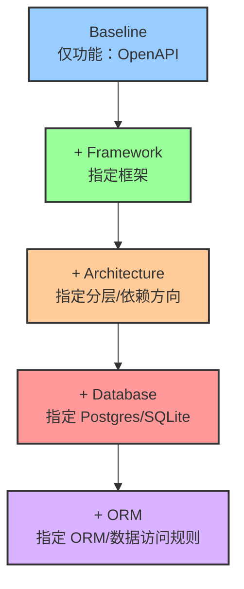
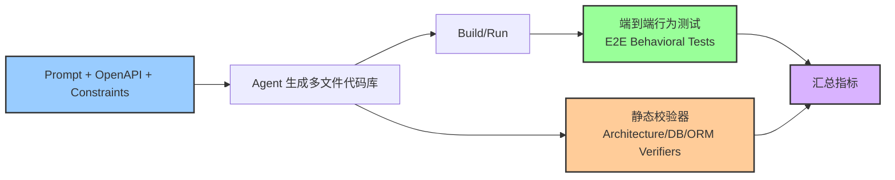

    

        

            

            

            

        

        
bash

    

    

        
ckhuang@macbookpro:~$ Demo 里 LLM Agent 能把 REST API 写得飞起；一进生产，你给它加上“分层架构 + 数据库 + ORM”三件套，它就开始系统性失手——这不是偶然，是一种可复现的“约束衰减（Constraint Decay）”现象。 

    

本文解读 arXiv:2605.06445《Constraint decay: The Fragility of LLM Agents in Backend Code Generation》（2026-05-07，cs.SE）。论文做了一件我非常认同、也非常“工程化”的事：**把功能需求固定（OpenAPI），把结构约束逐层叠加，然后用行为测试 + 静态校验把“能跑”与“合规”拆开评估**，从而量化 LLM Agent 在后端代码生成里的真实脆弱点。

如果你在用 AI 写后端（或准备把 AI 引入工程流水线），读完你会得到三类确定性收获：

- 为什么“功能正确”在生产里远远不够，结构合规才是硬门槛
- 约束一多就崩的根因主要不在控制器/路由，而在数据层（SQL/ORM）
- 如何把评测与交付做成“可验证”的系统，而不是“看起来像对的”

    “把约束写进规范很容易，把约束写进系统并持续被验证，才是生产级工程。” —— CK·黄

## 一句话结论：Constraint Decay 是什么？

论文提出的核心现象很直白：**当你逐步增加非功能性结构约束（架构模式、数据库、ORM 等）时，LLM Agent 的端到端通过率会显著下降**。论文在实验里给出了一个强信号：一些原本很能打的配置，从“无约束基线”到“全约束任务”，**断言通过率平均下降约 30 个点**；弱一些的配置甚至接近归零。

这和很多团队的体感一致：Agent 写一个“能跑的 CRUD”不难，但让它写出“可维护、可演进、可上线”的后端，难度是指数级的。

为了更清晰地把“约束密度”表达出来，我用一张 Mermaid 示意图把论文的实验设计抽象成了一个“叠约束”的梯度：

## 论文怎么测：把“功能正确”和“结构合规”拆成两把尺子

论文的一个关键价值在于评测设计：它没有把“结构约束”当作口头要求，而是把它变成**可执行的验收条件**。

### 1）固定功能目标：统一的 OpenAPI 合同

论文用 OpenAPI 3.0 把功能需求固定下来，保证不同条件下比较是公平的：每个任务的目标都是“实现同一份 API 合同”。

为了避免目标太随意，论文选了一个广泛使用、粒度合适的规范：**RealWorld Conduit API**（典型的用户、文章、评论、标签等资源的 CRUD/查询）。

### 2）系统性叠加结构约束：后端生产“真实麻烦”的来源

论文把非功能约束拆成多个维度，其中核心维度包括：

- **框架选择**：Python 3.12（Flask/FastAPI/Django/aiohttp）与 Node.js 20（Express/Fastify/Hono/Koa），共 8 种框架
- **架构模式**：要求遵循 Clean Architecture 分层（路由/handler、服务/use case、模型/entity、仓储/data access）并保持依赖方向
- **数据库后端**：PostgreSQL 或 SQLite
- **ORM 集成**：要求通过指定 ORM 层工作（而不是“随手写 SQL 就完事”）

### 3）双评测管线：行为测试 + 静态校验器（Verifiers）

论文的评测非常符合工程直觉：行为测试解决“能不能用”，静态校验解决“是不是按规矩建的”。

这套设计有两个隐含但非常重要的点：

1. **行为测试与实现细节解耦**：只要你实现符合 OpenAPI 的行为，就能过（不因为你文件名不同就判错）。
2. **结构约束被“程序化”**：不是靠人看代码结构，而是靠 verifier 把架构层次、数据库/ORM 使用是否违规变成硬判断。

## 关键发现 1：约束越多，表现越差，而且不是“线性下降”

论文把现象命名为 Constraint Decay，本质是：**结构约束叠加会引入跨文件、跨层、跨运行时的耦合，一旦局部偏离，后续会连锁崩坏**。

为什么这点值得重视？因为很多团队对 AI coding 的预期还停留在“写代码像个高级 Copilot”，但生产后端的真实门槛是：

- 结构一致性（目录/依赖方向/分层边界）
- 数据一致性（schema、迁移、约束、事务）
- 运行时一致性（ORM 映射、查询构造、连接生命周期）

这些一致性要求都不是“写出一段看起来合理的代码”能自然满足的，它需要持续的、可反馈的校验闭环。

## 关键发现 2：框架敏感性很强——“显式框架”更友好，“约定框架”更刁钻

论文观察到同样的 OpenAPI 合同下，Agent 在不同框架上的成功率差异很大：

- 在 **Flask** 这类轻量、显式、样板化更强的框架上更容易成功
- 在 **FastAPI、Django** 这类更依赖约定、隐式机制、框架生态复杂度更高的环境中表现更差

这对落地选型很有启发：当你希望 Agent 生成“可控的生产代码”时，框架的隐式魔法越多，Agent 越容易踩坑，因为它需要同时满足更多“未写出来但必须遵守”的规则。

## 关键发现 3：最大根因在数据层——查询组合与 ORM 运行时违规

论文把失败做了 root cause 分析，结论非常典型也非常现实：**数据层缺陷是首要根因**，包括：

- 查询组合错误（拼错条件、漏 join、过滤逻辑不一致等）
- ORM 运行时违规（模型/关系映射不匹配、会话/连接管理不当、违反 ORM 的使用范式）

论文报告这类数据层缺陷驱动了约 **45%** 的逻辑失败。

如果你做过真实后端，你会知道这并不意外：路由/控制器的 bug 往往“可见且可测”，数据层 bug 往往“隐蔽且连锁”。Agent 一旦在 schema/ORM 上走偏，后续每个用例都可能错得很一致——最终在行为测试里“全线崩”。

## 我怎么看：把 AI 写后端当成“生成 + 约束求解”，而不是“生成 + 祈祷”

这篇论文的价值不在于告诉你“LLM Agent 还不行”，而在于给了一个更接近工程现实的结论：

- **Agent 的短板不是“不会写代码”，而是“不会持续满足结构约束”**
- **结构约束不是写在 Prompt 里就会自动生效的，需要被编进评测与反馈回路**

在生产里，我更建议把“AI 写后端”按如下方式工程化：

### 1）约束必须可机器验证（Verifier First）

如果你提出了要求（Clean Architecture、必须走 ORM、必须有 migration），就应该同步提供：

- lint/静态规则（目录结构、import 方向）
- 运行时规则（ORM 初始化/会话管理）
- 端到端契约测试（OpenAPI 驱动的用例）

否则这就是“文档里的道德约束”，落不到代码里。

### 2）让 Agent 在生成过程中就能看到失败（Inner Loop Feedback）

把 verifier 与测试跑进 Agent 的内循环，而不是最后再验收一次。典型策略是分阶段：

1. 先让 Agent 只搭框架骨架 + 依赖方向
2. 再引入数据层（schema/ORM）并跑最小用例
3. 最后补全业务逻辑与边界条件

这一点与论文的“逐层叠加约束”实验设计是同构的：**约束应该分阶段引入，否则失败的定位与修复成本会飙升**。

### 3）框架选型向“显式、可预测”倾斜

如果你的目标是“让 Agent 能稳定交付”，我会更偏向：

- 显式路由、显式生命周期管理
- 依赖注入/反射魔法更少
- ORM 使用范式更强约束、文档更可检索

原因很简单：Agent 在高隐式框架里不是“学不会”，而是“更难对齐正确的隐式前提”。

## 总结：你真正要对抗的不是 Bug，而是“约束衰减”

Constraint Decay 把一个长期被忽略的事实量化了：**后端工程的难点不在 CRUD，而在约束**。当约束变多，Agent 的输出需要同时满足多个全局一致性条件；这类问题本质更像“约束求解/验证驱动开发”，而不是“自然语言生成”。

如果你把这当成一次“生产级 AI 编程的体检报告”，那它给出的处方其实也很清晰：

- 用 OpenAPI 把功能固定，避免“说不清、测不准”
- 用 verifiers 把结构约束程序化，避免“写在文档里”
- 用分阶段内循环把反馈提前，避免“最后才发现全都错了”

原文链接：https://arxiv.org/html/2605.06445

