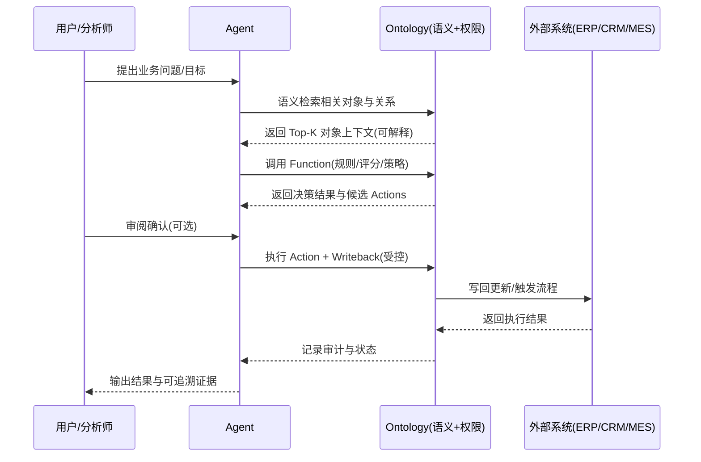

<div style="background-color: #1e1e1e; color: #00ff00; font-family: 'Courier New', Courier, monospace; border-radius: 8px; padding: 20px; box-shadow: 0 10px 30px rgba(0,0,0,0.3); margin-bottom: 30px; margin-top: 20px; position: relative; overflow: hidden;">
    <div style="display: flex; align-items: center; margin-bottom: 15px; padding-bottom: 10px; border-bottom: 1px solid #333;">
        <div style="display: flex; gap: 8px; margin-right: 15px;">
            <div style="width: 12px; height: 12px; border-radius: 50%; background-color: #ff5f56;"></div>
            <div style="width: 12px; height: 12px; border-radius: 50%; background-color: #ffbd2e;"></div>
            <div style="width: 12px; height: 12px; border-radius: 50%; background-color: #27c93f;"></div>
        </div>
        <div style="color: #ccc; font-size: 0.9em;">bash</div>
    </div>
    <div>
        <p style="margin: 5px 0; line-height: 1.6;"><span style="color: #008AFF; font-weight: bold;">ckhuang@macbookpro:~$</span> 你以为企业 AI 落地难在“模型不够强”，但多数时候，难点是“AI 根本不知道你在说什么，也不知道该做什么” <span style="display: inline-block; width: 8px; height: 16px; background-color: #00ff00; vertical-align: middle;"></span></p>
    </div>
</div>

## 引言：为什么“本体论”会从哲学概念变成 AI 落地的高频词？

最近两年，企业里做 AI 落地的团队几乎都经历过一个阶段：模型部署、Prompt、RAG 一路堆上去，Demo 看起来很美，但一落到真实生产环境就开始“掉链子”。

问题往往不在于模型不会“生成”，而在于它缺少三件企业级能力：

- **语义对齐**：多源异构数据、不同系统字段、不同部门话术之间没有统一“业务普通话”
- **可执行闭环**：AI 只会给建议，却无法在权限与规则约束下调用动作、写回系统、形成闭环
- **可治理演进**：缺权限、缺审计、缺版本控制，导致“能跑一次”≠“能跑一年”

Palantir 在 Foundry 里提出并工程化落地的 Ontology（本体工程），把这些问题放到一个更底层的视角去解决：**先把企业世界建模清楚，再谈智能化执行**。

<div style="text-align: center; font-size: 1.2em; font-style: italic; color: #008AFF; margin: 40px 0 20px; padding: 20px; border-top: 1px dashed #ccc; border-bottom: 1px dashed #ccc;">
    “企业 AI 的关键不是让模型更会说，而是让系统更可理解、更可执行、更可治理。” —— CK·黄
</div>

## 本体工程的三次“进化”：从追问世界到建模企业

原文把本体论的演化分成三个阶段，这里用工程师更容易落地的语言重述一下：

1. **哲学本体论：追问“世界由什么构成”**  
   关注“存在者是什么、如何关联”，目标是画一张最底层的“总谱”。
2. **知识工程本体：让机器共享“常识”**  
   经典定义是 Tom Gruber 的那句：*本体是共享概念模型的明确形式化规范说明*。
3. **企业智能本体：业务的“数字孪生骨架”**  
   重点从“解释世界”转为“支撑协同与决策”：把企业对象、关系、行为、治理统一建模，成为 AI 可消费的业务说明书。

## Palantir Ontology：不是“知识图谱”，而是“活的业务操作系统”

很多团队一听“本体”，第一反应是“知识图谱”。但 Palantir 的关键差异在于：**它把“能做什么”作为一等公民**。

原文给出三类核心要素：

- **语义要素（是什么）**：对象类型、关系类型、属性、接口等静态结构
- **行为要素（能做什么）**：操作、函数、写回等动态能力
- **治理要素（如何保障）**：安全、版本控制、审计支持

把这三类要素合起来，你会发现它更像一个“业务操作系统”：语义统一是地基，行为接口是系统调用，治理体系是企业级安全网。

## 四层架构拆解：语义、动态、连接、治理

为了更直观，我把原文的结构整理成一个分层图：

```mermaid
graph TD
    A[语义层<br/>统一业务语言] --> B[动态层<br/>让模型“动起来”】【Actions/Functions/Flows】
    B --> C[连接层<br/>把数据映射为对象】<br/>虚拟表/语义检索/Agent 上下文
    C --> D[治理层<br/>权限/审计/版本/协作]
    
    style A fill:#99ccff,stroke:#333,stroke-width:2px
    style B fill:#99ff99,stroke:#333,stroke-width:2px
    style C fill:#ffcc99,stroke:#333,stroke-width:2px
    style D fill:#ff9999,stroke:#333,stroke-width:2px
```

### 1）语义层：统一业务“普通话”

语义层解决的是企业里最常见、也最隐蔽的“语义债”：

- 同一个概念在不同系统叫法不同（客户/客商/Account）
- 同一个字段在不同团队语义不同（状态=审批状态？履约状态？风险状态？）
- 同一个对象在不同流程里边界不同（订单到底从创建开始，还是从支付开始？）

在 Ontology 里，它通过 Object / Link、继承与接口、元数据与演进机制，把对象与关系定义成**可复用、可演化、可被机器严格理解**的结构。

### 2）动态层：把“建议”变成“受控执行”

只靠语义一致，AI 仍然可能停留在“给建议”。动态层把业务能力显式化：

- **Actions**：标准化、可审计的业务动作（创建订单、触发警报、创建工单）
- **Functions**：封装复杂规则与决策逻辑（风险评分、补货策略、阈值判断）
- **Writeback**：把执行结果写回外部系统（ERP/CRM/MES），形成闭环
- **Process Flows / Scenarios**：把动作编排成流程，支持 What-If 推演

这一步的价值很大：它把智能体的“随口一说”收敛为“受控接口调用”，把 AI 的能力边界锁在权限与规则之内，降低越权与不可解释风险。

### 3）连接层：把数据“投射”为本体对象

企业数据是散的：表、API、日志、模型输出、第三方情报……连接层解决“怎么接地气”：

- 通过动态映射（虚拟表等）把底层数据映射为对象与关系
- 通过语义检索（向量嵌入、KNN）把“相关对象上下文”拉出来
- 在 AIP 平台里让智能体直接以本体为上下文，并执行操作写回
- 跨平台协同（例如与 Databricks 等）实现统一语义访问

### 4）治理层：企业级“安全网”

企业里 AI 最怕的不是“不聪明”，而是“聪明但失控”。治理层把系统带回工程纪律：

- 细粒度权限与标签：谁能看什么、谁能做什么
- 全链路审计：每次变更、每次智能体动作都可追溯
- 版本演化与协作机制：审批、冲突协调、回滚与兼容

## 本体工程对 AI Agent 的实质启发：四个关键增益

如果把 Agent 拆成“理解→检索→规划→执行→写回→可控→演化”，本体工程直接提升的是底座能力：

1. **更高质量的上下文**：从“关键词匹配的文本碎片”升级为“语义一致的对象网络”
2. **更安全的可执行接口**：Action/Function 作为受控工具面，降低越权与误操作
3. **更透明的决策链条**：流程与推演让 What-If 分析显式化、可审计
4. **更低的长期演化成本**：业务变更更多体现在模型层而不是胶水代码层

用一个简化的时序图，把“本体 + Agent”闭环跑起来的逻辑画出来：



## 原文案例复盘：供应链风险 Agent 为什么能跑成闭环？

原文举的供应链风险监控场景很典型：传统方式下分析师要跨系统拼数据，耗时且容易遗漏。

本体化之后，关键变化是：

- 先把供应商、工厂、物流节点、物料、风险事件抽象为对象类型
- 再定义它们的语义关系（采购/影响/阻断/关联订单）
- 然后把“查询受影响节点”“计算风险评分”“创建应急工单”等能力，以 Action/Function 的形式收进本体受控接口

于是 Agent 接到“评估台风影响”的指令时，不再是“生成一段分析”，而是可以：

- 在语义网络里找出受影响对象链条
- 计算风险评分、列出高风险订单
- 触发替代供应商评估、创建应急工单，并写回 ERP
- 全过程可审计、可回溯、可治理

这就是“从会说到会做”的分水岭。

## 落地挑战与十条建议：理想丰满，现实骨感

原文也很克制地指出了落地难点：建模成本、协作治理、性能规模、规则冲突、安全越权、平台锁定……这些都不是靠“再换个模型”能解决的。

我非常认同原文给出的十条建议，尤其是四条在国内团队里最容易被忽略：

- **小本体起步**：不要一上来就“全域建模”，从最小可用域做 MVP
- **治理先行**：权限、审计、版本控制要早落地，事后补设代价极高
- **接口契约严谨**：Action/Function 职责单一、边界清晰，并有错误处理与事务边界
- **规避锁定**：即使深度用平台，也要在架构上留出抽象层与迁移余地

## 结语：从“固化流程”到“建模世界”

如果把过去二十年的企业 IT 总结成一句话，大概是：**把业务流程固化成代码**。而本体工程试图推动下一步：**把业务世界建模成结构**。

当“对象是什么、关系怎么连、动作怎么做、权限怎么管”都被显式化后，AI Agent 才真正拥有了可理解的世界、可执行的工具、可治理的边界。

原文链接：<https://mp.weixin.qq.com/s/z-_75WNTNFjzlY54ijXyPA>

