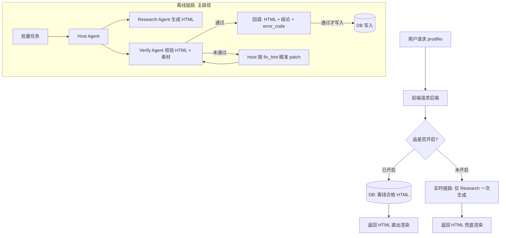
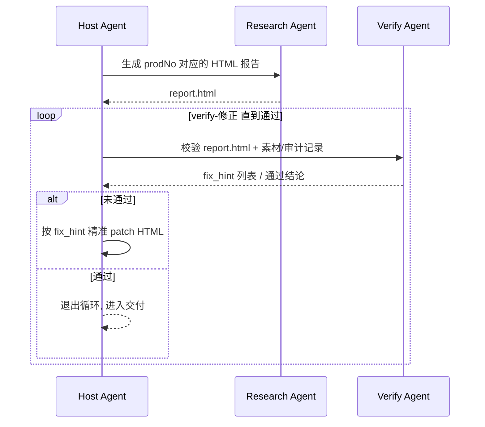

<div style="background-color: #1e1e1e; color: #00ff00; font-family: 'Courier New', Courier, monospace; border-radius: 8px; padding: 20px; box-shadow: 0 10px 30px rgba(0,0,0,0.3); margin-bottom: 30px; margin-top: 20px; position: relative; overflow: hidden;">
    <div style="display: flex; align-items: center; margin-bottom: 15px; padding-bottom: 10px; border-bottom: 1px solid #333;">
        <div style="display: flex; gap: 8px; margin-right: 15px;">
            <div style="width: 12px; height: 12px; border-radius: 50%; background-color: #ff5f56;"></div>
            <div style="width: 12px; height: 12px; border-radius: 50%; background-color: #ffbd2e;"></div>
            <div style="width: 12px; height: 12px; border-radius: 50%; background-color: #27c93f;"></div>
        </div>
        <div style="color: #ccc; font-size: 0.9em;">bash</div>
    </div>
    <div>
        <p style="margin: 5px 0; line-height: 1.6;"><span style="color: #008AFF; font-weight: bold;">ckhuang@macbookpro:~$</span> C 端 AIGC 如果“实时直出”，你赌的不是模型能力，而是线上体验与业务可信度。<span style="display: inline-block; width: 8px; height: 16px; background-color: #00ff00; vertical-align: middle;"></span></p>
        <p style="margin: 5px 0; line-height: 1.6;"><span style="color: #008AFF; font-weight: bold;">ckhuang@macbookpro:~$</span> 这篇文章拆解一个更工程化的答案：离线生成 + verify 闭环 + 按品开启，让“生成”变成“交付”。</p>
    </div>
</div>

很多团队做 C 端 AIGC 的第一反应都是：用户点开页面 -> 调 LLM -> 生成内容 -> 直接渲染。思路没问题，但一上线就会撞上两个现实的硬墙：

- **时延墙**：一次完整的深度解读往往要检索素材、读条款、多轮推理、生成几千字 HTML，几十秒是常态。C 端用户不可能等你“慢慢想”。
- **质量墙**：LLM 会出两类致命错误：一种让页面直接塌掉（结构/渲染错误），另一种让页面看起来正确但内容在骗人（事实/幻觉错误）。

原文给出的工程解法很直接：**把实时生成降级为兜底，把离线 Harness 生产作为主路径**。其代表系统是蚂蚁保保险快查的深度解读页面生成系统 DIPG（Deep Interpretation Page Generator）。

本文基于原文内容做一次面向工程落地的拆解：为什么要“翻转架构”，DIPG 的两条链路怎么跑，三个 Agent 怎么分工，以及 verify 闭环为什么是 C 端交付的关键。

---

## 1. 为什么 C 端不能实时直出？

原文的答案非常工程化：**C 端交付的本质要求是——用户点开那一刻看到的 HTML，必须是已经被校验过的**。否则无论你怎么做兜底、怎么灰度，线上最终都会变成“抽奖”。

这里有一个非常值得记住的分界线：

- **可用（can generate）**：能生成内容。
- **可交付（can ship）**：生成内容能稳定、安全、可信地给到用户。

实时直出能保证前者，却很难保证后者。

---

## 2. DIPG 的两条线上链路：离线主路径 + 实时兜底

系统对外形态是：前端请求携带 `prodNo`，后端返回一个用于移动端容器渲染的 HTML 片段（宽度 750）。

在线上生产环境，DIPG 同时跑两条链路：

- **离线链路（主路径）**：批量预生成 + verify 闭环，通过后刷入 DB，并按“品”维度开启；C 端请求时命中率 100%（从 DB 读）。
- **实时链路（兜底）**：未开启品时才走一次性生成，不参与 verify，也不做修正。

用一张图把“交付路径”说清楚：



这张图里最关键的一点是：**离线链路把“修正机会”还给了工程**。实时链路只有“一次机会”，离线链路可以在刷入 DB 前反复迭代直到合格。

---

## 3. 一个真实 badcase：页面塌掉 vs 页面骗人

原文给了两个很典型的线上坏例子，几乎覆盖了 C 端 AIGC 交付的两类“致命错误”：

### 3.1 渲染类错误：孤儿闭合标签

某份深度解读报告在 C 端偶发渲染错位，最后发现是 HTML 尾部多了一个孤儿 `</div>`：

```html
... <div text-card class="desc">...</div> </div></div></div>
```

顶层结构本应是平铺（`<h2>` 和各种卡片组件作为兄弟元素并列），但 LLM 凭“印象”补了一个闭合标签。这个标签进入移动端容器后被当成关闭容器自身的信号，从而把后续兄弟模块挤歪。

### 3.2 幻觉类错误：无中生有的具体数字

另一份报告渲染正常，但内容出现“优于市场 85% 同类产品”之类的表述，素材里并没有任何支撑该数据的来源。这种错误更可怕：**它不会塌 UI，但会塌可信度**。

这两个例子也顺势给出了 verify 的两层含义：

- 结构问题：可以靠程序化解析/规则校验抓住；
- 事实问题：必须把产物与信源对齐，才能抓住“编得很像真的”的幻觉。

---

## 4. 三个 Agent 的分工：把“生成”拆成“生产线”

离线链路的 verify 闭环不是“一个大 Agent 做所有事”，而是三个职责明确的 Agent 协作：

- **Host Agent**：总编排 + 精准修正。负责“研究 -> 校验 ->（不通过则修正）-> 再校验”的循环。
- **Research Agent**：只负责从零生成 HTML（下载素材、多轮读取条款、必要时网络检索，最终产出整份 HTML 片段）。
- **Verify Agent**：只负责校验，不改 HTML。读取 HTML 产物与 Research 用过的素材/记录，输出结构化修正意见（fix_hint 列表）。

把它抽象成一个最小闭环：



这里最“反直觉但非常关键”的设计点是：

- **Host 不会让 Research “按意见改一下再生成一遍”**；
- 而是自己对已有 HTML 做局部编辑（patch），然后再交回 Verify 复检。

这样做的好处是：修正可控、改动边界清晰、闭环更容易收敛（也更便于追踪到底改了哪一段）。

---

<div style="text-align: center; font-size: 1.2em; font-style: italic; color: #008AFF; margin: 40px 0 20px; padding: 20px; border-top: 1px dashed #ccc; border-bottom: 1px dashed #ccc;">
    “在 C 端交付里，LLM 不是‘内容生成器’，它必须被当成‘可控生产线的一环’。” —— CK·黄
</div>

---

## 5. Research 的约束：不是“写得更好”，而是“更不容易犯错”

原文强调：prompt 约束做得再严，也不可能 100% 遵守；但约束越清晰，Verify 需要兜底的概率就越低，闭环收敛就越快、成本就越可控。

其中有两类约束特别值得学习：

- **合规用语硬规则**：例如“0免赔”要写成“免赔额为 0”，属于监管红线型的硬约束清单。
- **事实性保证规则**：核心是信源优先级、无数据不展示、禁止盲目对比等，直接对应“优于市场 85%”这种幻觉坏例子。

这套规则的来源也很工程：一部分来自合规底线，另一部分来自 Verify 在离线链路中抓到的高频错误模式，再回灌进 prompt 形成“活的清单”。

---

## 6. 工程落地启示：把 verify 当成交付契约

如果把 DIPG 的方法论抽象成可以迁移的工程原则，我更愿意用三句话概括：

1. **把“实时生成”从主链路移出去**：主链路需要可重复、可追责、可验证；实时生成更适合作为兜底，而不是交付基座。
2. **把校验拆成结构校验 + 事实校验**：前者偏确定性、可程序化；后者偏语义对齐，需要结合信源与模型能力。
3. **把修正权收回到 Host**：不要让“重新生成”成为默认修正手段，尽量让修正是可控的局部 patch，并且每次 patch 都能被再次 verify。

---

<div style="background-color: #1e1e1e; color: #00ff00; font-family: 'Courier New', Courier, monospace; border-radius: 8px; padding: 20px; box-shadow: 0 10px 30px rgba(0,0,0,0.3); margin-bottom: 30px; margin-top: 20px; position: relative; overflow: hidden;">
    <div style="display: flex; align-items: center; margin-bottom: 15px; padding-bottom: 10px; border-bottom: 1px solid #333;">
        <div style="display: flex; gap: 8px; margin-right: 15px;">
            <div style="width: 12px; height: 12px; border-radius: 50%; background-color: #ff5f56;"></div>
            <div style="width: 12px; height: 12px; border-radius: 50%; background-color: #ffbd2e;"></div>
            <div style="width: 12px; height: 12px; border-radius: 50%; background-color: #27c93f;"></div>
        </div>
        <div style="color: #ccc; font-size: 0.9em;">bash</div>
    </div>
    <div>
        <p style="margin: 5px 0; line-height: 1.6;"><span style="color: #008AFF; font-weight: bold;">ckhuang@macbookpro:~$</span> C 端 AIGC 的关键不是“生成一次过”，而是“每一次都能交付”。<span style="display: inline-block; width: 8px; height: 16px; background-color: #00ff00; vertical-align: middle;"></span></p>
        <p style="margin: 5px 0; line-height: 1.6;"><span style="color: #008AFF; font-weight: bold;">ckhuang@macbookpro:~$</span> 让模型上生产，就别只给它 prompt，还要给它 Harness、Verify、以及能收敛的闭环。</p>
    </div>
</div>

---

**参考资料**：原文《Harness Engineering: C 端 AIGC 内容生产自优化实践》（阿里云开发者公众号）
