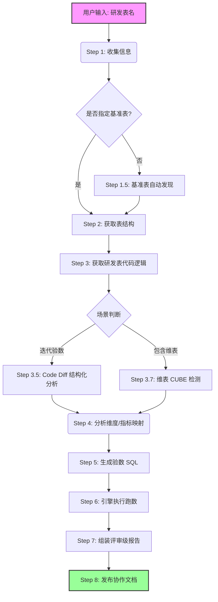

    

        

            

            

            

        

        
bash

    

    

        
ckhuang@macbookpro:~$ 数据开发的日常灵魂拷问：“你这个表的数据，到底准不准？” 如果你的回答还是“我跑了几条 SQL，应该没问题”，那么这份指南就是为你准备的。今天我们来聊聊如何用 AI Agent 彻底重塑数据验证流程。 

    

在业务数据团队，日常开发各层数据表（ADS、DWS、DWD、DIM）上线前，都需要经历数据验证（验数）这一最后防线。传统的手工验数简直是一场噩梦：
- **覆盖度极低**：多数人只测个总量，维度逐项对比、CUBE 完整性、关联膨胀全靠缘分。
- **基准表瞎选**：凭感觉选了个“名字差不多”的表，结果口径完全不同，白忙一场。
- **结论无依据**：拿着两页黑乎乎的终端输出去评审，毫无说服力。

2025 年以来，Agent 工具在代码生成等领域遍地开花。作为大数据和 AI Agent 领域的老兵，我一直在思考：能不能把数据验数的全流程，封装成一个可复用的 Agent Skill？

读完本文，你将了解如何通过一个名为 `verify-data` 的端到端 Agent Skill，将传统 2-4 小时的手工验数压缩到 30 分钟以内，并产出无懈可击的评审级报告。

---

### 一、什么是 verify-data Agent Skill？

简单来说，**Agent Skill 是赋予 AI Agent 的一套标准化能力包（SOP）**。`verify-data` 就是专门针对数据验数场景打造的 Skill。你只需输入一个表名，它便能自动发现基准表、生成验数 SQL、执行比对，最后生成结构化报告并推送到协作平台。

整个过程不需要手写一行 SQL，从“手工作坊”直接跃升到“自动化流水线”。

#### 核心工作流解析

为确保验数逻辑的严密性，Agent 的执行流并非线性的，而是带有条件分支的智能决策树：

### 二、核心能力深度拆解：为何它比人更靠谱？

为什么说 Agent 验数比人肉更靠谱？因为人会疲惫、会偷懒、会有思维盲区，但设定好规则的 Agent 不会。

#### 1. 基准表自动发现（精准定位参照物）

选错基准表是验数的原罪。当用户未提供基准表时，Agent 会通过两阶段策略自动寻找：
1. **血缘发现候选集**：通过元数据 API 追溯上游依赖，找出所有可能存在血缘关系的表。
2. **维度/指标精排**：计算综合评分 `score = 血缘亲和度 × 0.5 + 维度重合度 × 0.3 + 指标重合度 × 0.2`。

如果单表评分不高，但多张表联合能覆盖所有指标，Agent 会自动触发**分路指标对比策略**。这就完美解决了一张新宽表依赖多个底层明细表时的验证难题。

#### 2. 10 类标准化验数 SQL 模板（拒绝拍脑袋写 SQL）

Agent 绝不凭空捏造 SQL，而是基于 10 类模板按需组合。这其中最关键的是 **SQL 9（关联膨胀检测）** 和 **SQL 10（日期维度关联校验）**。

在我的带队经验中，表数据总量对得上，但一加上维度就数据翻倍，往往是因为 `LEFT JOIN` 维表时关联键并非唯一主键导致的**关联膨胀**。手工验数极易忽略这点，而 Agent 会强制扫雷。

#### 3. 降级验数策略与强制代码审查

如果这是一张全新口径的表，全网找不到基准表怎么办？Agent 不会摆烂，而是触发**降级策略**：
- **CUBE 层级自洽性校验**
- **DWD 上游比对**
- **数据质量检测（空值率、零值率等）**

**注意这里的防翻车设计**：如果只做 DWD 上游比对（重跑一遍原逻辑），只能证明“执行一致”，无法证明“逻辑正确”。因此，Agent 强制要求前置**代码逻辑审查**，扫描如字符串比较陷阱（`'10' > '1'`）、NULL 值假设、浮点精度累加等 8 类风险信号。

    “优秀的验证工具不是为了证明你是对的，而是穷尽一切手段试图证明你是错的。” —— CK·黄

### 三、实战沉淀的四条关键红线

在落地 `verify-data` 的过程中，我们踩过无数坑，最终沉淀出 4 条 Agent 在执行时绝对不可逾越的红线机制：

1. **禁止跳过 SQL 模板直接生成**：所有验数 SQL 必须从模板派生，保证验证路径的可追溯与覆盖度。
2. **禁止靠“字段名”猜测映射关系**：必须结合运行态代码和 Schema。名字相似的字段在不同层级可能口径截然不同。
3. **降级策略必须绑定代码审查**：没有基准表时，仅跑一致性检测等于掩耳盗铃，必须追加定量证实 SQL（V类逻辑校验）。
4. **强制验证 JOIN 膨胀与日期关联**：但凡代码里有 JOIN 或日期维度，强制挂载这两项检测，这是数据评审的高频退回灾区。

### 四、总结与思考

从最初的手工摸黑排雷，到如今的 `verify-data` 一句话搞定，这不仅仅是工具的升级，更是**数据研发工程化思维的觉醒**。

    

        

            

            

            

        

        
bash

    

    

        
ckhuang@macbookpro:~$ AI Agent 绝不是什么玄乎其玄的魔法，本质上它是我们将专家级的最佳实践（SOP）、风险红线以及工具链深度融合后的载体。当你把繁琐的验数交给 Agent 后，你才有精力去思考真正有价值的架构设计与业务数据模型。 

    

未来的数据开发，一定不再是拼谁写 SQL 快，而是拼谁能更好地编排与管理自己的 AI 助手。拥抱 Agent，让数据治理变得更优雅。
