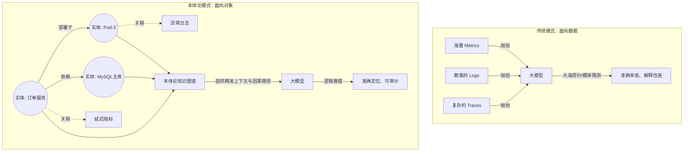

    

        

            

            

            

        

        
bash

    

    

        
ckhuang@macbookpro:~$ 很多 Agent Builder 都会陷入一个误区：以为给大模型投喂海量的日志、指标和链路数据，再写几个酷炫的 Skills，Agent 就能变成运维专家。但现实往往是，半夜报警时，Agent 只能基于概率给出“看起来相关”的猜测。缺乏“本体论”的支撑，大模型永远只是个懂得多但缺乏业务常识的“外包员工”。 

    

在构建企业级 AI Agent 的过程中，我们常常会听到上下文工程（Context Engineering）、RAG 等词汇。但随着场景深入，尤其是进入到 IT 运维、金融风控等严肃的业务深水区，另一个听上去有些哲学范儿的概念正逐渐成为破局的关键——**本体论（Ontology）**。

今天，我们就结合阿里云 UModel 的实践，聊聊为什么你的 AI 员工需要一套“本体论”。

## 1. 从“统计相关性”到“机器认知”

在哲学中，本体论探讨的是“存在”的本质。而在人工智能与分布式架构领域，**本体论就是为你研究的特定领域，画一张统一、无歧义的认知地图**。

通用大模型（Foundation Models）在预训练阶段阅读了全网的开源代码和技术文档。它知道“OOM 意味着内存不足”，知道“502 错误多与网关有关”。但它不知道的是：**在你的私有架构里，订单服务调用库存服务走的是内网还是公网？这个特定的 `biz_order_lag` 指标代表什么业务含义？**

### 大模型+Skills 模式的致命局限

在简单的场景下，“大模型 + 个人技能（Skills）”或许够用，但在复杂的分布式系统中，这种模式面临三大不可逾越的鸿沟：

1. **私有架构的知识盲区**：企业的微服务拓扑、自定义指标规范等私有知识，大模型在预训练时根本没见过。
2. **相关性与因果性的鸿沟**：大模型倾向于将“磁盘 90%”和“应用崩溃”关联，因为它俩经常同时出现。但实际的运维排障需要严密的**因果推断**（磁盘满 -> 日志无法写入 -> 健康检查失败 -> Pod 重启）。
3. **可解释性缺失**：当 AIOps 决定在半夜叫醒值班工程师，它不能用“神经网络权重激活”来解释。系统决策必须基于清晰的逻辑推理链条。

## 2. 破局之道：从面向数据到面向对象

阿里云的 UModel 为我们提供了一个绝佳的本体论落地参考。它解决问题的核心思路，是**将可观测体系从“面向数据”转向“面向对象”**。

在传统监控中，日志（Logs）、指标（Metrics）、链路（Traces）是孤立的。而在本体论的视角下，我们首先关注的是**实体（Entity）**（如服务、Pod、数据库）。数据只是绑定在特定实体上的观测属性，而关系则是知识图谱中的推理路径。

为了直观理解这种转变，我们可以看下面的对比图：

### UModel 的三大核心设计

结合分布式架构的实战经验，我认为 UModel 的以下三个设计尤为亮眼：

1. **以图为中心的建模**：定义了核心节点（实体集、数据、存储、可视化）和核心关系（部署、调用、依赖等）。这让沿着调用链的上下游追溯成为可能。
2. **统一查询与多模数据融合**：大模型不需要再同时精通 PromQL、SPL 和 SQL。系统通过统一的查询抽象，允许在一次分析中融合事件、拓扑、日志和指标。
3. **知识的情景化沉淀**：这也是最让我感到共鸣的一点。一份“慢查询排查指南”放在全局文档库里只是一堆死字，但当它被绑定到“订单服务对应的 MySQL 实体”上时，就变成了 AI Agent 的精准行动指南（SOP）。

## 3. 总结与思考

有了本体论的支撑，AI Agent 就不再是一个只会死记硬背的“文本生成器”，而是拥有了一套**语义导航系统**。它清楚每一个数据点的归属，明白故障在拓扑中传播的物理路径，从而在根因分析和故障自愈中表现出极高的准确性和可解释性。

当我们试图打造一个真正得力的 AI 员工时，别忘了给它配上一张能看懂你家院子的“地图”。

    “数据是躯壳，大模型是引擎，而本体论才是赋予智能体业务灵魂的认知骨架。” —— CK·黄

