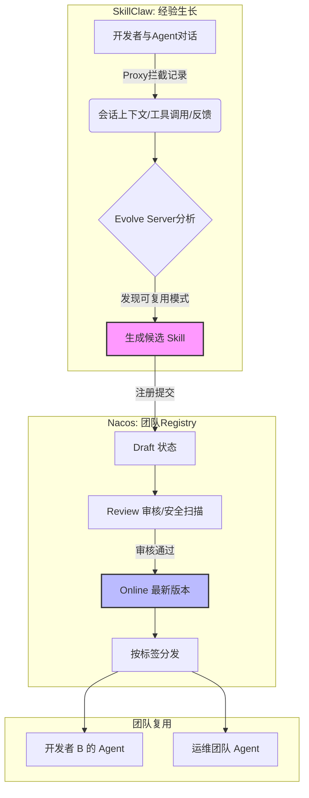

    

        

            

            

            

        

        
bash

    

    

        
ckhuang@macbookpro:~$ 你一定遇到过这种窘境：花了一下午时间，终于调教出一个能完美处理项目排障的 Agent。但当你关掉终端，或者换个同事接手时，一切又得从头再来。Agent 的经验，怎么就成了一座孤岛？ 

    

随着 Claude Code、Cursor 以及各类 MCP 生态的爆发，AI Agent 正在以前所未有的速度接管我们的日常开发与运维工作。但我在落地企业级 AI 架构时发现，真正拉开团队效率差距的，早已不是底层的模型参数，而是注入给 Agent 的 **Skill（技能）**。

一个带有团队内部规范和历史排障 SOP 的 Agent，和一个“出厂设置”的 Agent，生产力是天壤之别。然而，让经验转化为可复用的团队资产，一直是个难啃的骨头。今天，我想借着高德团队开源的 SkillClaw 和我们熟悉的 Nacos 的联合共建，来聊聊如何打破这个僵局。

### 为什么好 Skill 这么难搞？

在分布式系统的演进史里，我们一直在解决“状态”和“共享”的问题。在 Agent 时代，这个痛点同样存在，主要体现在两个维度：

1. **产生之困：闭门造车不如实战踩坑**
   很多团队尝试提前写好几十个 Prompt 模板或 Skill 文件，但这往往是徒劳的。真实的经验（比如排障时先看哪个日志文件、工具调用失败该怎么兜底）是在实战中“试”出来的。经验每天都在会话中产生，却随着窗口的关闭而流失。
2. **共享之困：有了文件，然后呢？**
   退一步说，就算你把经验提炼成了一个 `.md` 或 `.json` 的 Skill 文件，它也只是躺在你的本地硬盘上。团队协作时，谁来维护版本？怎么审核安全性（比如防止包含 `rm -rf /`）？其他同事的 Agent 怎么拉取最新版？

这本质上是一个**经验的提炼与微服务化治理**问题。

### 破局之道：SkillClaw 负责生长，Nacos 负责治理

来看看这套“打怪升级”的架构设计。SkillClaw 与 Nacos 的结合，其实是在打造一条从“局部经验”到“全局资产”的自动化流水线。

#### 1. SkillClaw：在实战中“榨取”经验
SkillClaw 巧妙地将自己作为一个 Proxy 挡在 Agent 客户端与大模型之间。它不干预你的正常工作，而是默默记录你的会话（Turns）、调用的工具、发生的错误以及最终的修正过程。当它的 Evolve Server 发现你在反复调教一个格式，或者解决了一个复杂问题后，它会自动将其抽象、提炼为一个**候选 Skill**。

这就像是一个随时在你背后做笔记的资深架构师，把你无意识的操作习惯变成了结构化的 SOP。

#### 2. Nacos：让 Skill 成为可信赖的微服务
生成的 Skill 不能直接全员广播，这是企业级架构的底线。这时候 Nacos 的出场就显得顺理成章了。作为老牌的注册中心，Nacos 在这里化身为 **AI Registry**：
- **生命周期管控**：候选 Skill 默认进入 Draft 状态，必须经过 Review 才能 Online。
- **安全与合规扫描**：通过 Pipeline 机制接入 `skill-scanner`，阻断包含敏感数据或高危指令的经验外流。
- **版本分发**：支持 `latest` 等标签拉取，让全团队的 Agent 启动时自动热更新。

    “AI 时代的真正壁垒，不在于某个员工拥有多强的个人 Agent，而在于组织是否具备将个体经验自动化地沉淀为团队共识的系统机制。” —— CK·黄

### 实战视角：从周报看演化闭环

原文中演示了一个非常经典的场景：教 Agent 写团队定制格式的周报。
以往我们可能需要写一个几百字的 Prompt，一旦格式变了还得手动去改。而在 SkillClaw + Nacos 的加持下：
1. **第一天**：你像往常一样，通过三轮对话，不断纠正 Agent（标题要一级、JIRA要带链接、结尾要加特定标识）。
2. **后台动作**：SkillClaw 捕捉到了这个完整的调教过程，自动生成了一个 `weekly-report-md` 的 Skill，并推送到 Nacos。
3. **第二天**：Nacos 上审核通过并打上 `latest` 标签。
4. **第三天**：团队里的任何新人，只需要对 Agent 说一句：“写本周周报，做了1、2、3...”，Agent 就会自动拉取 Nacos 上的 Skill，输出分毫不差的完美格式。

这种感觉，就像是你花时间带了一个徒弟，然后这个徒弟瞬间“分身”成了几百个，去服务团队里的每一个人。

### 思考与展望：Agent 架构的下一步

结合我这些年在分布式与大数据架构上的经验来看，Skill 的 Registry 化只是第一步。

未来的演进方向，必然会走向 **AgentSpec 的全面演化**。不仅仅是 Prompt 和 Skill，包括大模型的参数配置、安全边界、甚至使用的工具集，都将通过真实的运行数据进行自动优化和注册分发。

当团队里每一个资深专家的排障思路、代码规范、架构设计模式，都能像微服务一样被注册、发现、版本化和调用时，我们才真正迈入了 AI 原生的协作时代。

    

        

            

            

            

        

        
bash

    

    

        
ckhuang@macbookpro:~$ 把知识留在个人的聊天记录里是种浪费。去试试构建你团队的 AI Registry 吧，让下一个人，不再踩你踩过的坑。 

    

