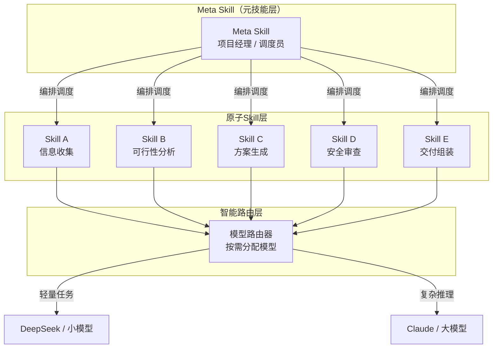
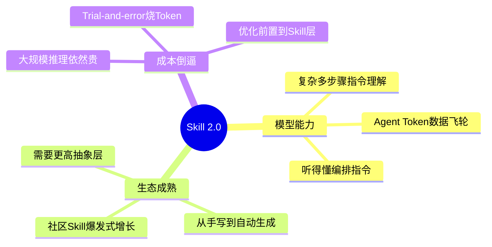
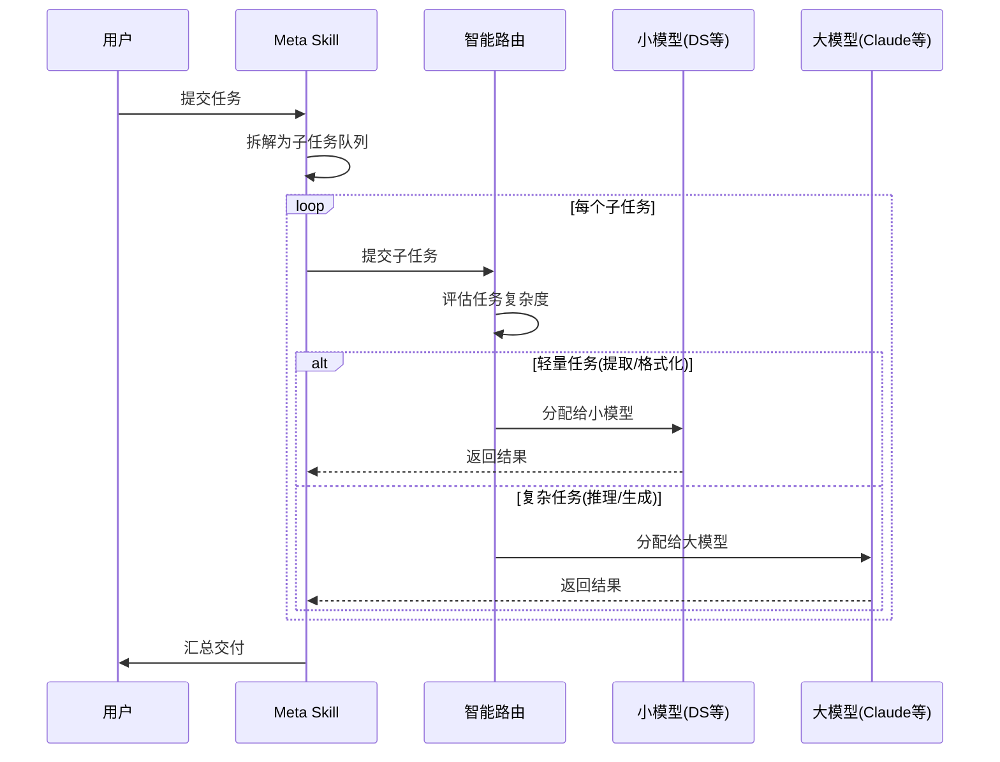
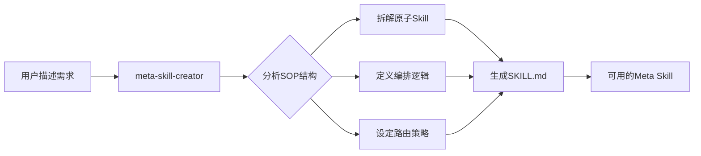

<div style="background-color: #1e1e1e; color: #00ff00; font-family: 'Courier New', Courier, monospace; border-radius: 8px; padding: 20px; box-shadow: 0 10px 30px rgba(0,0,0,0.3); margin-bottom: 30px; margin-top: 20px; position: relative; overflow: hidden;">
    <div style="display: flex; align-items: center; margin-bottom: 15px; padding-bottom: 10px; border-bottom: 1px solid #333;">
        <div style="display: flex; gap: 8px; margin-right: 15px;">
            <div style="width: 12px; height: 12px; border-radius: 50%; background-color: #ff5f56;"></div>
            <div style="width: 12px; height: 12px; border-radius: 50%; background-color: #ffbd2e;"></div>
            <div style="width: 12px; height: 12px; border-radius: 50%; background-color: #27c93f;"></div>
        </div>
        <div style="color: #ccc; font-size: 0.9em;">bash</div>
    </div>
    <div>
        <p style="margin: 5px 0; line-height: 1.6;"><span style="color: #008AFF; font-weight: bold;">ckhuang@macbookpro:~$</span> Agent的下一步，不是"会调用工具"，而是"会组织工具"。Meta Skill就是那本指导Agent三省六部的白皮书。<span style="display: inline-block; width: 8px; height: 16px; background-color: #00ff00; vertical-align: middle;"></span></p>
    </div>
</div>

## 痛点：你是不是也在"戳一下动一下"？

如果你最近在折腾AI Agent做自动化工作流，大概率遇到过这个问题——

你写了一堆Skill，搜索归搜索、文档归文档、天气归天气，每个Skill都能干好自己那一亩三分地的事。但真正跑一个端到端的复杂任务时，你发现**自己变成了那个最累的"调度员"**：脑子里得一直装着下一步该使唤哪个Skill，全程Human in the loop，像个癞蛤蟆一样戳一下动一下。

这不是个别现象。办一场大会的SOP、做一个数据分析Pipeline、甚至写一篇长文——任何需要**多步骤串联**的任务，都会撞上这面墙。

**今天这篇文章，要聊的是一个可能改变这个现状的东西——Meta Skill。**

## OpenSquilla：不只是"省钱"那么简单

GitHub上最近有个仓库火得很快：**OpenSquilla**，短时间内已经突破2000+ Star。

很多人第一反应是冲着它的**智能模型路由**去的——跑任务的时候，界面像个"老虎机"一样滚动，任务结束后弹出一个动画，告诉你这次省了多少Token。实测下来，同类任务比直接用Claude省60-80%，有些场景甚至能省90%以上。

```
┌─────────────────────────────────────────┐
│  🎰 智能路由 "老虎机"                    │
│                                         │
│  任务: 提取结构化数据                      │
│  → DeepSeek V3 ... ✅ 完成 (¥0.03)      │
│  → Claude Sonnet ... ⏭️ 跳过            │
│                                         │
│  💰 本次节省: 93.7% Token 成本           │
└─────────────────────────────────────────┘
```

但说实话，**省钱只是开胃菜，真正的主菜是Meta Skill。**

## 什么是Meta Skill？

Meta Skill，直译就是"元Skill"——**Skill的Skill**。

一个Meta Skill内嵌多个原子Skill，拼接到一块就是一本超级白皮书，能端到端打通一整套长程Workflow。

用一张图来理解它的架构：



**核心变化在于**：你不再需要手动串联每一步，Meta Skill自动判断当前阶段、调用对应子Skill、安排数据流转，整个过程可以完全自动化。

## 实测：20分钟，从零到完整项目规划包

以仓库内置的 `meta-kid-project-planner` 为例——一个给儿童项目规划用的Meta Skill。

**场景设定**：孩子9岁，想做一本Meta Skill魔法书，先网页呈现再做纸质小书。

**执行过程**：

1. **立项阶段**：自动询问用户偏好（年龄、周期、预算、家长参与度）
2. **可行性分类**：判断安全性、是否需要大人协助、是否需要额外采购
3. **执行阶段**：分步计划 → 材料清单 → 安全提醒 → 家长学习目标 → 最终交付

如果涉及户外活动，甚至会调用Web Search查天气。

**最终结果**：全程无需人工介入，自动跑了约20分钟，交付了一份完整的7天项目规划包，包含预案和安全审查——3000字左右的Markdown文档。

> 这背后的Meta Skill源文件有400多行SKILL.md，由5个不同的原子Skill拼接而成。

## 三层架构：为什么Meta Skill能跑通？

很多人可能会问：之前Agent一个Skill干一件事，凭什么Meta Skill就能自动编排了？

这背后其实是**三条线的交汇**：



### 1. 模型能力是基础

复杂多步骤指令的理解能力在这两年飞速提升。模型已经"听得懂"复杂的编排指令了——哪些步骤并行、哪些串行、哪个步骤的产出要喂给下一个步骤——这一切的前提是模型能理解这些结构化指令。

### 2. 生态爆发催生抽象需求

社区创建的Skill在爆发式增长。从用户手写，到基于数据自动生成，再到社区汇集分享。当可选Skill有成千上万个的时候，你需要一个更高的抽象层——Meta Skill——去简化掉Skill筛选和组合的成本。

### 3. 成本倒逼优化前置

大规模跑大模型依然贵。每次让Agent在线上trial-and-error反复摸索最优路径，Token烧掉一大堆。通过Meta Skill，能直接**固化这层复杂度，将优化问题前置到Skill层**。

<div style="text-align: center; font-size: 1.2em; font-style: italic; color: #008AFF; margin: 40px 0 20px; padding: 20px; border-top: 1px dashed #ccc; border-bottom: 1px dashed #ccc;">
    "Agent下一步要解决的问题，已经从'会不会调用工具'，变成了'会不会组织工具'。" —— CK·黄
</div>

## 智能路由：PM有了，还得有预算管理

Meta Skill是"项目经理"，但如果每一步都叫最贵的模型来干，那成本很快就失控了。

这就是智能路由的价值所在——**它帮PM做预算管理**。



以 `kid-project-planner` 为例：
- **提取孩子年龄和偏好**这种活 → DeepSeek就够了
- **生成安全审查方案和14天规划** → 才需要分配给参数更大的模型

你还可以自己选择是否打开路由，或者直接Prompt要求锁定到某个模型。

## meta-skill-creator：造Meta Skill的Meta Skill

Meta Skill很好，但创建起来真的很复杂。

400多行SKILL.md，即便跟AI迭代也要大概30分钟——这还建立在你脑海中已经有清晰SOP的前提下。如果涉及跨行业专家经验整合，照这么排列组合Skill，简直是灾难。

所以，**meta-skill-creator** 可能是OpenSquilla这次发布的9个Skill中最重要的一个。它的工作流程可以概括为：



这形成了一个完美的闭环：**用Meta Skill来创建Meta Skill**，把创建门槛从"需要深刻理解SOP + 手写400行配置"降到了"描述你的需求"。

## 供需匹配：Skill推荐引擎

当Creator不断产出新的Meta Skill，社区也在不断贡献——Skill膨胀问题怎么解决？

现在仓库里只有9个Meta Skill，但如果未来有上百个，你怎么知道哪个最适合你的场景？

OpenSquilla给出的方案是**「个人×社区」的索引协议**：

- 你平时常用哪些Skill
- 偏好什么组合顺序
- 哪个试过不好使

这些信号会被Agent拿去匹配社区里别人做好的Skill，然后根据你的工作流缝合出新的。简单来说，就是一个**自动的Skill推荐引擎**。

## 专家视角：Skill 2.0的范式意义

从分布式系统的视角来看，Meta Skill的架构设计其实暗合了很多经典的工程原则：

| 传统架构概念 | Meta Skill对应 |
|:---|:---|
| **微服务编排** (Orchestration) | Meta Skill对原子Skill的调度 |
| **API Gateway路由** | 智能模型路由的成本优化 |
| **服务注册与发现** | 个人×社区的Skill索引协议 |
| **配置即代码** (Config as Code) | SKILL.md作为编排蓝图 |

这不是巧合。**Agent系统正在重走分布式系统走过的路**——从单体（一个模型干所有事）到微服务（多个Skill各司其职），再到编排层（Meta Skill统一管理）。

当员工（Agent）变多、业务（Skill）变多，必然会遇到指数级放大的噪音。此时，如何善用架构和管理去做**熵减**，就非常必要了。

<div style="text-align: center; font-size: 1.2em; font-style: italic; color: #008AFF; margin: 40px 0 20px; padding: 20px; border-top: 1px dashed #ccc; border-bottom: 1px dashed #ccc;">
    "Agent和人类面对的核心问题殊途同归：组织规模扩大后，架构和管理层面的熵减能力，决定了系统能走多远。" —— CK·黄
</div>

## 快速上手

如果你已经装过类似的Agent工具，OpenSquilla支持一键迁移数据资产和API Keys。Mac/Linux在终端按顺序执行以下命令即可：

```bash
# 安装 uv
curl -LsSf https://astral.sh/uv/install.sh | sh
. "$HOME/.local/bin/env"

# 安装 OpenSquilla
uv tool install --python 3.12 \
  "opensquilla[recommended] @ https://github.com/opensquilla/opensquilla/releases/download/v0.3.0/opensquilla-0.3.0-py3-none-any.whl"

# 配置并运行
opensquilla onboard
opensquilla gateway run
```

入口方面支持飞书、Discord、QQ等主流IM，但推荐使用Web版——因为"智能路由老虎机"和"Token节省动画"只有网页端能显示。

## 写在最后

从版本历史来看，OpenSquilla的演进路径很清晰：

- **5月初**：发布智能路由，最初以为只是做Token优化
- **如今**：Meta Skill出炉，指向了一条反直觉的方向——**Skill 2.0**

Agent的竞争已经从"谁的模型更强"、"谁的Skill更多"，进化到了"**谁能更好地组织Skill**"。

腾讯有Marvis、MiniMax有Mavis、Kimi有Agent集群……但Skill层似乎还停留在刚被Claude带火时的阶段，社区基本还在为单个模型写SKILL.md。

**多Agent的潜能，其实一直没能被完全释放。** Meta Skill的出现，让我们看到了一种可能性——专为Agent团队设计的白皮书，赋予模型更宏观的全局上下文。

<div style="background-color: #1e1e1e; color: #00ff00; font-family: 'Courier New', Courier, monospace; border-radius: 8px; padding: 20px; box-shadow: 0 10px 30px rgba(0,0,0,0.3); margin-bottom: 30px; margin-top: 20px; position: relative; overflow: hidden;">
    <div style="display: flex; align-items: center; margin-bottom: 15px; padding-bottom: 10px; border-bottom: 1px solid #333;">
        <div style="display: flex; gap: 8px; margin-right: 15px;">
            <div style="width: 12px; height: 12px; border-radius: 50%; background-color: #ff5f56;"></div>
            <div style="width: 12px; height: 12px; border-radius: 50%; background-color: #ffbd2e;"></div>
            <div style="width: 12px; height: 12px; border-radius: 50%; background-color: #27c93f;"></div>
        </div>
        <div style="color: #ccc; font-size: 0.9em;">bash</div>
    </div>
    <div>
        <p style="margin: 5px 0; line-height: 1.6;"><span style="color: #008AFF; font-weight: bold;">ckhuang@macbookpro:~$</span> 当Skill从"工具"进化为"组织"，Agent才真正开始具备处理复杂现实问题的能力。这不是锦上添花，这是范式迭代。<span style="display: inline-block; width: 8px; height: 16px; background-color: #00ff00; vertical-align: middle;"></span></p>
    </div>
</div>

---

**参考链接**：
- GitHub仓库：[https://github.com/opensquilla/opensquilla](https://github.com/opensquilla/opensquilla)
- Skill魔法书演示：[https://imtangyujing.github.io/opensquilla-meta-skill-grimoire/](https://imtangyujing.github.io/opensquilla-meta-skill-grimoire/)

> 本文基于量子位公众号文章《刚刚，Meta Skill来了》进行提炼与专业点评。
