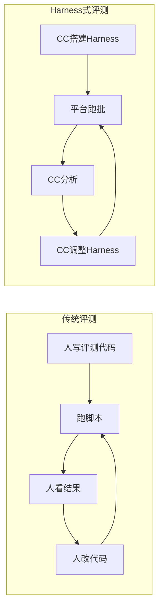
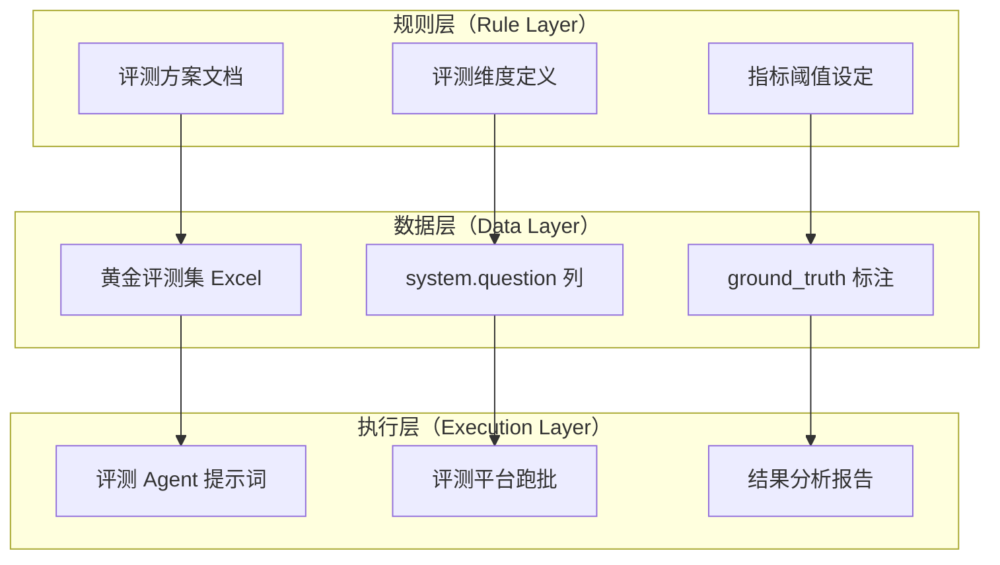
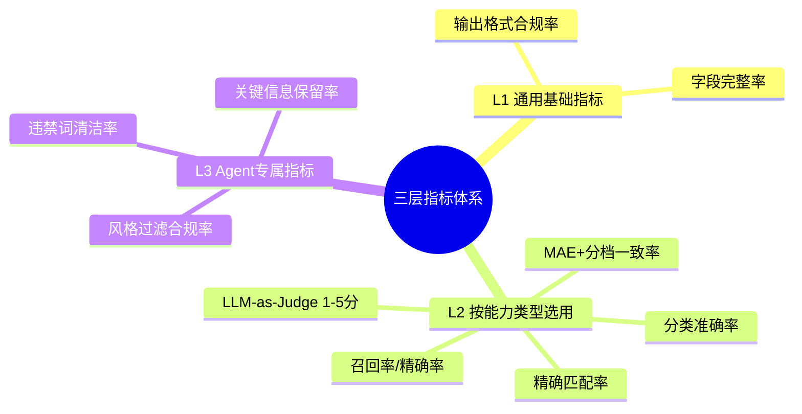
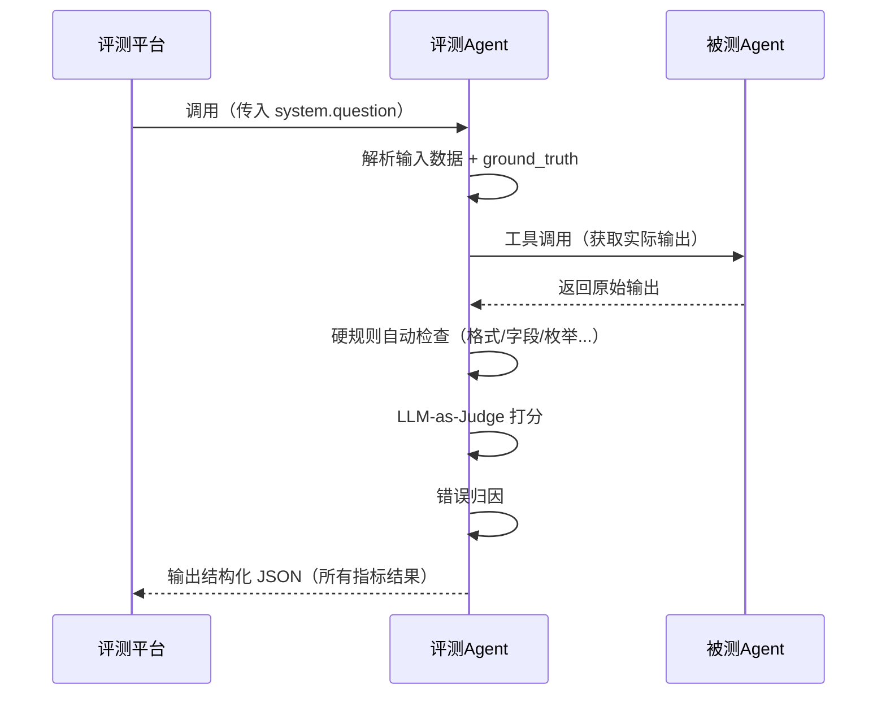

<div style="background-color: #1e1e1e; color: #00ff00; font-family: 'Courier New', Courier, monospace; border-radius: 8px; padding: 20px; box-shadow: 0 10px 30px rgba(0,0,0,0.3); margin-bottom: 30px; margin-top: 20px; position: relative; overflow: hidden;">
    <div style="display: flex; align-items: center; margin-bottom: 15px; padding-bottom: 10px; border-bottom: 1px solid #333;">
        <div style="display: flex; gap: 8px; margin-right: 15px;">
            <div style="width: 12px; height: 12px; border-radius: 50%; background-color: #ff5f56;"></div>
            <div style="width: 12px; height: 12px; border-radius: 50%; background-color: #ffbd2e;"></div>
            <div style="width: 12px; height: 12px; border-radius: 50%; background-color: #27c93f;"></div>
        </div>
        <div style="color: #ccc; font-size: 0.9em;">bash</div>
    </div>
    <div>
        <p style="margin: 5px 0; line-height: 1.6;"><span style="color: #008AFF; font-weight: bold;">ckhuang@macbookpro:~$</span> Prompt 改了一行，想看效果要等一周？评测脚本比被测 Agent 还难维护？是时候换一种活法了。<span style="display: inline-block; width: 8px; height: 16px; background-color: #00ff00; vertical-align: middle;"></span></p>
    </div>
</div>

## 一、痛点直击：AI Agent 评测的"老大难"

做过 AI Agent 落地的团队，十有八九都踩过这个坑——**业务 Agent 迭代飞快（天级），但评测工程搭建缓慢（周级）**。

这不是个别现象，而是一个系统性的矛盾。来看看传统评测的"六宗罪"：

| 痛点 | 典型表现 |
|---|---|
| **启动成本高** | 搭评测工程、写脚本、部署服务，还没开始评就花了一周 |
| **人力密集** | 标注数据、写分析脚本、出报告，每个环节都需人工介入 |
| **迭代慢** | Prompt 改了一行，想看效果要等半天重新跑 |
| **可复现性差** | 评测逻辑散落在各种脚本和 Notebook 里 |
| **指标不统一** | 不同 Agent 各搞一套，无法横向对比 |
| **工程化沉重** | 每换一个 Agent 就要新写一套评测代码 |

如果你正在被这些问题困扰，这篇文章将给你一个**经过 6 个 Agent 实战验证的系统性解法**——用一个顶级 Agent（Claude Code）搭建评测 Harness，将评测逻辑从"代码"升级为"Prompt"。

## 二、核心思路：用强 Agent 搭建评测骨架

### 什么是"Harness 工程搭建式"评测？

先厘清概念。传统做法是：**人写评测代码 → 跑脚本 → 看结果 → 改代码 → 再跑**。

而 Harness 式做法是：**顶级 Agent 搭建完整的评测骨架（harness）**，包括评测方案、数据集、评测逻辑（以 Agent 提示词形式表达）、分析流程。人只需提供被测对象和做关键决策。



> 传统：**周级启动，天级迭代**；Harness 式：**天级启动，小时级迭代**。

### 为什么 Claude Code 是合适的 Harness 搭建者？

Claude Code 在评测场景中展现出五项关键能力：

| 能力 | 在 Harness 中的作用 |
|---|---|
| **深度理解 Prompt** | 分析被测 Agent 的逻辑，设计针对性评测维度 |
| **代码生成** | 数据获取/处理脚本，评测辅助工具 |
| **结构化输出** | 评测方案文档、评测 Agent 提示词、评测报告 |
| **多轮协作** | 跨版本持续迭代（v1→v2→v3），保持上下文连贯 |
| **数据分析** | 对跑批结果做统计、归因、对比 |

<div style="text-align: center; font-size: 1.2em; font-style: italic; color: #008AFF; margin: 40px 0 20px; padding: 20px; border-top: 1px dashed #ccc; border-bottom: 1px dashed #ccc;">
    "评测 Harness 的本质是一套结构化的评估规则 + 执行流程。传统做法把它编码为 Python 脚本，而我们把它编码为 Agent 提示词——更灵活、更可读、更易迭代。" —— CK·黄
</div>

## 三、Harness 工程整体架构

### 3.1 三层架构总览

整套 Harness 采用清晰的三层架构设计：



### 3.2 与传统评测工程的类比

| 传统评测工程 | Harness 式评测 | 变化本质 |
|---|---|---|
| `test_config.yaml` | 评测方案 .md | 规则从配置文件变为自然语言文档 |
| `test_data.json` | 评测集 Excel | 数据格式统一，人可直接看懂 |
| `test_runner.py`（数百行） | 评测 Agent 提示词（数千字） | 执行逻辑从代码变为 Prompt |
| `conftest.py` + fixtures | GT 标注 + ground_truth 字段 | 预期结果内嵌在数据中 |
| `report_generator.py` | CC 实时分析 | 报告生成从脚本变为交互 |

### 3.3 职责分工

这套架构的核心在于**清晰的职责分离**：

| 角色 | 职责 | 不做什么 |
|---|---|---|
| **人** | GT 标注、方案审核、最终决策 | 不写评测脚本、不手动计算指标 |
| **Claude Code** | Harness 全链路搭建 + 结果分析 | 不做批量推理主循环（交给平台） |
| **评测平台** | 批量执行引擎（逐行调用） | 不做方案设计和指标汇总 |

## 四、统一评测指标框架——三层指标体系

在评测 6 个不同类型的 Agent 后，沉淀了一套通用的三层指标框架。这是我认为本文最有复用价值的部分。



### L1：通用基础指标（所有 Agent 必报）

| 指标 | 含义 | 为什么重要 |
|---|---|---|
| **输出格式合规率** | JSON 可成功解析的比例 | 下游消费方直接报错 |
| **字段完整率** | 必要字段均存在的比例 | 缺字段 = 功能不可用 |

### L2：按能力类型选用（从菜单中按需勾选）

| 能力类型 | 指标 | 适用场景 |
|---|---|---|
| 分类判断 | 分类准确率 | 枚举值选择（如类型判断） |
| 二元决策 | 召回率 / 精确率 | 过滤 / 准入决策 |
| 数值提取 | 精确匹配率 | 离散数值的精确提取 |
| 连续评分 | MAE + 分档一致率 | 内容质量打分 |
| 文本生成 | LLM-as-Judge 1-5 分 | 文案、描述等开放式输出 |

### L3：Agent 专属指标（按需自定义）

每个 Agent 可在 L1+L2 基础上追加专有指标，例如：
- **文案生成 Agent**：违禁词清洁率、关键信息保留率
- **风格匹配 Agent**：不适用风格过滤合规率

**新 Agent 接入时的指标选型流程**：确定 Agent 涉及的能力类型 → 从 L2 菜单勾选对应指标 → 按需追加 L3 专属指标 → 设定每个指标的目标阈值。

## 五、Harness 各层的搭建实战

### 5.1 规则层：评测方案设计

**Claude Code 角色：方案架构师**

输入是被测 Agent 的 Prompt 文件 + 业务上下文描述，CC 输出完整的评测方案文档（含维度、指标、阈值、数据集要求、错误分类体系）和边界用例建议。

**实际效果**：从一个 Prompt 文件到一份完整评测方案，大约 **10 分钟**的交互。

### 5.2 数据层：黄金评测集构建

**Claude Code 角色：数据工程师**

CC 完成四件事：
1. **数据获取**：编写脚本调用业务接口，批量拉取候选数据
2. **数据处理**：格式化为评测所需的 JSON 结构
3. **GT 辅助标注**：对分类型指标，CC 先给建议标注，人工复核
4. **评测集打包**：生成评测平台可直接消费的 Excel

其中**关键设计**是 `system.question` 列——每行数据包含被测 Agent 所需的全部输入字段和 ground_truth（人工标注的黄金答案），评测 Agent 读取这一列即可获得输入和预期输出，无需额外配置。

### 5.3 执行逻辑层：评测 Agent 提示词（最核心创新）

**Claude Code 角色：Harness 工程师**

这是整套方案最核心的创新：**把传统的评测脚本（Python/Java）替换为一份评测 Agent 提示词**。评测逻辑从"代码"变为"自然语言指令"，一个 Agent 来评测另一个 Agent。



**评测 Agent 提示词的结构模板**包含：角色定义、工具声明、约束条件、工作流程、输出 Schema。

**为什么把评测逻辑编码为 Prompt 而非代码？**

| 优势 | 说明 |
|---|---|
| **逻辑可读** | 评测逻辑以自然语言写在提示词里，无需读代码 |
| **快速迭代** | 发现评测逻辑有误，改一段文字就行，不用改代码重部署 |
| **统一执行** | 所有 Agent 的评测逻辑结构一致，只改内容不改框架 |
| **评测即文档** | 提示词本身就是评测标准的完整说明 |

### 5.4 输出层：结果分析与报告

**Claude Code 角色：数据分析师**

CC 在分析中的增值体现在三个方面：
1. **自动识别 pattern**：不只报数字，还归因（"18 条误过滤中，12 条都是把某评分维度<60 当过滤条件"）
2. **跨批次对比**：和上一版结果对比，明确哪些指标进步/退步
3. **给出可操作建议**：不只是"分数低"，而是"建议在 prompt 第三段加入明确的过滤条件边界"

## 六、关键实践经验（踩坑总结）

### 6.1 评测集设计原则

| 原则 | 说明 | 反例 |
|---|---|---|
| **小而精** | 20-55 条足够，覆盖所有边界场景 | 200+ 条但都是简单 case |
| **分布均衡** | 正/负例比例合理，边界场景必须有 | 全是正例，评不出问题 |
| **GT 可复核** | 每条 GT 标注有据可查 | GT 靠感觉打分 |
| **版本化管理** | 评测集跟随被测 Prompt 版本变更 | 用 v1 评测集评 v3 Prompt |

### 6.2 LLM-as-Judge 的使用心得

对文本生成类 Agent（无法精确匹配 GT），用 LLM 做评委。核心是设计**有效的 rubric**：

```
5 分：改写自然，传达原文单一核心意图，一次读完即懂
4 分：基本达标，有轻微瑕疵但整体可读
3 分：勉强可接受，但存在轻度问题
2 分：明显问题：信息压缩过度或照抄原文
1 分：严重错误：与输入无关或完全无法理解
```

**三个注意事项**：
- 每个分值必须有**具体、可区分的判定标准**
- 避免"好/较好/一般"这类主观描述
- 分值之间的差异应该**一个正常人也能判断**

### 6.3 "评测 Agent 调被测 Agent" 的踩坑记录

| 坑 | 解法 |
|---|---|
| 评测 Agent 忘记调用工具 | 在 Constraints 中强调"必须先调用工具" |
| 工具参数传递失败 | 在提示词中显式写明参数构造逻辑 |
| 评测 Agent 重试耗尽 token | 添加"禁止重试"约束 |
| 输出截断 | 减少推导过程，只输出最终 JSON |

### 6.4 评测 Agent 自身的迭代策略

评测 Agent 本身也需要迭代（**评测系统 bug ≠ 被测 Agent bug**）：

| 问题 | 表现 | 修复方式 |
|---|---|---|
| 匹配逻辑过严 | 语义等价的判定原因被判错 | GT⊆AI 超集匹配 |
| 硬编码规则误报 | 排除列表不全导致误判 | 改为动态语义比对 |
| Token 截断 | 输出超长被评测平台截断 | 正则容错提取关键字段 |
| GT 覆盖缺口 | 新增选项未在 GT 中体现 | 更新 GT 标注 |

迭代节奏建议：v1 基本逻辑跑通 → v2 切换跑批模式修复评测逻辑 bug → v3+ 基于实际结果持续调优。

## 七、效率对比：实测数据说话

| 阶段 | 传统方式 | CC 协助 | 加速比 |
|---|---|---|---|
| 评测方案设计 | 1-2 天 | 10-30 分钟 | **~10x** |
| 评测集构建 | 2-3 天 | 半天（含人工标注） | **~5x** |
| 评测脚本/Agent 开发 | 2-3 天 | 1-2 小时 | **~10x** |
| 跑批执行 | 同（平台执行） | 同 | 1x |
| 结果分析 + 报告 | 半天-1天 | 10-20 分钟 | **~5x** |
| **单 Agent 全流程** | **~1.5 周** | **~1-2 天** | **~5x** |

CC 方案不仅更快，分析质量也更高：
- **覆盖性**：CC 不会遗漏任何数据行（人工数 50 行 Excel 容易看漏）
- **一致性**：同样的评测标准，不会因为疲劳而评分漂移
- **溯源性**：每条评测结果都可追溯到 Prompt 中的具体逻辑
- **可复现**：同一份评测 Agent 提示词 + 同一份评测集 = 结果可复现

## 八、适用场景与局限

### 适用场景

| 场景 | 适合度 | 原因 |
|---|---|---|
| Prompt 迭代验证 | ⭐⭐⭐⭐⭐ | 改 prompt → 跑批 → 看报告，闭环最快 |
| 多 Agent 横向对比 | ⭐⭐⭐⭐⭐ | 统一指标框架 + 相同评测流程 |
| 新 Agent 上线前验收 | ⭐⭐⭐⭐ | 系统性覆盖，不依赖人工抽检 |
| 线上问题复盘 | ⭐⭐⭐ | 可快速构造问题用例验证 |

### 局限与建议

| 局限 | 建议 |
|---|---|
| LLM-as-Judge 本身有偏差 | 对关键决策用人工抽检兜底 |
| 评测集规模受限（人工 GT） | 小而精优于大而糙，20-55 条覆盖边界即可 |
| 依赖评测平台稳定性 | token 截断、API 超时需做容错 |
| 首次搭建有学习成本 | 第二个 Agent 起复用率很高 |

<div style="background-color: #1e1e1e; color: #00ff00; font-family: 'Courier New', Courier, monospace; border-radius: 8px; padding: 20px; box-shadow: 0 10px 30px rgba(0,0,0,0.3); margin-bottom: 30px; margin-top: 20px; position: relative; overflow: hidden;">
    <div style="display: flex; align-items: center; margin-bottom: 15px; padding-bottom: 10px; border-bottom: 1px solid #333;">
        <div style="display: flex; gap: 8px; margin-right: 15px;">
            <div style="width: 12px; height: 12px; border-radius: 50%; background-color: #ff5f56;"></div>
            <div style="width: 12px; height: 12px; border-radius: 50%; background-color: #ffbd2e;"></div>
            <div style="width: 12px; height: 12px; border-radius: 50%; background-color: #27c93f;"></div>
        </div>
        <div style="color: #ccc; font-size: 0.9em;">bash</div>
    </div>
    <div>
        <p style="margin: 5px 0; line-height: 1.6;"><span style="color: #008AFF; font-weight: bold;">ckhuang@macbookpro:~$</span> 核心公式：一个强 Agent + 评测 Harness + 评测平台 = 一人成军，系统性碾压传统评测流程。<span style="display: inline-block; width: 8px; height: 16px; background-color: #00ff00; vertical-align: middle;"></span></p>
    </div>
</div>

## 九、总结与思考

这套方案的核心理念可以用一句话概括：**用一个强 Agent 搭建评测 Harness 工程，将评测逻辑从"代码"升级为"Prompt"，实现业务 Agent 的系统性快速评测**。

经过 6 个 Agent 的实战验证，沉淀下来的可复用资产包括：

- **三层指标框架模板**（L1/L2/L3）——新 Agent 对照选用
- **评测方案文档模板**——填空式生成
- **评测 Agent 提示词模板**——替换业务逻辑即可
- **评测集 Excel 格式规范**——标准化接入评测平台
- **错误分类体系**——按需扩展

<div style="text-align: center; font-size: 1.2em; font-style: italic; color: #008AFF; margin: 40px 0 20px; padding: 20px; border-top: 1px dashed #ccc; border-bottom: 1px dashed #ccc;">
    "当你的 Prompt 迭代速度以天为单位时，评测不应该成为瓶颈。把评测逻辑从代码变成 Prompt，你就打通了 AI Agent 快速迭代的最后一公里。" —— CK·黄
</div>

### 几点个人思考

作为长期关注 AI Agent 工程化落地的实践者，我认为这套方法论抓住了一个关键洞见：**在 AI 时代，评测 AI 的最佳方式可能就是让另一个 AI 来做**。这不是简单地"用 AI 替代人工测试"，而是通过**结构化的 Harness 设计**，让强 Agent 的推理能力和理解力为评测服务。

但也要注意几个边界：
1. **LLM-as-Judge 不是万能的**——对于高风险决策场景，人工抽检仍然是最后防线
2. **评测集的质量决定上限**——再好的 Harness 也救不了糟糕的 GT 标注
3. **方法论沉淀比工具更重要**——三层指标框架和评测 Agent 模板的可迁移性，才是这套方案最大的价值

> 本文内容参考自阿里云开发者公众号文章《基于顶级 Agent（Claude Code）的 Harness 工程搭建式业务 Agent 评测方案》，作者泊予。在此基础上结合了个人在 Agent 工程化领域的实践经验进行总结与点评。
