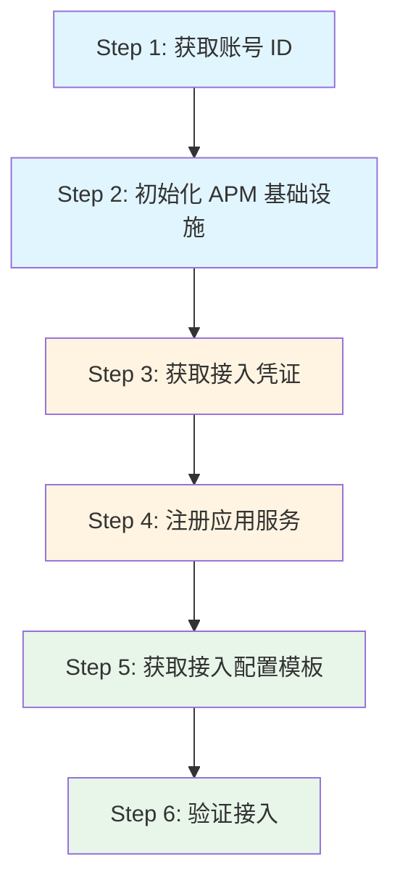
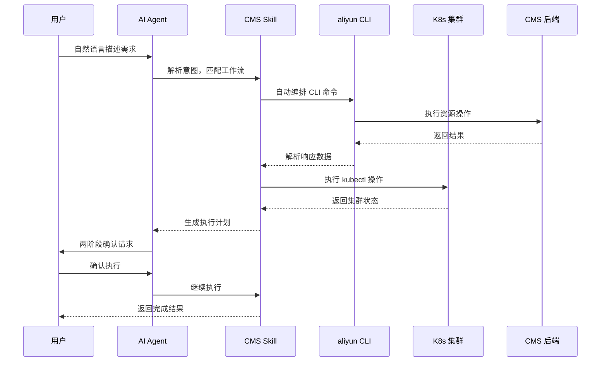

<div style="background-color: #1e1e1e; color: #00ff00; font-family: 'Courier New', Courier, monospace; border-radius: 8px; padding: 20px; box-shadow: 0 10px 30px rgba(0,0,0,0.3); margin-bottom: 30px; margin-top: 20px; position: relative; overflow: hidden;">
    <div style="display: flex; align-items: center; margin-bottom: 15px; padding-bottom: 10px; border-bottom: 1px solid #333;">
        <div style="display: flex; gap: 8px; margin-right: 15px;">
            <div style="width: 12px; height: 12px; border-radius: 50%; background-color: #ff5f56;"></div>
            <div style="width: 12px; height: 12px; border-radius: 50%; background-color: #ffbd2e;"></div>
            <div style="width: 12px; height: 12px; border-radius: 50%; background-color: #27c93f;"></div>
        </div>
        <div style="color: #ccc; font-size: 0.9em;">bash</div>
    </div>
    <div>
        <p style="margin: 5px 0; line-height: 1.6;"><span style="color: #008AFF; font-weight: bold;">ckhuang@macbookpro:~$</span> 你还在手动拼 8+ 条 CLI 命令、查参数、写 JSON 接入监控吗？AI Agent Skill 已经把这件事变成了一句话的事。 <span style="display: inline-block; width: 8px; height: 16px; background-color: #00ff00; vertical-align: middle;"></span></p>
    </div>
</div>

## 痛点：可观测接入的"记忆负担"

在云原生架构普及的今天，企业需要管理的应用类型日益复杂——从传统的 Java 微服务到 AI Agent，从 Golang 后端到各类 AI 网关组件。而可观测平台的接入配置涉及**账号获取、基础设施初始化、凭证获取、服务注册、组件安装、验证**等一系列步骤。

对于非高频使用 CLI 的运维人员来说，这 6 步流程、多个参数传递，就像是一场"记忆力考试"：

- 记不住命令参数？查文档。
- JSON 格式写错了？调试半天。
- Region 搞混了？从头再来。

**这本质上是一个信息转换效率问题**——用户知道自己想要什么（"帮我监控这个应用"），但必须把意图翻译成机器能理解的命令序列。而 AI Agent 的价值，就是抹平这个翻译成本。

## CMS CLI：可观测接入的命令行底座

阿里云云监控 CMS（CloudMonitor Service）2.0 作为统一的可观测管理平台，整合了应用监控（APM）、前端监控（RUM）、Prometheus 服务、告警管理等核心能力。其 `aliyun cms2` CLI 工具覆盖了以下能力：

### 应用接入能力矩阵

| 接入方式 | 支持语言/场景 | 特点 |
|---------|-------------|------|
| **ack-onepilot** | K8s 容器环境 | DaemonSet 自动注入探针，无需修改代码 |
| **手动自研探针** | Java/Python/Go 等 | 灵活控制，适合定制化场景 |
| **原生 OpenTelemetry** | 多语言 | 标准化协议，跨平台兼容 |

在 AI 可观测方面，CMS 2.0 为主流 AI 框架提供了开箱即用的接入体验，这对我们做 AI Agent 开发的团队来说尤其重要。

### 标准 6 步接入流程

无论接入什么应用，CLI 接入都遵循以下流程：



核心命令示例：

```bash
# Step 1: 获取账号 ID
$ aliyun sts get-caller-identity --force -o json
# → AccountId: 1108xxxxxxxxxxxx

# Step 2: 初始化 APM 基础设施（幂等操作）
$ aliyun cms2 apm configuration create \
    --workspace default-cms-1108xxxxxxxxxxxx-cn-hangzhou \
    --region cn-hangzhou

# Step 3: 获取接入凭证（LicenseKey、Endpoint 等）
$ aliyun cms2 apm configuration get \
    --workspace default-cms-1108xxxxxxxxxxxx-cn-hangzhou \
    --region cn-hangzhou -o json

# Step 4: 注册应用服务
$ aliyun cms2 apm service create \
    --workspace default-cms-1108xxxxxxxxxxxx-cn-hangzhou \
    --region cn-hangzhou \
    --body '{"serviceName":"my-app","serviceType":"TRACE","attributes":"{\"language\":\"java\"}"}'

# Step 5: 获取接入配置模板
$ aliyun cms2 integration addon get --addon-name apm-java-batch --env-type Client -o json

# Step 6: 验证接入
$ aliyun cms2 apm service list \
    --workspace default-cms-1108xxxxxxxxxxxx-cn-hangzhou \
    --service-name my-app --region cn-hangzhou
```

流程虽然清晰，但**信息密度高、容错率低**。这就引出了我们的核心方案——AI Agent Skill。

## AI Agent Skill：从"记命令"到"说人话"

CMS 团队将完整的 CLI 操作知识封装为 **alibabacloud-cms-manage Skill**，核心思路是：**将 CLI 操作流程转化为 AI Agent 可执行的结构化工作流**。

<div style="text-align: center; font-size: 1.2em; font-style: italic; color: #008AFF; margin: 40px 0 20px; padding: 20px; border-top: 1px dashed #ccc; border-bottom: 1px dashed #ccc;">
    "好的工具应该让人忘记工具的存在，只感受到目标的达成。" —— CK·黄
</div>

### Skill 工作机制

当用户在 Claude Code 等 AI 编程助手中描述需求时，AI Agent 按以下流程自动编排：



### 安全机制：两阶段确认协议

对于可能影响用户集群的操作（如安装组件、Patch Deployment），Skill 严格执行**两阶段确认**：

- **只读命令**（`get`、`list`）和 **CMS 后端资源创建**（`apm configuration create`）：无需确认，Agent 直接执行。
- **写操作**（如 `kubectl patch`）：展示执行计划，等待用户确认后再执行。

这个设计非常关键——AI Agent 的自动化不能以牺牲安全性为代价。**自动化不等于盲动，智能不等于独断**。

## 实战演示：一句话完成 K8s 容器接入

以下是通过 Skill 完成 ACK 集群中 LangChain 应用自动接入的完整交互过程：

### 用户输入

```
帮我把 ACK 集群里的 LangChain 应用 customer-support-agent 接入 CMS 监控
```

### AI Agent 自动执行流程

**1. 信息收集阶段（无需确认）**

```bash
# 获取账号信息
$ aliyun sts get-caller-identity --force -o json
# → AccountId: 1108xxxxxxxxxxxx

# 获取集群信息
$ aliyun cs describe-clusters
# → clusterId: c8d3f***********, region_id: cn-hangzhou

# 初始化 APM 基础设施
$ aliyun cms2 apm configuration create \
    --workspace default-cms-1108xxxxxxxxxxxx-cn-hangzhou \
    --region cn-hangzhou

# 获取凭证
$ aliyun cms2 apm configuration get \
    --workspace default-cms-1108xxxxxxxxxxxx-cn-hangzhou \
    --region cn-hangzhou -o json
# → LicenseKey: a]***@***************4b70

# 注册服务
$ aliyun cms2 apm service create \
    --workspace default-cms-1108xxxxxxxxxxxx-cn-hangzhou \
    --region cn-hangzhou \
    --body '{"serviceName":"customer-support-agent","serviceType":"TRACE","attributes":"{\"language\":\"python\"}"}'
```

**2. 组件检查阶段**

```bash
# 检查 ack-onepilot 组件状态
$ kubectl get pods -n ack-onepilot
# NAME                      READY   STATUS    RESTARTS   AGE
# ack-onepilot-7d8f9        1/1     Running   0          5d

# 查找目标 Deployment
$ kubectl get deployment --all-namespaces | grep customer-support
# default   customer-support-agent   3/3     3    3    12d
```

**3. 执行计划确认（需要用户确认）**

AI Agent 展示 Patch 内容：

```bash
正在检查 ack-onepilot 组件状态...
ack-onepilot 已安装且正常运行。
找到目标 Deployment default/customer-support-agent（3 副本）。

执行计划 — Patch K8s Deployment
请确认执行（yes / no）。
```

**4. 用户确认后执行**

```bash
# 用户输入: yes

# Patch Deployment，注入探针 Label
$ kubectl patch deployment customer-support-agent -n default \
    --type=strategic -p '{
      "spec":{
        "template":{
          "metadata":{
            "labels":{
              "aliyun.com/app-language":"python",
              "armsPilotAutoEnable":"on",
              "armsPilotCreateAppName":"customer-support-agent",
              "armsPilotAppWorkspace":"default-cms-1108xxxxxxxxxxxx-cn-hangzhou"
            }
          }
        }
      }
    }'

# 验证滚动更新
$ kubectl rollout status deployment/customer-support-agent -n default --timeout=120s
# deployment "customer-support-agent" successfully rolled out
```

**5. 接入完成**

2-3 分钟后，即可在 CMS 控制台看到 LLM 调用耗时、Token 使用量、Agent 链路等监控数据。

### 对比分析

| 维度 | 传统 CLI 方式 | AI Agent Skill 方式 |
|------|--------------|-------------------|
| **命令数量** | 8+ 条 | 0 条（用户侧） |
| **参数记忆** | 需要手动提供 workspace、region 等 | Agent 自动派生 |
| **JSON 拼接** | 手动编写，易出错 | Agent 自动生成 |
| **学习成本** | 高（需熟悉 CMS CLI） | 低（自然语言即可） |
| **安全控制** | 依赖操作者经验 | 两阶段确认机制 |

## 专家视角：为什么这个方向值得关注？

作为一个在分布式系统和云原生领域摸爬滚打多年的老兵，我认为这个案例代表了**运维工具演进的一个重要趋势**：

### 1. 从"命令执行"到"意图驱动"

传统的 CLI 工具要求用户具备领域知识，而 AI Agent Skill 将知识内化到工作流中。用户只需要表达意图，Agent 负责将意图拆解为可执行的步骤。这与我在做大数据平台运维时的体会一致——**最好的工具是让用户忘记工具的存在**。

### 2. 结构化工作流是 Agent 落地的关键

AI Agent 不是"什么都能做"的魔法，而是需要将领域知识结构化为可编排的工作流。CMS Skill 的设计思路值得借鉴：
- 明确每一步的前置条件和输出
- 定义好哪些操作可以自动执行，哪些需要人工确认
- 将错误处理和重试逻辑内嵌到工作流中

### 3. 安全与自动化的平衡

两阶段确认协议是一个非常好的实践。在分布式系统中，我们常说"fail fast"，但在 AI Agent 场景下，应该是"confirm before write"。**自动化提升了效率，但确认机制保证了可控性**。

<div style="background-color: #1e1e1e; color: #00ff00; font-family: 'Courier New', Courier, monospace; border-radius: 8px; padding: 20px; box-shadow: 0 10px 30px rgba(0,0,0,0.3); margin-bottom: 30px; margin-top: 20px; position: relative; overflow: hidden;">
    <div style="display: flex; align-items: center; margin-bottom: 15px; padding-bottom: 10px; border-bottom: 1px solid #333;">
        <div style="display: flex; gap: 8px; margin-right: 15px;">
            <div style="width: 12px; height: 12px; border-radius: 50%; background-color: #ff5f56;"></div>
            <div style="width: 12px; height: 12px; border-radius: 50%; background-color: #ffbd2e;"></div>
            <div style="width: 12px; height: 12px; border-radius: 50%; background-color: #27c93f;"></div>
        </div>
        <div style="color: #ccc; font-size: 0.9em;">bash</div>
    </div>
    <div>
        <p style="margin: 5px 0; line-height: 1.6;"><span style="color: #008AFF; font-weight: bold;">ckhuang@macbookpro:~$</span> AI Agent 不是替代工程师，而是让工程师从"翻译官"回归"架构师"。当工具能理解你的意图，你才能专注于真正有价值的设计与决策。 <span style="display: inline-block; width: 8px; height: 16px; background-color: #00ff00; vertical-align: middle;"></span></p>
    </div>
</div>

## 总结与延伸

CMS CLI + AI Agent Skill 的组合，展示了可观测性工程实践的一个新范式：

- **降低门槛**：从记忆命令到自然语言描述
- **提升效率**：自动化编排 8+ 条命令的执行流程
- **保障安全**：两阶段确认机制确保操作可控
- **智能派生**：Agent 自动获取账号、集群信息，无需手动提供参数

如果你对 CMS CLI 或 AI Agent 驱动的可观测接入感兴趣，可以访问以下资源：

- [阿里云 CLI](https://github.com/aliyun/aliyun-cli)
- [alibabacloud-cms-manage Skill](https://skills.aliyun.com/skills/alibabacloud-cms-manage)
- [CMS 控制台](https://cmsnext.console.aliyun.com/)
- [APM 应用监控文档](https://help.aliyun.com/zh/cms/cloudmonitor-2-0/)

在 AI Agent 快速发展的今天，如何将 AI 能力融入运维工具链，是每个技术团队都需要思考的问题。而这个案例，给出了一个很好的参考答案。
