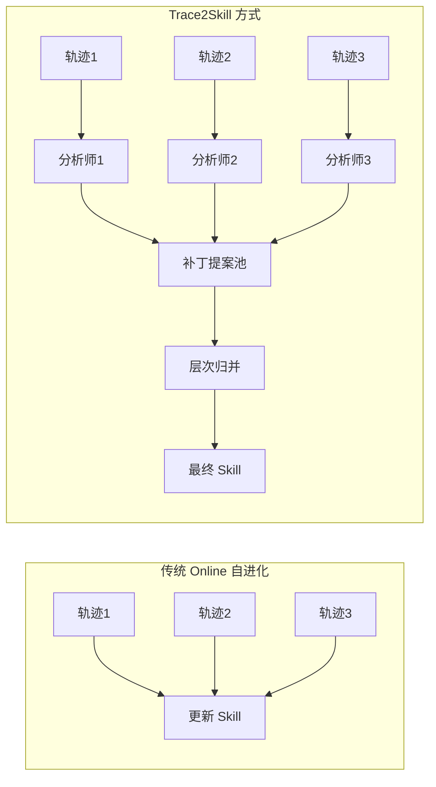
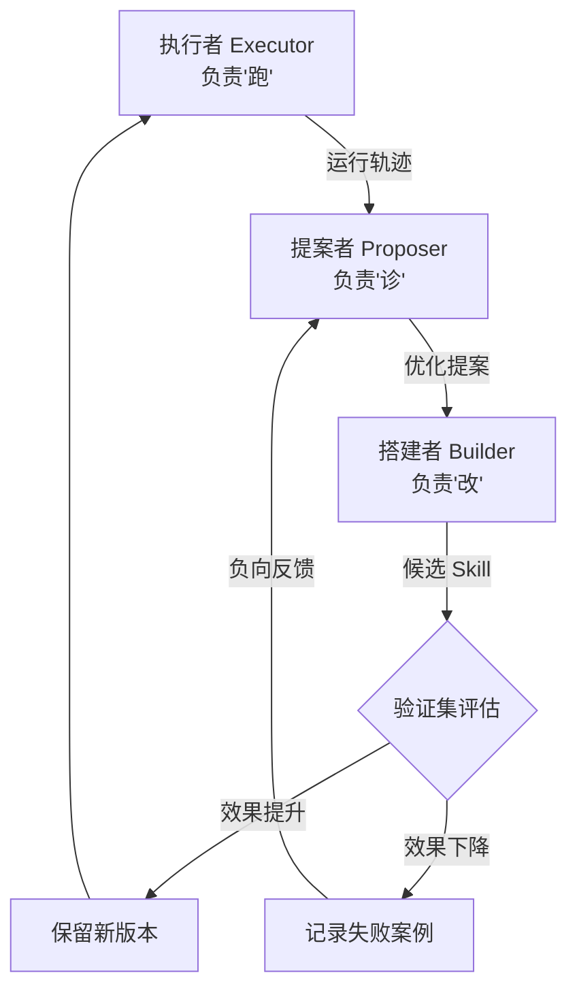

    

        

            

            

            

        

        
bash

    

    

        
ckhuang@macbookpro:~$ 你的 Agent Skill 越进化越蠢？单条轨迹就敢更新 Skill，跟只跑一次测试就上线有什么区别？ 

    

## 痛点：Skill 自进化的"过拟合陷阱"

现如今，**Agent Skills** 已经成为 Agent 架构中非常重要的组成部分。Agent 的最终效果与 Skill 的质量有着极高的相关度。回顾 Skill 的生产方式演化路径：

1. **纯人工手写** → 效率低、难规模化
2. **AI 辅助生成（Skill Creator）** → 效率提升，但仍需人工介入
3. **基于轨迹的自动沉淀** → Agent 运行后自动总结、沉淀 Skill，迈向自动化

第三种方式——也就是 Hermes Agent 所代表的 **"Skill 自动沉淀"** 模式，核心逻辑是：每轮 Agent 执行完毕后，基于运行轨迹（Trajectory）判断是否需要沉淀为新 Skill 或更新已有 Skill。这在很大程度上解放了人力。

然而，在实际应用中，你是否也经常遇到这些问题：

- 自动沉淀的 Skill **质量不高**，对 Agent 效果帮助不大
- Skill 更新后反而比原来**效果更差**
- 原本精简的 Skill 经过几次迭代后变得**冗长复杂、难以阅读**

    "基于单条轨迹就更新 Skill，就像只跑一个测试用例就重构整个模块——不是勇敢，是鲁莽。" —— CK·黄

## 根因分析：为什么 Skill 会"越进化越蠢"

问题的根源在于：目前的 Skill 自沉淀机制，大部分基于**单通 Agent 对话轨迹**来进行。这意味着当前这轮对话的任务完成效果，直接决定了 Skill 进化的方向。

### 个人场景 vs 企业场景的差异

| 维度 | 个人场景 | 企业场景 |
|------|---------|---------|
| 任务多样性 | 高，任务分散 | 低，大量重复任务 |
| 同一任务复现概率 | 较低 | 极高 |
| Skill 复用比例 | 不高 | 非常高 |
| 进化偏差影响 | 有限，不易察觉 | 巨大，直接影响线上质量 |

在企业级场景中，大量用户 Query 虽然属于同一任务类型，但由于用户输入差异，Agent 中间结果不同，层层累积后最终执行轨迹可能有较大差异，还会出现各类**边界情况和长尾场景**。如果简单地根据每轮轨迹直接进行 Skill 沉淀或更新，极易导致 Skill 质量**"飘忽不定"**。

### 与 Prompt 调优的相似教训

这其实与早期的 **Prompt 调优**有着很大的相似性。如果你只是简单地把 badcase 丢给模型，让它根据个案去优化提示词，很容易出现**"顾此失彼"**的现象——模型为了迎合当前的 badcase，甚至会**过拟合（Overfitting）**，把个例情况补进去，导致 Prompt 越来越臃肿，破坏了原本的泛化性和通用性。

> **结论**：受个例影响而不断"找补式的优化"，无论是对 Prompt 还是 Skill，都不是一种好的优化方式。

因此，在企业级线上任务中，我们通常**不敢让 Skill 直接进行 Online 的自进化**。更稳妥的做法是：

1. **离线收集轨迹数据** → 手动更新 Skill
2. **人工审核 + 回归评测验证** → 确认效果提升
3. **灰度切流上线** → 持续观察效果

这种"离线优化 + 在线验证"的流程虽然保障了稳定性，但严重制约生产力，很难**规模化**。而且整个过程核心的决策权依然在人的手中，**并不是真正意义上的"自进化"**。

那么，**如何更科学、更可控、更保质保量地实现 Skill 自进化？** 近期有两篇里程碑意义的论文给出了非常好的答案，且**代码均已开源**。

---

## Trace2Skill："归纳法"的聚合式进化

第一篇来自**阿里千问团队**的《Trace2Skill: Distill Trajectory-Local Lessons into Transferable Agent Skills》。

### 核心思路

Trace2Skill 的核心思路在于**强化"归纳能力"**——让一支"分析师小分队"**并行地看大量 Agent 执行轨迹**，把每条轨迹里学到的零碎经验合并成一份完整的 Skill 文档。

它模仿了人类专家的工作方式：**先广泛积累领域知识，再一次性写出一份成熟的操作手册**，而不是边干边改、整理出一堆碎片。

### 三步核心流程

#### 第一步：轨迹生成

目标是构建高质量的"数据原材料"：

- **初始输入**：给定一份初始 Skill *S*₀（人工编写或模型生成的草稿）
- **轨迹生成**：让 Agent 通过 ReAct 方式在一批用户任务上运行，产生大量执行轨迹（可并行，122B 参数 LLM 生成 200 条 50+ 轮次轨迹不到两小时）
- **正负样本分离**：根据执行结果是否正确，严格划分为**成功集 *T*⁺** 和**失败集 *T*⁻**

#### 第二步：并行提案（核心创新）

为**每一条轨迹独立分配一个 Sub-Agent 分析师**，输出一个"补丁提案"（Patch Proposal）。采用**不对称的角色设计**：

| 角色 | 分析对象 | 机制 | 特点 |
|------|---------|------|------|
| **Success Analyst (*A*⁺)** | 成功集 *T*⁺ | 一次性 LLM 调用 | 高效、低成本，成功路径一致性高 |
| **Error Analyst (*A*⁻)** | 失败集 *T*⁻ | ReAct 多轮循环推理 | 可读写文件、对比 Ground Truth、迭代验证假设 |

**关键设计**：
- **质量门控**：Error Analyst 经多轮推理仍无法找到明确根因的轨迹，直接丢弃
- **隔离性**：所有分析师基于同一份**冻结的初始 Skill *S*₀** 进行分析，互不干扰，避免早期错误观点的相互污染

#### 第三步：无冲突归纳

将分散的补丁池合并成最终版本，本质是**层次归并（Hierarchical Merge）**：

- **递归合并**：每层最多 *B*merge 个补丁合成一个，逐层递归
- **硬约束检查**：
  - 引用检查：引用不存在的文件或变量 → 直接拒绝
  - 冲突标记：同一文件同一行被多次编辑 → 标记冲突暂缓处理
  - 格式校验：最终 Skill 必须通过严格格式校验

在这种机制下，**多次重复出现的模式 = 系统性问题 → 保留为通用原则**；**只出现一两次的修改 = 噪声 → 果断丢弃**。

    "Trace2Skill 实现了从'单点试错'到'群体归纳'的跨越——这才是真正的'先观察，后总结'。" —— CK·黄

### 核心结论

1. **轻量级高度可迁移**：不需要更新模型参数，也不需要 RAG 检索模块，开源级模型即可完成从轨迹到 Skill 的构建
2. **轨迹分析出的 Skill 真的能泛化**：挑战了"经验必须通过情景记忆库检索"的传统假设——高质量的逻辑规则比零散的记忆更具泛化性
3. **设计哲学**："先看够多 → 再写一份完整文档"，批处理式的知识沉淀比流式反应更能捕捉任务本质规律
4. **局限性**：因果贡献难以定量、使用率追踪缺失、**缺乏自动化验证机制**

---

## EvoSkill："自验证"的自然选择

如果说 Trace2Skill 是通过"归纳法"将经验聚合成静态的 Skill，那么 **EvoSkill**（来自 Sentient Labs）则引入了动态的**"验证"过程**。

### 从"构建 → 验证"的闭环架构

这种设计灵感有点像武侠小说中的**"左右互搏"**——构建一个由三个专用 Agent 组成的闭环系统，让它们相互协作、互相验证：

三个角色的分工：

| 角色 | 职责 | 核心动作 |
|------|------|---------|
| **执行者（Executor）** | 跑任务 | 基于当前 Skill 执行任务，产生运行轨迹和答案 |
| **提案者（Proposer）** | 诊断问题 | 分析轨迹，定位问题根源，决定**新建 Skill** 还是**更新已有 Skill** |
| **搭建者（Builder）** | 落地修改 | 接收优化建议，真正编写或修改 Skill 文档 |

### 验证机制：最核心的创新

EvoSkill 最核心的创新点在于确保**每一次进化都是正向的**：

1. **生成与执行**：搭建者完成修改后，在独立的**验证集（Validation Set）** 上重新运行
2. **效果比对**：只有新 Skill 在验证集上**确实优于旧版本**时，进化才被保留
3. **负向反馈记录**：验证失败的尝试不会被直接丢弃，而是记录下来供后续学习，避免重蹈覆辙

### 基于"前沿集合"的迭代算法

EvoSkill 采用基于**前沿集合（Frontier）**的迭代算法。前沿集合 *G* 是一个容量固定为 *k* 的"精英池"，始终保留得分最高的 *k* 个**程序（Program）**。

> 这里的"程序"是 Agent 能力的完整载体，包括封装的 **System Prompt** 和累积的 **Skills 库**，非常像强化学习中的**策略（Policy）**。

每一轮迭代 *t* 严格遵循以下步骤：

1. **选择父代**：从前沿集合 *G* 中轮询选择父程序 *p*
2. **挖掘失败**：在训练集上运行 *p*，收集失败样本集 *F*（若无失败则跳过）
3. **诊断提案**：Proposer 结合失败集和历史记录，输出优化提案 *π*
4. **落地构建**：Builder 将提案具体化为候选程序 *p̃*
5. **严格验证**：在预留验证集 *V* 上评估 *p̃*，只有得分高于 *G* 中最弱成员时才进入集合
6. **历史沉淀**：无论成败，都记入历史库 *H*，供后续迭代参考

经过 *T* 次迭代后，输出前沿集合中**得分最高的程序**——其中的 System Prompt 和 Skill 都是**最优解版本**。

---

## 两种方案对比与选型建议

| 维度 | Trace2Skill | EvoSkill |
|------|------------|----------|
| **核心思想** | 归纳法：先观察后总结 | 自然选择：构建+验证 |
| **轨迹分析** | 并行分析大量轨迹 | 逐轮迭代分析 |
| **验证机制** | 无自动验证，需人工确认 | 内置自动验证集比对 |
| **负向反馈** | 丢弃无法分析的轨迹 | 记录失败案例供后续学习 |
| **适用场景** | 有大量历史轨迹数据时一次性提炼 | 需要持续迭代优化的场景 |
| **类比** | 像人类专家"写完手册再发布" | 像生物进化"适者生存" |

    

        

            

            

            

        

        
bash

    

    

        
ckhuang@macbookpro:~$ 总结：Skill 自进化不是"让 Agent 自己改自己"那么简单。核心在于两点——<strong>归纳要广（Trace2Skill）</strong>，<strong>验证要严（EvoSkill）</strong>。缺了任何一个，都是在"碰运气式优化"。 

    

## 写在最后

从个人经验来看，在企业级 Agent 系统中落地 Skill 自进化，我的建议是：

1. **不要直接 Online 自进化**：企业场景的容错空间远小于个人场景，务必采用"离线优化 + 在线验证"的策略
2. **善用归纳法**：积累足够多的轨迹数据后再做批量提炼，避免"一条轨迹改一次 Skill"的粗暴方式
3. **建立自动验证机制**：这是 EvoSkill 给我最大的启发——没有验证的优化就是盲猜，回归评测体系是 Skill 自进化的安全网
4. **两种方法可以组合使用**：用 Trace2Skill 的方式从大量轨迹中归纳初始 Skill，再用 EvoSkill 的验证机制持续迭代优化

Skill 自进化的终极目标，不是让 Agent "自己改自己"，而是建立一套**科学的、可量化的、方向可控的**持续优化体系。这既需要"归纳"的智慧，也需要"验证"的严谨。

> 参考论文：
> - 《Trace2Skill: Distill Trajectory-Local Lessons into Transferable Agent Skills》（阿里千问团队）
> - 《EvoSkill: Automated Skill Discovery for Multi-Agent Systems》（Sentient Labs）
