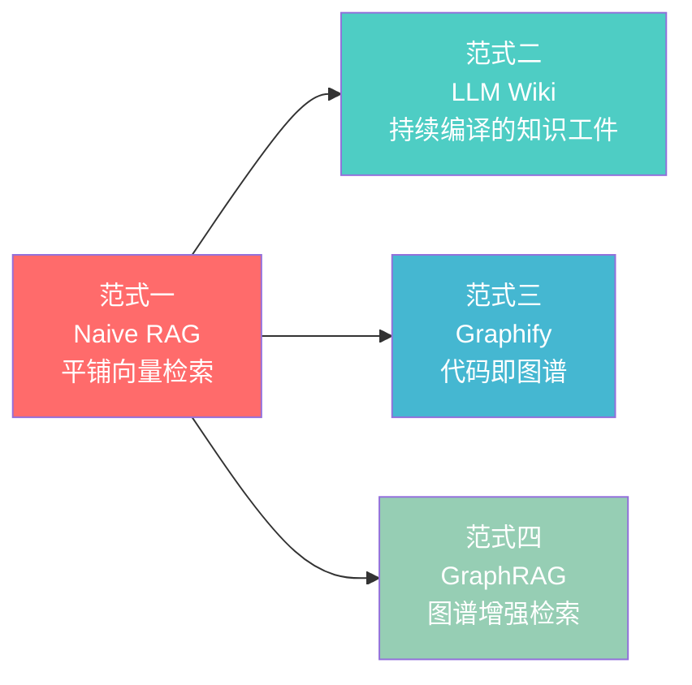
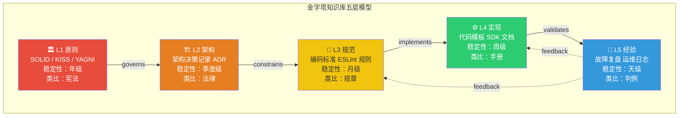
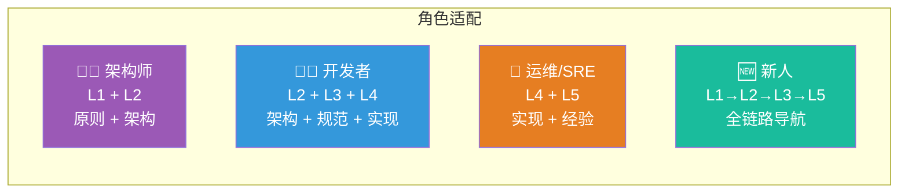
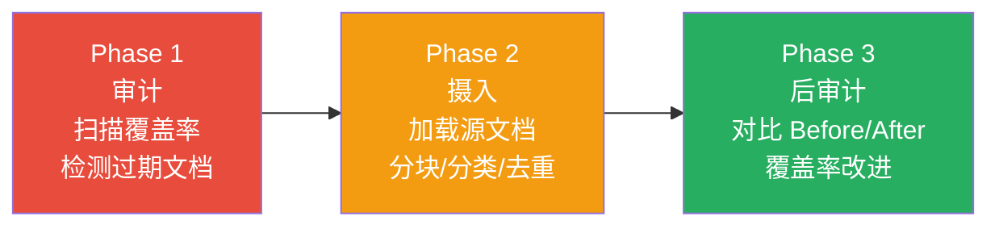
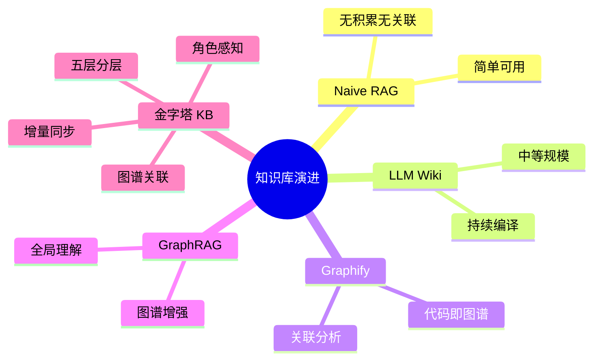

    

        

            

            

            

        

        
bash

    

    

        
ckhuang@macbookpro:~$ 你的知识库还在用"一袋词"做向量检索？难怪 AI 每次都从零推导、连点不成线、粒度全混乱。知识是"一棵树"和"一张图"，不是一堆 chunk。 

    

## 痛点：RAG 的天花板，你踩了几条？

做 AI Agent 落地的同学，大概率都经历过这个心路历程：一开始觉得 RAG（Retrieval-Augmented Generation）就是万能药——文档切 chunk、做 embedding、向量检索 Top-K、喂给 LLM 生成答案，搞定。

**但工程知识库做到深处，你会发现 RAG 有三个结构性缺陷，是任何 prompt 技巧都救不回来的：**

**缺陷一：每次从零推导。** 正如 Karpathy 在 LLM Wiki 设计文档中一针见血指出的——*"the LLM is rediscovering knowledge from scratch on every question. There's no accumulation."* 问一个需要综合 5 篇文档的问题，LLM 每次都得重新找到并拼接那 5 个片段，没有任何中间成果被保留。这就像每次做菜都从买菜开始，永远没有"备菜"这个环节。

**缺陷二：无法连点成线。** Microsoft GraphRAG 的研究明确指出了 baseline RAG 的两个失败模式：当答案需要通过共享属性连接分散信息时，平坦的向量检索无能为力；当需要对大规模语料做全局性的语义理解时，RAG 同样力不从心。

**缺陷三：粒度混乱。** 一个 chunk 可能是"系统设计原则"，也可能是"某个函数的第 42-143 行实现"。向量空间不区分抽象层次——"设计原则"和"代码实现"在语义上可能很近，但它们服务于完全不同的认知需求。

    "用向量检索做知识库，就像用搜索引擎替代知识体系——你能找到所有碎片，但拼不出全貌。" —— CK·黄

不管你团队规模大小，以下 **四个症状** 迟早都会出现：

- **"搜什么都是那几篇"** —— 高词频长文档垄断 Top-K 结果
- **"找到了但不是我要的层次"** —— 想知道"是什么"，返回了"怎么实现"
- **"改了一个地方不知道影响什么"** —— 文档之间没有关联关系
- **"新人不知道从哪看起"** —— 没有阅读路径和导航结构

**共同根源：知识库缺少结构。** 向量检索把知识当成"一袋词"，而工程知识是"一棵树"和"一张图"。

## 知识库方法论全景：四大范式演进

在深入金字塔知识库之前，我们先纵览当前主流的 4 种知识库构建范式。每种范式代表了对"知识应该如何组织"的不同回答。

### 范式一：Naive RAG — 平铺向量检索

**核心思想**：文档 → chunk → embedding → 向量数据库 → 相似度检索。

这是最基础也最广泛使用的模式。优势在于实现简单、无需预处理、直接可用。但默认配置下**无积累、无关联、无层次、无角色区分**——每次查询都是一次性的，知识不会随使用变得更好。

> 注：现代 RAG 可通过 metadata filter、rerank、hybrid search、ACL、query routing 等手段弥补部分缺陷，但需要额外工程投入。

### 范式二：LLM Wiki — 持续编译的知识工件

这是 Andrej Karpathy 提出的知识库模式，核心洞察是：**wiki 是一个持续积累的工件（persistent, compounding artifact）**。LLM 不只是检索者，更是知识的维护者。

**三层架构**：

| 层 | 职责 | 维护者 |
|---|---|---|
| Raw Sources | 不可变的源文档集合 | 人类策展 |
| Wiki | LLM 生成的结构化 markdown 页面 | LLM 完全拥有 |
| Schema | 定义 wiki 结构和工作流的配置 | 人类 + LLM 共同演进 |

**三个核心操作**：
- **Ingest**：新文档进入 → LLM 通读 → 写摘要 → 更新索引 → 修订相关页面（一次 ingest 可能触及 10-15 个页面）
- **Query**：通过 index.md 定位 → 读取 → 综合回答（好的回答反哺为新 wiki 页面）
- **Lint**：定期健康检查——矛盾、过期声明、孤立页面、断裂引用

Karpathy 指出了人类维护 wiki 失败的根因：*"Humans abandon wikis because the maintenance burden grows faster than the value."* LLM 显著降低了这个瓶颈，但仍有幻觉风险，需要人类定期审核。

### 范式三：Graphify — 代码即图谱

**核心思想**：把代码库、文档、配置文件、设计稿等异构资源统一映射为一张可查询的知识图谱。

采用**双管道提取**：
- **AST 管道（离线）**：通过 tree-sitter 解析代码实体，不调用外部 API
- **语义管道（LLM）**：对非代码内容做语义提取，生成概念节点和关系边

**独有能力**：
- **God Nodes**：系统中连接度最高的概念枢纽
- **Surprising Connections**：意料之外的跨模块关联
- **Knowledge Gaps**：图谱自动发现的知识缺口
- **置信度三档**：EXTRACTED / INFERRED / AMBIGUOUS，保证可追溯性

### 范式四：GraphRAG — 图谱增强的检索

Microsoft GraphRAG 是对 Naive RAG 的结构化升级：先构建知识图谱 → Leiden 算法社区聚类 → 分层社区摘要 → 查询时结合图结构和摘要回答。

**两种查询模式**：
- **Global Search**：利用社区摘要做全局推理
- **Local Search**：从特定实体出发，沿图谱边扩展

通过图结构"连点成线"，通过社区摘要实现"全局理解"。但构建成本高，增量更新困难。

### 四大范式对比

| 维度 | Naive RAG | LLM Wiki | Graphify | GraphRAG |
|---|---|---|---|---|
| **知识表示** | 向量 chunk | 结构化 wiki 页 | 有向图 | 知识图谱+社区摘要 |
| **知识积累** | ❌ 无 | ✅ 持续积累 | ✅ 增量更新 | 部分（需重建） |
| **知识关联** | 默认无 | 手动 wikilink | ✅ 自动推断 | ✅ 自动推断 |
| **层次感知** | 默认无 | 按主题分页 | 按社区分组 | 分层社区 |
| **角色适配** | 默认无 | ❌ 无 | ❌ 无 | ❌ 无 |
| **适合规模** | 大（1000+） | 中（~100） | 大（整个代码库） | 大（但构建贵） |
| **核心能力** | 语义相似度 | 综合编译+导航 | 关联分析+缺口发现 | 全局理解+局部精确 |

## 金字塔：一种新的知识工程范式

观察上述 4 种范式，每种都有明确的强项，但都缺少一个关键能力：**层次感知 + 角色适配**。金字塔知识库（Pyramid KB）补上了这一环。

### 五层分层设计

金字塔把知识按**稳定性和抽象度**分为 5 层，每层服务不同的认知需求和角色：

**为什么是 5 层？** 这对应了软件工程中常见的抽象层次划分——从不变的原则到易变的经验。**分层的核心价值**：检索时先确定"用户在问哪个层次的问题"，再在该层内精确定位，显著降低粒度混乱。

### 知识图谱：跨层关联

金字塔不只是 5 个独立的文件夹。每篇文档是一个节点，文档之间通过 **7 种有向边**关联：

| 边类型 | 方向 | 含义 |
|---|---|---|
| `governs` | L1→L2 | 原则约束架构决策 |
| `defines` | L1→L2/L3 | 概念定义域边界 |
| `constrains` | L2→L3 | 架构约束编码规范 |
| `implements` | L2/L3→L4 | 架构/规范的具体实现 |
| `validates` | L4→L5 | 实现产生运维经验 |
| `feedback` | L5→L3/L4 | 经验反馈改进规范和实现 |
| `cross_ref` | 任意 | 同层或跨层的横向引用 |

这形成了一个支持**上溯**（从实现追溯到原则）、**下探**（从原则推导实现）、**反馈环**（运维经验反哺改进）和**场景路径**（如"新人 Onboarding：L1→L2→L3→L5"）的有向图。

### 角色感知：不同人看不同层

这是金字塔的另一个独有设计——**角色-层级访问矩阵**：

每个角色有独立的 `context_budget` 和 `priority_order`，系统按优先层顺序逐层填充内容直到预算用完，确保有限的 context window 里优先塞入该角色最需要的知识。

### 检索机制：结构化路由 vs 向量相似度

| 维度 | 向量检索 | 金字塔分层检索 |
|---|---|---|
| **定位方式** | 语义相似度（embedding 距离） | 分层关键词打分 + 图谱扩展 |
| **搜索空间** | 全量文档 | 角色可访问层的子集 |
| **粒度控制** | 默认无 | 先按层过滤再定位 |
| **关联能力** | 默认单文档匹配 | 图谱边自动关联上下游 |
| **API 调用** | 每次 1 次 embedding 调用 | 0 次（纯本地） |
| **Token 消耗** | 较高（返回 raw chunk） | 较低（budget 截断 + 摘要级） |

**最优组合**：金字塔做分层定位（0 API 调用）→ 向量检索补代码级深度（1 API 调用）= 结构化导航 + 精确细节的互补。

## 知识保鲜：对抗"腐烂"的持久战

    "知识库最大的敌人不是'没有内容'，而是'内容过期'。过期的文档比没有文档更危险——因为它给你错误的信心。" —— CK·黄

### 腐烂的三种形式

| 类型 | 表现 | 危害程度 |
|---|---|---|
| **静默过期** | 文档描述的接口签名已变，但文档没更新 | ★★★★★ |
| **层级漂移** | 当初的架构决策（L2）已降级为历史背景（L5），但还放在 L2 | ★★★ |
| **覆盖盲区** | 新服务上线 3 个月，L4 实现参考里完全没有它 | ★★★★ |

**一个判断标准**：如果团队新人按知识库操作后会踩坑，这篇文档就已经腐烂了。

### 三大保鲜原则

**原则一：每层有不同的保鲜周期**

| 层 | 审查周期 | 过期信号 |
|---|---|---|
| L1 原则 | 年度 | 团队内部对某条原则产生分歧 |
| L2 架构 | 季度 | 系统拓扑图与文档不一致 |
| L3 规范 | 月度 | Lint 规则和文档描述的规则不同 |
| L4 实现 | 周/天级 | 代码模板跑不通或依赖版本过期 |
| L5 经验 | 天级 | 故障排查 SOP 中的命令/路径不存在 |

**原则二：用审计发现问题，而非人工巡检**

建立可自动化的审计指标：覆盖率（无空层）、新鲜度（无超 90 天未更新的 L4/L5）、图谱连通（所有条目至少有 1 条边）、层级平衡（L1 ≤ 10，无单层占比超 50%）。

**原则三：变更驱动更新，而非日历驱动**

把知识更新绑定到已有工作流——架构评审通过更新 L2、Lint 规则变更更新 L3、故障复盘完成更新 L5、新人入职提问暴露 L3/L5 缺口。**最有效的触发机制，就是你已经在做的事。**

### 增量同步机制

金字塔通过三阶段解决同步：

**去重四策略**（checksum + entry ID 双重校验）：

| 场景 | 动作 |
|---|---|
| 内容不变、同层 | skip |
| 内容变了、同层 | update（保留 createdAt） |
| 层级变了 | move（删旧写新） |
| 全新内容 | write |

## 实战测评：831 篇文档的验证

在 831 篇源文档、14 个代码服务、5 个业务域的工程知识库上，使用 200 条 QA pair 进行了对比测评（RAGAS 标准框架）：

| 测试模式 | 检索机制 | 类型 |
|---|---|---|
| Naive RAG | 纯向量语义召回 | Vector Store |
| Pipeline Skill | 7 阶段 pipeline + 6 层路由 | Agentic Pipeline |
| **Pyramid KB** | **分层关键词 + 同义词扩展 + 图谱增强** | **HierarchicalKB** |
| **Pyramid + RAG** | **金字塔路由 → 向量检索穿透** | **Hybrid Retrieval** |
| LLM Wiki | 23 篇编译 wiki + wikilink 导航 | Linked KB |
| Knowledge Graph | 86 节点 / 214 边图谱遍历 | KG Query |

金字塔的核心优势在于：通过分层 + 角色过滤将搜索空间大幅缩小，再通过图谱扩展补充关联上下文，**全程无网络调用**。代价是需要预先构建金字塔结构。

> **局限性声明**：单评估者、非盲评、评测集由 LLM 生成可能存在分布偏差，仅在单一团队知识库上测试，结论是否跨团队通用需验证。

## 总结与思考

从 RAG 到 Agent-native Knowledge Context Layer，核心演进逻辑是：**知识不是一袋词，而是一棵有根有枝的树、一张有向有环的图。**

金字塔知识库并不是要替代其他范式，而是在顶层增加了一个**结构化的路由和导航层**。它回答了一个关键问题：**在有限的 context window 里，给谁看哪些知识，按什么顺序看？**

    

        

            

            

            

        

        
bash

    

    

        
ckhuang@macbookpro:~$ 总结：知识库的终极形态不是"更大的向量库"，而是"更聪明的知识路由器"。分层是骨架，图谱是神经，角色感知是大脑，增量同步是新陈代谢。四者合一，才是 Agent-native 的知识基座。 

    

> **参考来源**：本文基于阿里云开发者社区文章《知识库分层编排：从 RAG 到 Agent-native Knowledge Context Layer》（作者：板牙板牙）进行专业解读与深度分析。
