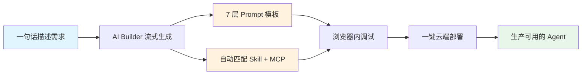
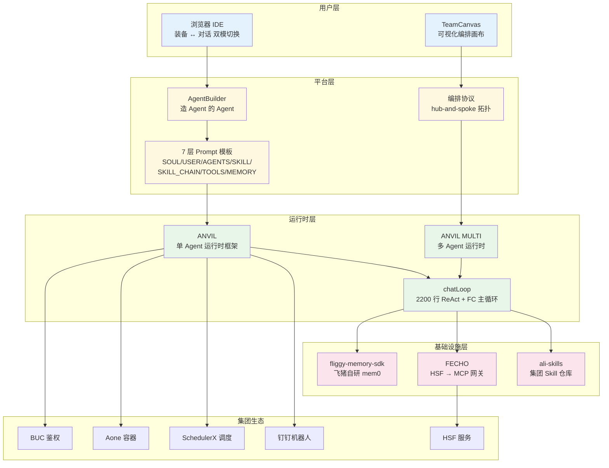

    

        

            

            

            

        

        
bash

    

    

        
ckhuang@macbookpro:~$ 当所有人都在卷大模型的时候，飞猪 CTO 线选择去卷"造 Agent 的基础设施" —— 这才是真正解决落地最后一公里的问题。

    

## 引言：Agent 落地的"最后一公里"困境

在跟不少团队交流 AI 落地的过程中，我发现一个非常普遍的现象：**大家的痛点不在模型能力，而在工程化交付**。

- 业务同学脑子里有 100 个 Agent 想法，但不会写代码、不懂 Prompt 结构、搞不定部署 —— **想法烂在脑子里**。
- 前端 / Node 同学能写，但每造一个 Agent 都要从 0 搭一遍：Dockerfile、容器适配、调度框架、IM 对接、记忆存储……**重复劳动比业务逻辑还多**。
- Java 同学是集团绝对主力，但 Agent 生态全是 Node / Python 系 —— 要么自学一套陌生语言栈，要么造一个半成品框架 —— **想加 AI 能力但不想搭一套 Node 栈**。

这本质上是一个**平台工程（Platform Engineering）**问题：你需要把碎片化的技术能力，封装成一套标准化的解决方案，让不同背景的人都能在自己的舒适区内完成 Agent 的创建与部署。

飞猪 CTO 线团队最近开源分享的 **AgentForge** 平台，正是对这个问题的一次系统性回答。本文将从架构视角深度拆解这个平台的设计思路与核心技术资产。

## AgentForge 是什么：一个"Agent 工厂"

AgentForge 的定位非常清晰 —— **用户一句话描述需求，平台流式生成 Agent 的人设、技能链、工具装备，直接在浏览器里调试对话、配置定时任务、私有化部署**。

它的核心价值主张可以用一张图来理解：

整个过程号称 **73 秒**即可产出一个线上可运行的云端 Agent。这个数字是否可复现取决于场景复杂度，但其工程化思路确实值得关注。

## 四类用户，四条路径

AgentForge 的设计哲学是**让每类用户都在自己的舒适区内完成任务**，而不是强迫所有人学同一套东西。

### 非技术同学：5 分钟出一个真 Loop Agent

核心链路是：**描述 → 生成 → 装备 → 调试 → 部署**。

这里有一个关键区分 —— AgentForge 生成的不是简单的 Prompt 转发，而是**带 Function Calling 主循环、记忆召回、工具确认/重试的完整生产闭环 Agent**。非技术同学甚至可以用 Markdown 写一个 Skill，上传 ZIP 即装，Agent 就能学会新本事。

### Node 技术同学：直接拿走、直接上生产

这一层解决的是**重复脚手架**问题。AgentForge 直接搞定了：

- **容器化**：Dockerfile + APP-META/docker-config 全套，nodejsctl 标准 start_app / health_check / setenv
- **Aone 适配**：自动派生 `EGG_SERVER_ENV`，无需运维额外配置
- **全链路 SOP**：BUC 鉴权 → MySQL/Redis → Egg 启动 → migration 自动 apply → 健康检查

### Java 同学：不碰 Node 一行代码

这可能是最实用的设计。Java 同学眼里的 AgentForge 就是一个 **HTTP 服务**，三条复用通道：

| 通道 | 说明 |
|---|---|
| **HTTP API** | `POST /api/chat` 直接对话，SSE 流式响应，`RestTemplate` / `WebClient` 即可接入 |
| **钉钉机器人** | 把 Agent 挂到业务群，Java 后台跟用户 @ 互动，零代码 |
| **MCP 反向调用** | Java 服务暴露成 MCP Server 让 Agent 调用，业务方法即工具 |

跨 Session 记忆中心化，Java 服务多次调用同一 Agent，记忆自动累积，不用自己存上下文。**不引一行 Node 依赖、不要 LLM SDK key、不动 Maven pom**。

### 小团队：单 Agent 编排成 Agent 战队

通过一套 **Agent 编排协议**，所有 AgentForge 生产的 Agent 都自带统一的对接契约。在 TeamCanvas 可视化画布上拖拽组合，连一条 handoff 线就能组成 Manager + Worker 战队。

## 核心技术架构拆解

作为分布式架构老兵，我认为 AgentForge 最值得学习的不是某个单点功能，而是它的**技术资产分层设计**。

### 五大核心技术资产

**1. fliggy-memory-sdk —— 飞猪自研的 mem0**

这不是简单接一下第三方 SDK，而是完整覆盖了 **namespace 隔离、catalog 注入、topK 召回、事实抽取、衰减/合并/去重** 的长期记忆方案。Agent 跨 Session、跨用户、跨业务域的记忆复用全靠它。在分布式系统中，记忆的状态一致性和隔离性是核心难题，这套 SDK 相当于给 Agent 记忆做了"分库分表"。

**2. FECHO —— 集团 HSF 自动变 MCP 的网关**

这是真正的"上限突破点"。集团内成千上万的 HSF 服务，过去 Agent 想用只能挨个写适配。FECHO 把**所有 HSF 服务自动翻译成 MCP 服务**，意味着 Agent 的能力边界 = 集团服务的全集。这个思路非常巧妙 —— 不是在 Agent 侧做适配，而是在网关层做统一翻译。

**3. ANVIL / ANVIL MULTI —— 自研 Agent 框架**

不是 LangGraph 包一下，也不是 OpenAI Agents SDK 套壳。从 BUC 鉴权 → 模型调用 → MCP 集成 → 调度触发 → 钉钉对接 → 监控审计，全链路生产闭环。用户拿到的不是要自己改的代码骨架，而是**即装即跑的运行时**。

**4. chatLoop —— 自研 ReAct + Function Calling 主循环**

2200 行核心 + 5 子模块懒加载。每一步都暴露 SSE 事件，工具确认/重试/跳过/历史压缩/错误兜底全是标准化 hook 点。中文场景下比直接接 OpenAI Agents SDK 更可控。平台和 ANVIL 框架共用同一份核心 —— **一份代码，两处复用**。

**5. 7 层 Prompt 模板的权责分离**

`SOUL / USER / AGENTS / SKILL / SKILL_CHAIN / TOOLS / MEMORY` 各自独立编辑、独立版本、独立复用。这比扁平 system prompt 更适合复杂 Agent 的协作演进，本质上就是**Prompt 工程的"关注点分离"原则**。

    "别人在做'造一个能跑的 Agent'，飞猪在做'造一套让任何人都能造 Agent 的标准体系'。这中间的差距，就是平台工程和项目工程的区别。" —— CK·黄

## 工程组织哲学：为什么能持续演化

技术资产堆得再多，如果没有好的工程组织，迟早变成屎山。AgentForge 有几个值得借鉴的工程原则：

### Agent 生命周期五阶段标准

**生成 → 装备 → 调试 → 部署 → 调度**，每一阶段抽象成独立模块 + 标准契约。任何阶段单独迭代（换调度后端、换生成策略、换部署目标）都不破坏其他阶段。

这不就是微服务架构里的**关注点分离**和**接口契约**吗？只不过这次应用到了 Agent 生命周期管理上。

### 多环境一致性

dev / pre / prod 同代码同行为，靠 `config.{env}.ts` + Aone 派生 `EGG_SERVER_ENV` 自动切换，migration 自动 apply。**生产容器零额外配置启动** —— 这一点看似简单，但在实际工程中不知道绊倒了多少团队。

### DB-first + 文件 fallback 双模存储

生产 RDS 完整持久化，本地零 MySQL 也能跑全套。降级路径在线上线下都被验证过 —— 不是"理论上可用"，而是**真正被验证过的降级策略**。这在分布式系统设计中是一个非常重要的原则：降级路径必须和主路径一样被充分测试。

### 三类扩展点协议化

Skill / MCP / Memory 三类扩展点全部协议化 —— 任何团队按契约写就能扩展，平台不需要每次都改代码。这就是**开闭原则（OCP）**的工程实践。

## 专家视角：我的思考

从架构角度来看，AgentForge 做对了几件关键的事：

**第一，分层清晰**。用户层、平台层、运行时层、基础设施层，每层职责明确，层间通过标准契约通信。这是经典的分布式系统分层设计，被正确地应用到了 Agent 平台领域。

**第二，网关思维**。FECHO 的设计是点睛之笔 —— 不是在每个 Agent 里做 HSF 适配，而是在网关层统一翻译。这种"能力中台化"的思路，让 Agent 的能力边界直接等于集团服务的全集。

**第三，渐进式复杂度**。非技术同学可以只用浏览器 UI，Node 同学可以拿走全链路 SOP，Java 同学可以只当它是 HTTP 服务。**不同复杂度的需求，对应不同复杂度的解决方案** —— 而不是一刀切地要求所有人学同一套东西。

当然，也有一些值得持续关注的点：
- **多 Agent 编排的可观测性**：当 Agent 战队规模扩大后，handoff 链路的调试和监控将成为新的挑战
- **记忆一致性的边界**：fliggy-memory-sdk 在高并发场景下的记忆写入冲突如何处理，需要持续关注
- **Skill 生态的治理**：当 Skill 数量增长后，版本兼容性、安全审计将成为平台治理的关键

## 总结

AgentForge 的核心价值不在于"又造了一个 Agent 框架"，而在于它**系统性地解决了 Agent 从创建到部署的全链路工程化问题**。

对于正在考虑 AI Agent 落地的团队，AgentForge 的设计思路提供了几个有价值的参考：

1. **平台思维 > 项目思维**：不要为每个 Agent 从零搭架子，而是建一套让 Agent 标准化生产的流水线
2. **网关模式统一能力接入**：与其在每个 Agent 里做适配，不如在网关层统一翻译
3. **渐进式复杂度**：让不同背景的人在自己的舒适区内完成任务
4. **降级路径必须被验证**：不是"理论上可用"，而是"真正跑通过"

    

        

            

            

            

        

        
bash

    

    

        
ckhuang@macbookpro:~$ 下一波生产力解放不来自更强的模型，来自让"造 Agent"变成普通人能完成的事。AgentForge 交出的不只是一个产品，更是一套平台工程的方法论。

    

> 本文基于阿里云开发者公众号飞猪 CTO 线团队分享的技术实践进行解读，原文内容仅代表作者个人观点。结合 CK·黄 在分布式架构与 AI Agent 领域的经验进行分析与点评。
