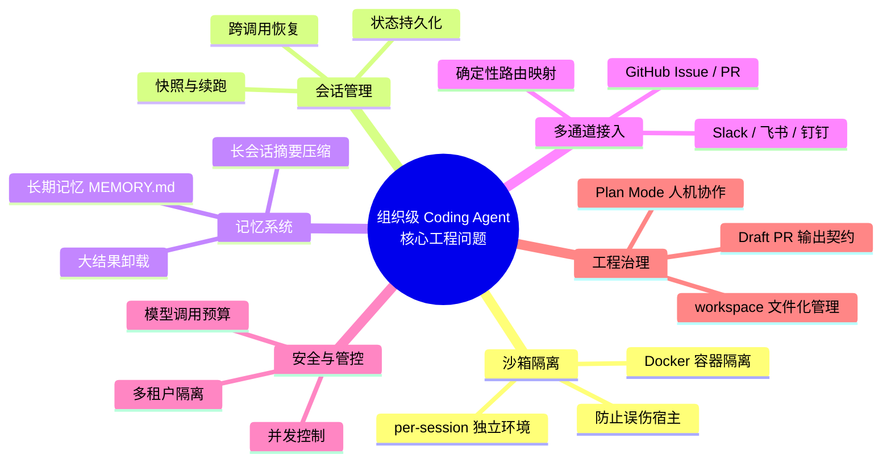
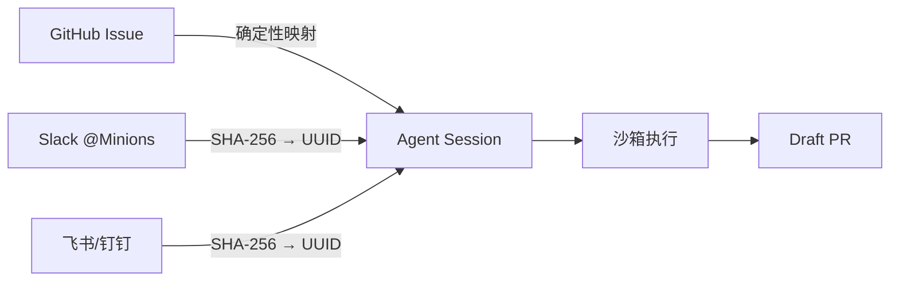
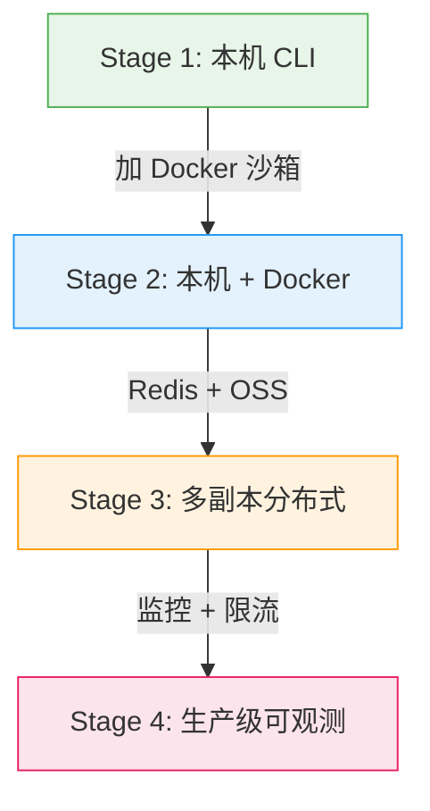

<div style="background-color: #1e1e1e; color: #00ff00; font-family: 'Courier New', Courier, monospace; border-radius: 8px; padding: 20px; box-shadow: 0 10px 30px rgba(0,0,0,0.3); margin-bottom: 30px; margin-top: 20px; position: relative; overflow: hidden;">
    <div style="display: flex; align-items: center; margin-bottom: 15px; padding-bottom: 10px; border-bottom: 1px solid #333;">
        <div style="display: flex; gap: 8px; margin-right: 15px;">
            <div style="width: 12px; height: 12px; border-radius: 50%; background-color: #ff5f56;"></div>
            <div style="width: 12px; height: 12px; border-radius: 50%; background-color: #ffbd2e;"></div>
            <div style="width: 12px; height: 12px; border-radius: 50%; background-color: #27c93f;"></div>
        </div>
        <div style="color: #ccc; font-size: 0.9em;">bash</div>
    </div>
    <div>
        <p style="margin: 5px 0; line-height: 1.6;"><span style="color: #008AFF; font-weight: bold;">ckhuang@macbookpro:~$</span> 个人用 Cursor 写代码叫"提效"，让整个团队通过 Slack @一下 Agent 就自动开 PR 叫"体系"。前者已经卷完了，下半场才刚开始。<span style="display: inline-block; width: 8px; height: 16px; background-color: #00ff00; vertical-align: middle;"></span></p>
    </div>
</div>

## 引言：一个有趣的技术趋同现象

2025 年底到 2026 年初，一件非常有意思的事情发生了：**Stripe、Ramp、Coinbase** 这三家顶级科技公司，几乎同时公开了各自的内部 Coding Agent——分别叫 **Minions**、**Inspect** 和 **Cloudbot**。三家公司独立开发，没有互相参考，最终却不约而同地收敛到了几乎相同的架构上。

这不是巧合。当你把 Coding Agent 从"一个人在终端里用"升级成"整个团队通过 Slack / GitHub Issue 随时触发"，你就会被**同一组工程问题**逼到**同一条路上去**。

> 原文来自阿里云云原生团队的一篇深度长文，我读完之后感触颇深。作为一名在分布式系统和大数据领域摸爬滚打多年的老兵，我想从一个架构师的视角，把这篇文章的核心脉络重新梳理一遍——不仅讲"是什么"和"怎么做"，更要聊"为什么"。

## 两个维度的事：个人提效 vs 组织级体系

在深入之前，必须先把两件事区分清楚。

| 维度 | 个人 Coding Agent（Claude Code / Cursor） | 组织级 Coding Agent（Minions / Cloudbot） |
|:---|:---|:---|
| **触发者** | 你自己 | 任何一个 Issue 评论者 |
| **执行环境** | 本机 | 远端沙箱 |
| **运行时长** | 几分钟，你盯着 | 十几分钟到一小时，没人盯 |
| **信任模型** | 你信你自己的机器 | 多租户、权限隔离、预算管控 |
| **产出形式** | 本地文件变更 | Draft PR，需人类 Review |

一个类比：

- **Claude Code** 是你自己的私家车——你信任驾驶员（你自己），不需要安全气囊以外的防护。
- **组织级 Coding Agent** 是出租车公司的运营车辆——乘客不是车主，驾驶发生在远端，你需要行车记录仪、GPS 追踪、里程限制、紧急制动，还得保证一辆车坏了不影响整个车队。

<div style="text-align: center; font-size: 1.2em; font-style: italic; color: #008AFF; margin: 40px 0 20px; padding: 20px; border-top: 1px dashed #ccc; border-bottom: 1px dashed #ccc;">
    "先隔离，再放权（Isolate first, then give full permissions inside the boundary）" —— 这是 Open SWE 总结的设计哲学，也是所有组织级 Coding Agent 的基石。
</div>

## 核心架构：为什么大家走向了同一条路？

当你真正要把 Coding Agent 做成一个 7x24 服务团队的系统，你会被一系列工程问题"逼"到同一个架构上。下面用一张图来概览这些核心问题域：



### 1. 沙箱：让 Agent 可以放心 `rm -rf`

Coding Agent 最大的工程矛盾是：**你要让模型有真正的执行能力**（`git clone`、`npm install`、`mvn test`、任意 shell 命令），**但又不能让它误伤宿主**。

AgentScope Harness 的做法是做一层统一抽象——`FilesystemSpec` 是接口，Docker 容器、远端 KV、本机文件系统都是可插拔的实现：

```java
HarnessAgent agent = HarnessAgent.builder()
    .name("coding")
    .model(model)
    .workspace(workspace)
    .filesystem(new DockerFilesystemSpec()
        .image("agentscope/coding-sandbox:latest")
        .isolationScope(IsolationScope.SESSION))
    .build();
```

只要一行 `.filesystem(...)`，所有内置工具自动改走沙箱后端，Agent 代码完全不用动。`IsolationScope.SESSION` 保证每个 Issue / PR / IM 对话各跑各的。

**我的经验**：在分布式系统里，沙箱隔离不是什么新概念——容器化早就这么干了。但把沙箱粒度细化到"每个对话一个容器"，这对资源调度和启动速度提出了很高的要求。这也是为什么快照恢复机制如此关键。

### 2. 跨调用恢复：第二轮才是真考验

用户在 PR 上评了一句"再补个测试"。Agent 必须能接着上一轮的环境继续干——重新 `git clone` + `npm install` 等五分钟，谁也受不了。

AgentScope Harness 的方案是**沙箱快照**：每次 `call()` 结束时把工作区状态打包存起来，下次按需恢复。

```
容器还在 → 直接接着用（最快）
容器没了 → 拿快照重新起一个，恢复工作区
没快照   → 全量初始化（冷启动）
```

快照后端可选 Local（本地单机）、OSS（S3 兼容，多副本）、Redis（低延迟，小工作区），生产环境加一行配置就够。

### 3. 长会话记忆：上下文窗口不是无限的

一个长 Issue 跑几十轮对话，`git diff` 输出上万字符，`mvn test` 日志几十 K——模型的上下文窗口很快就撑爆。

这里 AgentScope Harness 给出了**四套独立可组合的机制**：

1. **对话摘要压缩**：消息条数过多时自动触发，保留尾部原文，前面的压缩成摘要
2. **大工具结果卸载**：超过 80K 字符的输出写到工作区文件，上下文里只留首尾各约 2K + 一个 `read_file` 路径
3. **参数截断**：`write_file` 的大入参也截掉，因为内容已经写进文件了
4. **溢出兜底**：真的撞到 `context_length_exceeded` 时做紧急压缩后重试

```java
HarnessAgent.builder()
    .compaction(CompactionConfig.builder()
        .triggerMessages(50)
        .keepMessages(20)
        .truncateArgs(CompactionConfig.TruncateArgsConfig.builder()
            .maxArgLength(2000).build())
        .build())
    .toolResultEviction(ToolResultEvictionConfig.defaults())
    .build();
```

更妙的是 **MEMORY.md** 机制——它会从每天的对话流水账里周期性合并出长期事实。Agent 跑久了，自己就学会了团队的规矩：

```markdown
- 仓库的测试命令是 `mvn -pl module test`，根目录 `mvn test` 太慢不要用
- main 分支受保护，必须通过 PR 合并；feature 分支命名约定为 `feat/`
- CI 用 GitHub Actions，配置文件在 .github/workflows/ci.yml
```

<div style="text-align: center; font-size: 1.2em; font-style: italic; color: #008AFF; margin: 40px 0 20px; padding: 20px; border-top: 1px dashed #ccc; border-bottom: 1px dashed #ccc;">
    "Agent 自己学会了团队的规矩，下次就不用再问了。这不是工具，这是团队成员。" —— CK·黄
</div>

### 4. 多通道接入：让 Agent 出现在用户已经在用的地方

组织级 Coding Agent 的一个共识是：**不要让用户换到一个新的界面去找 Agent，让 Agent 钻进用户已经在用的 Slack 频道、GitHub Issue、IM 对话里**。



这个确定性映射保证同一个 Issue 的所有评论都路由到同一个 Agent session——对话历史自动恢复，不用用户操心。

### 5. 安全管控：多租户、并发、预算

组织级场景还有一些个人工具完全不需要考虑的问题：

- **多租户隔离**：几十个 Issue、几十个 PR 同时在跑，每个都有自己的代码仓库、对话历史和长期记忆，绝不能串台
- **并发控制**：一个 thread 同一时间只跑一个推理。用户在 Agent 跑着的时候又评了一条，新消息入队等下一轮
- **预算管控**：`ThreadBudgetHook` 管住每个 thread 的模型调用上限，`ModelCallLimitHook` 管住全局——一个用户的失控循环不能把全公司的额度烧光

## 从单机到企业：一条渐进式演进路线

这是我最欣赏的设计之一——**同一份 Agent 代码逻辑，配置不同就跑出不同的能力**：



| 阶段 | 关键配置 | 适用场景 |
|:---|:---|:---|
| **Stage 1** | 什么都不配 | 本地开发验证 |
| **Stage 2** | `.filesystem(new DockerFilesystemSpec()...)` | GitHub Webhook 模式 |
| **Stage 3** | `stateStore` 换 Redis，快照存 OSS | 横向扩展，多副本 |
| **Stage 4** | Actuator + Prometheus + BudgetHook | 生产级上线 |

这种**渐进式架构演进**的设计思路，在我做分布式系统的经验里是非常成熟的模式——先跑通最小闭环，再按需叠加复杂度。比起一步到位的"大设计"，这种方式更能适应组织的实际成长节奏。

## Workspace 即配置：Agent 的"配置仓库"

几乎所有主流 Coding Agent 都独立走到了同一个模式：

- Claude Code 有 `CLAUDE.md`
- GitHub Copilot 有 `.github/copilot-instructions.md`
- Open SWE 有 `AGENTS.md`

**核心洞察**：repo 级别的规约不应该硬编码在 system prompt 里，而应该是**文件**——能版本化、能 CR、能独立更新。

```
~/.agentscope/codingagent/workspace/
├── AGENTS.md         ← 人格 + 行为约定
├── MEMORY.md         ← 长期记忆
├── skills/           ← 可复用技能（提交规范、测试规范等 SOP）
├── subagents/        ← 子 agent 声明
├── knowledge/        ← 领域知识（API 文档、代码规范）
└── plans/            ← Plan Mode 计划文件
```

三个工程价值：
1. **团队规范以文件形式生效**：写成一份 skill 放进 `skills/` 目录，所有 Agent 实例下次 `call()` 就生效
2. **Agent 越用越懂团队**：第一次它问"我们用哪个测试框架"，你告诉它"JUnit 5 + Mockito"，下次就记得了
3. **workspace 当 Git 管理**：用 Git 管理，CI 验证，部署时 hydrate 进所有副本

## 总结与思考

<div style="background-color: #1e1e1e; color: #00ff00; font-family: 'Courier New', Courier, monospace; border-radius: 8px; padding: 20px; box-shadow: 0 10px 30px rgba(0,0,0,0.3); margin-bottom: 30px; margin-top: 20px; position: relative; overflow: hidden;">
    <div style="display: flex; align-items: center; margin-bottom: 15px; padding-bottom: 10px; border-bottom: 1px solid #333;">
        <div style="display: flex; gap: 8px; margin-right: 15px;">
            <div style="width: 12px; height: 12px; border-radius: 50%; background-color: #ff5f56;"></div>
            <div style="width: 12px; height: 12px; border-radius: 50%; background-color: #ffbd2e;"></div>
            <div style="width: 12px; height: 12px; border-radius: 50%; background-color: #27c93f;"></div>
        </div>
        <div style="color: #ccc; font-size: 0.9em;">summary</div>
    </div>
    <div>
        <p style="margin: 5px 0; line-height: 1.6;"><span style="color: #008AFF; font-weight: bold;">ckhuang@macbookpro:~$</span> Coding Agent 的上半场是个人提效，下半场的战场转到了工程。<span style="display: inline-block; width: 8px; height: 16px; background-color: #00ff00; vertical-align: middle;"></span></p>
        <p style="margin: 5px 0; line-height: 1.6;"><span style="color: #008AFF; font-weight: bold;">ckhuang@macbookpro:~$</span> 从 Stripe 到 GitHub，从 LangChain 到 AgentScope，大家在不同的起点上走向了同一架构。<span style="display: inline-block; width: 8px; height: 16px; background-color: #00ff00; vertical-align: middle;"></span></p>
        <p style="margin: 5px 0; line-height: 1.6;"><span style="color: #008AFF; font-weight: bold;">ckhuang@macbookpro:~$</span> 这种趋同本身就是最好的路标。echo "未来已来"<span style="display: inline-block; width: 8px; height: 16px; background-color: #00ff00; vertical-align: middle;"></span></p>
    </div>
</div>

回顾这些项目——Stripe Minions、Ramp Inspect、Coinbase Cloudbot、LangChain Open SWE、GitHub Copilot Coding Agent、Claude Code，再加上 AgentScope Harness——它们在语言、生态、部署形态上各不相同，但在**核心架构决策上高度一致**：

- **per-session 隔离沙箱**
- **确定性的 thread ID 路由**
- **middleware 拦截链**
- **Agent 运行时的 message queue 注入**
- **repo 级指令文件**
- **draft PR 作为输出契约**

从我个人的架构经验来看，这种"技术趋同"现象在分布式系统领域并不罕见——就像微服务架构最终都收敛到了服务发现、负载均衡、熔断限流这些共性模式一样。**好的架构不是设计出来的，是被工程问题"逼"出来的。**

Coding Agent 的下半场，拼的不是模型有多聪明，而是**工程基本功有多扎实**。

> 想继续深入了解，推荐查阅 AgentScope 2.0 官方文档：[https://java.agentscope.io](https://java.agentscope.io)
