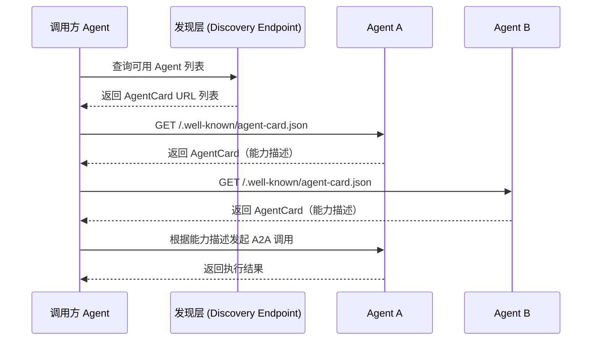
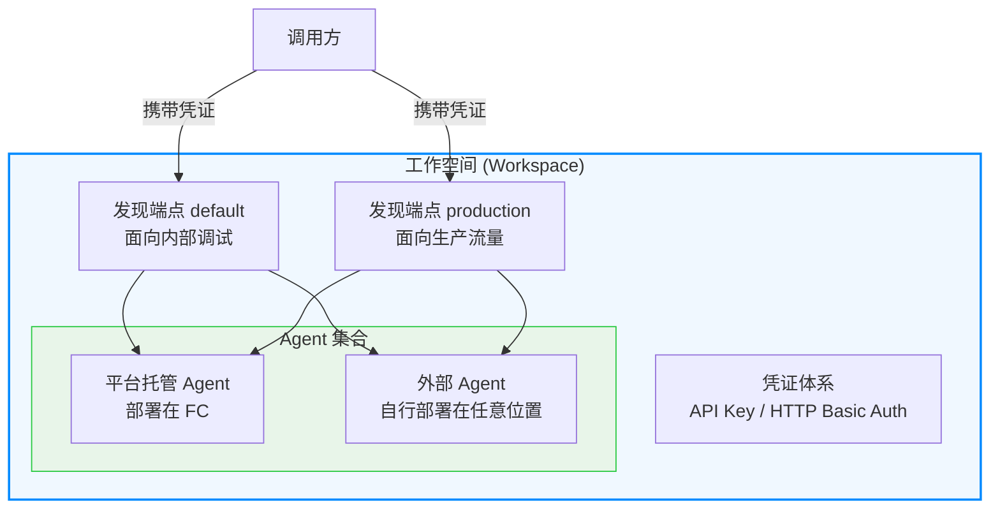
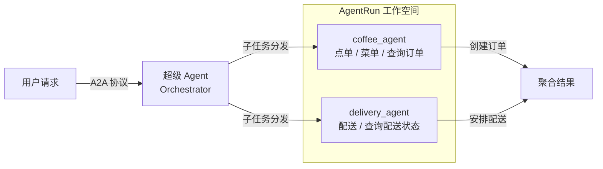
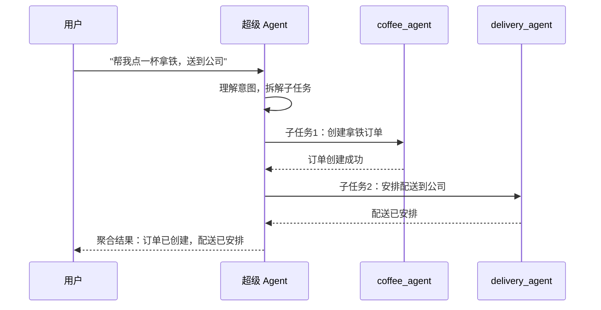

<div style="background-color: #1e1e1e; color: #00ff00; font-family: 'Courier New', Courier, monospace; border-radius: 8px; padding: 20px; box-shadow: 0 10px 30px rgba(0,0,0,0.3); margin-bottom: 30px; margin-top: 20px; position: relative; overflow: hidden;">
    <div style="display: flex; align-items: center; margin-bottom: 15px; padding-bottom: 10px; border-bottom: 1px solid #333;">
        <div style="display: flex; gap: 8px; margin-right: 15px;">
            <div style="width: 12px; height: 12px; border-radius: 50%; background-color: #ff5f56;"></div>
            <div style="width: 12px; height: 12px; border-radius: 50%; background-color: #ffbd2e;"></div>
            <div style="width: 12px; height: 12px; border-radius: 50%; background-color: #27c93f;"></div>
        </div>
        <div style="color: #ccc; font-size: 0.9em;">bash</div>
    </div>
    <div>
        <p style="margin: 5px 0; line-height: 1.6;"><span style="color: #008AFF; font-weight: bold;">ckhuang@macbookpro:~$</span> 单个 Agent 再强也不过是"孤胆英雄"，真正的生产力倍增来自多 Agent 协同——而 90% 的团队都卡在了"拆完之后怎么让它们互相发现、互相调用、互相信任"这一步。<span style="display: inline-block; width: 8px; height: 16px; background-color: #00ff00; vertical-align: middle;"></span></p>
    </div>
</div>

## 引言：多 Agent 的真正难题不是"拆"，而是"联"

在分布式系统领域摸爬滚打了十几年，我见过太多团队在微服务架构中踩过的坑——服务注册、服务发现、链路追踪、权限隔离……每一项都是血泪史。**如今多 Agent 协作面临的挑战，本质上与当年微服务从 Demo 到生产落地的困境如出一辙。**

单个 Agent 再强大，面对跨领域的复杂任务也会遇到能力边界。一个「点咖啡」的 Agent 不应该知道怎么「安排配送」，一个「写代码」的 Agent 不应该知道怎么「审批流程」。更合理的方式是让不同 Agent 各司其职，再通过协作机制互相发现、互相调用。

但问题在于——**自建一套多 Agent 系统远不止"多写几个 Agent"那么简单**。你还需要解决一整套平台工程问题：

- **注册中心**：哪些 Agent 在线？属于哪个环境？当前地址是什么？
- **服务发现**：调用方如何找到合适的 Agent？如何读取它的能力描述？
- **跨 Agent 鉴权**：谁可以发现谁、调用谁？凭证如何轮转？
- **调度编排**：复杂任务如何拆解、分发、重试、聚合结果？
- **环境隔离**：开发、测试、生产的 Agent 如何避免互相串用？
- **链路追踪**：一次用户请求跨多个 Agent 后，如何定位慢调用和失败点？

每一项单独看都是一个工程项目，加起来可能比写 Agent 本身的代码还多。

> 阿里云推出的 **AgentRun** 正是要解决这个核心痛点：**用 A2A 开放协议打破智能体孤岛，用工作空间提供生产级管理，让开发者把精力放回 Agent 能力本身。**

## 一、为什么选择 A2A：用开放协议拒绝"烟囱式"互联

多 Agent 协作最怕被平台私有协议锁死：每接一个 Agent，就要重新适配一套能力描述、鉴权方式和调用协议。Agent 一多，系统很快变成烟囱林立。

**A2A（Agent-to-Agent）** 是 Google 主导的开放协议，不绑定任何平台。这意味着你自建的 Agent、第三方的 Agent、不同云厂商的 Agent，只要遵循 A2A，就能基于同一套标准互相发现和通信。

它的核心价值在于为 Agent 互联提供了一套开放、统一的基础约定：

| 特性 | 说明 |
|---|---|
| **自描述** | 通过 AgentCard 描述 Agent 是谁、能做什么、怎么访问 |
| **可发现** | 调用方可基于标准入口获取 AgentCard，而非依赖人工配置 |
| **可互通** | 不同团队、不同平台、不同运行环境的 Agent 可被统一接入 |
| **可演进** | 协议层定义连接方式，平台层可继续补齐注册、权限、治理等能力 |

<div style="text-align: center; font-size: 1.2em; font-style: italic; color: #008AFF; margin: 40px 0 20px; padding: 20px; border-top: 1px dashed #ccc; border-bottom: 1px dashed #ccc;">
    "选择 A2A 不是把开放协议包装成私有能力，而是基于开放标准承接生态互通，再在协议之上补齐企业落地所需的管理面。" —— CK·黄
</div>

从架构师的视角来看，这个选择非常明智。回顾当年微服务领域的教训——凡是走私有协议路线的，最终都陷入了"适配地狱"。A2A 之于 Agent 生态，就像 HTTP 之于 Web 生态：**标准即自由**。

## 二、A2A 发现机制：AgentCard 与服务发现

### AgentCard：智能体的"身份证"

A2A 协议通过 **AgentCard** 让每个智能体对外自描述能力与接入方式。它是一份标准 JSON 文档，核心包含：

- **是谁**：Agent 的名称、描述、版本、提供方
- **能做什么**：技能列表（Skills），每个技能有 ID、名称、描述和示例问法
- **怎么访问**：服务地址（URL）、支持的传输协议（如 JSON-RPC / gRPC）
- **有什么限制**：认证方式、是否支持流式响应等

按照 A2A 标准，AgentCard 默认托管在 `/.well-known/agent-card.json` 路径下。客户端只需知道 Agent 的 Base URL，就能拿到这份自描述文档，进而决定如何与它通信。

### 服务发现：谁在这个网络里？

有了 AgentCard，还有一个关键问题：**我怎么知道有哪些 Agent 可以调用？**

A2A 协议本身不强制定义中心化注册表，实际项目中通常需要一个「发现层」来管理 Agent 的注册和查询。下面用一张 Mermaid 时序图展示完整的发现流程：



协议定义"怎么描述、怎么连接"，平台负责"怎么注册、怎么发现、怎么隔离、怎么治理"——**这正是 AgentRun 发挥价值的地方**。

## 三、AgentRun 的生产级多 Agent 管理体系

AgentRun 在 A2A 协议基础上，提供了一套完整的生产级管理体系。我用一张架构图来展示其核心概念之间的关系：



### 工作空间（Workspace）：逻辑隔离的基本单位

工作空间是 AgentRun 中组织 Agent 的基本单位，类似于一个「命名空间」。不同业务域、不同团队的 Agent 分属不同工作空间，互相隔离，权限独立管理。

一个 Agent Runtime 归属于一个工作空间后，工作空间就成为它对外可被发现的范围边界。**这就像 Kubernetes 中的 Namespace——没有隔离就没有安全，没有安全就没有生产。**

### 发现端点（Discovery Endpoint）：按环境隔离的发现入口

一个工作空间内可以配置多个发现端点，典型用法是按部署环境区分：

```
工作空间: my-ai-platform
├── 发现端点 default     → 面向内部调试，包含所有 Agent
└── 发现端点 production  → 面向生产流量，只含稳定版 Agent
```

每个发现端点维护一张映射表，记录「哪个 Agent」对应「哪个访问地址」。同一个 Agent 在不同端点中可以配置不同地址——开发地址和生产自定义域名各走各的。

### 平台托管 vs 外部 Agent：统一的发现体验

AgentRun 支持两类 Agent 共存于同一工作空间：

| **类型** | **部署方式** | **注册方式** | **状态流转** |
|---|---|---|---|
| 平台托管 Agent | AgentRun 负责部署到 FC | 通过创建注册 | CREATING → READY |
| 外部 Agent | 自行部署在任意位置 | 手动注册到指定空间 | 直接 READY |

两类 Agent 在发现端点中的表现完全一致——调用方拿到的都是标准 `a2aAgentCardUrl`，无需关心 Agent 实际部署在哪里。**这种"屏蔽底层差异"的设计思路，正是好的平台工程应有的样子。**

### 凭证安全：服务发现也是攻击面

服务发现本身就是敏感信息：暴露工作空间内有哪些 Agent、它们在哪里，可能为攻击者提供侦察入口。AgentRun 在发现端点上内置了凭证验证体系，支持 API Key、HTTP Basic Auth 等方式。

凭证配置与工作空间解耦——更换凭证时，只需在平台重新绑定，无需修改任何 Agent 的代码。

## 四、实战演练：用"希希咖啡厅"跑通发现链路

下面以「希希咖啡厅」多 Agent 系统为例，看看如何一步步跑通完整链路。

### 整体架构



### 五步跑通链路

**第一步：部署模板，准备两个专职 Agent**

在 AgentRun 控制台的 Agent 模版页面一键部署「希希咖啡厅」，平台自动创建：
- `coffee_agent`：负责点单、查看菜单、查询订单
- `delivery_agent`：负责安排配送和查询配送状态

**第二步：创建工作空间，确定管理边界**

新建一个 Workspace，作为这组 Agent 的组织、隔离和发现边界。

**第三步：注册 Agent，统一托管与外部接入**

将平台托管 Agent 或外部 A2A 兼容 Agent 纳入工作空间。注册完成后，调用方看到的都是统一的 `a2aAgentCardUrl`。

**第四步：配置发现端点，暴露可控的发现入口**

在工作空间的「服务发现」中添加端点，配置 Agent 映射和访问凭证。可按环境拆分——`default` 用于调试，`production` 只暴露稳定版。

**第五步：调用发现端点，拿到 AgentCard 入口**

```bash
curl -s \
  -H 'X-API-Key: <your-api-key>' \
  'https://<uid>.agentrun-data.cn-hangzhou.aliyuncs.com/workspaces/<workspace-name>/discovery/agents?discoveryEndpointName=default'
```

响应中的 `a2aAgentCardUrl` 就是 A2A 客户端连接对应 Agent 的入口。链路跑通：**注册 Agent → 配置发现端点 → 获取 AgentCard URL → 发起 A2A 通信**。

## 五、从发现到调度：超级 Agent 的编排能力

走通 A2A 发现链路后，多 Agent 系统具备了"怎么发现、怎么通信"的基础。但真正进入业务场景，还会遇到一个问题：**很多用户知道有哪些 Agent，却不知道该怎么搭建协作关系、怎么选择调用顺序、怎么把复杂任务拆给合适的 Agent。**

这就是 AgentRun **超级 Agent** 要解决的问题——它是 A2A 发现和工作空间管理之上的调度入口：

- **A2A** 定义 Agent 如何自描述、如何被发现、如何通信
- **工作空间** 定义 Agent 如何被组织、隔离、授权、治理
- **超级 Agent** 承担 Orchestrator 角色，把用户意图拆成子任务，动态调用合适的专职 Agent



相比业界常见的"框架式多 Agent Demo"，AgentRun 更关注生产落地中的五个维度：

| 维度 | 说明 |
|---|---|
| **开放互通** | 基于 A2A 接入平台托管和外部 Agent，避免私有协议锁死 |
| **统一治理** | 通过工作空间、发现端点和凭证体系管理可见范围与访问边界 |
| **服务端编排** | 超级 Agent 在服务端完成调度，调用方只需面向一个入口 |
| **生产可观测** | 跨 Agent 调用链路可追踪、可审计，便于定位失败点 |
| **渐进演进** | 先用 A2A + 工作空间管起来，再用超级 Agent 把调度做起来 |

## 六、专家视角：从微服务到多 Agent 的历史回响

<div style="background-color: #1e1e1e; color: #00ff00; font-family: 'Courier New', Courier, monospace; border-radius: 8px; padding: 20px; box-shadow: 0 10px 30px rgba(0,0,0,0.3); margin-bottom: 30px; margin-top: 20px; position: relative; overflow: hidden;">
    <div style="display: flex; align-items: center; margin-bottom: 15px; padding-bottom: 10px; border-bottom: 1px solid #333;">
        <div style="display: flex; gap: 8px; margin-right: 15px;">
            <div style="width: 12px; height: 12px; border-radius: 50%; background-color: #ff5f56;"></div>
            <div style="width: 12px; height: 12px; border-radius: 50%; background-color: #ffbd2e;"></div>
            <div style="width: 12px; height: 12px; border-radius: 50%; background-color: #27c93f;"></div>
        </div>
        <div style="color: #ccc; font-size: 0.9em;">bash</div>
    </div>
    <div>
        <p style="margin: 5px 0; line-height: 1.6;"><span style="color: #008AFF; font-weight: bold;">ckhuang@macbookpro:~$</span> 历史不会简单重复，但总是押着相同的韵脚。十年前微服务踩过的坑——注册发现、环境隔离、链路追踪——今天多 Agent 一个不落地再踩一遍。唯一的区别是：这次我们有了 A2A 这个开放起点，而不是从私有协议开始。 <span style="display: inline-block; width: 8px; height: 16px; background-color: #00ff00; vertical-align: middle;"></span></p>
    </div>
</div>

作为一名在分布式系统领域深耕多年的老兵，看到 AgentRun 的设计思路，我有几点感触：

**1. 协议先行，平台跟进。** 这是正确的路径。先有 HTTP 才有 Web 生态的繁荣，先有 gRPC 才有云原生的互通。A2A 给 Agent 生态提供了同样的基石。

**2. 管理面不可跳过。** 很多团队觉得"我自己写几个 Agent 互相调就行了"，这在 Demo 阶段没问题。但一旦进入生产，你会发现没有注册发现、没有环境隔离、没有凭证管理的多 Agent 系统，就是一个随时会爆的定时炸弹。

**3. 渐进式演进是关键。** AgentRun 提出的路径——先用 A2A 和工作空间管起来，再用超级 Agent 做调度——这与我一贯推崇的"先治理后编排"理念完全吻合。不要一上来就搞复杂编排，先把基础设施打好。

## 总结

AgentRun 让多 Agent 协作像调一个 API 一样简单——用 **A2A** 这个开放标准打破智能体孤岛，用**工作空间**实现生产级管理，并用**超级 Agent** 把协作真正组织起来。

如果你已经有自建 Agent、第三方 Agent 或不同云上的 Agent，只要它们遵循 A2A，就可以被纳入同一套发现和通信体系；如果你还没有调度体系，AgentRun 也提供了从注册发现、权限隔离到服务端编排的生产级路径。

**多 Agent 的未来不在于单个 Agent 有多聪明，而在于它们能像一支训练有素的军队一样协同作战。** AgentRun 正在为这支军队打造指挥系统。

### 相关链接

- [AgentRun 控制台](https://functionai.console.aliyun.com/)
- [A2A 协议规范](https://a2a-protocol.org/latest/specification/)
- [a2a-go SDK](https://github.com/a2aproject/a2a-go)
- [AgentRun Python SDK](https://github.com/Serverless-Devs/agentrun-sdk-python)
- [阿里云 AgentRun 产品文档](https://help.aliyun.com/zh/functioncompute/fc/what-is-agentrun)
