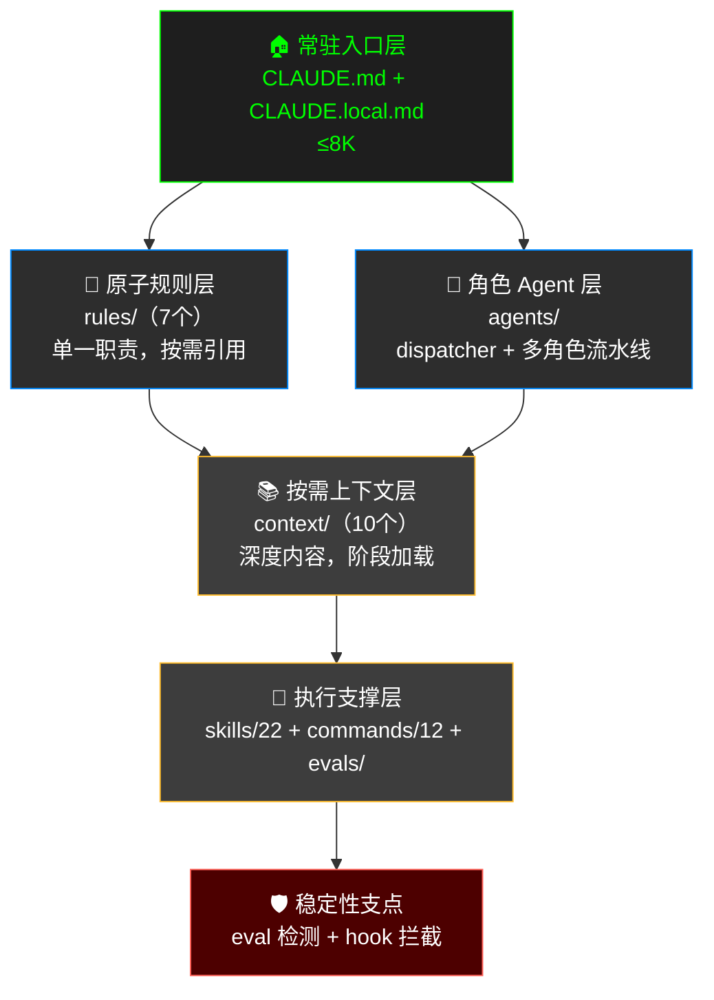
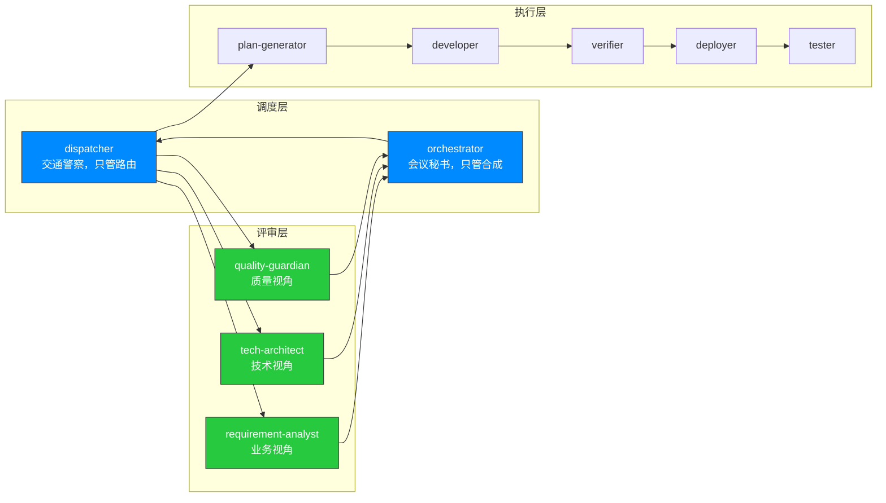
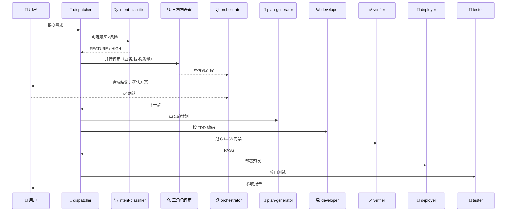

<div style="background-color: #1e1e1e; color: #00ff00; font-family: 'Courier New', Courier, monospace; border-radius: 8px; padding: 20px; box-shadow: 0 10px 30px rgba(0,0,0,0.3); margin-bottom: 30px; margin-top: 20px; position: relative; overflow: hidden;">
    <div style="display: flex; align-items: center; margin-bottom: 15px; padding-bottom: 10px; border-bottom: 1px solid #333;">
        <div style="display: flex; gap: 8px; margin-right: 15px;">
            <div style="width: 12px; height: 12px; border-radius: 50%; background-color: #ff5f56;"></div>
            <div style="width: 12px; height: 12px; border-radius: 50%; background-color: #ffbd2e;"></div>
            <div style="width: 12px; height: 12px; border-radius: 50%; background-color: #27c93f;"></div>
        </div>
        <div style="color: #ccc; font-size: 0.9em;">bash</div>
    </div>
    <div>
        <p style="margin: 5px 0; line-height: 1.6;"><span style="color: #008AFF; font-weight: bold;">ckhuang@macbookpro:~$</span> AI 的瓶颈正从"模型能力"转移到"流程工程"——模型已经足够聪明，但不稳定，而稳定性必须由外部框架供给。堆 prompt 是负债，做框架才是资产。<span style="display: inline-block; width: 8px; height: 16px; background-color: #00ff00; vertical-align: middle;"></span></p>
    </div>
</div>

## 引言：一个所有 AI Coding 用户都会踩的坑

你有没有经历过这样的场景：用 AI 写代码，一开始顺风顺水，于是你往 `CLAUDE.md`（或类似的配置文件）里塞越来越多的规则——先写单测、部署前评审、提交前合 master……它确实管用了三天。

**然后问题以更猛烈的形式回来了。**

规则多到撑爆上下文，模型读完规则就没"脑容量"读代码，于是它开始遗忘、串味、自我矛盾。你以为是 prompt 写得不够好，于是写更多——陷入恶性循环。

阿里云的杜学友在最近的一篇深度长文中，分享了她用两个月时间打磨出的一套 **Harness 工程化框架**，系统性地解决了这个问题。作为一名在分布式系统和大数据领域摸爬滚打多年的老兵，我读完之后深有共鸣——这套框架的设计思路，和我在分布式系统里做"流程编排 + 状态外置 + 门禁阻断"的经验如出一辙。

今天就来深度拆解这篇文章的核心脉络，不仅讲"是什么"和"怎么做"，更要聊"为什么"。

## 一、Harness 到底是什么？它解决的根本问题是什么

先说定义：

> **Harness = 把"AI 该怎么干活"固化成可执行、可约束、可评测的工程框架。**

它和"写更好的 prompt"有本质区别——**prompt 是一次性的说服，harness 是结构性的约束**。模型供给智商，harness 供给纪律。

### 1.1 三个痛点，你一定遇到过

| 痛点 | 没有 Harness 时 | 有 Harness 后 |
|:---|:---|:---|
| **工序随机** | 改了接口跳过单测直接推预发，构建挂了才发现 | 意图×风险决定流程，同类任务走同一条链 |
| **上下文污染** | 方案设计时模型混入上一段需求的字段名，业务/技术/状态全挤一个窗口互相串味 | 角色分工、状态外置，各管一段 |
| **坑反复踩** | `mvn -am` 卡死踩过三次，每次换会话都忘 | 坑沉淀成规则，一次踩、永久兜底 |

### 1.2 遗忘不是 Bug，是架构的必然代价

这里作者引用了 VILA-Lab 对 Claude Code 的逆向工程研究，揭示了一个关键事实：**Claude Code 的记忆完全基于文件系统**（CLAUDE.md + JSONL 日志），没有向量数据库、没有 Embedding。上下文管理靠一条 5 层渐进式压缩管线——从裁剪低优先级提示、截断工具输出，一直到最后手段的全量模型摘要（Auto-Compact）——**流程状态细节恰恰会在这一层被丢失**。

遗忘有三重根因：

1. **压缩丢失**：Auto-Compact 省略"看似不重要"的流程步骤
2. **检索失败**：记忆文件在但没被加载进上下文
3. **指令遵循失败**：信息都在但模型仍然跳步

<div style="text-align: center; font-size: 1.2em; font-style: italic; color: #008AFF; margin: 40px 0 20px; padding: 20px; border-top: 1px dashed #ccc; border-bottom: 1px dashed #ccc;">
    "对付 AI 的不确定性，堆 prompt 是负债，做框架才是资产。" —— CK·黄
</div>

这个判断我在分布式系统领域也反复验证过：**你不能依赖节点的"记忆力"来保证流程正确性，你必须把状态外置到持久化存储，用确定性的状态机来驱动流程。** 分布式系统里的 Saga 模式、事件溯源（Event Sourcing），本质上都是同一个思路。

## 二、Harness 的三层加载模型：把上下文当预算来管理

这是全文最核心的部分。作者的设计思想只有一句：**把上下文当预算来管理。**

主会话的上下文是最贵的资源，不是免费的草稿纸。所以分层的唯一标准不是"按功能分类"，而是**"按何时被读取"**——常驻的极小，深的按需加载。

下面用一张 Mermaid 图来展示整体架构：



### 2.1 常驻入口层：极致精简

放角色、代码偏好、流程触发规则、门禁速查。关键设计是 `CLAUDE.local.md` **自包含、不依赖全局 `@import`**：新项目接入只需拷一份模版进去就能独立运作。

- **解决**：每个项目的流程规范彼此隔离、互不串味
- **效果**：主会话常驻上下文压到 ≤8K，把宝贵窗口留给真正的代码

### 2.2 原子规则层：每条规则都是一次事故的墓志铭

每个规则单一职责、可被按需引用。本质是**把踩过的坑固化成强制约束**：

| 规则 | 约束 | 背后的事故 |
|:---|:---|:---|
| `build.md` | 禁用 `mvn -am`，只编译单模块 | `-am` 触发全量解析卡死 |
| `branch-hygiene.md` | 提预发前必须先合 master | 多分支集成构建报"找不到符号" |
| `code-search.md` | 禁 Grep 搜 Java 结构、禁 LSP，强制走 kbase | 符号搜索误命中、上下文浪费 |

这让我想到分布式系统里的 **Chaos Engineering**（混沌工程）——每一次生产事故都会沉淀成一条自动化检测规则。坑只踩一次，之后由规则兜底——这是 Harness 最朴素也最值钱的复利。

### 2.3 角色 Agent 层：全套框架的发动机

这是最精彩的设计。作者把一个"全能主会话"拆成一条职责清晰的流水线：



核心设计原则：**主会话应该退化成一个"什么都不想、只执行 dispatcher 指令"的纯执行器。**

这反直觉——我们本能地想让主模型更全能；但**全能恰恰是污染之源**。主会话不是能力不足，而是职责收窄——像微服务里的 thin controller，不是它不行，是它不该管。

这个思路和 Devin 的"脑机分离"架构异曲同工：推理（"大脑"）在沙箱外执行，执行环境（"机器"）无权访问大脑状态。作者的 Harness 走了一条更轻量的路——不隔离进程，而是通过 **agent 职责隔离 + 文件交接**达到类似效果。

三条铁律保障落地：

1. **主会话只听 dispatcher**：禁止自己 Read phases/*.md / evidence.json
2. **职责隔离**：每个 agent 的可用工具严格受限
3. **上下文 ≤8K**：主会话只加载 CLAUDE.md + 触发规则 + 最近一条 dispatcher 指令

### 2.4 按需上下文层：上下文不是免费缓冲区

完整流程详情、Pre-Mortem 模板、对抗辩论模板、证据链规范等深度内容全放这层，**只在进入对应阶段时才被 Read**。

这不是凭感觉——有研究支撑：

- **LLM 注意力呈 U 型分布**，中部信息准确率显著下降（Stanford "Lost in the Middle", TACL 2024）
- 声称支持 32K+ 的模型仅半数能在该长度保持可靠性能（NVIDIA RULER）

### 2.5 稳定性支点：Eval 检测 + Hook 拦截

上面几层定义了"该怎么做"，但如果没人检查"有没有做到"，一切约束都是纸上谈兵。

作者引用了 arxiv 2605.29682 的核心发现：

- 原始 token 消耗和工具调用仅解释 agent 成功率方差的 **R²=0.33~0.42**
- 验证反馈质量（Effective Feedback Compute）达到 **R²=0.94~0.99**

**决定 AI 干活靠不靠谱的不是"给它多少预算"，而是"检查做得多好"。**

两大机制：

- **G1–G8 门禁墙**：每个门禁是确定性的 Python 函数，任一 gate FAIL 则流程退回——不是"建议"，是**"阻断"**
- **Hook 拦截**：在工具调用执行前拦截，危险操作（`git push --force`、`rm -rf`）弹确认

<div style="text-align: center; font-size: 1.2em; font-style: italic; color: #008AFF; margin: 40px 0 20px; padding: 20px; border-top: 1px dashed #ccc; border-bottom: 1px dashed #ccc;">
    "流程强制执行必须从 LLM 推理中外置到确定性基础设施。不能依赖模型'记住'该执行哪个步骤——门禁必须是确定性代码，fail-closed。" —— CK·黄
</div>

## 三、19 节点链 × 动态裁剪：不是一刀切，而是量体裁衣

完整的标准研发链路是一条 19 节点链：

```
需求评审 → 需求确认 → 方案设计 → 方案确认 → Pre-Mortem → 实施计划 → 
验收标准确认 → 拉变更 → 建分支 → 建 worktree → 开发 → 编译 → 单测 → 
ATDD → 证据链 → 部署预发 → 接口测试 → 上线确认 → 验收报告
```

但绝不是每个需求都走全 19 步——**该走多重的流程，由意图 × 风险动态裁剪决定**：

| 意图 × 风险 | 实际走的节点 |
|:---|:---|
| `QUERY / NA` | 0 个必需——纯查询，识别对了就根本不该启动流程 |
| `BUG_FIX · LOW` | FAST_PATH：开发 → 编译 → 单测 → 证据 → 报告 |
| `FEATURE · MEDIUM` | 再加上方案设计、对抗辩论、TDD |
| `FEATURE · HIGH` | 19 节点拉满 + ADR 架构决策记录 |

外加一条最实用的硬规则——**"改完必部署"**：只要检测到真实业务代码改动，自动把部署预发、接口测试追加为必需节点，堵死"改了代码、没验证就收工"。

用一个流程图来直观感受 `FEATURE/HIGH` 需求的完整流转：



全程主会话没"思考"过任何业务细节，它只是 dispatcher 指令的执行器；每个 agent 从干净上下文启动、只装自己那一段的规则和输入。

## 四、演进四阶段：被现实一路逼出来的架构

这套框架不是设计出来的，是被现实一路逼出来的。回看整个演进过程，是四个阶段：

### 阶段一：拿来主义

用社区开源项目（`oh-my-claudecode`、`everything-claude-code`）的规范直接上手。帮助从"裸用 AI"跨进"有章法地用 AI"，但通用规范覆盖不了个性化开发流程。

> **触发词**：每次我要写的额外 prompt 比规范本身还长时，就意味着该自己造了。

### 阶段二：重 prompt 约束

把所有流程规矩写进 CLAUDE.md，让 AI 按步骤一步步走。**三天后崩了**——规则太多，模型开始"选择性遵守"；上下文爆炸，留给实际代码的空间被挤压；规则间偶尔冲突，模型开始编造折中方案。

> **核心教训**：prompt 约束是说服，不是强制。模型"理解"了规则不等于"遵守"了规则——你无法用更多的字来对抗概率性的遗忘。

### 阶段三：减负 + 分层加载

把常驻 prompt 从"全流程指令手册"砍到只剩角色定义 + 触发规则（≤8K），深度内容全部移到 `context/` 层按需加载。效果立竿见影，但长程会话中规则被业务代码稀释到注意力衰减区。

### 阶段四：Agent 调度编排

认知上最大的转变：**不再约束模型"你该怎么做"，而是让不同的 agent 各司其职、互相制衡。**

dispatcher 作为大脑只负责"算下一步该谁上场"，其他 agent 各管一段。即使单次会话崩了、上下文被压缩了，**状态不丢、流程能续**。


## 五、CK·黄的专家视角：为什么这套框架在分布式系统里似曾相识

读完这篇文章，我最大的感受是：**这套 Harness 架构的设计原则，和分布式系统里的核心模式高度同构。**

| Harness 设计 | 分布式系统对应模式 | 共同原则 |
|:---|:---|:---|
| dispatcher 状态机 | 分布式工作流引擎（如 Temporal） | 确定性编排，状态外置 |
| G1–G8 门禁墙 | API Gateway 的准入控制 | fail-closed，默认拒绝 |
| Hook 拦截 | Service Mesh 的 Sidecar 代理 | 运行时拦截，不侵入业务 |
| 三角色评审隔离 | 微服务的职责隔离 | 独立思考，互不污染 |
| 上下文 ≤8K 预算 | 内存预算管理 | 稀缺资源精细化管理 |
| 经验三级进化 | 运维知识的 GitOps | 一次沉淀，自动传播 |

这不是巧合。**任何需要管理"不可靠执行单元"的系统，最终都会走向同一套架构模式**——外置状态、确定性编排、门禁阻断、职责隔离。在分布式系统里，不可靠的执行单元是网络节点；在 AI Coding 里，不可靠的执行单元是 LLM 本身。

<div style="text-align: center; font-size: 1.2em; font-style: italic; color: #008AFF; margin: 40px 0 20px; padding: 20px; border-top: 1px dashed #ccc; border-bottom: 1px dashed #ccc;">
    "AI Agent 的工程化，本质上就是把分布式系统里验证过的可靠性模式，应用到 LLM 这个新的'不可靠节点'上。历史不会重复，但会押韵。" —— CK·黄
</div>

## 六、当前边界与未来方向

作者诚实地声明了当前链路的边界：流程止步于预发部署 + 接口测试 + 验收报告，**G8 生产上线节点不强制**。

原因是生产发布涉及灰度策略、流量切换、线上回归——目前这些动作的"出错成本"远高于让 AI 自主操作的"效率收益"，所以由人兜底。

下一步目标：AI 自主完成预发验证 → 触发生产发布 → 观测线上指标 → 产出线上验收报告，把 G8 从"人工确认"进化为"AI 执行 + 人工兜底"。

这个演进路径和我们在自动驾驶领域看到的 L1→L5 分级如出一辙——**先在低风险场景建立信任，再逐步扩大自主范围**。

## 总结：三条核心 takeaway

1. **上下文是稀缺资源，不是免费缓冲区**。像管理内存一样管理上下文——常驻的极小，深度的按需加载，用完即释放。

2. **约束必须外置为确定性基础设施**。不能依赖模型"记住"该做什么——门禁必须是确定性代码，独立于上下文窗口，fail-closed。

3. **Agent 拆分的关键不是数量，而是耦合度**。输入输出是清晰的文件/JSON、不需要会话协商，数量就不是问题。真正需要警惕的是 agent 间耦合过多。

<div style="background-color: #1e1e1e; color: #00ff00; font-family: 'Courier New', Courier, monospace; border-radius: 8px; padding: 20px; box-shadow: 0 10px 30px rgba(0,0,0,0.3); margin-bottom: 30px; margin-top: 20px; position: relative; overflow: hidden;">
    <div style="display: flex; align-items: center; margin-bottom: 15px; padding-bottom: 10px; border-bottom: 1px solid #333;">
        <div style="display: flex; gap: 8px; margin-right: 15px;">
            <div style="width: 12px; height: 12px; border-radius: 50%; background-color: #ff5f56;"></div>
            <div style="width: 12px; height: 12px; border-radius: 50%; background-color: #ffbd2e;"></div>
            <div style="width: 12px; height: 12px; border-radius: 50%; background-color: #27c93f;"></div>
        </div>
        <div style="color: #ccc; font-size: 0.9em;">bash</div>
    </div>
    <div>
        <p style="margin: 5px 0; line-height: 1.6;"><span style="color: #008AFF; font-weight: bold;">ckhuang@macbookpro:~$</span> 模型供给智商，框架供给纪律。当你不再试图让 AI 更聪明，而是让它更有纪律——恭喜你，你从"用 AI"进化到了"工程化 AI"。<span style="display: inline-block; width: 8px; height: 16px; background-color: #00ff00; vertical-align: middle;"></span></p>
    </div>
</div>

> **原文参考**：杜学友《AI 不缺智商缺纪律：我的 Harness 工程化实践》，阿里云开发者，2026年6月16日。文章内容基于作者个人技术实践与独立思考，旨在分享经验。
