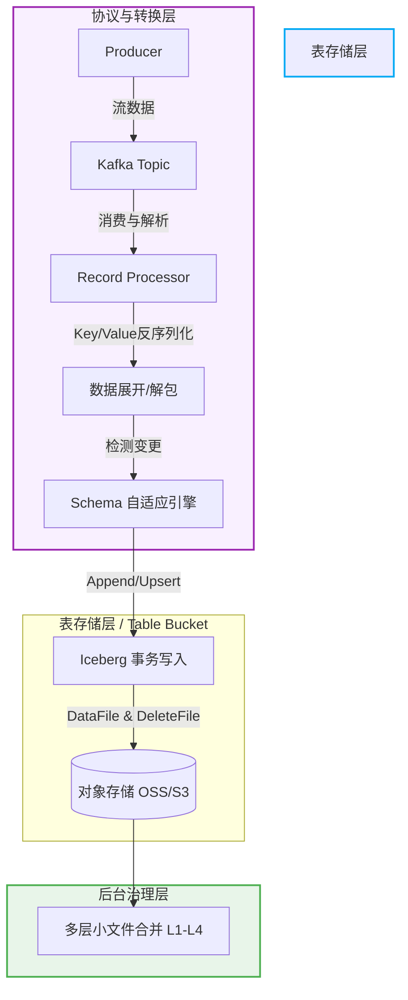

    

        

            

            

            

        

        
bash

    

    

        
ckhuang@macbookpro:~$ 曾经，为了把 Kafka 的数据塞进数据湖，我们不得不维护庞大的 Flink/Spark 集群。不仅链路长、易出错，还面临无休止的小文件治理噩梦。今天，是时候给入湖架构做个“减法”了！ 

    

## 1. 痛点：为什么我们需要“架构减法”？

进入 AI 时代后，业务对数据的诉求发生了剧变：既要支撑模型训练、在线推理的**实时性**，又要满足历史特征回溯、风控审计的**海量存储与多引擎复用**。这就要求数据底座必须具备“既快又稳”的双重能力。

在过去，`Kafka + Flink/Spark Streaming + Iceberg + 对象存储` 是一套经典组合。但随着业务规模扩大，这条重度依赖外部 ETL 的链路暴露出明显的弊端：

- **系统边界过多**：数据从 Kafka 流出，经过流计算引擎清洗，再写入对象存储。链路越长，故障面越大。
- **通用逻辑重复造轮子**：Schema 映射、事务提交、位点管理等基础入湖工作，几乎要在每一个 ETL 任务里重新实现一遍。
- **运维与机器成本飙升**：为了单纯的“数据搬运”，需要常驻流计算集群，性价比极低。

作为一名在分布式和大数据领域摸爬滚打十多年的老兵，我经常看到团队在凌晨为了修复一个因 Schema 变更导致的 Flink 入湖任务而焦头烂额。我们真正需要的，不是更强大的 ETL 工具，而是**将通用入湖能力直接下沉为基础设施**。

## 2. 破局：“零 ETL”到底减掉了什么？

“零 ETL”并非不要数据处理，而是摒弃了传统架构中**不必要的搬运链路**和**冗余的运维复杂度**。

    “好的架构设计，往往不是堆砌组件，而是克制地做减法，让复杂性在底层收敛。” —— CK·黄

当我们将入湖逻辑前移，直接融入消息主链路（如 Kafka Broker 或轻量级协议层），我们减掉的是：
1. **一整套外部流计算集群（Flink/Spark）的机器成本**。
2. **复杂的跨系统调度与容错状态机**。
3. **人工干预 Schema 演进的运维负担**。

## 3. 深度解析：Kafka × Table Bucket 的极简链路

让我们来看看，如果不依赖外部 ETL，一条 Kafka 消息是如何稳稳落入 Iceberg 数据湖的。

这里的核心思想是 **Table Bucket（表存储层）** 概念：它将协议接入、格式转换和表存储内聚，形成端到端的零 ETL 链路。

### 3.1 Schema 自适应演进
业务表结构变化是常态。在这个架构中，系统能自动感知源端与目标 Iceberg 表的 Schema 差异。对于高频的兼容性变更（如 `ADD_FIELD` 新增字段、`PROMOTE_TYPE` 类型向上提升如 int 转 long），引擎会自动刷新批次并应用新 Schema，彻底告别“上游加字段，下游挂任务”的尴尬局面。

### 3.2 终结小文件噩梦的多层治理
实时入湖最怕把对象存储写成“碎文件垃圾场”。我推崇的是 **L1 到 L4 的多层递进式治理机制**：
- **L1 (内存 Buffer)**：在内存中聚合小批次。
- **L2 (微批处理)**：控制单次 Flush 的大小（如 32MB）。
- **L3 (目标文件阈值)**：强制控制落盘文件大小（如 64MB）。
- **L4 (后台 Compaction)**：异步离线合并，完全不占用主链路的计算资源。

### 3.3 原生 CDC 与智能分区
支持将 Insert、Update、Delete 直接映射为 Iceberg 的 Equality Delete 机制。同时配合 `bucket` 或 `truncate` 等智能分区策略，让数据在写入时就具备了极高的查询裁剪效率。

## 4. 总结：流湖一体的新基建

    

        

            

            

            

        

        
bash

    

    

        
ckhuang@macbookpro:~$ AI 时代的数据基础设施，正从“拼装”走向“融合”。Kafka 与 Iceberg 的直接碰撞，不仅仅是省去了几台 Flink 机器，更是让数据的实时可见性、Schema 演进能力和长期治理收敛到了基础设施层面。少即是多，越底层的融合，越能释放业务的生产力！ 

    

如果你也在经历实时数仓架构的选型与重构，不妨认真评估一下这种内建入湖能力的方案。架构的终极奥义，就是把复杂留给系统，把简单交还给用户。
