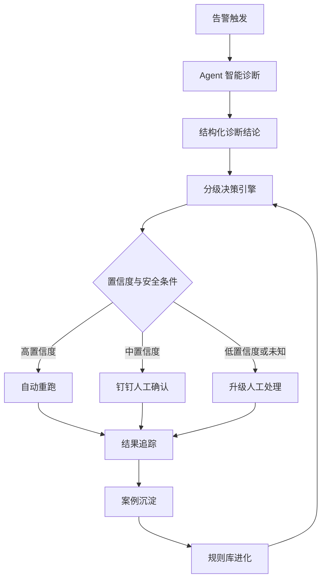
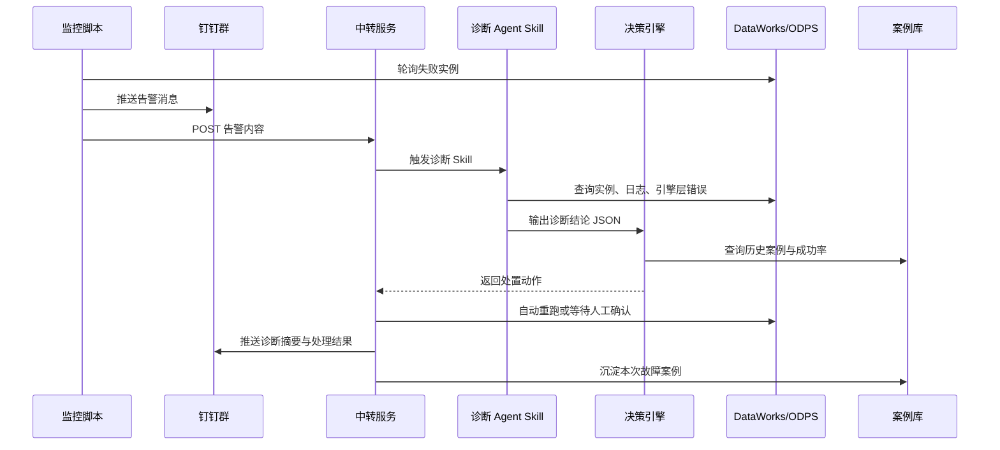
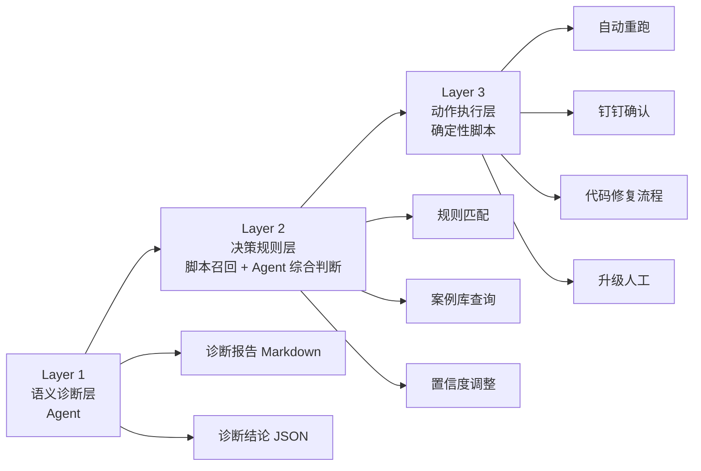
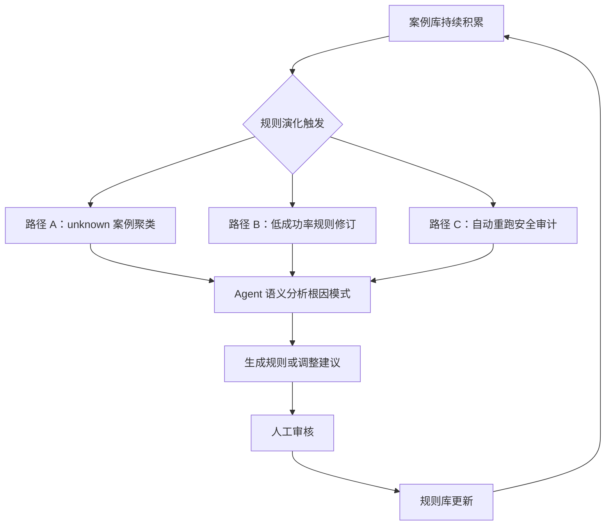

    

        

            

            

            

        

        
bash

    

    

        
ckhuang@macbookpro:~$ 生产级 AI 运维的关键，不是让 Agent 自由发挥，而是给它装上护栏：Agent 负责理解和推理，脚本负责召回和执行，规则库负责边界，案例库负责进化。

    

## 引言：凌晨两点的告警，为什么总是人先崩溃？

很多团队都经历过这样的运维场景：凌晨两点，手机响了，群里只有一条冷冰冰的任务失败告警。没有根因，没有日志摘要，只有实例 ID 和 `Failed` 状态。

接下来是一套熟悉但令人疲惫的手工动作：打开运维中心、搜索实例、翻运行日志、跳到引擎层 Logview、定位错误码、判断是否可重跑、找到外层周期实例、执行重跑，最后在群里回一句“已处理”。

真正让人崩溃的不是单次排查，而是**同类问题一周出现三次，每次都要重新爬起来走一遍流程**。

原文《当 Agent 替你值班：基于 Devix 构建 7x24 自动化运维 Harness Engineering》记录了一套很有代表性的实践：基于 Devix 构建 7x24 自动化运维系统，通过 Harness Engineering 给 AI Agent 建立可控的工程框架，让它能够诊断故障、分级决策、自动处置，并从历史经验中持续进化。

我读完最大的感受是：这篇文章不是在讲“让大模型帮忙看日志”这么简单，而是在讨论一个更本质的问题：**如何把不稳定的 Agent 变成生产环境里可审计、可约束、可演进的工程系统。**

## 一、AI 运维的核心矛盾：日志是文本，故障是业务

现有不少 AI 运维工具已经能做日志解析和错误摘要，比如告诉你某个 DAG 失败、某段 SQL 报错、某个任务资源不足。但这类能力往往停留在“文本理解”层面。

真实运维不只是读日志，而是要理解业务上下文：

- 这个节点处于哪条调度链路？
- 当前失败的是内层子节点，还是外层周期实例？
- 这个错误是否历史上经常通过重跑恢复？
- 最近有没有代码变更？
- 上游依赖是否已经异常？
- 自动重跑是否安全？

原文里有一句判断非常关键：**AI 把日志当文本读，人在把日志当业务读。**

这句话点出了 AI 运维落地的本质门槛。生产环境里的故障诊断不是单纯的 NLP 问题，而是一个包含业务语义、调度拓扑、历史案例、操作权限、安全边界的复杂系统工程。

    “让 Agent 直接操作生产系统，就像让实习生深夜拿着 root 权限救火：不是不能帮忙，而是必须先有流程、边界和审计。” —— CK·黄

## 二、Harness Engineering：不是放大 Agent，而是约束 Agent

原文提出的核心方法论是 **Harness Engineering**。

所谓 Harness，不是再写一堆更复杂的 prompt，而是用工程化框架驾驭 Agent：

1. **Agent 负责语义理解与决策推理**  
   让模型做它擅长的事情：理解日志、归纳错误模式、结合知识库生成诊断结论。

2. **脚本负责数据召回与动作执行**  
   所有数据获取、API 调用、重跑操作、通知推送都由确定性脚本完成，避免 Agent “创造性执行”。

3. **用置信度换自动化程度**  
   高置信度全自动，中等置信度人工确认，低置信度升级人工。

4. **让系统从历史经验中学习**  
   每次诊断和处置都沉淀为案例，再反哺后续规则和决策。

这套思想和分布式系统设计非常像：不相信单点的“聪明”，而是依靠状态机、规则、审计日志、幂等执行和反馈闭环来保证整体可靠性。

可以把整体闭环抽象成下面这张图：

这不是一个“聊天机器人运维系统”，而是一个**以 Agent 为语义中枢、以脚本为执行边界、以规则和案例为记忆系统的运维闭环**。

## 三、为什么选择 Devix：运维 Agent 需要云端常驻

自动化运维有两个硬要求：

- **7x24 小时运行**：不能依赖某个人的本机环境。
- **公网交互能力**：需要承载钉钉回调、交互卡片、状态通知等链路。

原文对比了 Qoder / 悟空与 Devix 的差异：前者更偏本机开发辅助，后者提供云端常驻 Sandbox、公网端点和 Agent 能力，更适合作为运维 Agent 的运行载体。

系统由三个核心组件组成：

| 组件 | 部署方式 | 核心职责 |
|:---|:---|:---|
| 监控脚本 | Devix 独立脚本轮询 | 轮询失败实例，推送告警并触发中转服务 |
| 中转服务 | Python Flask 常驻 Sandbox | 接收告警、触发诊断、承载重跑回调、追踪实例状态 |
| 诊断 Skill | Devix Agent 能力模块 | 解析日志、匹配错误模式、生成结构化诊断报告 |

端到端流程如下：

这条链路的关键不在于“用了 Agent”，而在于**每一步都有明确边界**：谁负责感知，谁负责诊断，谁负责决策，谁负责执行，谁负责追踪，谁负责沉淀。

## 四、诊断层：让 Agent 像资深运维一样排查

原文把诊断能力封装成 Agent Skill。当中转服务收到告警后，通过触发词调用 Skill 执行完整诊断。

这套诊断不是简单地把日志丢给 LLM 猜原因，而是模拟资深运维工程师的排查路径：

1. **实例信息采集**  
   查询失败实例的负责人、优先级、运行时长等上下文。

2. **日志智能解析**  
   自动识别 SQL / Cupid / Mixed 等日志类型，结构化提取错误信息。

3. **深层错误获取**  
   通过 ODPS REST API 获取计算引擎 Task 级别的精确错误。很多关键根因并不在 DataWorks 表层日志里。

4. **关联分析**  
   检查代码变更、运维操作记录、上游依赖状态。

5. **调度链路追溯**  
   自动定位正确的重跑目标：外层周期实例优先于根工作流实例，再到当前实例。

6. **知识库检索**  
   结合团队领域知识库，理解节点依赖、配置语义和业务链路。

诊断输出也分为两类：

| 输出 | 格式 | 受众 | 用途 |
|:---|:---|:---|:---|
| 诊断报告 | Markdown | 人 | 完整故障分析、日志证据、修复建议、归档复盘 |
| 诊断结论 | JSON | 决策引擎 | 错误模式、环境上下文、置信度、修复提案 |

这里非常重要的一点是：**给人看的报告和给机器用的结论必须分开。**

人需要上下文、证据和解释；机器需要结构化字段、置信度和可匹配的错误模式。如果只输出自然语言报告，后续决策就很难稳定自动化。

## 五、决策层：为什么不能让 Agent 一条龙干到底？

很多人做 AI 运维时会自然想到：既然 Agent 能诊断，那就让它直接决定是否重跑、是否修代码、是否升级人工。

原文没有这么做，原因很现实：

- **决策不可控**：同一个错误模式，prompt 略有差异可能输出不同动作。
- **策略难量化**：比如“历史重跑成功率超过 80% 才自动重跑”这类条件，更适合脚本和规则表达。
- **经验难沉淀**：纯 Agent 决策很难从历史案例中稳定学习。

因此系统拆成三层流水线：

这个设计可以概括为：

> **脚本召回 → 回流 Agent → Agent 决策 → 脚本执行。**

Agent 被夹在两层确定性脚本中间，既能发挥语义理解能力，又不会越过生产系统的安全边界。

## 六、五种动作：用置信度换自动化程度

原文将决策动作定义为五类，按照自动化程度从高到低排列：

| 动作 | 含义 | 适用场景 |
|:---|:---|:---|
| 自动重跑 `rerun` | 系统直接执行 | 瞬时基础设施故障、历史成功率高、无代码变更 |
| 按钮重跑 `rerun_with_approval` | 钉钉确认后执行 | 首次出现的可恢复错误，或置信度不足 |
| 代码修复 `fix_code` | 生成修复提案，确认后执行 | 明确诊断为代码问题且有可行方案 |
| 排查建议 `investigate` | 提供方向和备用动作 | 数据量异常、上游失败等需人工判断 |
| 升级人工 `escalate` | 通知负责人处理 | 权限问题、未知错误、风险不可控 |

这个设计背后的方法论很朴素，但非常重要：**自动化不是开关，而是连续光谱。**

新故障没有历史样本时，系统保守处理；同类故障被多次验证后，置信度逐渐提高，才进入更自动化的分支。系统不是一开始就“相信 Agent”，而是在案例沉淀中逐步建立信任。

## 七、规则库与案例库：让系统越用越聪明

原文中规则库包含 15 条精确规则和 2 条兜底规则，覆盖基础设施、UDF、SQL、数据、权限、资源等常见故障类型。

每条规则不是简单的 if-else，而是包含：

- 决策匹配条件：如何匹配错误模式；
- 决策树：如何选择处理动作；
- 诊断信息：帮助 Agent 识别错误模式；
- 自动重跑配置：定义安全边界；
- 元数据：支持规则演化。

更有价值的是规则自进化机制，它包含三条路径：

这里最值得借鉴的是 `resolution` 数据的设计。每个案例不仅记录错误类型，还记录解决路径：重跑次数、触发方式、是否代码部署、最终是否恢复。

这些数据直接影响后续决策：

- 纯重跑恢复占比高 → 可以添加自动重跑分支；
- 代码修复占比高 → 应进入修复提案流程；
- 样本不足 → 保守升级人工；
- 自动重跑失败率过高 → 降级自动化权限。

这就是我一直强调的：**Agent 系统的“记忆”不应该只存在对话上下文里，而应该沉淀为可查询、可统计、可审计的数据资产。**

## 八、安全防护：生产环境里，护栏比能力更重要

Agent 做运维，安全性是底线。原文设计了三道防线：

### 8.1 自动重跑约束

自动重跑必须同时满足：

- 决策树命中自动重跑分支；
- 置信度足够高；
- 历史成功率足够高；
- 近期无代码变更；
- 规则明确标记为“安全可重跑”。

### 8.2 代码修复三层防护

代码修复风险最高，因此需要：

1. 诊断层生成完整修复建议；
2. 决策层命中 `fix_code` 分支；
3. 执行层通过钉钉按钮人工确认。

### 8.3 未知故障兜底

任何未被规则覆盖、缺乏历史依据或风险不可控的故障，一律升级人工。

这套设计体现了成熟工程系统的基本原则：**宁可少自动化一点，也不能在生产环境里失控。**

## 九、我的架构点评：Agent 运维的正确姿势

从分布式架构和大数据平台运维经验看，这篇实践真正有价值的不是某个工具或某段脚本，而是它形成了一套可复用的 AI 运维架构范式。

### 9.1 Agent 不应该直接拥有最终执行权

Agent 的强项是语义理解、归纳和推理，但它不适合作为最终执行器。生产操作必须由确定性脚本、权限系统和审计链路承接。

### 9.2 决策必须结构化

自然语言报告适合人读，不适合机器决策。要让 AI 运维可持续演进，必须把错误模式、置信度、环境上下文、修复建议结构化。

### 9.3 自动化要渐进式放开

不要一开始就追求“全自动无人值守”。合理路径应该是：先辅助诊断，再人工确认重跑，再高置信自动重跑，最后才考虑自动修复。

### 9.4 案例库比 prompt 更重要

Prompt 可以指导一次行为，案例库才能积累组织经验。真正的 AIOps，不是让 Agent 每次重新思考，而是让它站在过去所有故障处理经验之上做判断。

## 结语：Harness 的本质，是把 Agent 变成工程系统的一部分

原文最后有一句总结非常准确：**Harness Engineering 的本质，不是让 Agent 更聪明，而是让 Agent 更可控。**

我非常认同。

模型能力会持续进步，但生产系统不会因为模型更聪明就自动变安全。真正决定 Agent 能否进入生产环境的，是围绕它构建的工程约束：规则库、决策树、案例库、安全防护、人工确认、审计归档和结果追踪。

    

        

            

            

            

        

        
bash

    

    

        
ckhuang@macbookpro:~$ 未来的 AIOps 不会是“Agent 替代运维工程师”，而是“运维工程师把经验工程化成 Harness，让 Agent 在边界内放大团队能力”。这才是 AI Agent 进入生产环境的正确姿势。

    

参考原文：[当 Agent 替你值班：基于 Devix 构建 7x24 自动化运维 Harness Engineering](https://mp.weixin.qq.com/s/_cVR4O3Gg3XcxYmkO28K8Q)
