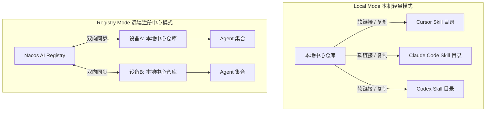
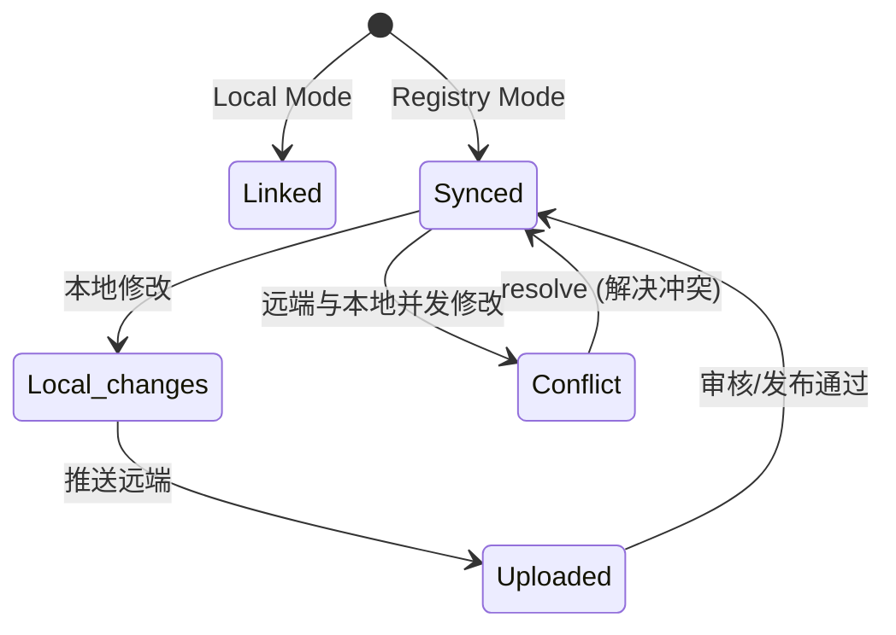

    

        

            

            

            

        

        
bash

    

    

        
ckhuang@macbookpro:~$ 当你同时开着 Cursor、Claude Code 和 Codex，为了改一句 Prompt 要在三个目录里来回复制时，你就知道，是时候停下来重构你的 AI 资产管理流了。 

    

## 1. 认知缺口：多 Agent 时代的“最后一公里”痛点

当前 AI Coding 的发展正处在百花齐放的时代，Cursor、Claude Code、Codex 轮番成为阶段性首选。再加上额度限制、响应延迟等现实问题，开发者早就习惯了“鸡蛋不放在一个篮子里”。同时使用多个 AI Agent 干活，一边试用新工具，一边防着老工具掉链子，已经成为这个时代的开发新常态。

然而，**工具可以无缝切换，Skill（Agent 技能/Prompt）却无法自动跟随**。

在 Codex 中更新过的 Skill，Claude Code 里仍是旧版；Cursor 目录下还可能并存一份同名但内容迥异的副本。起初手动复制尚可忍受，时间一长便陷入混乱：哪份才是最新？该用谁覆盖谁？接入新工具时是否还要重复搬运？

这种碎片化的版本管理不仅降低工作效率，更在反复确认中不断消耗我们的心力。开源社区其实也有尝试，比如用 Git submodule 或者 Syncthing，但前者太重（改个 Prompt 还要 commit/push），后者不懂 Skill 语义（容易产生双向覆盖灾难）。

当你的多款 Agent 同时开启，你需要的是**改一处就全部生效、且随时知道哪份是最新的**——这个“最后一公里”的闭环，Nacos Skill Sync 给出了一个相当优雅的解法。

## 2. 架构破局：Nacos Skill Sync 的双模设计

Nacos Skill Sync 的核心思想非常直接：**把 Skill 收敛到一个中心仓库，再按需分发给各个 Agent。**

从分布式架构的视角来看，这本质上是一个配置中心与最终一致性的问题。Nacos Skill Sync 提供了两种模式来适配不同的演进阶段：

### ▍ Local mode：本机 Skill 的“单一事实来源”
Local mode 非常轻量，不需要接入远端服务，仅在本地构建中心仓库。它默认通过**软链接**（Symlink）的方式，让各 Agent 的目录指向中心仓库。
- **适合谁**：只想先把本机多个 Agent 的 Skill 统一起来，不想折腾部署的开发者。
- **核心价值**：改一处，全局生效。自动发现 Cursor、Claude、Codex 等主流工具的配置目录，一键收拢。

### ▍ Registry mode：远端的统一资产管理
当你手上有几十个 Skill 在持续迭代，或者团队里需要共享同一套工作流规范时，Registry mode 就派上用场了。
- **适合谁**：需要系统管理 Skill 库，或有团队协作、跨设备同步需求的场景。
- **核心价值**：将 Skill 视作“微服务配置”存入 Nacos AI Registry。支持可视化管理、版本治理（草稿/发布/回滚）、跨设备同步以及双向流通。

    “多 Agent 并行会越来越常见。我们真正需要管理的不是用哪个 Agent，而是这些 Agent 共同依赖的核心逻辑与认知——让 Skill 有一份可信来源。” —— CK·黄

## 3. 实战推演：从单兵作战到团队协同

光谈架构设计有点虚，我们来看看具体怎么落地。

### 案例一：个人工作流沉淀（Local mode）
很多人每天在多个 Agent 里处理不同任务，周五写周报时总要翻聊天记录。你可以将这套习惯沉淀为一个 `biweekly-work-report` Skill。
在 Local mode 下，你在 Codex 里调整了周报的字段模板，因为软链接的存在，Claude Code 和 Cursor 看到的立刻就是更新后的版本。不需要服务端，隐私数据不出本机，完美解决个人的效率痛点。

### 案例二：团队文档规范统一（Registry mode）
团队开发中，接口文档、技术方案的格式最容易走样。靠口头提醒或复制 Wiki 模板，总有人用错版本。
通过 Registry mode，团队可以将技术方案结构、评审清单整理成一个 `doc-format` Skill 放入 Nacos。公司电脑、家里电脑以及新员工的设备，只需一键同步，所有人生成的文档都会遵循最新、最标准的那份规范。

## 4. 深入思考：运维视角的最佳实践

作为技术老兵，我非常看重工具的“可观测性”。Nacos Skill Sync 提供了一套极简的状态机来帮你确认当前环境是否健康：

- **Synced / Linked**：一切正常，无需介入。
- **Local changes**：本地有改动，等待上传（或后台 daemon 自动上传）。
- **Conflict**：本地和远端都改了。这里的策略很保守，系统绝不会替你做决定，需要你通过 `resolve` 命令显式指定以谁为准。

这种保守的冲突解决策略，与我们在分布式系统设计中处理数据冲突的原则如出一辙：**涉及到资产覆盖的高危操作，必须将控制权交还给用户**。

## 总结

AI Coding 工具的竞争远未结束，今天我们用 Cursor，明天可能就是 Claude Code 的下一代产品。工具会不断迭代，但你沉淀的 Prompt、规范和工作流，才是真正属于你的“AI 资产”。

Nacos Skill Sync 的出现，恰好填补了这块空白。无论你选择从 Local mode 轻装上阵，还是直接用 Registry mode 打造团队资产库，目标只有一个：**Agent 可以换，Skill 不能散。**

    

        

            

            

            

        

        
bash

    

    

        
ckhuang@macbookpro:~$ 把易变的任务交给 AI，把稳定的资产攥在自己手里。这才是拥抱多 Agent 时代的正确姿势。 

    

