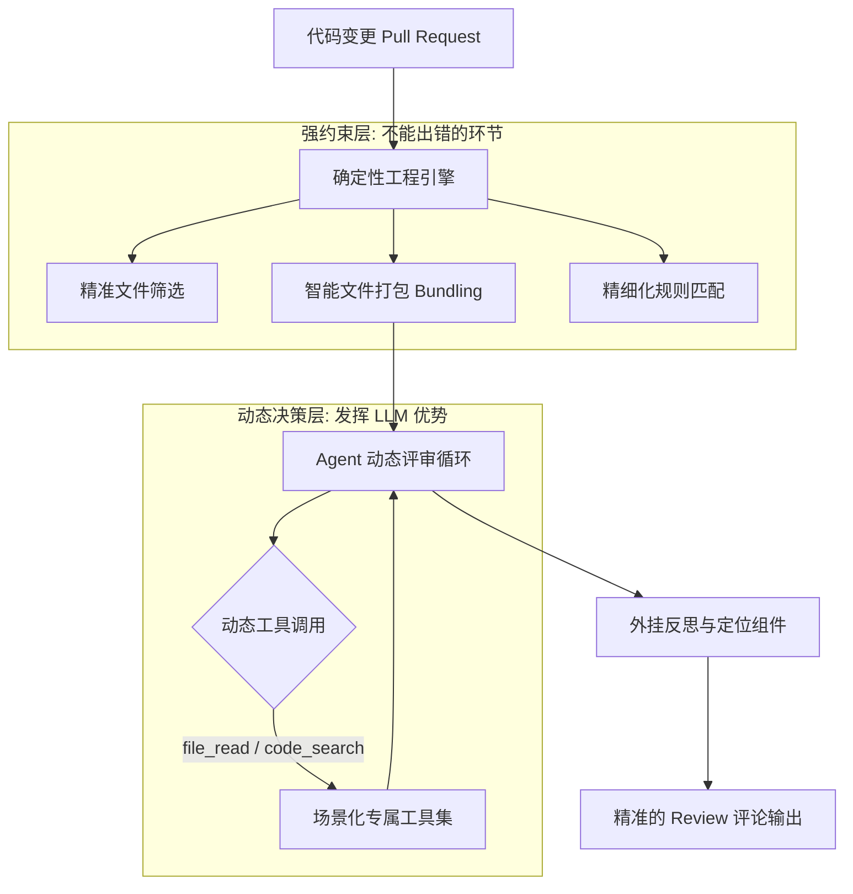

    

        

            

            

            

        

        
bash

    

    

        
ckhuang@macbookpro:~$ AI 每天生成的代码动辄几万行，而人工 Review 几百行就头昏眼花。通用 Agent 评审代码总是漏报、错位、胡说八道？因为纯语言驱动的架构，根本管不住大模型的“天马行空”。

    

## 1. 痛点切入 —— 当 AI 产能超越人工 Review 上限

AI 写代码的能力突飞猛进，但随之而来的是研发效率的新瓶颈：**代码评审（Code Review）**。

你是不是也尝试过用 Claude Code 或其他通用 Agent + Skills 的方案来做代码评审？如果你深度用过，大概率会被以下三个问题折磨过：

1. **覆盖不全（偷懒）**：变更稍微大一点，Agent 就开始选择性忽略，导致严重的遗漏。
2. **位置漂移（对不齐）**：指出的问题很犀利，但行号完全是错的，导致自动修复工具根本无从下手。
3. **效果玄学（不稳定）**：稍微改动一点 Prompt，评审结果就天差地别。

为什么会这样？结合我在分布式系统和 AI Agent 领域的实战经验，我经常强调一个观点：**纯自然语言驱动的架构，缺乏对复杂业务流程的强约束。** 大模型是优秀的“大脑”，但它天然缺乏结构化的“纪律性”。

## 2. 破局之道 —— 确定性工程 × Agent 混合驱动

近期，阿里重磅开源了其内部打磨两年的 AI 评审助手 —— **Open Code Review**。这款在阿里内部服务了 2 万多名开发者、累计执行 370 万次真实评审任务的工具，给出了一份堪称教科书级别的解法：将**确定性工程**与 **Agent** 结合，各司其职。

它的核心设计哲学非常明确：**把最贵的资源用在最需要的地方，让工程代码接管确定性任务。**

- **工程逻辑管纪律**：文件筛选、智能打包（比如把 `message_en.properties` 和 `zh.properties` 强绑定在一个评审单元中）、规则匹配、行号定位等，全部由系统工程代码实现。不仅 0 Token 消耗，而且结果绝对稳定。
- **Agent 管推理**：LLM 专注做语义理解，结合场景化专属工具集（从海量真实 traces 中蒸馏而来，而非通用大杂烩），实现层层递进的推理和深度审查。

## 3. 深度剖析 —— 如何解决“漏报”与“误报”？

在实际的工程落地中，漏报（假阴性）和误报（假阳性）是 AI 辅助工具的生死线。误报太多会导致“告警疲劳”，大家最后都会选择性无视真实的风险。

Open Code Review 是如何解决的？

**防漏报：Agent 化的动态上下文召回**  
面对复杂变更，静态给定的上下文根本不够。OCR 为每个子任务赋予了最高 20 轮的独立 Agent 工具循环。比如，当它看到一个可能返回 `null` 的方法调用时，它会主动调用 `code_search` 工具去全库检索该方法的历史调用方式，像资深架构师一样做交叉验证。结合大文件专属的 **Plan 阶段**，确保复杂逻辑不被遗漏。

**防误报：反思模型与精细化规则**  
阿里内部甚至利用真实反馈数据（采纳、忽略）训练了专属的**反思模型（Reflection Model）**作为前置过滤器，基模的误报拦截率从 30% 大幅提升到 52% 以上。同时，通过四层递进式规则机制（CLI 参数 -> 项目级 -> 用户级 -> 系统默认），解决了“什么算问题，谁说了算”的团队主观性难题。

    “试图用一套规则满足所有用户是不可能的。规则存在显著的'边际效益递减'——写得越多，指令跟随越差。工程设计的优雅，在于懂得何时让 LLM 闭嘴。” —— CK·黄

## 4. 成本与收益 —— 真实的工程权衡

在做架构设计和选型时，我们不能只盯着评测榜单上的 F1 分数，更要看底层的 **Token 消耗**。

根据开源集的评测，Claude Code 的召回率极高（适合安全审计等容错率极低的场景），但 Token 消耗动辄 2M-5M，耗时也更长。这在企业级规模化部署中，算起经济账来几乎是灾难性的。

OCR 采用了极致的内存压缩和预算控制策略：
- **分治策略**：将大规模代码变更拆分为独立的上下文进行并发评审，成本呈现线性增长，而非指数级爆炸。
- **双阈值内存压缩**：历史对话上下文达到 MaxTokens 的 60% 时触发异步后台压缩，达到 80% 时强制同步压缩，采用“冻结区、压缩区、活跃区”三区模型，保留推理连续性的同时防止上下文撑爆。
- **大文件预过滤与工具限流**：单次 `file_read` 最多返回 500 行，直接跳过超大 Diff。

这才是真正的工业级落地思维：**每一步只给模型看它需要的信息，尽早丢弃不需要的内容，严格限制输出边界。**

## 总结

    

        

            

            

            

        

        
bash

    

    

        
ckhuang@macbookpro:~$ AI 写代码与 AI 审代码，是两种截然不同的能力。即便是最强的编码 Agent，也需要专业的评审 Agent 来兜底。大模型不是万能药，扎实的工程化思维，才是大模型走向规模化落地的最后一块拼图。

    

