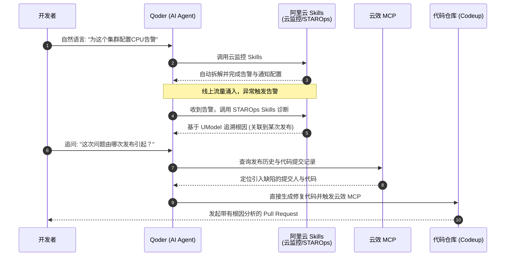

    

        

            

            

            

        

        
bash

    

    

        
ckhuang@macbookpro:~$ 过去我们半夜被电话叫醒，盯着满屏红色的告警查日志、看链路，在研发与运维之间反复扯皮；现在，让AI Agent自己去查监控、找根因甚至提PR。阿里云发布的Agentic Skills，标志着运维范式正在被彻底重构。 

    

如果你在互联网大厂或规模化创业公司待过，对这样的场景一定不陌生：半夜两点，核心服务告警。SRE 睡眼惺忪地爬起来，打开大盘看 CPU 和内存，接着去 ELK 里捞日志，去链路追踪系统里看 TraceID，最后发现是某个开发下午提交的一段看似人畜无害的代码引发了内存泄漏。从告警到定位，再到拉人回滚，整个过程短则半小时，长则几小时。

这种“人拉肩扛”的运维模式，痛点非常明显：**认知成本极高，跨域数据割裂**。

6 月 25 日，阿里云发布了以 Agent 为操作主体的 **Agentic Skills**，首批上线了云监控 Skills 和 STAROps Skills。这不仅仅是给现有的监控系统套个壳，而是**从根本上将可观测性从“Human-Friendly（人类友好）”转向了“Agent-Friendly（智能体友好）”**。读完本文，你将明白为什么这是迈向 AI Native DevOps 的关键一步。

## 一、打破僵局：为什么我们需要 Agentic Skills？

在传统的 DevOps 体系中，运维工具是为了**人**设计的：炫酷的大屏、复杂的聚合查询 DSL、层层嵌套的菜单。但当我们试图让大模型（LLM）去接管这些工具时，往往会水土不服。大模型看不懂复杂的 Dashboard，也很难一次性写对晦涩的告警配置 JSON。

阿里云给出的解法是：**封装标准化、Agent友好的 Skills**。

通过将云监控 CMS、日志服务 SLS、应用实时监控服务 ARMS、全域智能运维平台 STAROps 的核心能力封装为 Agentic Skills，大模型客户端（如 Qoder）只需要输出简单的自然语言指令，Agent 就能在背后通过 Skills 完成调用。

更硬核的是，这些 Skills 内置了严格的 **参数 Schema 与多重校验逻辑**，这就相当于给大模型戴上了“护栏”，确保 Agent 生成的配置项字段合法，从源头上避免了“大模型幻觉”导致的误配灾难。

    “不要试图给大模型看人类的仪表盘，真正的AI运维需要的是Agent友好的Schema与数字孪生语义。” —— CK·黄

## 二、UModel 数字孪生：跨越“研发”与“运维”的鸿沟

在实际踩坑中，我们经常遇到一个问题：**监控只知道机器出了问题，但不知道是哪行代码搞坏的**。这是因为运维域数据（指标、日志、事件）和研发域数据（代码提交、流水线、镜像发布）往往是物理隔离的。

这次发布的 STAROps 引入了一个极其关键的设计：**UModel 运维数字孪生**。

它对采集到的全栈数据（包括移动端、小程序、云产品、大模型等）进行语义化建模，将 IT 资源和业务资源本体化，彻底打通了跨域对象。这意味着，当一个 CPU 飙高的告警触发时，STAROps 可以基于大模型进行根因推理，不仅告诉你“Pod 出了问题”，更能**沿着 UModel 的关系链路，一路追溯到具体的 Deployment 变更，甚至精准定位到是哪次流水线发布、哪位开发者提交了哪行代码**。

## 三、实战演练：AI Native DevOps 的全链路闭环

让我们来看看在 Qoder 这个统一 Agent 客户端入口中，这套体系是如何运转的。这不仅仅是一个理论模型，而是真正落地的工程实践。

我画了一张时序图，展示这个“编码 → 发布 → 告警 → 诊断 → 修复”的闭环：

在这个流程中，我们看到：
1. **零门槛配置**：告警配置这种高频、重复的枯燥劳动，直接被一句自然语言取代。
2. **多轮追问诊断**：线上出问题时，你可以像问高级 SRE 一样问 Agent：“问题是哪次发布引起的？”，大模型结合 STAROps 给出的结论不再是玄学，而是有数据支撑的链路闭环。
3. **自动化修复**：在查明根因后，Agent 甚至可以直接生成修复代码，通过云效发起带有问题背景和修复说明的 PR。开发者只需要做最后的 Review。

## 四、写在最后：拥抱你的第一个 AI SRE 同事

从“人找数据”到“数据找人”，再到现在的“Agent处理数据并修复系统”，可观测性的演进已经进入了深水区。

这套 Agentic Skills 体系的价值在于，它为企业提供了一条**从存量监控体系平滑过渡到 AI 原生运维的务实路径**。你不需要推翻重来，只需要在现有的工作流中嵌入这些 Skills，就能极大地释放研发和运维团队的生产力。

面对滚滚而来的 AI 浪潮，抗拒是没有意义的。或许我们很快就会习惯，在钉钉或飞书群里@一个名为 SRE-Agent 的机器人，看着它熟练地排查问题并甩出一个修复代码的 PR 链接。

运维的终局不是没有运维，而是让机器懂机器。准备好迎接你的第一个 AI SRE 同事了吗？

    

        

            

            

            

        

        
bash

    

    

        
ckhuang@macbookpro:~$ exit 

        
Session closed.

    

