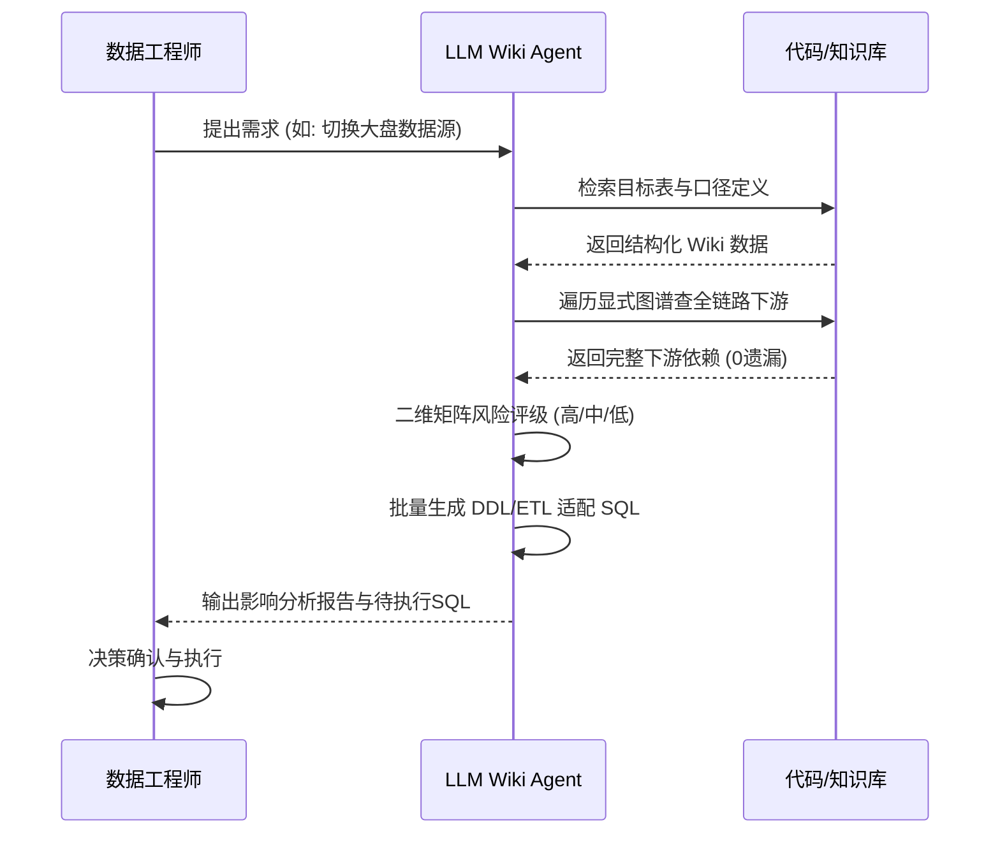

<div style="background-color: #1e1e1e; color: #00ff00; font-family: 'Courier New', Courier, monospace; border-radius: 8px; padding: 20px; box-shadow: 0 10px 30px rgba(0,0,0,0.3); margin-bottom: 30px; margin-top: 20px; position: relative; overflow: hidden;">
    <div style="display: flex; align-items: center; margin-bottom: 15px; padding-bottom: 10px; border-bottom: 1px solid #333;">
        <div style="display: flex; gap: 8px; margin-right: 15px;">
            <div style="width: 12px; height: 12px; border-radius: 50%; background-color: #ff5f56;"></div>
            <div style="width: 12px; height: 12px; border-radius: 50%; background-color: #ffbd2e;"></div>
            <div style="width: 12px; height: 12px; border-radius: 50%; background-color: #27c93f;"></div>
        </div>
        <div style="color: #ccc; font-size: 0.9em;">bash</div>
    </div>
    <div>
        <p style="margin: 5px 0; line-height: 1.6;"><span style="color: #008AFF; font-weight: bold;">ckhuang@macbookpro:~$</span> 直接套 RAG 就能搞定企业知识库？别天真了。垃圾进，垃圾出，散落且矛盾的原始文档，只会让 AI 变成一本正经胡说八道的“懂王”。我们需要的是给大模型加一道“编译器”。 <span style="display: inline-block; width: 8px; height: 16px; background-color: #00ff00; vertical-align: middle;"></span></p>
    </div>
</div>

在企业数字化转型的深水区，我们常常遇到这样一个痛点：**想用 AI Agent 来提效数据开发或业务排查，却发现 AI 根本“喂不进去”知识。** 

为什么？因为在真实的数据团队中，知识是高度熵增的。口径定义散落在钉钉文档里，表结构藏在 DDL 里，而真实的过滤条件又硬编码在调度任务的 SQL 中。更要命的是，这些知识经常是相互矛盾的。当你问 AI 一个业务指标怎么算时，如果直接用 RAG（检索增强生成）去暴力搜索，结果往往是灾难性的。

今天，我们就来聊聊为什么 RAG 解决不了知识腐化的问题，以及如何通过构建 **LLM Wiki（大模型编译器）** 来真正沉淀 AI 时代的知识底座。读完本文，你将获得一套经过真实业务验证的 AI 知识库架构方法论。

---

### 一、RAG 的陷阱：检索治不好知识的“慢性病”

很多人对 RAG 寄予厚望，认为只要把所有文档灌进向量数据库，AI 就能无所不知。但这是典型的**战术上的勤奋掩盖了战略上的懒惰**。

RAG 的核心模式是：`chunk 召回 -> 上下文拼接 -> 模型生成`。它本质上只是多了一层向量索引，**但完全没有改变原始材料本身的状态**。

如果你的原始文档里，三份报告对同一个指标有三种不同的定义，RAG 召回后，AI 依然会懵圈。知识的散落、矛盾、过期问题一个没解决，RAG 只是把“人找不到文档”，变成了“AI 找到了文档但依然答不准”。

<div style="text-align: center; font-size: 1.2em; font-style: italic; color: #008AFF; margin: 40px 0 20px; padding: 20px; border-top: 1px dashed #ccc; border-bottom: 1px dashed #ccc;">
    “RAG 解决的是运行时的‘精准召回’，但解决不了知识本身的矛盾。我们需要在检索前加一道‘编译’。” —— CK·黄
</div>

---

### 二、破局之道：引入 LLM 编译器机制

问题出在知识本身，不在检索。我们需要在知识入库之前，增加一道**“编译过程”**，把散落的源材料加工为可被 AI 直接消费的结构化知识。

我们可以把这个过程类比为传统代码的编译流程。LLM Wiki 不是简单地让大模型写一篇总结，而是建立一条流水线：**提取 → 生成 → 归类 → 聚合 → 链接 → 验证**。

为了更直观地理解，我们来看看 LLM Wiki 和纯 RAG 架构在定位上的核心差异：

```mermaid
flowchart LR
    subgraph 编译时 (LLM Wiki 构建)
        A[散落材料\nDDL/代码/钉钉文档] -->|LLM 提炼与仲裁| B(结构化 Wiki 页面)
        B --> C(显式知识图谱\n血缘/归属/引用)
    end
    
    subgraph 运行时 (RAG 检索)
        C --> D{Agent 查询引擎}
        D -->|精准硬过滤 + 语义匹配| E[高准确率业务回答]
    end
    
    style A fill:#f9f9f9,stroke:#333,stroke-width:1px
    style C fill:#e1f5fe,stroke:#008AFF,stroke-width:2px
    style E fill:#e8f5e9,stroke:#008AFF,stroke-width:2px
```

在这套架构下：
1. **代码即真相**：当文档与实际代码冲突时，编译器强制以线上运行的任务代码为准进行仲裁。
2. **结构可解析**：每个生成的 Wiki 页面都是 `Frontmatter (YAML) + 正文` 的结构，Agent 可以直接读取 YAML 中的血缘关系，避免反复依赖 LLM 去解析长文本。
3. **关系可遍历**：知识不仅有内容，还有边（血缘、归属、消费）。修改一张表，瞬间能计算出下游影响。

---

### 三、实战演练：让 AI 接管数据模型迭代

让我们来看一个实际的业务场景。在数仓的日常工作中，数据模型迭代是高频且高危的操作。过去，一次迭代需要人工 grep 查代码、看血缘、凭经验评估风险，耗时极长。

引入 LLM Wiki 后，我们将这个过程重塑为以下自动化流水线：



**实际效果是质变的**：
- **血缘查询**从人工递归的 30 分钟，缩短到自动化遍历的 2 分钟。
- **下游表遗漏率**从 20% 降到了 0%（强制图谱完整性校验）。
- **SQL 生成时间**从半天缩短到 10 分钟。
工程师彻底从“查代码、写 SQL”的机械劳动中解放出来，将精力聚焦在最后的“决策确认”上。

---

### 四、系统架构：如何落地这套知识底座？

要支撑上述能力，LLM Wiki 在底层需要一套严谨的工程架构设计。我们可以将其与数据库系统进行类比：

- **存储引擎 (多级文件系统)**：通过 `pre/`、`raw/`、`wiki/` 等目录管理知识的生命周期，确保只有经过清洗的 `ready` 数据才能进入编译流水线。
- **Schema 即契约**：定义统一的 YAML 模板。生成器按契约写，检索器按契约读，打破不同 Agent 工具之间的信息壁垒。
- **执行引擎 (Agent 编排)**：调度计算任务，支持断点续传。一旦构建中断，可以幂等重跑，已有正确产物直接跳过。

通过这种方式，我们建立的不再是一个普通的“文档库”，而是一个**结构化、有约束、可验证的知识资产系统**。

---

<div style="background-color: #1e1e1e; color: #00ff00; font-family: 'Courier New', Courier, monospace; border-radius: 8px; padding: 20px; box-shadow: 0 10px 30px rgba(0,0,0,0.3); margin-bottom: 30px; margin-top: 20px; position: relative; overflow: hidden;">
    <div style="display: flex; align-items: center; margin-bottom: 15px; padding-bottom: 10px; border-bottom: 1px solid #333;">
        <div style="display: flex; gap: 8px; margin-right: 15px;">
            <div style="width: 12px; height: 12px; border-radius: 50%; background-color: #ff5f56;"></div>
            <div style="width: 12px; height: 12px; border-radius: 50%; background-color: #ffbd2e;"></div>
            <div style="width: 12px; height: 12px; border-radius: 50%; background-color: #27c93f;"></div>
        </div>
        <div style="color: #ccc; font-size: 0.9em;">bash</div>
    </div>
    <div>
        <p style="margin: 5px 0; line-height: 1.6;"><span style="color: #008AFF; font-weight: bold;">ckhuang@macbookpro:~$</span> 总结一下：Wiki 提供高质量的高纯度语料，RAG 在运行时提供精准召回。两者组合，才是 AI 时代完整的检索栈。不要妄想用花哨的 Prompt 掩盖数据的贫瘠，去建好你的知识编译器吧！ <span style="display: inline-block; width: 8px; height: 16px; background-color: #00ff00; vertical-align: middle;"></span></p>
    </div>
</div>
