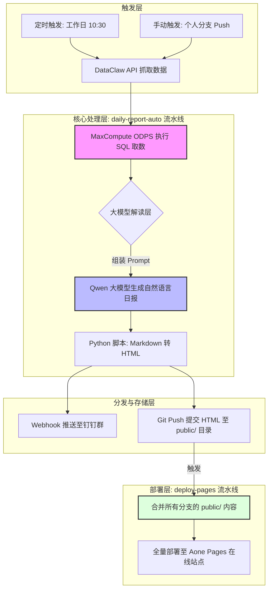

    

        

            

            

            

        

        
bash

    

    

        
ckhuang@macbookpro:~$ 未来的技术壁垒不在于你会不会写代码，而在于你懂不懂得利用 AI 将业务逻辑工程化。当运营同学开始熟练运用 CI/CD 时，这才是真正的“技术平权”。 

    

## 一、引言：被困在“取数-制表”循环里的运营人

在日常的业务团队中，不论是高德打车还是其他 O2O 业务，运营同学们常常会陷入一个经典的泥潭：**数据日报**。

以前，一份覆盖大盘数据、商户异动、分时应答等诸多模块的日报，往往需要经历以下“手工流水线”：
1. 打开 ODPS 进行 SQL 取数。
2. 将数据复制到 Excel 里整理清洗。
3. 结合业务经验，手动写分析解读。
4. 排版成文档发送到钉钉群，并手动存档。

这个过程每天至少消耗 1 小时，且分析质量高度依赖当事人的精神状态和细心程度。这种高度重复的“搬砖”工作，难道不应该被机器取代吗？

随着大模型（如 Qwen）和自动化工具的普及，我们迎来了改变的契机。本文将以一位非技术出身的运营同学的真实实战记录为切入点，深度拆解如何从 0 到 1 搭建一套结合**大数据分析（ODPS）**与 **AI Agent（Qwen大模型）** 的 CI 自动化流水线。我们不仅要看“怎么做”，更要从架构和工程思维的角度，剖析“为什么这么做”。

## 二、架构解析：7 步打通的 AI 自动化报表流水线

对于一个没有接触过 CI/CD、Git 乃至代码库的运营同学来说，最直接的自动化方案可能是本地跑个 Python 脚本，但这存在着单点故障（电脑关机就停摆）的致命缺陷。而最终选择 **Aone CI 流水线**，看中的正是其**云端运行、日志可查、定时触发**的企业级特性。

经过不断踩坑与迭代，最终成型的自动化日报流水线架构如下：

### 深度洞见：SQL 保下限，AI 提上限
在这套架构中，有一个极其精妙且必须遵守的设计原则：**数据准确性由 SQL 保证，大模型只负责自然语言解读。**
作为大数据与 AI 领域的从业者，我非常推崇这种模式。大模型存在不可避免的“幻觉（Hallucination）”，如果让 AI 直接去查库或计算核心指标，很容易出现灾难性的业务误导。通过 MaxCompute 固化 SQL 取数逻辑，确保了底层数据的 100% 准确；而 Qwen 模型则发挥其归纳总结的特长，将冰冷的数字转化为有温度的业务解读。

## 三、踩坑与破局：流水线背后的分布式系统思维

从单机脚本走向 CI/CD，本质上是经历了一次从“单机思维”到“分布式与工程化思维”的洗礼。在这个过程中，有几个经典的技术坑点值得深入探讨。

### 1. 并发覆盖问题：状态同步的典型痛点
**现象**：大家都在个人分支生成日报 HTML 并推送到 `public/` 目录。当部署流水线触发时，Aone Pages 站点进行的是**全量替换**。这就导致了后一个触发部署的分支，直接覆盖掉了前一个分支的内容，导致日报“离奇失踪”。

**工程视角分析**：这在分布式系统中是一个典型的**状态覆盖问题**。多个并发写入者（各个分支）试图修改同一个全局状态（在线站点），且使用的是“覆盖”而非“追加”操作。

**解决方案**：在部署步骤（deploy-pages.yaml）前，强行增加一个“合并环节”。每次部署前，拉取并合并所有远程分支的 `public/` 目录内容，然后再做全量部署。这就像是在分布式系统引入了一个聚合器（Aggregator），保证了最终状态的完整性。

### 2. 环境隔离：为什么拆分成两条流水线？
**现象**：最初试图在一条流水线中完成“生成日报”和“站点部署”，但发现生成日报需要 `python:3.11` 镜像，而站点部署组件 `deploy-pages` 需要 `jq` 等工具，且在 Python 容器中无法通过流水线补装。

**工程视角分析**：CI 流水线中的 `uses:` 组件通常运行在完全隔离的容器环境中，这遵循了 Docker 容器化轻量、隔离的原则，不继承上一个 `run` 步骤的环境变量或安装的软件。

**解决方案**：架构解耦。将系统拆分为两条独立的流水线：
- **`daily-report-auto`**：负责数据处理与生成，基于 Python 镜像。
- **`deploy-pages`**：负责发布部署，基于基础系统镜像（如 alios-8u）。
两条流水线通过 Git Push 动作（将 HTML 写入仓库）进行事件驱动解耦。互不干扰，职责单一。

## 四、给新手的避坑指南与最佳实践

对于想要尝试搭建类似系统的同学，以下是从无数次报错日志中提炼出的实战心法：

1. **安全第一：合理管理凭证**
   不要在 YAML 中明文硬编码 Token。使用 `Secrets` 存储敏感信息（如 PAT、ODPS_ACCESS_KEY），使用 `Variables` 存储普通配置（如项目名）。此外，强烈建议 **ODPS 权限使用团队公共账号**，避免个人离职或转岗导致整个流水线瘫痪，这也是企业级架构中的权限隔离最佳实践。
2. **精确控制触发器：慎用 `[skip ci]`**
   为了防止代码 push 导致部署流水线死循环，很多人会习惯性地在 commit message 里加上 `[skip ci]`。但请注意，这是一个“全局杀伤性武器”，它会把包括日报生成在内的所有流水线全部杀掉。更优雅的做法是使用 `paths` 过滤：例如 `paths: [ "public/**" ]`，只在特定目录变更时触发。
3. **拥抱 AI 调试**
   遇到 YAML 语法错误、容器报错等问题，不要自己死磕。把完整的报错日志丢给大模型分析。配置 CI 的效率不取决于你背熟了多少语法，而在于你能否快速定位问题本质。

    “技术工具在变，但核心价值没变：用数据驱动决策，用效率创造价值。” —— CK·黄

## 五、总结与思考：AI 时代的“技术平权”

回顾这个从 0 到 1 的过程，一个不懂代码库、不理解分支隔离的运营同学，能够在 AI 的辅助下一步步搭建起包含定时调度、环境隔离、大模型调用和静态发布的复杂系统。这不仅是个人能力的跃升，更是时代变迁的缩影。

AI 并不会替代业务专家，因为**哪些数据重要、怎么分析、怎么呈现**，这些依然是运营和业务的核心能力。但 AI 补足了执行层的短板，让业务人员可以将自己的逻辑直接“工程化”。

不要畏惧那些看似高深的技术名词。从最简单的痛点出发，遇到问题就问 AI。当有一天，非技术人员也能轻松驾驭 CI/CD 与 Agent 工作流时，我们才能真正享受到技术释放出的巨大生产力。
