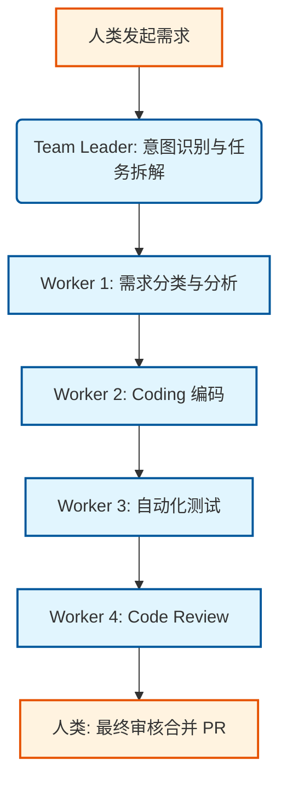
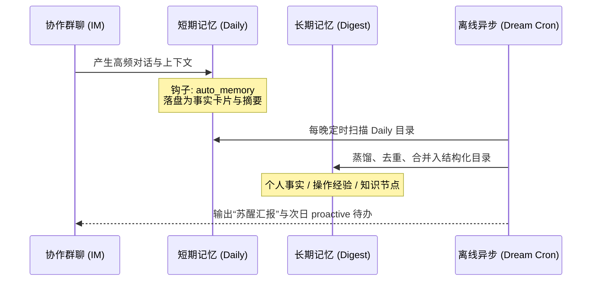

<!-- Terminal style introduction -->

    

        

            

            

            

        

        
bash

    

    

        
ckhuang@macbookpro:~$ 当我们把 Agent 塞进企业长链路工作流时，很快就会撞到两堵墙：上下文长度的物理限制，和注意力衰减的认知限制。于是，Anthropic 搞出了 Claude Tag，阿里云发布了 AgentTeams，大家不约而同地让 Agent 进入了“群聊模式”。这究竟是套皮的 UI 升级，还是真正的组织级协同范式？今天我们从 Infra 的视角扒一扒。 

    

## 一、群聊 ≠ 多人单聊的并集

在讨论群聊之前，我们要先理清一个误区：很多人以为把 Agent 拉进钉钉或 Slack 群，大家都能 @ 它，就是群聊了。**错，那只是并行的单聊。**

Anthropic 在发布 Claude Tag 时，给出了 Agent 群聊的四个核心特征：
1. **Multiplayer（多玩家共享）**：同一个实例与所有人协同，共享全局状态。
2. **Learns over time（时间维度学习）**：持续跟随频道活动，积累业务上下文。
3. **Takes initiative（主动性）**：在 ambient（静默）模式下，无需显式 @，也能主动监听、跟进任务。
4. **Works asynchronously（异步工作）**：能接手跨小时甚至跨天的长周期任务。

而在阿里云 AgentTeams 的工程化视角中，群聊被抽象为了一组声明式 CRD。每个群成员都被赋予了明确的身份架构：Manager（人类管理员）、Team Leader（Agent 管理者）、Worker（Agent 执行单元）以及 Human（分级权限人类）。

    “群聊不是聊天形态的升级，而是组织建模的开始。把群聊当作一种可被声明、可调度、可审计的组织资源，才是多智能体协同的核心。” —— CK·黄

## 二、为什么我们需要把 Agent 拉进群聊？

如果只是写个脚本、查个 Bug，单聊永远是最高效的。引入群聊意味着要承担上下文消歧、并发调度、权限治理等巨大的 Infra 复杂度。那么，边际收益在哪里？

### 1. 跨领域协作与长链路降噪
Agent 和人一样，塞太多职责就会“降智”。在软件研发这种长链路（需求 -> 编码 -> 测试 -> 部署）中，如果用单聊，早期信息的注意力会被严重稀释。
群聊模式下，我们可以将任务拆解给不同的 Worker。比如 AgentLoop 的端到端编码流水线，由 TeamLeader 统筹，5个 Worker 分别负责分类、Coding、Test、Review 和 Verify。每段上下文干净纯粹，断点可续跑，且过程全透明。

### 2. 突破信任边界：多智能体治理
当多个团队协作时，谁的 Agent 花了多少钱？能访问哪些数据库？单聊 Agent 无法代表多组织身份。群聊模式强制拆分出独立的 Agent，各自授权、独立计费，这是企业级落地的刚需。

### 3. 沉淀组织级群体记忆
单聊是“用完即焚”的，而群聊的上下文是组织资产。新员工入群 @ Agent 就能完成 onboarding，这是个人助理无法提供的价值。

## 三、硬核挑战：群聊模式对 Agent Infra 的重塑

作为分布式架构老兵，我看到群聊模式最兴奋的点在于：**它把 K8s 的控制平面思想，完美平移到了 Agent 协作中。**

### 挑战一：身份与权限的 RBAC 演进
在群聊里，权限主体不再是触发任务的“人”，而是“频道/Team”这个集合实体。这就像 K8s 里的 `ServiceAccount`。
AgentTeams 实现了正交的两条权限轴：
- **Worker 侧**：只拥有子集 Skills 和 MCP Servers，能力边界在 `AGENT.md` 中声明。
- **Human 侧**：分为 L1 Admin（托管主 Key）、L2 Team Leader（决定编制）和 L3 Worker（日常发言）。

### 挑战二：凭据治理（Credential Governance）
多人 @ 同一个 Agent，长周期任务挂起后触发者 session 过期了怎么办？
解法非常工程化：**API Key 永远不出网关。**
所有凭据（LLM Key、MCP、GitHub PAT）托管在 Higress AI Gateway。Worker 只持有可撤销的 Consumer Token（派生凭证），每次调用由网关代换。即使 Worker 容器被攻破，攻击者也只能拿到带租户标签的临时凭证，爆炸半径被严格限制。

### 挑战三：群体记忆的三层架构设计
群聊的高频交互极易撑爆 Token，组织知识又不能污染个人记忆。AgentTeams 采用的 ReMe 记忆框架，给出了非常优雅的三层设计：

1. **短期记忆（Session/Daily）**：只记录“今天发生了什么”，不直接参与在线召回，防污染。
2. **长期记忆（Digest）**：结构化的知识节点（Markdown + 混合索引 / 向量库），按 Agent 强隔离。
3. **Dream（睡眠与蒸馏）**：夜间离线批处理任务。用 LLM 整理当天的短期碎片，蒸馏进长期记忆，并生成次日的“待办”（interests）。

## 四、写在最后

    

        

            

            

            

        

        
bash

    

    

        
ckhuang@macbookpro:~$ 群聊模式会取代单聊吗？当然不会。但它绝对是 AI Native 组织重塑协作效率的必经之路。模型能力决定了 Agent 能走多快，而治理能力、Infra 架构则决定了多智能体系统能走多远。当并发调度、上下文消歧、安全网关这些底层基建就绪时，我们离真正的“硅基同事”也就不远了。 

    

