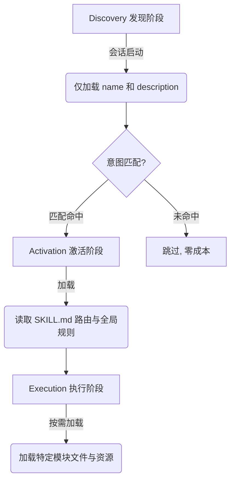
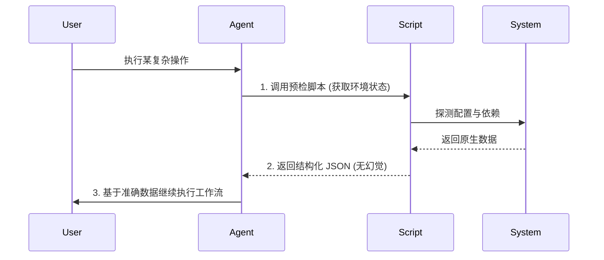

    

        

            

            

            

        

        
bash

    

    

        
ckhuang@macbookpro:~$ 传统的 Prompt 工程喜欢把所有领域知识一股脑塞进提示词，结果不仅撑爆了上下文窗口，还让关键信息被“淹没”。项目越复杂，Prompt 越臃肿，复用性几乎为零。如何打破这种“记忆负担”？Agent Skill 体系给出了标准答案。 

    

在构建复杂 AI Agent 的过程中，我们常常会遇到“上下文失忆”和“上下文超载”的矛盾。为了让 Agent 记住复杂的业务逻辑，我们拼命堆砌 Prompt；但随之而来的却是模型注意力的稀释和成本的飙升。

作为一名在分布式架构和大数据领域摸爬滚打多年的老兵，我深知“解耦”和“按需加载”的重要性。今天，我们就来深度拆解 Agent Skills（一种轻量、开放的能力扩展规范），看看它是如何用工程化的思维，将领域知识打包成模块化、可复用的能力的。

## 1. 核心理念：渐进性披露 (Progressive Disclosure)

Skill 体系最核心的设计理念是**渐进性披露**。这和我们在分布式系统中做“懒加载”和“按需路由”的思路如出一辙。它绝不一次性加载所有知识，而是分为三个关键阶段：

1. **Discovery（发现阶段）**：会话启动时，Agent 只常驻加载 Skill 的 `name` 和 `description`。
2. **Activation（激活阶段）**：当用户的自然语言意图命中 `description` 时，Agent 读取完整的 `SKILL.md`，获取路由表和全局规则。
3. **Execution（执行阶段）**：根据路由表，精准加载所需的子模块文件和参考文档。

这种模型用最小的上下文成本，换取了最大的知识覆盖范围。不仅保证了决策的精准性，也极大提升了系统的可扩展性。

    “渐进性披露用最小的上下文成本，换取了最大的知识覆盖范围，这就是‘按需投放知识’的核心经济学优势。” —— CK·黄

## 2. System Prompt vs Skill：规矩与能力的解耦

在项目架构中，理清边界是第一步。我们需要明确 System Prompt 和 Skill 的不同定位：

- **System Prompt**：项目的“全局规矩”。比如代码规范、架构约束。它在会话启动时全量加载，持续占用上下文。
- **Skill**：特定的“能力模块”。比如“如何新建一个 AB 实验”。它是多文件结构，仅在匹配时按需加载，未命中则零成本。

两者协同工作：System Prompt 定义底色，Skill 叠加专业能力。

## 3. 工程化最佳实践

在实际的工程落地中（例如内部的 `trade-ab-skill` 项目），构建一个健壮的 Skill 需要遵循以下几个核心实践：

### 3.1 SKILL.md 是路由器，而非知识库
不要把所有细节都塞进 `SKILL.md`。它的核心职责是**分发任务**。
- 代码行数应严格控制在 **500行** 以内（约 2000~3000 Token）。
- 建立明确的引用契约：“触发时机 + 资源位置 + 预期产出”。业务细节必须下沉到独立的模块文件中。

### 3.2 严格的工具隔离与安全边界
当 Skill 需要调用外部接口（如 MCP Tools）时，必须实施**模块级的工具隔离**，遵循权限最小化原则。
- **白名单制**：每个模块明确可用接口。
- **禁用万能工具**：全局禁止直接的 HTTP 调用等危险操作。
- **防止误调**：例如，“实验创建”模块仅能调用创建接口，“审批”接口则严格控制访问。

### 3.3 脚本增强：突破 LLM 的确定性边界
LLM 存在幻觉，算术和复杂状态推导不可靠。最佳实践是：**将确定性计算逻辑封装为脚本，由 Agent 调用执行。**
- **自愈性**：脚本内部处理异常，绝不阻断主流程。
- **结构化输出**：统一返回 JSON，方便 Agent 解析。
- **幂等性**：多次执行结果一致。

### 3.4 参数传递与动态注入
Skill 的执行往往是多阶段的。良好的参数传递机制应具备“显式、可校验、防丢失”的特性。
引入 **Snapshot（快照）机制** 作为跨阶段参数传递的载体。每个阶段将产出写入快照，下一阶段从快照读取，确保长工作流中的关键参数不会因上下文刷新而丢失。

## 4. 总结与思考

Agent Skills 的本质，是将软件工程中成熟的“模块化设计”、“路由分发”和“最小权限原则”引入到了 LLM 的 Prompt 体系中。这标志着我们正在从早期的“堆砌 Prompt”时代，迈入到了精细化的 **Skill 工程化** 时代。

作为 AI 时代的开发者，我们不仅要懂得如何与大模型对话，更要学会如何为大模型“编写入职指南”，用工程化的手段榨干每一 Token 的价值。