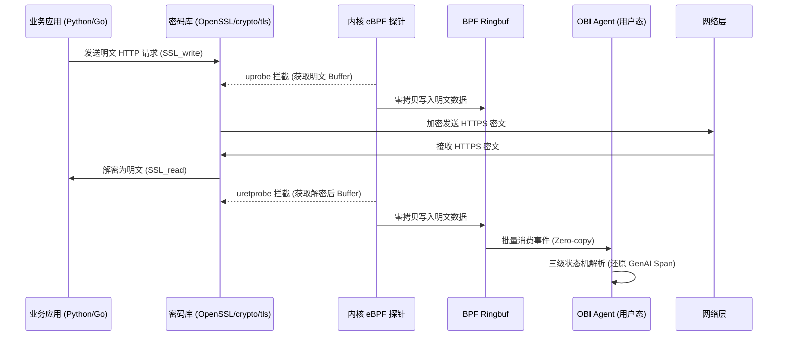

    

        

            

            

            

        

        
bash

    

    

        
ckhuang@macbookpro:~$ 当你的 AI Agent 出现“幻觉”或者 Token 账单爆炸时，传统的 APM 只能告诉你“有个 HTTP 请求花了 3 秒”，却无法告诉你消耗了多少 Token、调用了什么 Tool。基于 SDK 的手工埋点注定是死胡同，真正的解法在 Linux 内核里。 

    

在构建复杂的 AI Agent 系统时，我们经常会遇到这样的案发现场：用户提问后，系统先调 Embedding 向量化，再去 Pinecone 或 Milvus 做 Top-K 检索，经 Rerank 重排后携带上下文请求大模型（如 GPT-4o），期间还可能通过 MCP 协议调用了外部 API。

一旦用户反馈“回答不对”或“答非所问”，排查过程简直就是一场噩梦。整条链路横跨多种协议和云服务商，传统的 APM 监控在这些黑盒面前毫无还手之力。今天，我想和大家深度拆解一下近期阿里云云原生团队分享的 **OBI (OpenTelemetry eBPF Instrumentation)** 技术，看看基础设施层是如何用“降维打击”的方式解决 AI 可观测性难题的。

## 为什么按 GenAI 语义规范的手工埋点是条死路？

OpenTelemetry 社区虽然定义了 `Semantic Conventions for GenAI`（包含 `model`、`input_tokens` 等标准字段），但在实际工程落地中，极其痛苦。作为架构师，我经常看到团队在以下几个坑里挣扎：

1. **多语言与多 SDK 的“乘法爆炸”**：OpenAI、Anthropic、Google、Bedrock、通义千问……每家一套 SDK。你要为每一种语言的每一个 SDK 编写 tracing wrapper，一旦官方 API 字段变更，所有探针全部失效。
2. **侵入性改造拖慢迭代**：每次接入新的 AI 服务，都需要改代码、装依赖、重新发布，业务代码与监控逻辑强耦合。
3. **“裸调 HTTP” 带来的监控盲区**：这是一个致命问题。很多轻量级自研 Agent 压根不用官方 SDK，直接用 `requests` 或 `fetch` 拼接 JSON 发起调用。这意味着所有基于 SDK monkey-patch 的可观测性方案**全部失效**。

> 不管你用什么语言、用不用 SDK，最终都是 TCP 上跑的 HTTP 流量。如果我们在内核层面拦截，那看到的东西不就完全一样了吗？

## 降维打击：把观测能力下沉到内核

OBI 的核心破局思路非常巧妙：**不在应用层逐个封装 SDK，而是在 Linux 内核的网络层统一拦截 HTTP 流量。**

但随之而来的是一个硬核挑战：**今天的 LLM 调用全部跑在 HTTPS 上，直接在网卡抓包只能看到一堆加密字节。** 如何在不解密私钥的前提下拿到明文？

OBI 的做法是在用户态密码库的“加密前 / 解密后”那一瞬间挂上 eBPF `uprobe` 钩子：

- **针对 OpenSSL/BoringSSL**：对 `libssl.so` 的 `SSL_write`（加密前明文）和 `SSL_read`（解密后明文）挂钩子。这覆盖了 Python、Node.js、Nginx 等绝大多数场景。
- **针对 Go**：Go 自带 `crypto/tls`，OBI 通过符号表直接定位到底层读写函数挂载探针。

明文数据被拦截后，通过 BPF ringbuf **零拷贝** 传递到用户态，完全避免了传统 perf event 的多次拷贝性能损耗。

## 跨协程追踪：PID 不够用了怎么办？

抓到明文只是第一步，更难的是“上下文关联”。真实的 AI Agent 中，Python 的 `asyncio` 或 Go 的 `goroutine` 会在同一个线程里并发处理大量请求。如果仅靠 PID/TID 关联，Trace 链路会彻底串线。

OBI 在内核层完成了惊艳的**上下文重建**：
- **Python**：在 CPython 解释器上挂载 4 个 uprobe（盯住 `Task.step`、`Task.__init__`、`context_run` 等），精准还原协程间的父子血缘关系。
- **Go**：深挖 Go runtime 内部函数（如 `runtime.newproc1`），在不依赖公开 API 的情况下，建立 goroutine 的血缘映射表，向上溯源寻找正确的 trace context。

## 从字节流到 Span：精妙的三级状态机

拿到无标签的 HTTP 字节流后，如何判断它是 OpenAI 的对话、Pinecone 的向量检索，还是 MCP 工具调用？OBI 设计了一套严密的**三级状态机**：

1. **第一级：响应头特征码（最高优先级）**。例如 `Openai-Version` 或 `X-DashScope-Request-Id`。这是最可靠的指纹。
2. **第二级：URL 二段验证（Fallback）**。当遇到 5xx 错误响应头丢失时，退而求其次看 URL 路径。
3. **第三级：Body 顶层键最终裁决**。例如 LLM 调用必须有 `model` + `messages`；向量检索必须有特征键集合；MCP 调用必须符合 JSON-RPC 2.0 规范并命中白名单。

针对最棘手的 SSE 流式响应，OBI 甚至能在用户态维护事件缓冲区，实时累积 Token 消耗，精确输出最终的 Span。

## 实战破案：真正解决业务痛点

在实际架构运维中，这种内核级观测能力能解决许多玄学问题。结合行业真实案例：

- **“模型答非所问”的甩锅大战**：RAG 系统上线后胡编乱造，APM 只能看到 200 OK。通过 OBI 展开 Trace，一眼看出 Embedding 没问题，但向量库的 `namespace` 写错了，召回了旧版文档。一分钟破案。
- **Token 账单暴涨的元凶**：月底账单涨了 3 倍，几十个 Agent 查不出是谁干的。OBI 聚合 `input_tokens` 指标后，瞬间锁定一个内部知识库 Agent——开发人员为了图省事，把整篇 PDF 塞进了 `system message` 每次重复发送。
- **彻底消除自研框架盲区**：不用任何 SDK、直接用 HTTP 客户端裸调大模型的代码，同样能在监控大盘中完美呈现所有 Token 和 Tool Calls。

    “在复杂的分布式 AI 系统中，观测能力不应该成为业务的负担。把脏活累活下沉到基础设施，才是云原生架构的最终归宿。” —— CK·黄

## 总结

OBI 的出现，标志着 AI 可观测性从“应用层手工贴膏药”走向了“内核层降维打击”。**不改一行业务代码、CPU 开销不到 1%、跨语言且无视 SDK 差异**，这正是分布式系统架构演进的魅力所在。

随着大模型和 Agent 技术的爆发，基础设施层的技术红利正在重塑我们构建 AI 应用的方式。保持对底层技术的敬畏，善用新工具，我们才能在 AI 浪潮中走得更稳、更远。