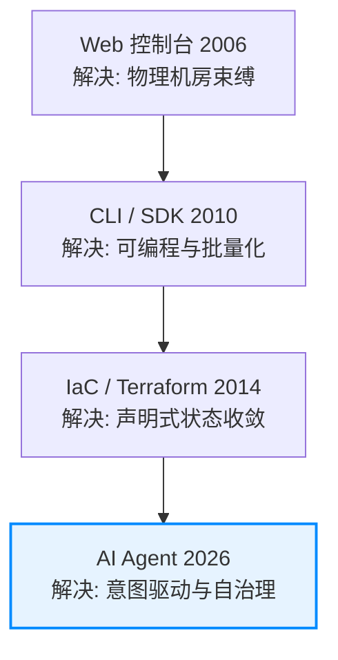
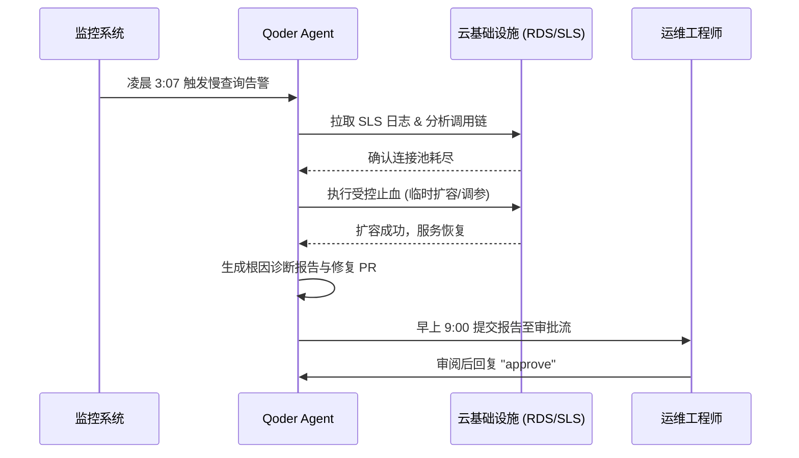

    

        

            

            

            

        

        
bash

    

    

        
ckhuang@macbookpro:~$ 凌晨3点的告警，不仅考验你的发量，更考验你们公司的基础设施代差。在“人肉运维”与“脚本自动化”之间挣扎了十年后，我们终于迎来了一个不用被闹钟薅起来的解法。 

    

## 引言：被冰冻的资源组与“成精”的报告

设想这样一个场景：凌晨两点，一份数据分析报告在无人值守的情况下自动运行。中途它遇到了一个致命阻碍——计算资源组被冻结了。

如果按照我们过去十年的传统运维经验，换成一段再严谨的自动化脚本，这时候也该红着脸抛出 `ResourceExhaustedError`，然后把值班的兄弟从被窝里薅起来。但这一次没有。它自己申请了一个新的按量资源组，绕过障碍，把报告跑完，然后安静地躺进早晨的收件箱里。

写这份报告的，不是人，是一个 Agent。

今天，我想结合阿里云最新提出的 **Qoder Cloud Agents × Alibaba Cloud Skills** 新范式，和大家聊聊我眼中云计算的下一个十年。读完本文，你将理解为什么传统的 IaC（基础设施即代码）终将被取代，以及“Agent 是云的最后一个界面”这一论断背后的深刻技术逻辑。

## 一、云界面的四次演进：从“怎么做”到“为什么”

要部署一个高可用 Web 应用，你需要做哪些事？开 ECS 选规格、进 VPC 配安全组、去 SLB 建负载均衡、申请 HTTPS 证书、配 ESS 自动扩缩容、绑域名解析……这六个控制台、几十个配置项，即便是资深架构师也要折腾半天，新手可能要卡上一周。

这本质上不是技术门槛，而是**界面代差**。云计算的每一代界面演进，都在试图让人用更少的脑力，办更多的事：

1. **Web 控制台（2006）**：让你不用再买服务器、租机房，把物理硬件抽象成了虚拟资源。
2. **CLI / SDK（2010）**：让操作可编程、可批量化、可版本控制。
3. **Terraform / IaC（2014）**：引入声明式编排，让你只说“要什么”，底层工具负责收敛状态。
4. **AI Agent（2026）**：意图驱动，让你只说“为什么”，剩下的机器自己搞定。

有趣的是，每一代演进都在把上一代变成自己的“底层工具”。Agent 时代，你不再需要知道 SLB 和 ESS 是什么，Agent 内部照样会去调用 CLI、写 Terraform。货架已经搭好，现在缺的，是一个“人以外的使用者”。

## 二、真正的“自治”：把人从执行链路中挪走

过去在搞分布式系统和自动化平台时，我们做了很多尝试：写复杂的 Runbook、推行 ChatOps。但它们都有一个致命弱点——**另一头，都还站着一个人**。脚本跑在某人的机器上，Runbook 依赖某人的账号权限，ChatOps 需要人在会话里按回车。

Agent 用云，核心突破在于把这个“必须在场的人”挪走。

以前我们总调侃要追求“睡后收入”，而在云原生时代，我们更需要的是**“睡后运维”**。凌晨 3 点 07 分，一条慢查询把数据库连接池吃满，告警触发。传统的排障链路是：起床 -> 登 Grafana -> 查 SLS -> 连 RDS -> 用一颗打了折的凌晨大脑做危险的线上决策。

而在 Agent 范式下，整个流程变成了这样：

漏斗的价值不在于它生成了多少动作，而在于它挡住了多少噪音。Agent 敢于放手，是因为其背后有严格的验收口和受控的安全策略（只扩容、不删缩）。早上 9 点，你喝着咖啡，用最清醒的大脑回复一个 `approve`，这才是工程师该有的体面。

    “云计算的终局，不是提供多少原子化的 API，而是提供多少能听懂人话的‘数字员工’。” —— CK·黄

## 三、Skill 即服务：让专家经验长在组织里

除了运维止血，Agent 范式带来的另一个巨大红利是**专家能力的组织级沉淀**。

以前，新人学用云，面对的是散落在几十个产品站的文档；遇到架构选型，只能去问各执一词的老员工。踩坑、排查、填坑，几个月才勉强上手。

现在，阿里云将 300+ 款产品、2w+ API 的能力封装成了 Skills（带语义、前置条件和最小权限模板）。一位资深架构师可以把“高并发数据库选型”这项硬核能力打磨成一个 Skill。业务同学只需一句话：“我们有个电商项目，日活 50 万，要扛秒杀，预算 5 万/月。”

Agent 跑完 Skill，直接输出：推荐 PolarDB-X 分布式 + Redis 缓存，附带分库分表策略、缓存预热方案以及月度成本明细。

从资深 SRE 的故障诊断，到安全专家的漏洞扫描，这些曾被锁在个人大脑里的“隐性知识”，终于变成了组织级随时可调用的“显性服务”。

## 总结：告别界面的时代

我们正在见证一次基础设施与使用者的双向奔赴。云的能力底座（API）已经足够完备，而大模型赋予了机器理解复杂意图的能力。

当数据分析师可以一句话让 Agent 自己探 schema、写 SQL 出图；当业务线每天能收到带“一行修复动作”的成本优化清单；当告警不再意味着通宵熬夜……我们终于可以把时间还给业务创新本身。

    

        

            

            

            

        

        
bash

    

    

        
ckhuang@macbookpro:~$ Agent 是云的最后一个界面。因为在它之后，界面本身就不再被需要了。 

    

