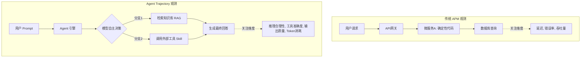
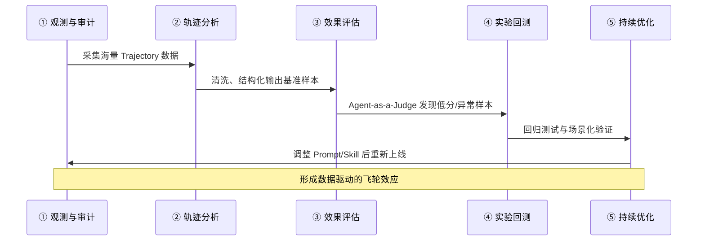

    

        

            

            

            

        

        
bash

    

    

        
ckhuang@macbookpro:~$ 每个时代的软件工程进化，都始于对不确定性的收敛。在传统分布式系统中，我们用 APM 和链路追踪去降伏微服务的混沌；而到了 Agent 时代，当系统从“执行确定代码”演进到“自主规划与工具调用”时，全新的黑箱出现了。今天，我们来拆解阿里云最新发布的 AgentLoop，看看如何用工程化手段让智能体完成“观测-评估-进化”的闭环。 

    

## 一、为什么 Agent 优化必须“观测先行”？

在分布式架构的演进史中，有一条铁律：**我们无法优化看不见的东西。**

传统应用的线上问题通常是确定性的——一段慢查询、一次内存泄漏、或者 RPC 超时。工程师依靠 APM（应用性能管理）工具，能精确定位到具体的代码行。这种“发现、定位、修复、验证”的工作流，建立在**系统行为可预测**的基石之上。

然而，AI Agent 彻底打破了这个前提。

当一个用户请求进入 Agent 系统后，它会经历一段高度不确定的执行过程（Trajectory）。模型可能会选择调用工具 A 而非工具 B；可能因为检索（RAG）到的上下文微小差异，生成截然不同的回答；甚至在多轮 ReAct 推理中陷入死循环。**同一段 Prompt，同一个底层模型，在不同时间的行为路径都不完全一致。**

如果没有观测，这些问题就成了彻头彻尾的黑箱。我们关注的不再是单纯的 Error Rate 或 Latency，而是输出的准确性、推理规划的合理性以及 Token 消耗的 ROI。因此，必须先将 Agent 的完整推理路径记录下来，形成可分析的数据基础，才能谈及后续的评估与优化。

## 二、观测维度的降维打击：从 APM 到 Trajectory

上一代的链路追踪粒度是应用、服务、接口级别；而在 Agent 观测中，粒度变成了：**一次对话（Session） -> 端到端调用（Trace） -> 单次请求（Request）**。每一次请求不仅包含代码执行，还涉及环境变量、知识库命中、记忆上下文等复杂状态。

我们可以通过一个对比图来直观感受两者的差异：

打个比方：传统应用观测像调试自动售货机，流水线是确定性的；而 Agent 观测像复盘棋局，第 17 手的成败可能取决于第 8 手的战略意图。这就是**推理路径（Trajectory）**的真正价值所在。

    “模型能力决定了 Agent 的上限，但工程基建（Harness）决定了 Agent 在业务落地中的下限。Agent 优化绝不等于单纯的模型微调。” —— CK·黄

## 三、Agent 优化的三大核心工程挑战

在构建企业级智能体时，我们通常会面临三个层面的技术挑战：

1. **数据从哪来？（采集难题）**
   传统的 APM 数据无法体现回答质量。Agent 的轨迹数据量大、语义复杂（包含大量上下文和中间推理）。如何高效、无侵入地采集、存储并检索这些数据，将其转化为高质量的评测数据集，是第一道门槛。
2. **怎么评？（评估难题）**
   Agent 任务通常是开放式的（Open-ended），没有唯一正确答案；且其表现高度依赖上下文。人工评估成本极高，规则评估覆盖有限。要评估 Agent 的行为序列，我们需要一个具备同样理解能力的“裁判”——这就是 **Agent-as-a-Judge** 的核心理念。
3. **怎么改？（高维耦合的调优）**
   Agent 系统的参数空间极为庞大：Prompt 设计、工具定义、知识库构建、编排逻辑、模型选择。这些维度相互耦合，牵一发而动全身。依靠“拍脑袋”调参不再可行，必须引入系统化的对比实验和量化评估机制。

## 四、AgentLoop 的破局之道：MVP 五环闭环

阿里云推出的 AgentLoop 并非又一个 Agent 框架，而是一个**工程基建平台**，旨在通过 MVP（Minimum Viable Product）五环闭环，驱动 Agent 持续进化：

1. **观测与审计**：无侵入采集主流框架（如 LangChain、AgentScope、Dify 等）在生产环境中的 Trace 和 Log 数据，完整还原 Trajectory。
2. **轨迹分析**：采用 ATIF（Agent Trajectory Interchange Format）标准，通过 Pipeline 处理管线，自动化清洗和转化海量数据，将其转化为有价值的评估样本。
3. **效果评估**：内置 20+ 开箱即用的评估器 Agent，通过 Agent-as-a-Judge 机制，对线上真实环境进行持续的质量监控（无 Ground Truth 采样）以及受控环境的量化评分。
4. **实验回测**：引入 CI/CD 基线测试理念，确保 Agent 资产的任何变更不会引发能力退化（Regression）。
5. **持续优化**：基于评估结果，对 Prompt、Skill 和模型配置进行多维调优，并将企业级实战经验沉淀到经验库中，实现自动化进化。

## 五、结语：进化是当前时代的工程补位

    

        

            

            

            

        

        
bash

    

    

        
ckhuang@macbookpro:~$ 长远来看，“进化”与 Agent Harness 工程一样，本质上是在当前大模型能力尚未完全覆盖业务需求时的一种“工程补位”。当底层模型强大到一定程度，部分外部脚手架终将被内化。  但在此之前，尤其是在高度定制化、缺乏通用数据的企业长尾场景中，搭建一套像 AgentLoop 这样完善的观测与进化体系，依然是不可或缺的。谁先跑通了这套飞轮，谁就拿到了下一代企业级 AI 软件的入场券。 

    

