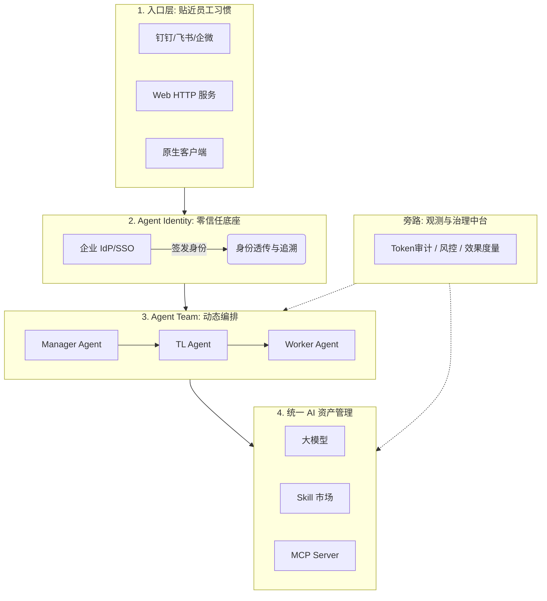
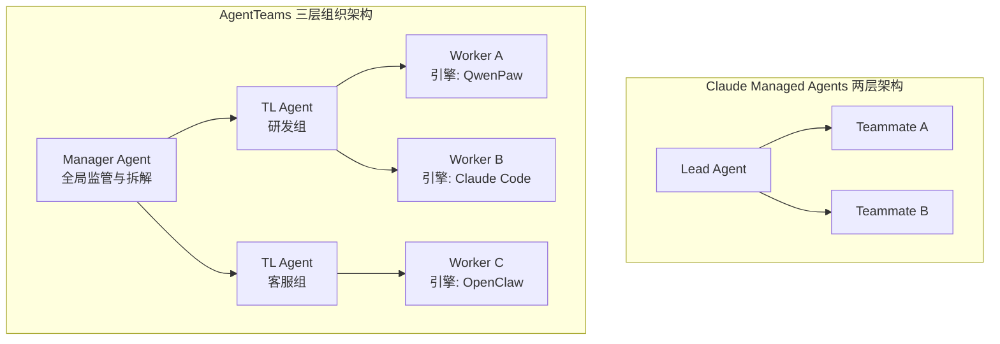

    

        

            

            

            

        

        
bash

    

    

        
ckhuang@macbookpro:~$ 过去大半年，大家都在疯狂卷“多 Agent 协作”，但绝大多数方案解决的只是“一次任务怎么跑得快”。而当 Agent 真正要下沉到企业生产环境时，致命的问题其实是：“一个 Agent 组织怎么在企业里长期、安全地活下去？” 

    

如果把多 Agent 协作比作打羽毛球，市面上的主流框架更像是在“临时组个局”，打完就散；而企业真正需要的是运营一个“几百号人的俱乐部”。近日，阿里云云原生团队分享了他们关于 **AgentTeams** 的落地架构思考，这篇内容让我产生了极大的共鸣。作为在分布式系统和 AI Agent 领域摸爬滚打多年的老兵，我一直坚信：**Agent 不是散装的脚本，而是一种需要被管理、被治理、被观测的企业级工作负载。**

今天，我们就从架构师的视角，深度解构 AgentTeams 背后的 Kubernetes 范式映射与设计哲学。

## 一、 四层企业级架构：数字员工的“合法化”

在很多 Demo 级的项目中，Agent 只是一个带着 Prompt 的 API 调用循环。但到了企业里，Agent 必须拥有“合法身份”。AgentTeams 给出了一套非常清晰的四层落地架构：

在这个架构中，最亮眼的是 **Agent Identity（身份层）**。把企业已有的 IdP (如 RAM, Okta) 接进来，给 Agent 签发身份，这意味着**Agent 的每一步操作都可以归属到具体的人或实体**。不逼着员工换工具（入口层），而是让有合法身份的 Agent 走进员工现有的工作流中，这是做企业级 SaaS 的黄金法则。

## 二、 零信任安全：被低估的“生死线”

    “安全不是锦上添花。当你的 Agent 手里攥着数据库写权限和 API Key 时，如果它被注入攻击，你连爆炸半径有多大都不知道。” —— CK·黄

很多开发者在搞 Agent 时，喜欢直接把密钥明文写在环境变量里。AgentTeams 给出的答案是**四道防线**构筑的零信任底座：

1. **AI 网关（凭证剥离）**：这是最核心的一步。Agent 自身**零明文持有**任何凭证，所有的 STS、OAuth、API Key 全部托管在网关。通过身份认证 + 细粒度风控（指令级拦截），把风险锁死在调用前。
2. **Sandbox 沙箱（运行时隔离）**：每个 Agent 跑在独立的沙箱中，物理隔离实例、网络和存储。即使发生提示词注入越权，破坏也出不了沙箱。
3. **通信安全**：Agent 间的任务派发和上下文流转基于端到端加密，并具备 Room 审计机制。
4. **Skill 市场（供应链安全）**：所有能力上架必须过安全扫描，调用环节执行最小权限原则（per-consumer ACL）。

在实际的大型架构演进中，安全往往是滞后建设的。但对于拥有执行权的 Agent 而言，安全架构必须是 Day 1 的第一优先级。

## 三、 协作架构的解耦：Agent 领域的 Kubernetes CRI 时刻

在组织架构上，AgentTeams 没有采用 Anthropic Claude Managed Agents (CMA) 的简单“主从两层”模式，而是加入了 **Team Leader (TL) Agent**，形成 `Manager -> TL -> Worker` 的三层结构。

**为什么要加 TL 这一层？** 因为在真实企业管理中，一个 CEO 无法直管 50 个人，必须有 VP 和 TL。**管理幅度（Span of Control）**同样适用于 Agent 系统。

更让我拍案叫绝的是它的**引擎热插拔（解耦）设计**。当前市面上的框架（如 CrewAI, LangGraph）几乎都与特定的底层引擎深度绑定。而 AgentTeams 在协议层做了解耦：同一个 Team 里，Worker A 可以用 QwenPaw，Worker B 可以用 Claude Code。

这让我回想起当年 Kubernetes 推出 CRI（Container Runtime Interface）的时刻。K8s 通过解耦编排层与容器运行时，最终打赢了编排之战。AgentTeams 将协作层与引擎层切开，保证了企业不会被单一模型或技术栈锁死。长期来看，这是一个决定生死的架构决策。

## 四、 弹性的运行时与进化的双飞轮

当 Agent 真正跑起来，如何兼顾“时延”与“成本”？AgentTeams 结合 ACS Sandbox 提供了极其优雅的三种并发伸缩方式：

1. **Session 级扩并发**：多用户交互时，秒级拉起独立沙箱，线性扩展。
2. **Team 级多副本**：类似无状态微服务的多实例负载均衡。
3. **进程内 Subagent（压时延利器）**：这是极具工程智慧的一点。针对时延敏感的连贯业务（如：退款受理 -> 核验 -> 风控 -> 执行），将多个 Subagent 塞进**同一个 Worker 进程内串行执行**。零网络跳数，彻底干掉 IPC/RPC 的开销。

在成本控制上，采用**深休眠快照机制**，无请求时冻结现场，彻底实现“算力用多少付多少”。

而在长期演进上，AgentTeams 构建了**业务执行与 AgentLoop 调优的双飞轮**。从运行轨迹中沉淀 Bad Case，结合人类偏好数据（RLHF/DPO），反哺 Prompt 与模型更新。**在这个时代，你的护城河不是用了哪个基座模型，而是你在这个业务场景里积攒了多少高价值的 Agent 协作数据。**

## 总结

    

        

            

            

            

        

        
bash

    

    

        
ckhuang@macbookpro:~$ Kubernetes 当年的成功，在于它把写脚本变成了声明意图。今天，Agent 的演进也在经历同样的质变。别再把 Agent 当成花哨的脚本玩具，用基础设施的思维，用声明式、高可用、零信任的理念去管理这些“数字员工”，才是构建企业级 AI 架构的正道。 

    

