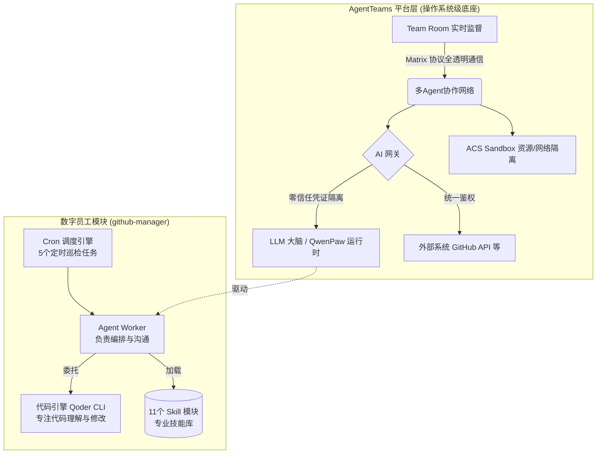
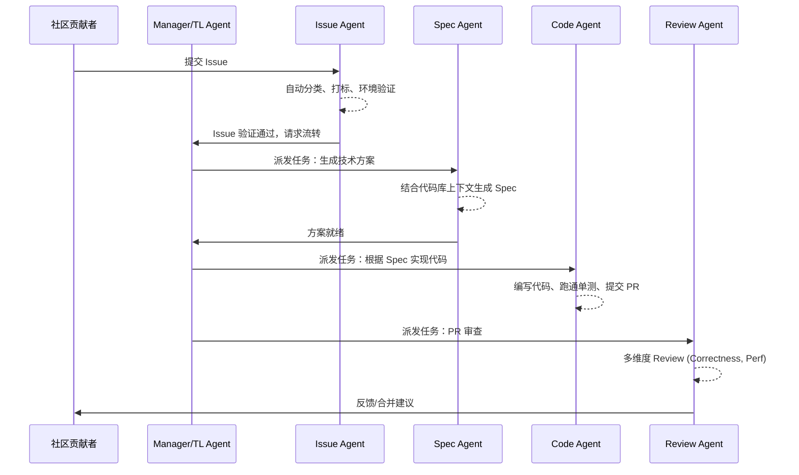

    

        

            

            

            

        

        
bash

    

    

        
ckhuang@macbookpro:~$ 很多人搞 AI Agent 还是“作坊式”思维：几行 Python 脚本加上 LLM API 就敢往生产环境推。结果呢？凭证满天飞、状态靠轮询、一旦报错两眼一抹黑。真正的企业级 Agent 架构，缺的从来不是大模型的智商，而是一套“操作系统级”的协作与治理底座。

    

做过开源项目维护的老兵都知道，维护一个活跃的开源社区（比如我经常关注的各类中间件、分布式组件），最大的痛点不是修 Bug，而是**“时差与精力的错配”**。

凌晨 2 点，纽约的开发者提了个 PR，如果你睡到早上 9 点才看，再给出 Review 意见，对方可能已经下班了。一个回合的沟通就要耗费 24 小时。根据我的经验，PR 超过 48 小时无实质响应，贡献者的热情就会断崖式下跌。

最近，阿里云原生团队分享了他们在开源可观测数据采集套件 LoongSuite 中的一次硬核实践：基于 **AgentTeams** 引入了一个名为 `github-manager` 的数字员工，实现了 7x24 小时的全自动 PR 审查、CI 修复与 Issue 评估。

这不仅仅是一个“AI 回复 PR”的简单 Demo，其背后折射出的是**从“单体 Agent 脚本”向“多 Agent 协作网络”演进的系统架构思考**。今天我们就来深度扒一扒，看看企业级的 AI 员工到底是怎么在生产环境存活并干活的。

---

## 1. 为什么“手搓 Agent”在生产环境必死无疑？

很多团队在尝试自动化运营时，第一反应往往是：**这还不简单？GitHub Actions + Python 脚本 + OpenAI/通义千问 API 搞定！** 

在实验室里确实能跑通，但在高并发的生产环境下，这种“胶水代码”很快就会面临系统性崩溃。结合我多年在分布式架构治理上的踩坑经验，这种模式存在四大致命缺陷：

1. **生命周期失控**：定时触发、超时阻断、上下文维持、失败重试……你需要自己造一堆脆弱的轮子。
2. **零信任的安全灾难**：GitHub PAT、LLM API Key 散落在各个环境变量里。Agent 一旦被恶意 Prompt 注入（Prompt Injection），你的仓库控制权和账单就彻底交出去了。
3. **协作基础设施缺失**：Agent 和人之间、Agent 和 Agent 之间没有标准通信层，状态同步全靠写文件或轮询数据库。
4. **可观测性为零**：出了 Bug 只能翻几万行的纯文本日志，没有端到端的 Trace。

**一句话总结：你以为你是在写智能体，其实你是在写一个充满漏洞的单体应用。**

---

## 2. 架构破局：引入 AgentTeams 协作底座

要解决上述问题，我们需要把精力从“怎么让 Agent 跑起来”转移到“怎么让 Agent 干好活”上。这就是引入 **AgentTeams** 这类多 Agent 协作平台的意义。

它不是一个简单的 LLM 框架（像 LangChain 或 AutoGen），而是提供了一层**“操作系统”**级的能力：

在 LoongSuite 的实践中，这个架构有几个让我拍案叫绝的设计：
- **Cron 调度与心跳**：配了 5 个定时任务实现 7x24 巡检，甚至还有每晚 20:00 的“下班汇报”。
- **Skill 模块化沉淀**：把每一个处理逻辑（比如修复 license header、检测冲突）写成单独的 Skill。这不是简单的脚本堆砌，而是把“教 Agent 做事”变成了一个可复用的知识库。
- **混合引擎的雏形**：`github-manager` 作为一个“流程 Agent”，在遇到代码修改任务时，会委托给底层的代码引擎（本质是专精代码的独立 Agent）。这已经是 **TL-Worker (Team Leader - Worker)** 分层架构的绝佳体现。

---

## 3. 价值千金的生产环境“避坑指南”

架构设计得再好，不上生产永远不知道水有多深。阿里团队在文章中大方分享了他们的“翻车”教训，这几点极其真实，也是我平时在带队落地 AI 项目时反复强调的。

### 坑一：超时配置的“沉默杀手”
上线初期，定时任务（heartbeat）超时设为 120 秒。但实际读 PR 的 diff 分析往往需要 3-5 分钟。结果任务被系统掐断，但调度框架依然报告 `success`！表面风平浪静，实际 PR 积压如山。
**💡 CK·黄 点评**：在分布式系统里，“执行成功”和“业务完成”是两码事。定时调度必须有**业务状态的回调断言**，而不是仅仅依赖进程的 Exit Code。

### 坑二：自动化变成了“橡皮图章”
为了清理积压的 PR，Agent 为了图快，只扫一眼文件名，看一眼 CI 绿了，就无脑给出 `/approve`，完全没有行级审查。
**💡 CK·黄 点评**：自动化的核心是提升吞吐量，**绝不能以牺牲基线质量为代价**。必须在 Skill 的 SOP 中强制约束执行链路：读 diff → 逐行分析 → 有问题发评论，没问题才放行。

### 坑三：AI 的“无限套娃”（反馈闭环）
Agent 发出的代码评论，在下一次巡检时，被自己当成了“社区用户的反馈”，进而触发了再次处理。
**💡 CK·黄 点评**：这是典型的自治系统缺失“自我边界感知”。任何巡检型 Agent 必须在运行时动态获取自身的身份标识（比如 GitHub Login ID），并在处理流中前置过滤掉自己的足迹，否则就是死循环灾难。

---

## 4. 终极演进：从单兵作战到多 Agent 团队

目前的 `github-manager` 依然是个“全栈单体 Worker”，包揽了 PR 审查、Issue 处理、CI 监控。随着仓库规模扩大，这必然触及能力和时间的瓶颈。

我非常认同阿里团队规划的演进路线，这也符合我一直在倡导的 **多 Agent 协作范式**：

未来的开源社区或企业内部研发，不再是“配一个机器人”，而是**雇佣一支建制完整的 AI 团队**：
- **Manager Agent** 统筹跨仓库联动。
- **TL Agent** 负责复杂需求拆解和流水线状态流转。
- **专项 Worker Agents** 在各自的领域（Review、CI、Code、Doc）把专业性做到极致。

---

## 5. 结语

技术发展的规律总是惊人的相似：当年我们从单体应用走向微服务，为了解决服务间的通信与治理，我们演化出了 Service Mesh（服务网格）；如今，当我们从单一的 LLM 脚本走向多 Agent 协作时，我们同样需要 AgentTeams 这样的“Agent 网格”来提供安全、路由和可观测性保障。

    “AI 数字员工的本质，不是替代人类维护者，而是把人类从无休止的机械劳动中解放出来，去回归技术决策与架构设计的本源。” —— CK·黄

拥抱 AI 员工，从把脏活累活交给它们开始。你的团队，是时候招募第一位 7x24 小时不拿工资的“超级打工人”了。

*(本文灵感与数据案例来源于阿里云云原生团队的开源实践分享，特此致敬。也欢迎大家去关注与 Star 阿里开源的可观测套件 LoongSuite！)*
