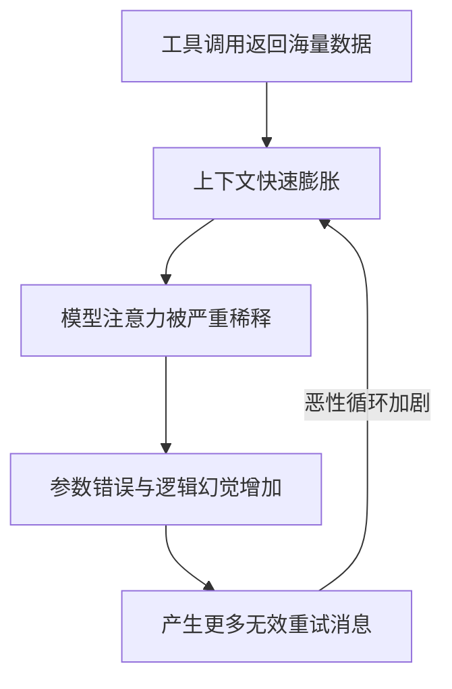
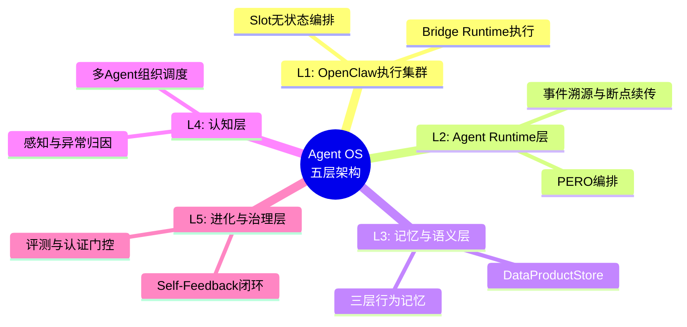

    

        

            

            

            

        

        
bash

    

    

        
ckhuang@macbookpro:~$ 为什么在执行多步复杂任务时，Agent 经常“越跑越蠢”？这不是模型不够聪明，而是我们喂给模型的信息质量在恶化。大模型本质上只是一块裸 CPU，缺乏内存管理、文件系统和进程调度。今天我们聊聊，如何为大模型装上真正的企业级 Agent OS。

    

在构建企业级 AI Agent 平台的实战中，我们不可避免地会遇到大语言模型（LLM）的**“先天约束”**：上下文窗口是稀缺资源、跨执行的无状态性、以及长链路导致的注意力稀释。

不要试图用更大的模型来掩盖工程层面的问题。从 Prompt 注入，到 Context 上下文管理，再到 Harness 运行时工程，这不仅是一次架构的升级，更是一次对 Agent 认知和治理范式的全面重构。

---

## 1. 痛点：大模型的四大先天约束

在讨论任何工程方法论之前，必须先看清大语言模型的物理边界。

1. **上下文窗口极其脆弱**：一个 5 步技能的 ReAct Agent，如果在工具调用中返回海量 JSON，几轮之内就会膨胀到远超物理上限。
2. **注意力稀释效应**：当 128K 的窗口中 70% 都是无用的 JSON 噪音时，大模型就会“越跑越蠢”。有效容量和物理容量完全是两码事。
3. **数据搬运谬误**：迫使 LLM 充当数据搬运工（从步骤 A 提取数据塞给步骤 B）极易导致截断、遗漏或幻觉。
4. **无状态的先天缺陷**：单次执行一旦网络断开状态瞬间清零；跨执行时，昨天的踩坑经验，今天的 Agent 依然会重新犯错。

这四大约束形成了一个可怕的恶性循环。如下方的流程图所示，缺乏系统级治理的 Agent 最终必然走向崩溃：

---

## 2. 演进：从 Prompt 走向 Context 分层防御

早期的做法是拼命写 Prompt。我们将数百行的规则、状态和知识塞进 `System Prompt`，加上无数个 `⚠️` 和大写字母。然而，在 10 步以上的长链路中，指令遵从率会断崖式下跌。

**真正的出路不在 Prompt，而在 Context 工程。** 也就是给 LLM 装上“内存管理系统”。针对不同粒度的数据膨胀，我们必须采取分层拦截的策略：

- **L1 单次大数据拦截 (ToolResultRefStore)**：当工具返回超过阈值（如 >8000 字符）时，强制将原始数据外置存储到 DB，上下文中只保留引用指针（refId）。
- **L2 中等数据语义压缩 (SemanticCompressor)**：使用较小的模型对 10000 字符左右的工具结果进行注意力蒸馏，提取核心结论，过滤无用噪音。
- **L3 累积膨胀对话压缩 (Compaction)**：当 Prompt 预算达到 85% 时，将前序冗长对话压缩为结构化的“交接文档”（包括原始请求、执行历史、放弃的路径）。“已放弃的路径”极其关键，它能防止 LLM 重蹈覆辙。
- **L4 数据总线按需取回 (DataBus)**：利用声明式依赖，在需要的步骤预取数据，实现预测性的信息加载。

这四层防线之上，还必须遵守**“单一表示原则”**：同一份上游数据在后续 prompt 中只允许出现一种形态，绝对禁止全量与摘要共存，从而避免模型因对比差异而产生幻觉。

    “没有一个银弹压缩算法能解决所有膨胀问题。分层拦截、单一职责，这和微服务的架构哲学如出一辙。” —— CK·黄

---

## 3. 升维：Harness 工程与 Agent OS

如果说 Context 工程是内存管理，那么 Harness 工程就是构建真正的 **Agent 操作系统**。

过去我们习惯于用“防御范式”来设计 Agent：假设模型会犯错，所以写了五层修复管道去兜底。但这会导致系统越健壮，性能税越重，且越难从新模型的进步中获益。

正确的架构哲学应该是**从防御走向赋能**：通过 `parameterBindings` 消除数据搬运的场景，通过动态 Action Space 裁剪减少工具诱惑，让系统负责确定性的数据流转，让 LLM 专注于意图理解与推理。

企业级的 Agent OS 必然演化为一套五层架构：

在这个操作系统中：
- **执行引擎是有状态的**：基于事件溯源（Event Sourcing）实现执行与推送分离，进程崩溃后可以从断点秒级恢复，不再需要从头重跑。
- **知识是跨执行积累的**：Agent 会自我反思，将踩坑教训和决策沉淀为 Policy Memory 和 Strategy Memory，跨会话生效。
- **组织结构是树形的**：CEO 级 Agent 负责拆解任务，调度执行 Agent 并行处理，最后汇总结果。

更重要的是，**认知层与执行层被彻底解耦**。Agent OS 持有认知真相，负责思考；OpenClaw 集群持有执行真相，负责操作。思考与执行分离，让系统得以独立演化。

---

## 4. 结语：控制的最高境界是自由

    “信任不是一种态度，而是一种设计能力。最好的控制，看起来像自由。” —— CK·黄

Agent 系统设计的本质，绝不是通过严苛的 Prompt 去死死限制 LLM 的行为，而是为它创造一个**“犯错成本最低、正确路径最短”**的执行环境。

当错误发生时，系统有检查点可以回退（断点续传）；当面临海量数据时，系统有结构化机制避免迷失；当任务过于庞大时，系统能自动分解并调度资源。

在这四面被大模型“先天约束”围成的墙壁里，我们并非束手无策。通过引入系统级的基础设施，这四面墙不再是阻碍我们的天花板，而是系统设计的起点。操作系统的意义，正是让这墙壁内的探索空间，变得无限大。

    

        

            

            

            

        

        
bash

    

    

        
ckhuang@macbookpro:~$ 从“能做事”到“稳定地、大规模地做事”，企业级 Agent 平台的进化才刚刚开始。保持好奇，持续重构。 

    

