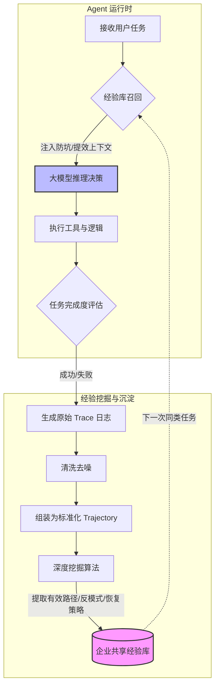

    

        

            

            

            

        

        
bash

    

    

        
ckhuang@macbookpro:~$ 很多企业的 Agent 在 Demo 环境下所向披靡，一上生产线就变成了“薛定谔的猫”——偶尔惊艳，经常翻车，Token 成本还高得吓人。真正的工程落地，不是让模型每次都去盲目试错，而是要让它学会“长记性”。 

    

在传统的软件工程思维里，我们追求的是**绝对的确定性**：相同的输入、相同的环境，必须得出一致的结果。一旦出现偏差，那就是 Bug，我们可以通过发布门禁、回归测试将其死死按在上线之前。

然而，当我们一脚踏入 AI Agent 的深水区，游戏规则彻底变了。模型采样的随机性、上下文的微小扰动、外部工具的状态变化，让 Agent 天然带着“不确定性”的基因。同一个任务，Agent 这次可能走 A 路径完美解决，下次却可能选了 B 路径然后陷入死循环。

今天，我们就来深度拆解一下，如何通过构建**经验自进化闭环**（如 AgentLoop 的实践），让 Agent 从“偶尔做对”走向“稳定可靠”，在提升任务成功率的同时，把失控的 Token 成本打下来。

## 一、为什么你的 Agent 总是“记吃不记打”？

在实际的业务场景中，我们经常会看到这样的翻车现场：Agent 在查询数据库时，选错了入口导致空转；调用 API 时参数格式不对，然后原样重试直到超时；甚至在还没拿到最终结果时，就提前给出了幻觉般的回答。

大部分团队的解法是什么？**人工看 Trace、人工修 Prompt、人工加规则。**

这种“人工数据飞轮”在项目初期确实有效，但当 Agent 数量和调用规模爆发时，专家的时间立刻成为瓶颈。海量的执行 Trace 躺在日志系统里睡大觉，真正能转化为模型优化动作的寥寥无几。

这就引出了一个核心问题：**原始的 Trace 日志并不等于经验。** 

## 二、从 Trace 到 Trajectory：经验自进化的核心引擎

要让 Agent 真正“长记性”，我们需要在模型之外，构建一层可持续更新的**经验系统**。它的核心逻辑不是去微调（Fine-tuning）模型权重，而是将高噪音的执行数据提炼为可复用的决策依据。

### 1. 经验自进化架构与数据流转

我们来看一下这个自进化闭环是如何运转的：

### 2. 为什么是 Trajectory 而不是 Trace？

原始的 Trace 里面充满了大量的基础设施 Span、重复的消息报文，数据量极其庞大且充满噪音。AgentLoop 的做法是将这些原始数据清洗、去噪，组装成标准化的 **Trajectory（轨迹）**。

清洗后的 Trajectory 只保留：**任务目标、行动步骤、工具调用、观察结果、错误和恢复过程**。数据量级通常能降到原始 Trace 的 `4%—6%`。这不仅省了存储费，更关键的是，挖掘算法可以直接对着 Agent 的“思考决策树”进行分析，找出那些**反复出现的成功路径**和**致命的反模式**。

    “大模型提供的是通用智能，而企业真正需要的，是沉淀在真实业务轨迹中的专属行动经验。让 Agent 越用越聪明，而不是越用越费 Token。” —— CK·黄

## 三、经验注入：用确定性约束不确定性

当我们在运行时把提炼好的经验注入给 Agent，到底能解决什么问题？

1. **防患于未然**：在任务开始时，直接告诉 Agent 验证过的入口和行动顺序。
2. **精准排雷**：在调用工具前，补充前置条件和数据范围约束。
3. **丝滑兜底**：一旦报错，立刻提供历史验证有效的恢复绕行策略，避免无脑重试。

从实际的 Benchmark 测试来看（例如 StarOps 或 PawBench），引入经验注入后，不仅**首次完成率**和**任务成功率**大幅提升，更重要的是，**无效的工具调用和因重复推理消耗的 Token 显著下降**。

我们追求的成本优化，绝不是单纯看单次调用的绝对 Token 数，而是**每完成一个成功的任务，所需的综合成本（Token + 耗时 + 人工介入率）是否在持续降低**。

## 四、经验自进化与 Memory、RAG 的本质区别

很多人会把经验库和 Memory、RAG 混为一谈，其实它们在系统架构中扮演着完全不同的角色：

*   **Memory（记忆）**：解决“过去发生了什么”，保持多轮对话的连续性。
*   **RAG（检索增强）**：解决“事实是什么”，给模型补充外部知识文档。
*   **Skill/工具**：解决“能做什么”，赋予 Agent 操作环境的能力。
*   **经验自进化**：解决“**在当前情境下，怎么做最容易成功，怎么做一定会失败**”。

经验自进化是一层极其轻量、可移植的优化能力。它不需要昂贵且漫长的 SFT（监督微调），随时可以跨越不同的模型框架，在团队内多个 Agent 之间共享。前人踩过的坑，后人绝不再踩；别人跑通的路，新 Agent 直接复用。

## 五、结语

让 Agent 从一个炫酷的 Demo 变成企业级的生产力工具，跨越鸿沟的关键在于**对不确定性的收敛能力**。

在这个过程中，日志不该只是一堆躺在磁盘里的冷数据，它们应该是 Agent 进化的养料。当你的系统能够自动从失败中提取教训，从成功中固化流程，你的 Agent 才能真正实现“越用越准，越用越便宜”的飞轮效应。这，才是大模型时代下半场的硬核工程玩法。