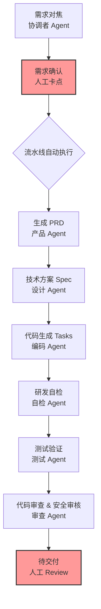

    

        

            

            

            

        

        
bash

    

    

        
ckhuang@macbookpro:~$ 现在的 AI Coding 就像在抽卡：简单逻辑一把过，复杂需求乱成锅。如果连着网、盯着屏、靠着人才能跑通，那这不叫工业化，这叫赛博手工作坊。 

    

在过去的很长一段时间里，我们在 AI 辅助编程（如 Cursor、Qoder 等工具）上尝到了甜头。最初的 1.0 阶段，大家沉浸在“一句话生成代码”的快感中。但随着业务复杂度的上升，问题开始集中爆发：

1. **质量黑盒**：Agent 哗哗吐出几万行代码，没人敢直接上，最后还得人工逐行 Review。
2. **抽卡体验**：处理复杂需求时，模型经常上下文丢失、随机“降智”，本该一步到位的逻辑被拆得七零八落。
3. **脆弱的单点**：网络一断，会话重开；人一离开，流水线停摆。

这让我不禁反思：**AI Coding 的真正瓶颈到底是什么？**

答案是：**不是模型能力，而是缺少一套像工业流水线一样的交付体系。** 我们不能把所有的希望都寄托在“等大模型变得更聪明”上，而应该基于现有模型的“能力下限”，设计一套稳定、可控、安全的端到端交付 2.0 体系。

---

## 一、从 1.0 到 2.0：工业流水线的觉醒

回顾工业化的演进史，100 年前亨利·福特把汽车制造拆解成了流水线。每个工位有明确的输入、输出和质检标准。福特不需要每一个流水线工人都是造车专家，但他依然能稳定产出合格的汽车。

软件开发的 AI 工业化也应如此。一个好的端到端 2.0 交付体系，应该做到**“三可”**：
- **可追溯**：一个 ID 贯穿全链路，从 PRD 到代码到测试，任何时候都能回溯一句话是怎么变成代码的。
- **可验证**：研发自检 + 平台扫描，多重过程检查，在流水线的每个阶段都有质检卡点。
- **可优化**：每次执行都会留下 Session Log，通过分析日志发现规则盲区，持续迭代。

在架构设计上，我们将 2.0 体系拆解为多个 Agent 协同的自动化流水线。

在这条流水线中，人不再是亲自下场的“操作工”，而是关键节点的“监督者”。

---

## 二、脊梁骨：Spec + Harness 物料体系

如果说流水线是外壳，那约束 Agent 行为的规范就是灵魂。在 2.0 体系中，我们将这种约束称为 **Harness（马具）工程**。

一匹再好的骏马（强大的模型），如果没有套上马具（约束规范），跑起来也会伤人。为了让 Agent 产出稳定可控的代码，我们设计了四层约束体系，这和国家法律的层级设计有着异曲同工之妙：

1. **原则（Principle）**：顶层价值观。例如“代码必须向后兼容”、“新增接口必须有契约”。这是不可违背的底线。
2. **宪法（Constitution）**：框架级抽象。定义了 Spec 的组织逻辑和执行动作的中枢逻辑。
3. **规则（Rules）**：实际指导作业的标准。例如 Maven 的构建规则、单测的覆盖率要求。每一条都告诉 Agent“这一步具体该怎么做”。
4. **判例（Cases）**：具体场景的解读。**这是最容易被忽视却最关键的一环。** 判例必须成对出现（正例与反例），明确告诉 Agent“错在哪里”以及“正确的长什么样”，避免机器对规则进行过度演绎。

    “没有 Harness 约束的 Agent 拿到需求直接写代码，就像没有工艺卡的作坊，产出完全不可控；有完整体系的 Agent 则是先对齐目标，再出计划，再拆解任务，最后自检。” —— CK·黄

---

## 三、从数字分身到数字员工（AI Native）

在早期的实践中，我们采用的是“数字分身”模式：一个员工配一个 Agent 分身，借用人的账号和权限去跑 CI/CD。这能快速启动，但天花板很低，因为分身之间无法协作，行为边界也和具体的“人”死死绑定。

随着体系的成熟，我们正在向 **1:N 的数字员工（Digital Employees）** 演进。

数字员工不再是某人的影子，而是团队里的正式成员。它们有明确的职责范围和独立的权限体系：
- **测试数字员工**：拥有测试执行权限，但绝没有代码修改权限。
- **运维数字员工**：拥有读取配置和 CI/CD 权限，但无法操作生产环境。

当一个需求进来时，协调者 Agent 可以并发召唤多个不同角色的数字员工协同作战。此时，团队的吞吐量将彻底打破“人头数”的物理限制。

---

## 四、总结与思考

    

        

            

            

            

        

        
bash

    

    

        
ckhuang@macbookpro:~$ 提升模型能力下限，那是大模型团队的课题；但在现有的模型能力下，把交付做稳、做快、做可验证，这是架构师和研发团队的课题。别再天天追着模型版本跑了，先把自己的工业流水线建好吧！ 

    

在 AI Native 时代，最核心的壁垒不是你调用了多昂贵的模型，而是你是否拥有一套让普通模型也能稳定产出的工程化体系。从“操作工”到“流水线设计师”，这是每个技术人在新时代必须完成的认知跃迁。