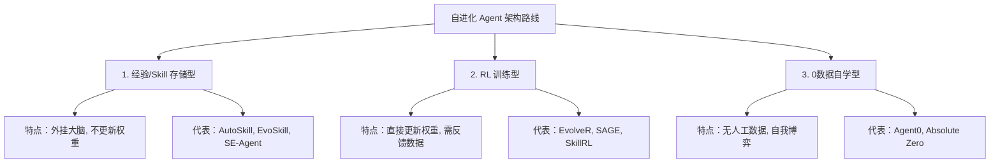
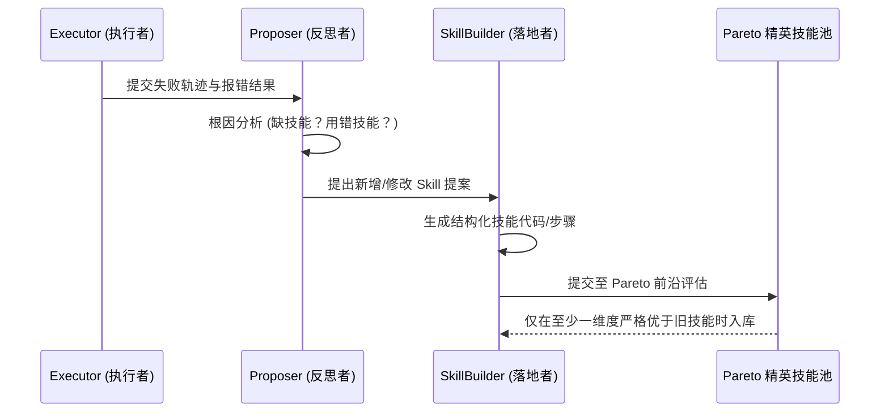

    

        

            

            

            

        

        
bash

    

    

        
ckhuang@macbookpro:~$ 我们现在用的大多数 Agent，本质上就像是拥有超强短期记忆却患有重度“失忆症”的天才。每天教会它的最佳实践，只要上下文一清空，第二天照样原地踩坑。如何让 Agent 自己把错误沉淀成技能包，实现真正的“自我进化”？今天我们就来扒一扒这层皮。 

    

在日常的架构设计和 AI 落地实战中，我们经常遇到这样一个痛点：**优质数据越来越贵，人工微调越来越卷**。

无论是微调（SFT）还是强化学习（RL），传统的模型成长路径都高度依赖人工介入。但大模型的终极目标，或者说 AGI 的必然形态，一定是一个能在与环境交互中**自主积累经验、提炼技能、自我迭代**的系统。这就是我们今天的主角：**自进化 Agent（Self-Evolving Agent）**。

读完本文，你将了解目前学术界与工业界在“Agent 永续成长”赛道上的三大核心技术路线，并掌握其背后的架构逻辑和演进趋势。

---

## 一、为什么我们需要“自进化”？

大模型固然强大，但在构建实际 Agent 产品时，几个“老大难”问题始终如影随形：
1. **静态知识冻结**：训练完成那一刻，模型的认知边界就被焊死了。
2. **上下文的物理极限**：哪怕是百万 token 窗口，面对真正长周期的复杂业务交互，依然会“断片”。
3. **重复交学费**：没有持久化的经验沉淀，系统会在同一类长尾 case 上反复失败。
4. **进化成本高昂**：每次想要引入新知识或新技能，都要重新拉起昂贵的训练 pipeline。

自进化 Agent 的核心诉求，就是要打破这种限制。它必须做到三件事：**能存**（把成功模式和失败教训写下来）、**能用**（在新任务中精准检索并内化决策）、**能进化**（动态合并、淘汰陈旧技能，防止经验库变垃圾堆）。

---

## 二、自进化 Agent 的三大技术路线

经过对近期十几篇顶会与前沿论文的拆解，我们可以按照“**是否更新模型权重**”和“**是否依赖人工数据**”这两个核心维度，将目前的自进化架构划分为三大流派：

简单来说：
- **第一类**是给 Agent 配一本“错题本和工作指南”，每次做题前翻一翻；
- **第二类**是把工作指南上的经验，通过 RL（强化学习）直接“焊”进模型的神经元里；
- **第三类**最野，连老师都不要了，左右互搏，自己出题自己考。

---

## 三、深度剖析路线一：经验存储型（外挂大脑）

在实际的业务架构落地中，第一类“不改模型权重”的方案工程性价比最高，也是目前最成熟的范式。它的精髓在于：**把交互的副产物沉淀为可检索的资产（Skill）。**

### 1. “失败即学习”的进化闭环 (EvoSkill)

传统的 Agent 遇到失败，最粗暴的做法就是 ReAct（反思再试一次），但这依然是在单次会话里打转。EvoSkill 提出了一套非常优雅的 **三 Agent 分工架构**：

在这个架构中，失败不再是异常，而是进化的“原材料”。通过 Pareto 精英池的筛选，保证了技能库在规模膨胀时依然“精而不滥”。

### 2. 测试驱动的技能进化 (CoEvoSkills)

总结出来的经验到底靠不靠谱？不能只靠 LLM 的“自觉”。CoEvoSkills 把软件工程里 **TDD（测试驱动开发）** 的思想搬了过来：

每次生成新 Skill 时，**必须同步生成对应的单元测试**。Skill 和 Test 在隔离沙盒里相互校验。这就相当于给 Agent 请了一个廉价但严厉的“考官”（Verifier）。有趣的是，实验证明：**让小模型自己生成技能并自己使用，效果甚至优于把大模型（如 Opus）生成的精巧技能生硬地迁移给小模型。** 

这告诉我们一个深刻的架构道理：**技能的抽象必须匹配执行者的认知层级。**

### 3. 多线程横向融合：跳出单轨迹的最优解 (SE-Agent)

很多时候，一条执行轨迹一开始就走偏了，你怎么纵向反思（Self-refine）都救不回来。SE-Agent 的破局点在于**横向融合**：
- 同时用“贪心策略”、“防御式策略”、“先写测试策略”跑出多条轨迹；
- 把轨迹 A 中的精准定位，嫁接到轨迹 B 的异常处理上（Crossover）；
- 最终重组出一条任何单一策略都无法达到的完美轨迹。

这种做法从根本上突破了单线程思考的“局部最优陷阱”。

---

## 四、走向纵深：RL 训练型自进化

第一类工作再精妙，也有瓶颈：每次都要消耗大量的 prompt 上下文去加载“外挂经验”，不仅慢，而且贵。第二类工作（如 SAGE、EvolveR）的思路就是：**把经验直接训进权重里**。

以 **SAGE (Sequential Rollout)** 为例，它的设计非常巧妙：
在 RL 训练的 rollout 阶段，不让 Agent 孤立地跑单个任务，而是让它**序列化地跑一串相似任务**。在跑前序任务时生成的技能，在同一串任务的后半段就可以直接拿来复用。这就逼着模型在训练阶段不仅要学会“做题”，更要学会“总结解题套路并举一反三”。

这种把**“生成技能”**和**“复用技能”**内化为模型本能的做法，是通往终极自进化形态的必经之路。

---

## 五、CK·黄的架构洞察

    “自进化不仅是算法层面的参数博弈，更是工程架构层面的记忆与反馈重构。你设计的经验抽象层级，决定了系统能力的迁移广度。” —— CK·黄

回顾这些前沿工作，作为架构师，我们应该看到其中的几个关键趋势：

1. **“总结”环节被严重低估**：目前绝大多数系统把提炼技能的工作交给了冻结的 Base 模型。但如何针对“总结经验”这个动作本身去设计奖励函数，优化专用模型，是一片巨大的蓝海。
2. **横向 vs 纵向的反思**：单点的纵向反思已经遇到瓶颈，未来的 Agent 架构必须引入“多视角采样+横向交叉重组”的并发工作流。
3. **从“有监督”到“左脚踩右脚”**：最终极的进化，必然是抛弃人工评判，走向完全的 Zero-Data。让 Agent 自己出题、自己验证、自己沉淀，形成自我增强的飞轮。

从外挂错题本，到肌肉记忆，再到左右互搏，Agent 正在以我们难以想象的速度“长出脑子”。在这场进化的浪潮中，掌握经验沉淀架构的开发者，才能真正构建出具有生命力的 AI 员工。

---
*本文基于前沿自进化 Agent 论文的深度解析与实战思考总结，希望能为在 AI Agent 架构之路上探索的你提供一点启发。*