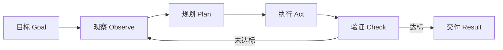
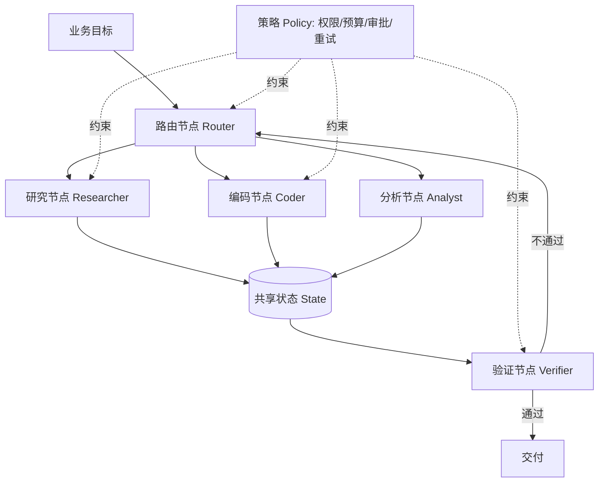
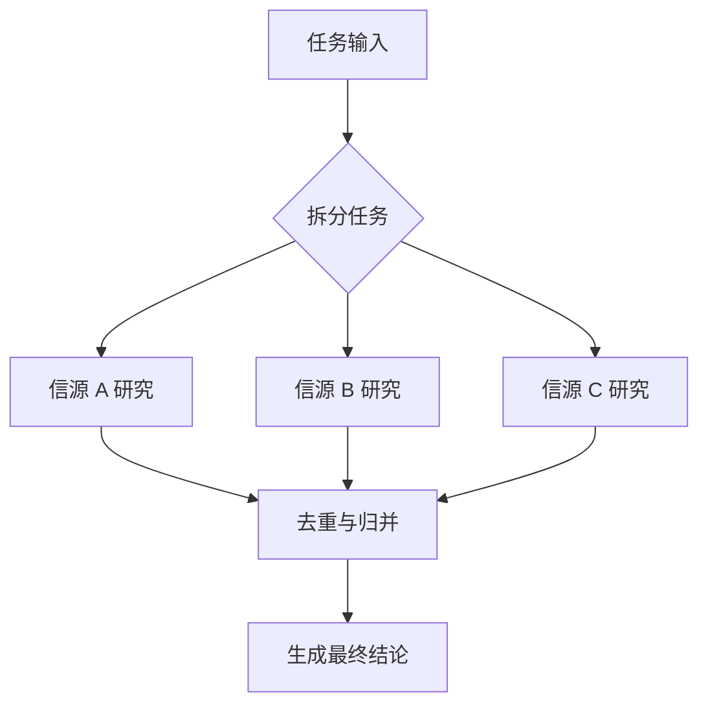
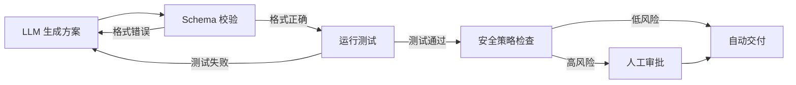
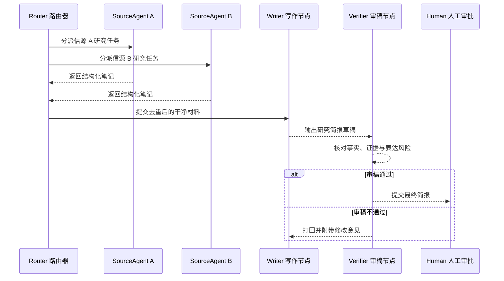
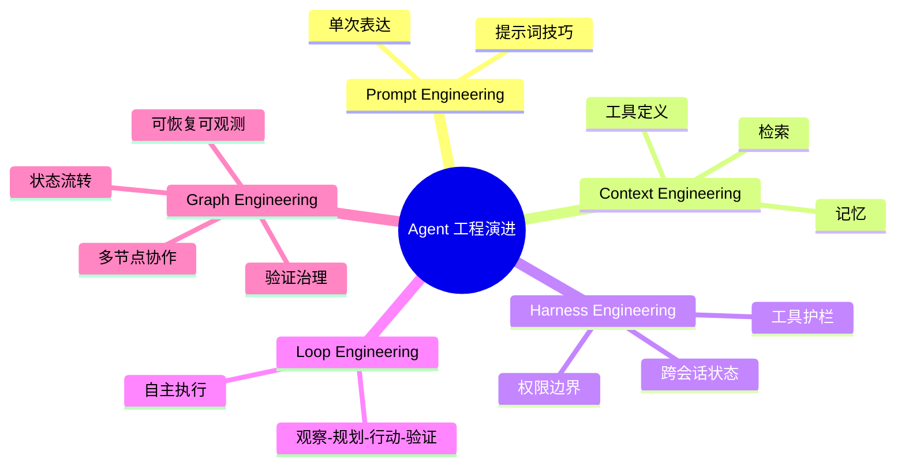

<div style="background-color: #1e1e1e; color: #00ff00; font-family: 'Courier New', Courier, monospace; border-radius: 8px; padding: 20px; box-shadow: 0 10px 30px rgba(0,0,0,0.3); margin-bottom: 30px; margin-top: 20px; position: relative; overflow: hidden;">
    <div style="display: flex; align-items: center; margin-bottom: 15px; padding-bottom: 10px; border-bottom: 1px solid #333;">
        <div style="display: flex; gap: 8px; margin-right: 15px;">
            <div style="width: 12px; height: 12px; border-radius: 50%; background-color: #ff5f56;"></div>
            <div style="width: 12px; height: 12px; border-radius: 50%; background-color: #ffbd2e;"></div>
            <div style="width: 12px; height: 12px; border-radius: 50%; background-color: #27c93f;"></div>
        </div>
        <div style="color: #ccc; font-size: 0.9em;">bash</div>
    </div>
    <div>
        <p style="margin: 5px 0; line-height: 1.6;"><span style="color: #008AFF; font-weight: bold;">ckhuang@macbookpro:~$</span> Loop Engineering 没有死，它只是从“单个 Agent 自己转圈”升级到了“多个节点按规则协作”。真正的问题不是要不要画图，而是你的 AI 系统是否已经复杂到必须被拆分、观测、验证和恢复。 <span style="display: inline-block; width: 8px; height: 16px; background-color: #00ff00; vertical-align: middle;"></span></p>
    </div>
</div>

最近，“Graph Engineering”这个词突然火了。起点很有互联网味道：OpenClaw 创始人 Peter Steinberger 在 X 上发了一句“我们还在聊 loops，还是已经转向 graphs 了？”，三天内拿到 270 万浏览。没有新模型，没有新框架，没有新论文发布，一个工程术语就这样被推上了热搜。

如果只看表面，这像极了技术圈熟悉的“换壳造词”：过去讲 Prompt Engineering，后来讲 Context Engineering，再到 Harness Engineering、Loop Engineering，现在又来了 Graph Engineering。

但我更愿意把它看成一个真实工程拐点的命名：**当 Agent 从个人效率工具进入生产系统，单循环不再足够，系统必须开始具备组织结构。**

读完本文，你会搞清楚三件事：

1. Loop Engineering 到底解决了什么，又为什么会撞墙；
2. Graph Engineering 的本质不是“多智能体炫技”，而是状态、路由、验证与治理；
3. 什么时候该上 Graph，什么时候继续用一个简单 Loop 反而更专业。

---

## 一、先别急着“宣布 Loop 死亡”

技术圈特别喜欢“某某已死”的标题。可真正做过生产系统的人都知道，上一代范式很少突然死亡，它通常会变成下一代范式里的一个局部组件。

Loop Engineering 的价值非常明确：它把人肉驱动的“你说一句、AI 做一步”变成了 Agent 自己的闭环。



在这个闭环里，Agent 不再只是聊天窗口里的问答机器人，而是能围绕目标持续推进：查资料、写代码、调用工具、跑测试、修复问题，直到验收条件满足。

这一步非常重要。很多 AI 编程工具、自动化运维助手、数据分析 Agent，核心都是这种循环：

- 给定目标；
- 让模型观察环境；
- 调用工具执行动作；
- 根据反馈继续下一轮；
- 最终输出结果。

所以，Loop 并没有错。问题是，**当一个 Loop 被迫承担所有角色时，它会变成一个“全能但混乱”的人。**

这就像一个项目里，需求分析、架构设计、编码、测试、上线审批、事故复盘都让同一个人闭门完成。小任务还能扛，大任务迟早出事。

---

## 二、Loop 的五个结构性短板

原文把 Loop 的问题拆得很清楚：上下文腐烂、错误级联、工具过载、控制粒度不足、可观测性差。结合我自己做分布式系统和 Agent 工程的经验，这些问题并不是模型“不够聪明”，而是**系统形状不对**。

### 1. 上下文腐烂：所有东西都塞进一个脑袋

Loop 每转一轮，都会把思考、工具调用、错误日志、历史尝试塞回上下文。前几轮还算清爽，十几轮后就像一个没人维护的日志目录：什么都有，但很难找到关键事实。

模型在这种上下文里容易出现两个问题：

- 原始目标被中间噪声淹没；
- 模型开始对自己的历史输出过度解释，越绕越远。

这和大数据系统里的“脏数据扩散”很像：不是没有数据，而是没有边界、没有血缘、没有清洗策略。

### 2. 错误级联：在同一条推理链里很难自救

单 Loop 出错后，通常让同一个模型继续反思并修复。听起来合理，实际很危险。因为它很可能沿着同一个错误假设继续往下走，只是换一种说法重试。

最典型的场景是工具调用失败：参数错了，模型换个参数；还错，再换；最后 token 烧了一堆，根因仍然没定位。

### 3. 工具过载：工具越多，选择越困难

一个 Agent 挂 3 个工具时，模型还能比较稳定地选择；挂 20 个工具时，工具描述之间会相互干扰。两个功能相近的工具，模型很容易选错。

这不是 LLM 独有的问题。人类工程团队也一样：权限、入口、平台、流程太多，最后大家会走最熟悉但未必正确的路径。

### 4. 控制粒度不足：要么跑完，要么杀掉

生产系统里，我们经常需要：

- 某一步等待人工审批；
- 高风险动作使用更强模型；
- 中间产物先过格式校验；
- 某个子任务失败后只重跑局部。

单 Loop 很难优雅表达这些控制点。它像一根长长的 shell 脚本：能跑，但一旦中间状态复杂，恢复和审计都很痛苦。

### 5. 可观测性差：知道发生了什么，不知道为什么这样发生

Loop 的轨迹通常是一长串对话和工具调用。你能看到它“做过什么”，但很难回答：

- 哪个决策导致了最终错误？
- 哪个中间节点质量不达标？
- 是否可以只替换某个步骤？
- 能否把某段流程沉淀成可复用组件？

这正是 Graph Engineering 想解决的问题。

<div style="text-align: center; font-size: 1.2em; font-style: italic; color: #008AFF; margin: 40px 0 20px; padding: 20px; border-top: 1px dashed #ccc; border-bottom: 1px dashed #ccc;">
    “Loop 解决执行连续性，Graph 解决系统可治理性。前者让 Agent 动起来，后者让 Agent 群体可控地跑起来。” —— CK·黄
</div>

---

## 三、Graph Engineering 到底是什么？

不要把 Graph Engineering 简单理解成“画流程图”。流程图是给人看的，Graph Engineering 要构建的是**机器可以执行、系统可以观测、失败可以恢复的运行结构**。

一个可运行的 Graph，至少包含四类要素：

```text
G = (V 节点, E 边, S 状态, P 策略)
```

- **V / Node 节点**：负责执行具体任务，可以是一个专职 Agent，也可以是一段确定性代码；
- **E / Edge 边**：负责路由与依赖，决定下一步去哪里；
- **S / State 状态**：负责承载任务、证据、预算、产物、检查点；
- **P / Policy 策略**：负责权限、审批、预算、失败重试、风险控制。

用 Mermaid 表达，大概是这样：



这里有一个关键点：**Graph 的价值不是节点数量，而是边界清晰。**

一个好的 Graph 会把复杂任务拆成多个上下文干净、职责明确、输入输出稳定的节点。每个节点只做一件事，节点之间通过结构化状态交接。这样做带来的好处非常实在：

- 某个节点坏了，可以局部修；
- 某个步骤贵了，可以换便宜模型；
- 某个产物风险高，可以加验证器；
- 某条路径不稳定，可以单独观测和优化。

这与分布式系统设计有很强的同构性：我们不会把所有业务逻辑塞进一个巨大的单体服务，然后祈祷它永远正确；我们会拆服务、定义接口、做监控、加熔断、设重试、保留审计日志。Graph Engineering 其实就是 Agent 系统进入“工程化治理阶段”的表现。

---

## 四、最常见的三种 Graph 拓扑

原文提到的几类模式很值得记住，因为它们不是概念游戏，而是已经在真实 Agent 系统里反复出现的工程形状。

### 1. 扇出 / 扇入：并行搜索，再统一收敛

这是最经典的“菱形结构”。适合研究、调研、代码评审、竞品分析等任务。



它解决的是两个问题：

- **速度**：多个分支并行执行；
- **覆盖面**：多个视角交叉验证，降低单一路径遗漏。

在我看来，这个模式是最容易落地、也最不容易过度设计的 Graph 起点。

### 2. 主管 / 工人：动态拆解与汇总

Orchestrator-Workers 模式更像一个项目经理带多个专家。主管节点负责任务拆解、分派、汇总，工人节点负责具体执行。

它适合任务结构在运行前无法完全确定的场景，比如复杂研究、跨模块代码修改、问题排查等。

风险也很明显：主管节点如果判断错了，会把错误分解扩散给所有工人。所以这个模式通常必须配合验证器和预算控制。

### 3. 流水线：固定步骤，逐级过关

Prompt Chaining / Pipeline 适合步骤清晰、顺序固定的任务。例如：

1. 抽取信息；
2. 结构化整理；
3. 规则校验；
4. 生成报告；
5. 审稿发布。

流水线的优势不是灵活，而是稳定。它用更高的延迟换更好的可控性，非常适合对质量有明确要求的长期任务。

---

## 五、Graph 真正的杠杆：确定性，而不是“多智能体”

很多人听到 Graph Engineering，第一反应是“我要不要堆一堆 Agent？”这是一个危险误区。

Graph 的关键不在于多，而在于**把不确定性关进笼子里**。

LLM 擅长判断、生成、推理、归纳，但不擅长做确定性校验。格式是否合法、测试是否通过、预算是否超限、数据是否重复、权限是否允许，这些都应该交给普通代码和规则系统。

一个成熟的 Graph，通常会把节点分成两类：

- **概率型节点**：由 LLM/Agent 执行，负责理解、生成、判断；
- **确定型节点**：由代码/规则/测试执行，负责校验、路由、过滤、计费、审计。



这也是我最认同的一点：**让模型的判断力落在节点上，让代码的可靠性落在边上。**

如果一张 Graph 里所有节点都只是模型互相点评，没有任何节点触达真实世界、测试系统、业务指标或用户反馈，那它只是一个组织结构更漂亮的幻觉生成器。

真正的锚点必须来自现实：

- 测试真的跑过；
- 指标真的恢复；
- 数据真的一致；
- 用户真的留存；
- 成本真的下降；
- 风险真的被拦截。

---

## 六、一个具体例子：每日研究简报该怎么做？

原文用了“每日研究简报”这个例子，非常适合说明 Loop 与 Graph 的区别。

如果用一个 Loop，它会这样工作：搜索资料、阅读网页、写摘要、再审查自己的摘要。问题是，等它审查时，上下文里已经混入了大量搜索噪声、半成品推理和历史尝试。让它在这个上下文里自审，就像让作者自己给试卷打分，基本都会觉得“我写得挺好”。

换成 Graph，可以拆成三类节点：

1. **研究节点**：并行读取多个信源，只输出结构化笔记；
2. **写作节点**：只读取干净笔记，不接触原始噪声；
3. **审稿节点**：在全新上下文里，只看简报、证据和验收标准。



这个结构的好处很直观：

- 研究上下文和写作上下文隔离；
- 审稿节点拥有“干净眼睛”；
- 多信源可以并行；
- 失败可以局部回滚；
- 每一步都有明确产物可审计。

当然，它也不是免费的。你要维护多个提示词、设计状态结构、处理合并遗漏、避免路由死循环。**所以 Graph 不是免费午餐，它是复杂度换确定性的工程投资。**

---

## 七、什么时候该用 Graph？什么时候不要？

Anthropic 在相关实践里给过很务实的建议：先从简单方案开始，只有在确实需要时再增加复杂度。这个判断非常重要。

我会用下面这张表做决策：

| 判断问题 | 更适合 Loop | 更适合 Graph |
|---|---|---|
| 任务频率 | 偶尔执行一次 | 高频、长期、可复用 |
| 上下文规模 | 信息量小、路径短 | 多信源、多阶段、上下文容易污染 |
| 风险等级 | 失败成本低 | 需要审计、审批、回滚 |
| 并行潜力 | 基本串行 | 可拆成多个独立分支 |
| 质量要求 | 粗略可用即可 | 需要验证器和确定性检查 |
| 工具数量 | 少量工具 | 多工具、多权限、多策略 |

一句话总结：

- **一次性、小规模、低风险任务**：用 Loop，甚至一次 LLM 调用就够；
- **长期运行、高价值、高风险、可并行任务**：考虑 Graph；
- **没有现实校验点的“多 Agent 互聊”**：谨慎，可能只是更贵的幻觉。

在企业落地里，我尤其建议从两个地方开始 Graph 化：

1. **验证器节点**：把生成与评审拆开，这是性价比最高的第一步；
2. **确定性边**：把测试、Schema 校验、权限检查、预算控制交给代码。

这两步做完，再考虑更复杂的主管-工人、多分支搜索和动态路由。

---

## 八、我的架构判断：Graph Engineering 是 Agent 的“组织化阶段”

从 Prompt 到 Context，再到 Harness、Loop、Graph，这条演进线其实很清楚：



Prompt Engineering 解决“怎么说”；Context Engineering 解决“给模型看什么”；Harness Engineering 解决“模型能在什么边界内行动”；Loop Engineering 解决“如何让单个 Agent 持续推进”；Graph Engineering 解决“如何让一组 Agent、工具、规则和人协同工作”。

这不是简单替代关系，而是一层层向外扩展。

在分布式架构里，我们早就学过类似教训：一个巨大的循环，最终会变成不可维护的单体；一张没有治理的图，也会变成分布式泥球。真正高级的地方，不是把系统拆开，而是拆开后仍然能保持一致性、可观测性和可恢复性。

<div style="background-color: #1e1e1e; color: #00ff00; font-family: 'Courier New', Courier, monospace; border-radius: 8px; padding: 20px; box-shadow: 0 10px 30px rgba(0,0,0,0.3); margin-bottom: 30px; margin-top: 20px; position: relative; overflow: hidden;">
    <div style="display: flex; align-items: center; margin-bottom: 15px; padding-bottom: 10px; border-bottom: 1px solid #333;">
        <div style="display: flex; gap: 8px; margin-right: 15px;">
            <div style="width: 12px; height: 12px; border-radius: 50%; background-color: #ff5f56;"></div>
            <div style="width: 12px; height: 12px; border-radius: 50%; background-color: #ffbd2e;"></div>
            <div style="width: 12px; height: 12px; border-radius: 50%; background-color: #27c93f;"></div>
        </div>
        <div style="color: #ccc; font-size: 0.9em;">bash</div>
    </div>
    <div>
        <p style="margin: 5px 0; line-height: 1.6;"><span style="color: #008AFF; font-weight: bold;">ckhuang@macbookpro:~$</span> 最好的 Agent 架构不是“看起来很智能”，而是每一步都知道谁在做、为什么做、做错了怎么发现、发现后怎么恢复。Graph Engineering 的价值，正在这里。 <span style="display: inline-block; width: 8px; height: 16px; background-color: #00ff00; vertical-align: middle;"></span></p>
    </div>
</div>

**最后留一个判断标准：如果你无法画出系统的状态如何流动、错误如何回滚、验证器在哪里、哪些动作由代码保证确定性，那你拥有的可能不是 Graph Engineering，而只是一堆 Agent 的热闹聊天群。**

工程的终点从来不是更酷的术语，而是更稳定的交付。