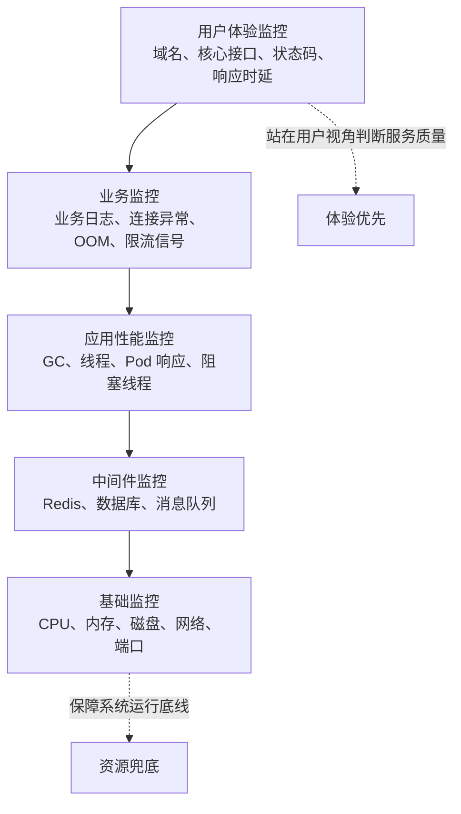
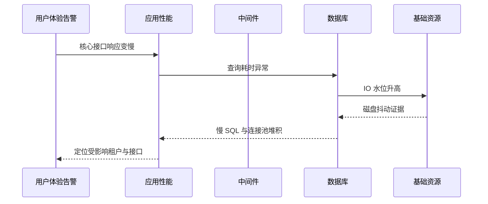
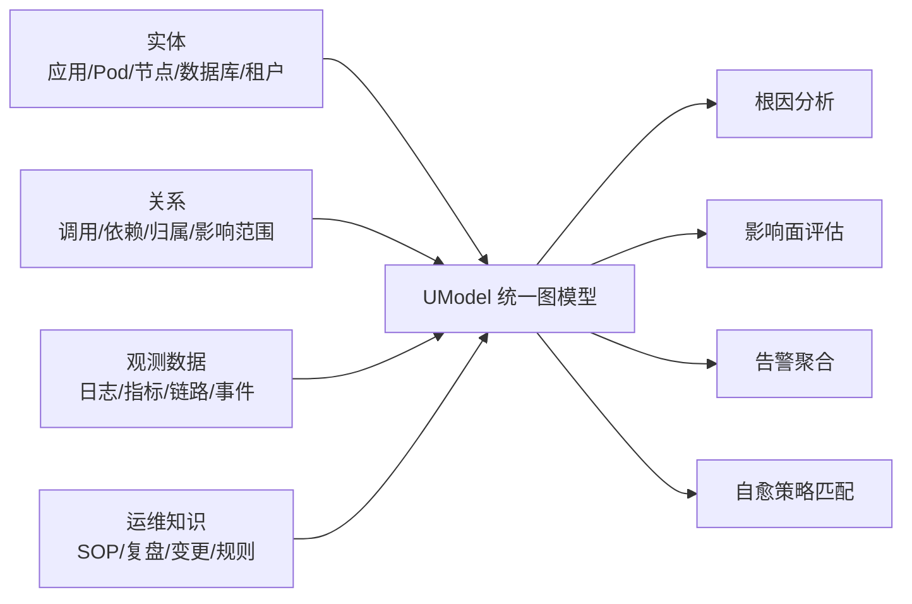
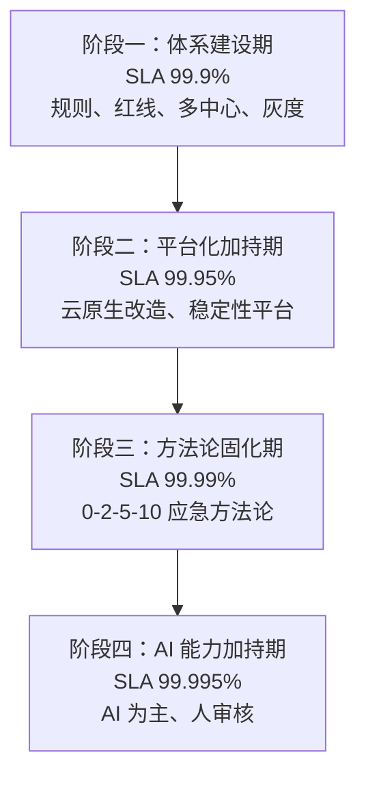
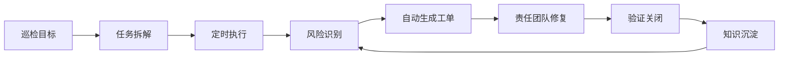
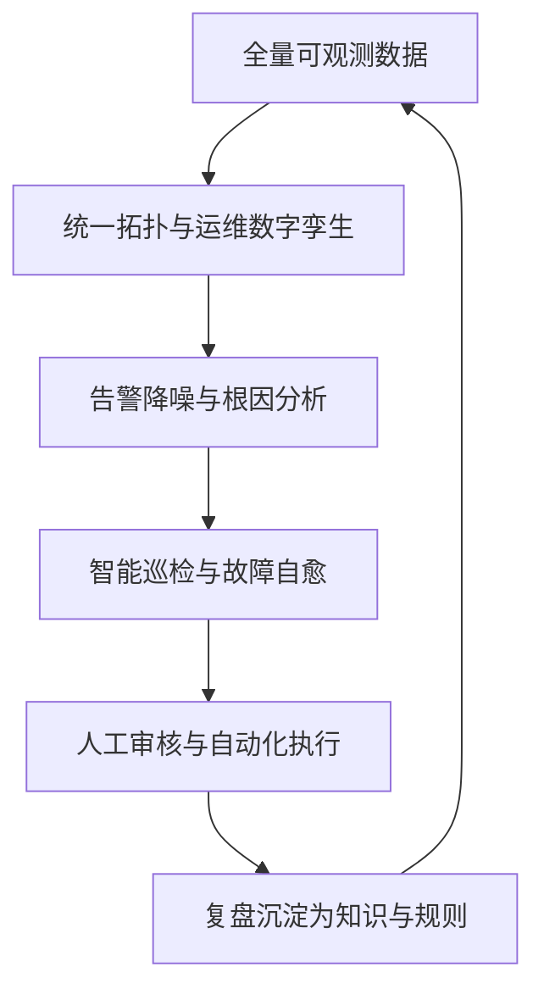

    

        

            

            

            

        

        
bash

    

    

        
ckhuang@macbookpro:~$ 真正的 AIOps 不是给告警套一层大模型外壳，而是先把“看得见、管得住、能执行”的工程底座打牢，再让 AI 接管高频、标准化、可验证的运维闭环。

    

很多团队一谈智能运维，第一反应就是：接个大模型、建个机器人、让它帮忙分析告警。

但真实生产环境不会这么温柔。SaaS、多租户、多中心、云原生、微服务、数据库、中间件、网关、日志、链路、容量、成本……这些变量叠在一起之后，问题往往不是“没有告警”，而是：

- **底层指标全绿，用户已经开始骂娘**；
- **一个存储抖动，引爆上百条告警**；
- **根因找到了，但止损动作还卡在专家经验里**；
- **事故复盘写了很多，下一次换个姿势继续摔跤**。

阿里云云原生公众号发布的《从“看得见”到“自己治”：畅捷通可观测与智能运维实践》提供了一个很有参考价值的案例：畅捷通围绕五大产线、九大集群和数百万小微企业客户，在云原生与 SaaS 化背景下，把整体 SLA 从 **99.9% 提升到 99.995%**，并将故障定位从平均 10 分钟以上压缩到 30 秒以内。

这篇文章我不做简单复述，而是从架构与工程落地视角，拆解其中最值得借鉴的三件事：**可观测分层、AIOps 演进路径、智能闭环设计**。

## 一、先承认一个现实：传统监控解决不了用户体验问题

畅捷通面临的第一个问题，被原文概括为“看不见”：CPU、内存、磁盘这些基础指标都正常，但用户侧已经出现域名访问异常、接口变慢、功能报错、页面卡顿。

这就是典型的**指标陷阱**。

在分布式系统里，基础设施指标只能说明“机器还活着”，不能说明“业务真的好用”。一个系统是否健康，至少要同时回答三类问题：

1. **资源是否健康**：CPU、内存、磁盘、网络是否异常；
2. **服务是否健康**：应用、接口、依赖、中间件是否稳定；
3. **用户是否健康**：用户请求是否成功、是否变慢、是否被错误码影响。

如果监控体系只停留在第一层，就像体检只量身高体重，然后宣布病人没事。技术上没错，业务上很危险。

## 二、五层可观测模型：从机器视角切到用户视角

畅捷通的可观测体系采用了五层模型：基础监控、中间件监控、应用性能监控、业务监控、用户体验监控。这个设计的价值在于，它不是堆工具，而是建立了从底层资源到终端体验的完整映射。

这个模型有两个关键点。

### 1. 分层不是为了报表好看，而是为了根因下钻

单独看每一层都不稀奇，难点在于跨层关联。

例如一个核心接口 P99 延迟突然升高，排查路径可能是：

如果没有统一拓扑和链路数据，团队只能在多个平台之间来回切：看日志、看监控、看链路、问 DBA、问业务同学。这个过程最消耗的不是 CPU，而是人的注意力。

### 2. 应用分级决定监控深度，避免“一刀切”

原文提到，畅捷通按应用等级设定覆盖范围：

- 三类应用至少覆盖基础监控、中间件监控、应用性能监控；
- 二类应用延伸到业务监控；
- 一类核心应用必须实现五层全覆盖。

这点非常务实。监控不是越多越好，而是要匹配业务价值和故障半径。对非核心系统强行上满全链路，最后很可能变成“数据很多，没人消费”。

    “可观测性的终点不是采集更多数据，而是让每一条数据都能服务于判断、决策和动作。” —— CK·黄

## 三、UModel 与数字孪生：AIOps 的核心不是 Chat，而是 Context

原文里一个重要技术点是：畅捷通引入云监控 2.0 基于 UModel 的运维数字孪生能力，构建应用、资源、租户三维拓扑。

这背后的意义很大。

很多所谓智能运维做不深，根因是 AI 只有“文本”，没有“上下文”。它能读告警标题，却不知道：

- 这个 Pod 属于哪个应用；
- 这个应用服务哪些租户；
- 这个接口依赖哪些数据库和消息队列；
- 最近是否发生过发布、扩容、配置变更；
- 历史上类似异常如何止损。

没有这些上下文，大模型只能做“语言推理”；有了这些上下文，AI 才能做“运维推理”。

从我做大规模分布式系统的经验看，AIOps 的成败往往不取决于模型参数有多大，而取决于运维上下文组织得是否足够结构化。**图模型、拓扑关系、标签体系、知识库、SOP，这些才是智能运维真正的“地基”。**

## 四、四阶段演进：SLA 的提升，本质是组织能力升级

畅捷通把智能运维演进分成四个阶段：体系建设期、平台化加持期、方法论固化期、AI 能力加持期。这个路径比“直接上 AI”靠谱得多。

其中“0-2-5-10”方法论很值得关注：

- **0**：事前预防目标 0 事故；
- **2**：2 分钟内及时感知，降低 MTTI；
- **5**：5 分钟内完成根因分析，降低 MTTK；
- **10**：10 分钟内止损恢复，覆盖 MTTF 与 MTTV。

这套方法论的价值，不只是指标漂亮，而是把专家经验变成团队共同语言。

我见过不少团队，故障处理高度依赖“某个老师傅在线”。老师傅在，定位如神；老师傅休假，群里开始大型考古。方法论固化的意义，就是把个人经验变成流程，把流程变成平台能力，再把平台能力交给 AI 执行。

## 五、三大智能闭环：体检、治病、控饮食

原文将 AI 场景落地拆成三类：智能巡检、故障自愈、容量预测与成本管控。这个分类很接地气，我用三个比喻来理解：**体检、治病、控饮食**。

### 1. 智能巡检：把事故挡在用户之前

智能巡检覆盖运维风险、数据库红线、变更风险等场景。它的关键不是“每天跑个脚本”，而是形成闭环：

这类能力的收益非常直接：很多事故其实不是突然发生的，而是早有征兆。容量水位缓慢逼近、慢 SQL 越来越多、配置逐渐漂移、依赖版本长期不升级，这些都是“慢性病”。巡检的价值就是提前发现慢性病，别等进 ICU 才喊救命。

### 2. 故障自愈：从“专家手搓”到“策略执行”

畅捷通针对高频故障预定义自愈策略，例如：

- 单租户资源异常消耗 → 用户隔离；
- 连接池水位突破阈值 → 接口限流；
- 单节点不可用 → 中心切换；
- 下游服务劣化 → 功能降级；
- 流量突增 → 资源扩容。

这里必须强调一点：自愈不是让 AI 随便执行生产操作。原文提到当前采用的是 **AI 感知 + 人工审核** 模式，这非常合理。

对生产系统而言，自动化动作要满足三个条件：

1. **场景明确**：故障模式可识别；
2. **动作可控**：限流、降级、切换、扩容都有边界；
3. **结果可验证**：执行后能判断是否止损成功。

没有这三个条件，所谓自愈很容易变成“自动制造二次事故”。

### 3. 容量预测与成本管控：可用性和成本不是对立面

传统容量告警依赖静态阈值，比如 CPU 超过 80% 报警。这种方式简单，但不聪明：

- 业务有周期性峰谷，静态阈值容易误报；
- 容量不足往往需要提前数天准备，临界点报警已经太晚；
- 资源过度冗余又会造成成本浪费。

畅捷通引入 AI 时序预测能力，结合历史容量规律、业务增长趋势和突变事件检测，提前识别容量风险，并与 FinOps 成本管控联动。

这说明一个成熟的 AIOps 系统不只追求“不宕机”，还要追求“以合理成本不宕机”。在云上，这个认知尤其重要，因为资源弹性很美好，账单也很真实。

## 六、我看到的关键启示：AIOps 是一条工程链路，不是一个单点工具

从这个案例里，我总结出四个判断。

### 1. 没有可观测，AI 只能猜

日志、指标、链路、事件、拓扑、租户、变更、知识库，这些数据如果没有打通，AI 就无法形成稳定判断。智能运维的第一步永远是可观测工程。

### 2. 没有方法论，平台只是工具箱

平台能提供能力，但不能自动形成组织协作方式。畅捷通从红线规范、灰度发布、多中心架构，到“0-2-5-10”应急方法论，本质上是在建立组织级稳定性语言。

### 3. 没有自动化动作，诊断再准也只是旁观者

很多团队能做到“发现问题”和“定位问题”，但卡在“执行动作”。真正的闭环必须走到限流、降级、切换、扩容、隔离、工单、验证这些动作层。

### 4. 没有知识沉淀，AI 不会越用越聪明

原文最后提到“可观测数据 → AI 分析 → 自动化动作 → 知识沉淀”的正循环，这句话非常关键。每一次故障如果不能变成规则、SOP、知识和训练样本，团队就只是在重复交学费。

## 结语：从“看见问题”到“系统自己变强”

畅捷通这个案例最有价值的地方，不是用了某个单点产品，也不是喊了 AIOps 口号，而是完整呈现了一条路径：

这条路径的本质，是让系统从“被动响应故障”进化到“主动预防风险”，再进一步走向“持续自我优化”。

    

        

            

            

            

        

        
bash

    

    

        
ckhuang@macbookpro:~$ AIOps 的终局不是替运维写一份更漂亮的故障分析报告，而是把故障发现、定位、止损、验证、复盘沉淀成一个越来越强的自治系统。

    

原文链接：[从“看得见”到“自己治”：畅捷通可观测与智能运维实践](https://mp.weixin.qq.com/s/3b34j-J5_rag9luBSzrhdA)
