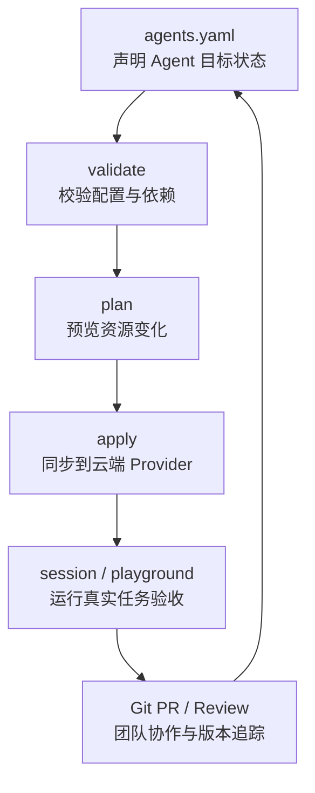
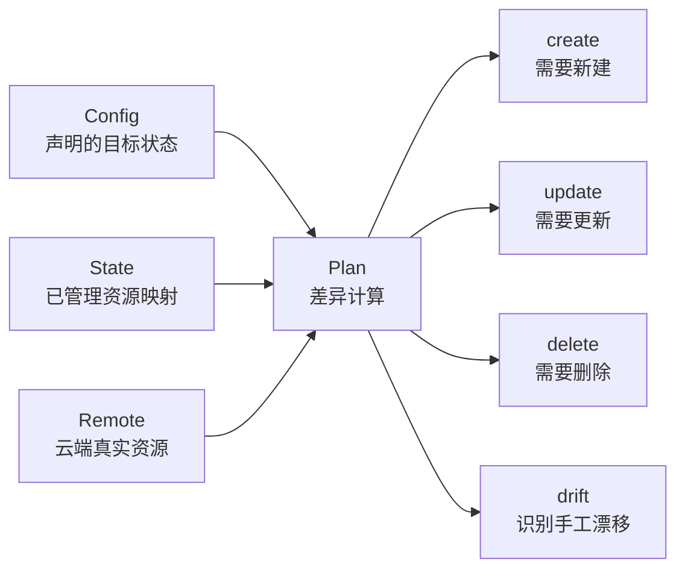
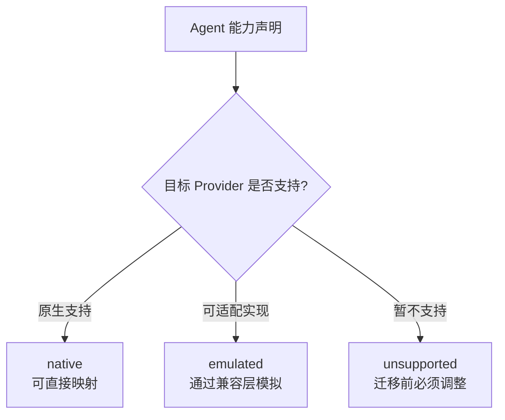
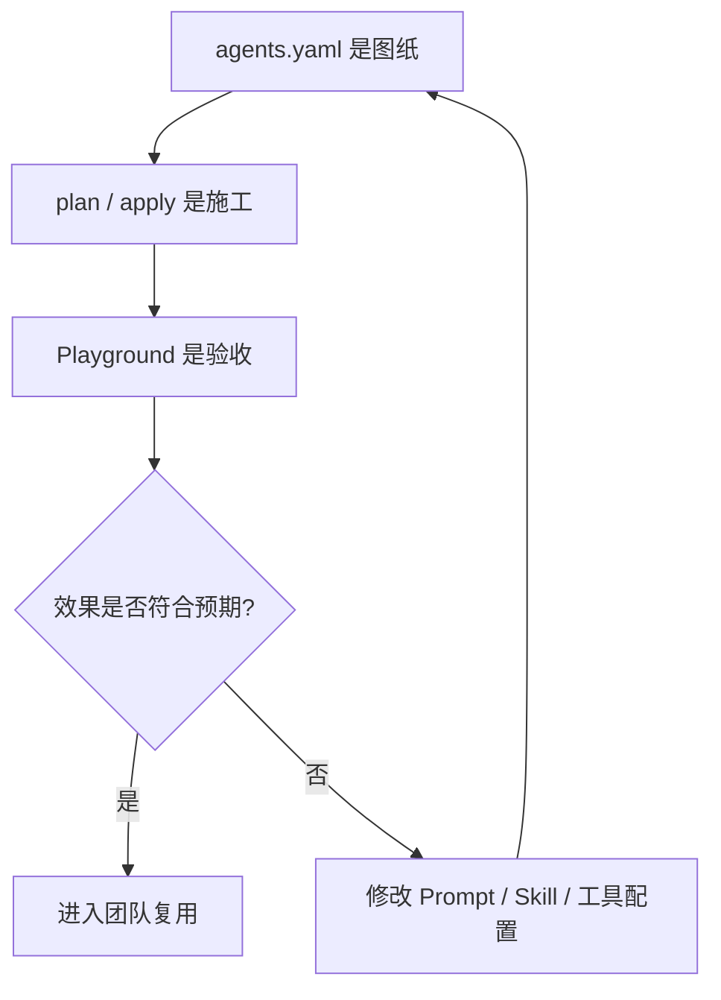

<div style="background-color: #1e1e1e; color: #00ff00; font-family: 'Courier New', Courier, monospace; border-radius: 8px; padding: 20px; box-shadow: 0 10px 30px rgba(0,0,0,0.3); margin-bottom: 30px; margin-top: 20px; position: relative; overflow: hidden;">
    <div style="display: flex; align-items: center; margin-bottom: 15px; padding-bottom: 10px; border-bottom: 1px solid #333;">
        <div style="display: flex; gap: 8px; margin-right: 15px;">
            <div style="width: 12px; height: 12px; border-radius: 50%; background-color: #ff5f56;"></div>
            <div style="width: 12px; height: 12px; border-radius: 50%; background-color: #ffbd2e;"></div>
            <div style="width: 12px; height: 12px; border-radius: 50%; background-color: #27c93f;"></div>
        </div>
        <div style="color: #ccc; font-size: 0.9em;">bash</div>
    </div>
    <div>
        <p style="margin: 5px 0; line-height: 1.6;"><span style="color: #008AFF; font-weight: bold;">ckhuang@macbookpro:~$</span> 真正值得沉淀的不是某一次 Agent 对话，而是那套能被复现、验证、协作迭代的工作流。OpenAgentPack 的价值，正是把云端 Agent 从“控制台资产”变成“工程资产”。<span style="display: inline-block; width: 8px; height: 16px; background-color: #00ff00; vertical-align: middle;"></span></p>
    </div>
</div>

很多团队在做 AI Agent 落地时，会遇到一个很尴尬的问题：Agent 在某个平台、某个账号、某台电脑上被调得很好用，但一旦换环境，就像搬家时发现家具都焊死在墙上一样。

Prompt 在控制台里，MCP 配置散在另一个页面，Skill 是一组本地文件，知识库和凭据又在平台侧；真正决定 Agent 能力的运行参数、模型、Memory、调度方式，也常常缺少统一的声明与版本记录。

于是，团队最终带走的可能不是一个可运行的 Agent，而是一堆截图、几段 Prompt，以及一句很熟悉的工程灾难宣言：**“我记得当时是这么配的。”**

阿里云云原生公众号发布的《OpenAgentPack 开源：让云端 Agent 像代码一样可管理、可迁移》切中的正是这个痛点。OpenAgentPack 的目标很明确：用一份 `agents.yaml` 描述云端 Agent 工作流，并通过 `validate → plan → apply` 的方式，把 Agent 的配置、部署和验证纳入 Git 管理。

这篇文章我会忠于原文核心信息，从工程架构视角拆解 OpenAgentPack 解决的问题，以及它为什么可能成为 AgentOps / Agentic DevOps 体系中的关键拼图。

## 一、Agent 真正难迁移的不是 Prompt，而是工作流

如果只把 Agent 理解成一段 Prompt，那迁移并不难：复制、粘贴、保存，三连结束。

但一个能完成真实工作的云端 Agent，通常至少包含这些要素：

- **模型与运行环境**：选择哪个模型、运行在哪个 Provider、有哪些能力约束；
- **系统指令与角色定义**：Agent 的职责边界、输出规范、判断标准；
- **工具与 MCP**：它能调用哪些外部系统，工具参数与权限如何声明；
- **Skill 与知识文件**：沉淀下来的任务方法、领域知识、模板和流程；
- **凭据引用**：密钥不应写死在配置里，但配置必须知道如何引用；
- **Memory 与任务调度**：哪些上下文需要长期保留，哪些任务需要定时运行；
- **团队协作机制**：谁改了什么，为什么改，能不能回滚。

这些内容叠在一起，才构成一个“会干活”的 Agent。

<div style="text-align: center; font-size: 1.2em; font-style: italic; color: #008AFF; margin: 40px 0 20px; padding: 20px; border-top: 1px dashed #ccc; border-bottom: 1px dashed #ccc;">
    “Prompt 是 Agent 的台词，工作流才是 Agent 的肌肉和骨架。” —— CK·黄
</div>

原文提到的行业研究 Agent 是一个很典型的例子：它不是简单回答问题，而是会读取访谈记录和市场资料、判断信源、调用工具，再输出结论先行的研究报告。这样的 Agent 一旦沉淀下来，它承载的是研究框架、信源判断、工具使用方式和交付标准。

如果这些东西只存在某个平台控制台里，本质上就是一份不可审计、不可复现、不可迁移的“手工配置资产”。

## 二、OpenAgentPack 的核心思路：把 Agent 带回 Git

OpenAgentPack 用一份 `agents.yaml` 描述 Agent 工作流，并让 Git 保存其演进。原文给出的核心流程非常简洁：

```text
agents.yaml → validate → plan → apply
```

这条链路背后的工程含义并不简单：

1. **声明式配置**：用 `agents.yaml` 描述目标状态，而不是依赖控制台点击；
2. **本地校验**：通过 `agents validate` 发现配置错误与依赖缺失；
3. **变更预览**：通过 `agents plan` 看到即将创建、更新、删除的资源；
4. **执行部署**：通过 `agents apply` 把声明同步到云端 Provider；
5. **真实验收**：通过 Session 或 Playground 运行任务，验证 Agent 效果。

这套设计很像基础设施领域的 Terraform / GitOps 思想：不是登录控制台手改资源，而是把目标状态写进代码仓库，再通过工具完成校验、差异分析和应用。



原文给出的研究 Agent 配置示意如下，我把结构稍微整理成更容易阅读的形式：

```yaml
# 这里声明可复用的 Skill，source 指向本地目录，便于随代码仓库一起版本化管理。
skills:
  industry-research:
    source: ./skills/industry-research/

# 这里声明具体 Agent，instructions、environment、skills 共同决定它如何工作。
agents:
  researcher:
    instructions: ./prompts/researcher.md
    environment: dev
    skills:
      - industry-research
```

注意，这里最关键的不是 YAML 语法，而是**把过去散落在平台里的 Agent 能力显式化、结构化、版本化**。

## 三、Plan 的价值：让“迁移”不再靠猜

很多人会低估 `plan` 的价值。因为在简单场景里，似乎直接 apply 就好了。

但在真实企业环境中，Agent 往往不是单个资源，而是一组相互依赖的资源集合。贸然同步配置，可能带来三个风险：

- 不知道会创建哪些资源；
- 不知道会覆盖哪些已有配置；
- 不知道控制台里的手工修改是否会被误删或覆盖。

OpenAgentPack 的 `plan` 会比较三类状态：

- **Config**：`agents.yaml` 中期望得到的 Agent；
- **State**：已管理资源、远端 ID、内容哈希之间的映射；
- **Remote**：Provider 上真实存在的资源。



这里有一个很重要的工程判断：**Agent 工作流不是静态文档，而是运行中的生产资产。**

只保存 Prompt 文件，最多算备份；能识别远端差异、预览变更、追踪漂移，才开始接近可治理的工程系统。

在分布式系统里，我们早就知道“声明状态”和“实际状态”之间一定会出现偏差；Kubernetes 有控制循环，Terraform 有 state，GitOps 有 drift detection。Agent 进入生产后，也需要类似的工程治理能力。

## 四、Provider 差异不可避免，但必须显式化

原文有一句话很关键：不同 Provider 的能力确实不同，OpenAgentPack 会明确标识某项能力是 `native`、`emulated` 还是 `unsupported`。

这点非常务实。

做过跨云、跨数据库、跨消息队列迁移的人都知道，最危险的不是“不兼容”，而是“假装兼容”。

- **native**：目标平台原生支持该能力；
- **emulated**：目标平台不完全原生支持，但可以通过适配方式模拟；
- **unsupported**：目标平台暂不支持，需要调整设计或放弃迁移这部分能力。



从架构设计角度看，这比做一个“万物皆可迁移”的口号更有价值。因为它把风险提前暴露在 plan 阶段，而不是等迁移后才发现某个工具、Memory 或调度能力根本跑不起来。

## 五、Playground：部署正确不等于 Agent 正确

原文特别强调：基础设施部署正确，不等于 Agent 的效果仍然正确。

这句话非常值得放大。

传统软件交付里，我们至少会区分：

- 配置是否语法正确；
- 服务是否启动成功；
- 接口是否返回 200；
- 业务逻辑是否符合预期。

Agent 也是一样。`agents apply` 成功，只能说明资源同步完成；但 Agent 是否读到了正确资料、是否调用了预期工具、是否按既定框架输出结果，还需要运行真实任务验证。

OpenAgentPack 自带本地 Playground：运行 `agents playground` 后，它会读取同一份 `agents.yaml`，让你选择已声明的 Agent，发起真实云端 Session，观察工具调用和产物。

原文给出的验收任务很典型：

```text
帮我把这些访谈记录和市场调研笔记整理成一份结构清晰的行业研究报告，要求结论先行、数据驱动。
```

这类任务不是简单 smoke test，而是对 Agent 工作流能力的端到端验收。

可以这样理解：



我自己的经验是，Agent 工程化最容易踩的坑，就是只验证“能不能启动”，不验证“是否仍然按团队方法论交付”。而后者，才是真正决定 Agent 能不能进入生产的关键。

## 六、从个人 Agent 到团队工作方法

原文的另一个重点，是 OpenAgentPack 让个人沉淀的 Agent 能力变成团队资产。

当 Agent 工作流进入 Git 后，团队可以获得一组过去在控制台时代很难具备的能力：

- **Pull Request 审查**：Prompt、Skill、工具权限变化可以被讨论和审查；
- **变更记录可追踪**：知道是谁、在什么时候、为什么修改了 Agent；
- **版本可回滚**：效果下降时，可以回到已验证版本；
- **新同事可复用**：新人不必从零搭建 Agent；
- **平台迁移有抓手**：换账号、换环境、评估新 Provider 时，核心工作流仍在自己手里。

这其实是从“我的 Agent”走向“团队工作方法”的关键一步。

如果一个资深研究员、运维专家、客服质检专家、数据分析专家，把自己的判断框架与工具链沉淀成 Agent，那么团队真正复用的不是一次输出结果，而是一套可持续进化的方法。

## 七、Deployment：让持续运行也进入声明式管理

OpenAgentPack 还支持把 Agent、初始任务和调度方式声明为 Deployment。原文给出的日报示例如下：

```yaml
# Deployment 用来描述持续运行的 Agent 任务，而不是一次性的手工对话。
deployments:
  daily-report:
    agent: reporter
    schedule:
      expression: "0 9 * * *"
      timezone: Asia/Shanghai
    initial_events:
      - type: user.message
        content: "汇总昨天的项目进展，按模板生成日报。"
```

这个能力很关键，因为企业里大量 Agent 场景不是“一问一答”，而是持续运行的业务流程：

- 日报、周报、项目进展汇总；
- 竞品追踪与市场情报；
- 内容生产与发布辅助；
- 客服质检与工单归因；
- 数据分析与异常巡检；
- 合规审阅与风险提示。

当调度方式也进入声明式配置后，Agent 就不再是一个只能在聊天窗口里触发的助手，而更像一个可管理、可审计、可演进的自动化执行单元。

## 八、五分钟上手：从测试 Agent 开始

原文提醒 OpenAgentPack 目前处于 Beta 阶段，1.0 前公开 API 和 `agents.yaml` Schema 仍可能调整。因此，更稳妥的方式是从测试 Agent 开始。

准备 Node.js 22 或更高版本，以及任一已支持 Provider 的凭据后，可以按下面流程体验：

```bash
# 安装 OpenAgentPack CLI。
npm install -g @openagentpack/cli

# 创建一个用于管理 Agent 声明的项目目录。
mkdir my-agents && cd my-agents

# 初始化 agents.yaml 等基础结构。
agents init
```

然后检查并预览第一个声明：

```bash
# 校验配置是否完整、依赖是否满足。
agents validate

# 预览同步到云端前将发生哪些资源变化。
agents plan
```

确认后部署，并运行一次真实任务：

```bash
# 将声明式配置应用到目标 Provider。
agents apply

# 发起一次真实云端 Session，验证 Agent 是否可用。
agents session run "介绍一下你能做什么" --agent assistant
```

也可以启动本地 Playground：

```bash
# 启动本地 Playground，用交互方式验收已声明的 Agent。
agents playground
```

原文提供了三个重要链接：

- 项目地址：<https://github.com/modelstudioai/OpenAgentPack>
- 快速开始：<https://github.com/modelstudioai/OpenAgentPack/blob/main/docs/getting-started.zh-CN.md>
- 示例集合：<https://github.com/modelstudioai/OpenAgentPack/tree/main/examples>
- Provider 能力矩阵：<https://github.com/modelstudioai/OpenAgentPack/blob/main/docs/reference/providers.zh-CN.md>

## 九、我的判断：AgentOps 正在补齐“工程化拼图”

从分布式系统和 DevOps 的历史看，一项技术要真正进入生产，通常会经历三个阶段：

1. **能用**：开发者可以手工搭起来；
2. **可复现**：配置、依赖、环境可以被重建；
3. **可治理**：变更、权限、漂移、回滚、验收可以被管理。

今天很多 Agent 项目仍停留在第一阶段：Demo 很惊艳，迁移很痛苦，协作很混乱，回滚基本靠玄学。

OpenAgentPack 的意义在于，它没有试图重新定义“Agent 是什么”，而是把 Agent 带回软件工程最熟悉的轨道：声明式配置、版本控制、差异预览、部署执行、运行验收、团队协作。

这也是我认为它值得关注的原因。

<div style="background-color: #1e1e1e; color: #00ff00; font-family: 'Courier New', Courier, monospace; border-radius: 8px; padding: 20px; box-shadow: 0 10px 30px rgba(0,0,0,0.3); margin-bottom: 30px; margin-top: 20px; position: relative; overflow: hidden;">
    <div style="display: flex; align-items: center; margin-bottom: 15px; padding-bottom: 10px; border-bottom: 1px solid #333;">
        <div style="display: flex; gap: 8px; margin-right: 15px;">
            <div style="width: 12px; height: 12px; border-radius: 50%; background-color: #ff5f56;"></div>
            <div style="width: 12px; height: 12px; border-radius: 50%; background-color: #ffbd2e;"></div>
            <div style="width: 12px; height: 12px; border-radius: 50%; background-color: #27c93f;"></div>
        </div>
        <div style="color: #ccc; font-size: 0.9em;">bash</div>
    </div>
    <div>
        <p style="margin: 5px 0; line-height: 1.6;"><span style="color: #008AFF; font-weight: bold;">ckhuang@macbookpro:~$</span> Agent 的竞争，不会只停留在模型和 Prompt 上。谁能把工作流沉淀为可管理的工程资产，谁才真正拥有长期复利。<span style="display: inline-block; width: 8px; height: 16px; background-color: #00ff00; vertical-align: middle;"></span></p>
    </div>
</div>

## 总结

OpenAgentPack 解决的不是“如何写一个更酷的 Prompt”，而是一个更底层的问题：**如何让云端 Agent 工作流可复现、可验证、可协作、可迁移。**

它通过 `agents.yaml` 把 Prompt、Skill、MCP、知识、凭据引用、运行环境和调度方式纳入声明式管理；通过 `validate → plan → apply` 让变更可校验、可预览、可执行；通过 Playground 和 Session 让 Agent 在新环境中重新验收。

对于正在推进 Agent 工程化的团队来说，这类工具的出现意味着一个趋势：Agent 不再只是聊天窗口里的助手，而会越来越像代码、服务和基础设施一样，被纳入完整的软件工程生命周期。

模型会变，平台会变，账号会变，但团队真正应该掌握在自己手里的，是那套持续进化的工作方法。
