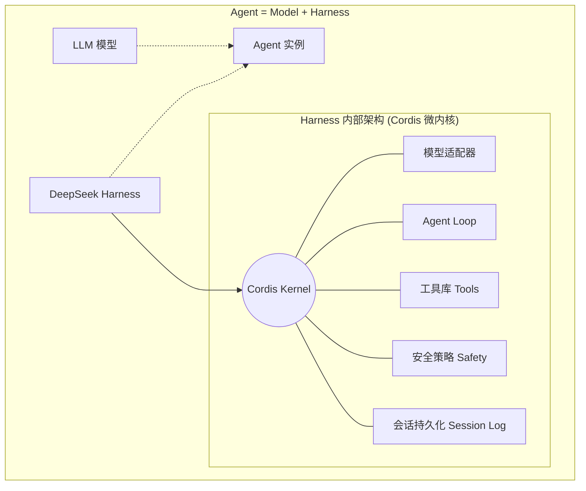

<div style="background-color: #1e1e1e; color: #00ff00; font-family: 'Courier New', Courier, monospace; border-radius: 8px; padding: 20px; box-shadow: 0 10px 30px rgba(0,0,0,0.3); margin-bottom: 30px; margin-top: 20px; position: relative; overflow: hidden;">
    <div style="display: flex; align-items: center; margin-bottom: 15px; padding-bottom: 10px; border-bottom: 1px solid #333;">
        <div style="display: flex; gap: 8px; margin-right: 15px;">
            <div style="width: 12px; height: 12px; border-radius: 50%; background-color: #ff5f56;"></div>
            <div style="width: 12px; height: 12px; border-radius: 50%; background-color: #ffbd2e;"></div>
            <div style="width: 12px; height: 12px; border-radius: 50%; background-color: #27c93f;"></div>
        </div>
        <div style="color: #ccc; font-size: 0.9em;">bash</div>
    </div>
    <div>
        <p style="margin: 5px 0; line-height: 1.6;"><span style="color: #008AFF; font-weight: bold;">ckhuang@macbookpro:~$</span> 当我们谈论 Agent 评测时，究竟在评测什么？如果连“失败原因”都无法追溯，所谓的“胜率”不过是碰运气的数字游戏。今天，我们拆解 DeepSeek Harness，看看如何用工程化的手段，把 Agent 评测从“玄学”变成“科学”。 <span style="display: inline-block; width: 8px; height: 16px; background-color: #00ff00; vertical-align: middle;"></span></p>
    </div>
</div>

### 1. 痛点：Agent 评测的“阿喀琉斯之踵”

随着大语言模型（LLM）从单纯的文本生成走向任务执行，**“模型之外的运行时”（Harness）** 正在成为 Agent 工程的核心议题。DeepSeek 开源其 Harness 框架，再次印证了那个经典的公式：`Agent = Model + Harness`。模型决定了能力的上限，而 Harness（负责工具调用、上下文管理、权限控制等）决定了能力如何落地。

然而，当前的 Agent 评测体系却常常让人感到无力：
1. **纸上谈兵**：传统的问答式基准（Benchmark）只看文本输出，根本无法度量 Agent 在真实环境（如 Shell、文件系统）中通过状态变更完成复杂任务的能力。
2. **LLM-as-Judge 的主观偏差**：用大模型当裁判，不仅存在巨大的方差，还有“宽松偏差（Leniency Bias）”，难以得出可复现、可审计的工程结论。
3. **二值化结果的粗糙**：只给出一个 Pass 或 Fail，掩盖了任务的实际完成度、结果的正当性以及执行过程的可靠性。这就好比高考数学只看最终答案，完全不给步骤分，这对排查复杂 Agent 的失败原因毫无帮助。

为了解决这些痛点，基于阿里云 AgentLoop 平台，我们对 DeepSeek Harness 进行了一次深度的工程化评测实践。

### 2. 解构 DeepSeek Harness：一切皆插件的微内核哲学

在进行评测之前，我们需要先看清被评测的对象。DeepSeek Harness 并不是另一个“模型”，它是一个使模型成为 Agent 的基础设施。

其核心架构采用了 **Cordis 微内核 + “一切皆插件”** 的设计：



这种设计就像一块“洞洞板”（原型板），组件可以动态插拔。它带来的两个核心优势对评测至关重要：
1. **模型无关性**：我们可以横向替换模型（比如接入 Qwen3.7-Plus 或 Codex），从而纯粹地度量“Harness+特定模型”组合的工程能力。
2. **Session Log 权威事件源**：系统提示词、工具调用、模型请求、权限切换等所有动作，都会被记录在单一的 Session Log 中。这构成了**轨迹（Trajectory）评估**的绝对证据基础。

<div style="text-align: center; font-size: 1.2em; font-style: italic; color: #008AFF; margin: 40px 0 20px; padding: 20px; border-top: 1px dashed #ccc; border-bottom: 1px dashed #ccc;">
    “Agent 的执行失败千奇百怪，但只要过程有迹可循，评估就能从‘黑盒’变成流水线。” —— CK·黄
</div>

### 3. 从“看答案”到“看过程”：Trajectory 评估的工程化落地

本次评测使用了 `terminal-bench 2.1` 的 10 任务子集。所有的任务都在隔离的容器中执行，以容器最终的状态（落盘文件、启动的端口等）作为唯一判据。

但我们并不满足于 Benchmark 提供的二值通过率。借助 AgentLoop 平台的 LoongSuite Pilot 组件，我们无侵入地采集了 DeepSeek Harness 的完整 Session Log，并构建了三个正交的**确定性评估器**：

1. **Outcome（任务完成度）**：即使任务整体判定失败，Agent 是否推进了部分进度？产物是否落地？
2. **Compliance（红线规则判定）**：Agent 在执行过程中是否触碰了安全红线或越权操作？
3. **Process（执行过程可靠性）**：Agent 的试错、重试和逻辑推理过程是否合理？

用一个序列图来展示这套基于轨迹的评测流程：

```mermaid
sequenceDiagram
    participant Agent as Agent (DSH + Qwen3.7+)
    participant Env as 终端容器 (Terminal-Bench)
    participant Loop as AgentLoop (评估器)
    
    Agent->>Env: 执行 Shell/文件操作
    Env-->>Agent: 返回 stdout/stderr 状态
    Note over Agent,Env: 实时生成 Session Log 轨迹
    
    Agent->>Loop: 任务结束，提交 Trajectory
    
    Loop->>Loop: 1. 验证器 (Verifier) 客观终态判定
    Loop->>Loop: 2. Outcome 评估器 (计算步骤分)
    Loop->>Loop: 3. Compliance & Process 评估器
    
    Loop-->>Agent: 输出多维细粒度评分与诊断报告
```

这种将大模型裁判（Agent-as-Judge）转化为“详细 Prompt + 规则脚本 Skill”的做法，直接排除了模型打分的方差。

### 4. 评测结果与洞见：当 DSH 遇上 Qwen3.7-Plus

在 10 项高难度工程任务中，DeepSeek Harness 结合 Qwen 3.7-Plus 模型交出了令人瞩目的答卷：**通过 8 项任务（通过率 80%）**，与目前业界的标杆 Codex 持平。

但通过深度的轨迹分析，我们发现了更多有趣的细节：
- **约束即挑战**：在未通过的案例中，部分任务（如 `qemu-startup`）虽然验证器判定能够成功，但由于耗时过长触及了墙钟时限（Wall-clock time），被评估器无情封顶（Outcome 0.5）。这说明在真实工程场景中，**时间与资源约束本身就是 Agent 能力的重要考题**。
- **细粒度归因的威力**：在 `extract-elf` 任务中，DSH 最终失败，但轨迹评分精准指出其失败原因是“6个必需产物仅写出了2个”。这种归因直接为后续的 Prompt 优化或 Harness 策略调整指明了方向。

<div style="background-color: #1e1e1e; color: #00ff00; font-family: 'Courier New', Courier, monospace; border-radius: 8px; padding: 20px; box-shadow: 0 10px 30px rgba(0,0,0,0.3); margin-bottom: 30px; margin-top: 20px; position: relative; overflow: hidden;">
    <div style="display: flex; align-items: center; margin-bottom: 15px; padding-bottom: 10px; border-bottom: 1px solid #333;">
        <div style="display: flex; gap: 8px; margin-right: 15px;">
            <div style="width: 12px; height: 12px; border-radius: 50%; background-color: #ff5f56;"></div>
            <div style="width: 12px; height: 12px; border-radius: 50%; background-color: #ffbd2e;"></div>
            <div style="width: 12px; height: 12px; border-radius: 50%; background-color: #27c93f;"></div>
        </div>
        <div style="color: #ccc; font-size: 0.9em;">bash</div>
    </div>
    <div>
        <p style="margin: 5px 0; line-height: 1.6;"><span style="color: #008AFF; font-weight: bold;">ckhuang@macbookpro:~$</span> 评测不是为了证明谁比谁强，而是为了找到 Agent 在通往 AGI 路上的那块“短板”。把过程拆开揉碎，用工程化的指标去度量，这才是资深工程师该有的浪漫。 <span style="display: inline-block; width: 8px; height: 16px; background-color: #00ff00; vertical-align: middle;"></span></p>
    </div>
</div>

### 5. 总结与展望

Agent 的发展正在脱离“玩具”阶段，走向真正的生产力工具。DeepSeek Harness 以其优秀的微内核架构为我们提供了一个标准化的运行时，而 AgentLoop 则补齐了其在可观测性与工程化评测上的拼图。

未来的 Agent 评测，必然是**基于真实环境、依赖确定性断言、并深度解析执行轨迹**的综合体系。只有让 Agent 的每一步都“有迹可循、有理可依”，我们才能放心地把核心业务系统交给它们。
